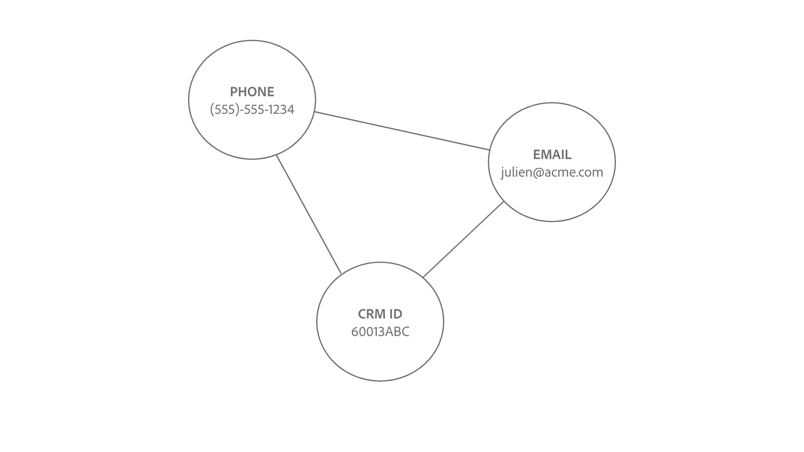

# Verknüpfungslogik für Identity Service

Eine Verknüpfung zwischen zwei Identitäten wird hergestellt, wenn der Identitäts-Namespace und die Identitätswerte übereinstimmen.

Es gibt zwei Arten von Identitäten, die verknüpft werden:

* **Profildatensätze**: Diese Identitäten stammen normalerweise aus CRM-Systemen.
* **Erlebnisereignisse**: Diese Identitäten stammen normalerweise aus der WebSDK-Implementierung oder der Adobe Analytics-Quelle.

## Semantische Bedeutung der Herstellung von Verbindungen

Eine Identität repräsentiert eine reale Einheit. Wenn eine Verbindung zwischen zwei Identitäten hergestellt wird, bedeutet dies, dass die beiden Identitäten miteinander verknüpft sind. Im Folgenden finden Sie einige Beispiele, die dieses Konzept illustrieren:

| Aktion | Verknüpfungen | Bedeutung |
| --- | --- | --- |
| Ein Endbenutzer meldet sich über einen Computer an. | CRMID und ECID sind miteinander verknüpft. | Eine Person (CRMID) besitzt ein Gerät mit einem Browser (ECID). |
| Endbenutzer navigieren anonym mit einer iPhone . | Der IDFA ist mit der ECID verknüpft. | Das Apple-Hardwaregerät (IDFA), z. B. ein iPhone, ist mit dem Browser (ECID) verknüpft. |
| Ein Endbenutzer meldet sich mit Google Chrome und dann mit Firefox an. | CRMID ist mit zwei verschiedenen ECIDs verknüpft. | Eine Person (CRMID) ist zwei Webbrowsern zugeordnet (**Hinweis**: Jeder Browser verfügt über eine eigene ECID). |
| Ein Data Engineer erfasst einen CRM-Datensatz, der zwei als Identität gekennzeichnete Felder enthält: CRMID und E-Mail. | CRMID und E-Mail sind verknüpft. | Eine Person (CRMID) ist mit der E-Mail-Adresse verknüpft. |

## Verstehen der Verknüpfungslogik des Identity Service

Eine Identität besteht aus einem Identitäts-Namespace und einem Identitätswert.

* Ein Identitäts-Namespace ist der Kontext eines bestimmten Identitätswerts. Beispiele für Identitäts-Namespaces sind CRMID, E-Mail und Telefon.
* Ein Identitätswert ist die Zeichenfolge, die eine reale Entität darstellt. Beispiel: &quot;julien@acme.com&quot;kann ein Identitätswert für einen E-Mail-Namespace und 555-555-1234 ein entsprechender Identitätswert für einen Phone-Namespace sein.

>[!TIP]
>
>Der Identitäts-Namespace ist wichtig, da ohne ihn der Identitätswert seinen Kontext verliert und nicht über genügend Informationen verfügt, um Identitäten erfolgreich zuzuordnen.

In den folgenden Diagrammen finden Sie eine visuelle Darstellung der Funktionsweise der Identity Service-Verknüpfungslogik:

>[!BEGINTABS]

>[!TAB Vorhandenes Diagramm]

Angenommen, Sie verfügen über ein vorhandenes Identitätsdiagramm mit drei verknüpften Identitäten:

* TELEFON:(555)-555-1234
* EMAIL:julien@acme.com
* CRMID:60013ABC

>[!TAB Eingehende Daten]

Ein Paar Identitäten werden in Ihr Diagramm aufgenommen und dieses Paar enthält:

* CRMID:60013ABC
* ECID: 100066526

>[!TAB Aktualisiertes Diagramm]

Identity Service erkennt, dass CRMID:60013ABC bereits in Ihrem Diagramm vorhanden ist. Daher wird nur die neue ECID verknüpft.

>[!ENDTABS]

## Kundenszenario

Sie sind Dateningenieur und erfassen den folgenden CRM-Datensatz (Profildatensatz) zum Experience Platform.

| CRMID** | Phone* | E-Mail* | Vorname | Last name |
| --- | --- | --- | --- | --- |
| 60013ABC | 555-555-1234 | julien@acme.com | Julien | Smith |
| 31260XYZ | 777-777-6890 | evan@acme.com | Evan | Smith |

>[!NOTE]
>
>* `**` - Kennzeichnet das Feld, das als primäre Identität markiert ist.
>* `*` - Kennzeichnet das Feld, das als sekundäre Identität markiert ist.
>
>Identity Service unterscheidet nicht zwischen primärer und sekundärer Identität. Solange ein Feld als Identität markiert ist, wird es in Identity Service erfasst.

Sie haben auch WebSDK implementiert und einen WebSDK-Datensatz (Erlebnisereignis) mit den folgenden Datentabellen erfasst:

| Zeitstempel | Identitäten im Ereignis* | Ereignis |
| --- | --- | --- |
| `t=1` | ECID: 38652 | Startseite anzeigen |
| `t=2` | ECID:38652, CRMID:31260XYZ | Suchen nach Schuhen |
| `t=3` | ECID: 44675 | Startseite anzeigen |
| `t=4` | ECID:44675, CRMID: 31260XYZ | Kaufverlauf anzeigen |

Die primäre Identität für jedes Ereignis wird anhand von [wie Sie Datenelementtypen konfigurieren](../../tags/extensions/client/web-sdk/data-element-types.md) bestimmt.

>[!NOTE]
>
>* Wenn Sie die CRMID als primäre Instanz auswählen, haben authentifizierte Ereignisse (Ereignisse mit Identitätszuordnung, die die CRMID und ECID enthalten) eine primäre Identität von CRMID. Für nicht authentifizierte Ereignisse (Ereignisse, bei denen die Identitätszuordnung nur ECID enthält) weist ECID als primäre Identität auf. Adobe empfiehlt diese Option.
>
>* Wenn Sie die ECID unabhängig vom Authentifizierungsstatus als primäre Identität auswählen, wird die ECID zur primären Identität.

In diesem Beispiel:

* `t=1`, einen Desktop-Computer (ECID:38652) verwendet und anonym den Homepage-Durchsuchen angezeigt hat.
* `t=2`, denselben Desktop-Computer verwendet, angemeldet (CRMID:31260XYZ) und dann nach Schuhen gesucht.
   * Sobald ein Benutzer angemeldet ist, sendet das Ereignis sowohl ECID als auch CRMID an Identity Service.
* `t=3`, einen Laptop-Computer (ECID:44675) verwendet und anonym durchsucht.
* `t=4`, denselben Laptop-Computer verwendet, angemeldet (CRMID: 31260XYZ) und dann den Kaufverlauf angezeigt.

>[!BEGINTABS]

>[!TAB timestamp=0]

Bei `timestamp=0` haben Sie zwei Identitätsdiagramme für zwei verschiedene Kunden. Beide sind jeweils durch drei verknüpfte Identitäten vertreten.

| | CRMID | E-Mail | Telefon |
| --- | --- | --- | --- |
| Customer One | 60013ABC | julien@acme.com | 555-555-1234 |
| Kunde zwei | 31260XYZ | evan@acme.com | 777-777-6890 |

>[!TAB timestamp=1]

Bei `timestamp=1` verwendet ein Kunde einen Laptop, um Ihre E-Commerce-Website zu besuchen, Ihre Homepage anzuzeigen und anonym zu durchsuchen. Dieses anonyme Browsing-Ereignis wird als ECID:38652 identifiziert. Da Identity Service nur Ereignisse mit mindestens zwei Identitäten speichert, werden diese Informationen nicht gespeichert.

>[!TAB timestamp=2]

Bei `timestamp=2` verwendet ein Kunde denselben Laptop, um Ihre E-Commerce-Website zu besuchen. Sie melden sich mit ihrer Benutzernamen- und Passwortkombination an und suchen nach Schuhen. Identity Service identifiziert das Konto des Kunden bei seiner Anmeldung, da es seiner CRMID entspricht: 31260XYZ. Darüber hinaus verknüpft Identity Service ECID:38562 mit CRMID:31260XYZ, da beide denselben Browser auf demselben Gerät verwenden.

>[!TAB timestamp=3]

Bei `timestamp=3` verwendet ein Kunde ein Tablet, um Ihre E-Commerce-Website zu besuchen und anonym zu durchsuchen. Dieses anonyme Browsing-Ereignis wird als ECID:44675 identifiziert. Da Identity Service nur Ereignisse mit mindestens zwei Identitäten speichert, werden diese Informationen nicht gespeichert.

>[!TAB timestamp=4]

Bei `timestamp=4` verwendet ein Kunde dasselbe Tablet, meldet sich bei seinem Konto an (CRMID:31260XYZ) und zeigt seinen Kaufverlauf an. Dieses Ereignis verknüpft ihre CRMID:31260XYZ mit der Cookie-ID, die der anonymen Browsing-Aktivität zugewiesen wurde, ECID:44675 und verknüpft ECID:44675 mit dem Identitätsdiagramm des Kunden.

>[!ENDTABS]
