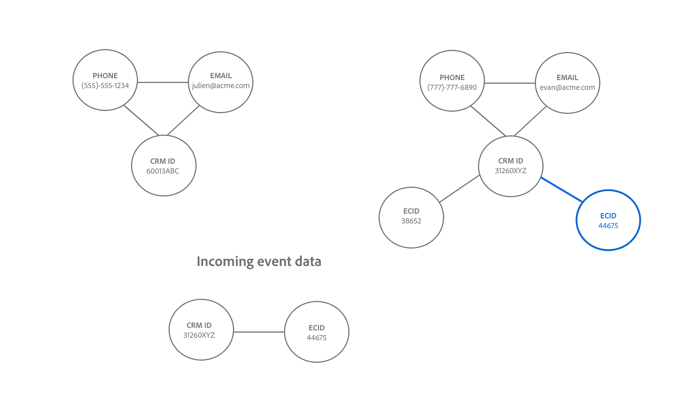

# Identity Service-Verknüpfungslogik {#identity-service-linking-logic}

>[!CONTEXTUALHELP]
>id="platform_identities_simulatedgraph"
>title="Simuliertes Diagramm"
>abstract="Identitäten werden verknüpft, wenn der Identity-Namespace und der Identitätswert übereinstimmen."

Eine Verknüpfung zwischen zwei Identitäten wird hergestellt, wenn der Identity-Namespace und die Identitätswerte übereinstimmen.

Es gibt zwei Arten von Identitäten, die verknüpft werden:

* **Profildatensätze**: Diese Identitäten stammen normalerweise aus CRM-Systemen.
* **Erlebnisereignisse**: Diese Identitäten stammen in der Regel aus der WebSDK-Implementierung oder der Adobe Analytics-Quelle.

## Semantische Bedeutung der Relationserstellung

Eine Identität stellt eine reale Entität dar. Wenn eine Verbindung zwischen zwei Identitäten hergestellt wird, bedeutet dies, dass die beiden Identitäten miteinander verknüpft sind. Im Folgenden finden Sie einige Beispiele, die dieses Konzept veranschaulichen:

| Aktion | Verbindungen hergestellt | Bedeutung |
| --- | --- | --- |
| Endbenutzer melden sich mit einem Computer an. | CRMID und ECID sind miteinander verknüpft. | Eine Person (CRMID) besitzt ein Gerät mit einem Browser (ECID). |
| Ein Endbenutzer browst mithilfe eines iPhone anonym . | IDFA ist mit ECID verknüpft. | Das Apple-Hardwaregerät (IDFA), z. B. ein iPhone, ist mit dem Browser (ECID) verknüpft. |
| Endbenutzer melden sich mit Google Chrome und dann mit Firefox an. | CRMID ist mit zwei verschiedenen ECIDs verknüpft. | Eine Person (CRMID) ist mit zwei Webbrowsern verknüpft (**Hinweis**: Jeder Browser verfügt über eine eigene ECID). |
| Ein Datentechniker nimmt einen CRM-Datensatz auf, der zwei als Identität markierte Felder enthält: CRMID und E-Mail. | CRMID und E-Mail sind verknüpft. | Der E-Mail-Adresse ist eine Person (CRMID) zugeordnet. |

## Grundlegendes zur Verknüpfungslogik von Identity Service

Eine Identität besteht aus einem Identity-Namespace und einem Identitätswert.

* Ein Identity-Namespace ist der Kontext eines angegebenen Identitätswerts, der verwendet werden soll. Häufige Beispiele für Identity-Namespaces sind CRMID, E-Mail und Telefon.
* Ein Identitätswert ist die Zeichenfolge, die eine reale Entität darstellt. Beispiel: „julien@acme.com“ kann ein Identitätswert für einen E-Mail-Namespace sein und 555-555-1234 kann ein entsprechender Identitätswert für einen Telefon-Namespace sein.
* Bei Identity Service wird zwischen Groß- und Kleinschreibung unterschieden. Beispielsweise würden **julien@gmail.com** und **JULIEN@GMAIL.COM** als zwei separate E-Mail-Identitäten behandelt.

>[!TIP]
>
>Der Identity-Namespace ist wichtig, da andernfalls der Identitätswert seinen Kontext verliert und nicht über genügend Informationen verfügt, um Identitäten erfolgreich abzugleichen.

In den folgenden Diagrammen finden Sie eine visuelle Darstellung der Funktionsweise der Verknüpfungslogik für Identity Service:

>[!BEGINTABS]

>[!TAB Vorhandenes Diagramm]

Angenommen, Sie haben ein vorhandenes Identitätsdiagramm mit drei verknüpften Identitäten:

* TEL.: (555)-555-1234
* EMAIL:julien@acme.com
* CRMID:60013ABC

>[!TAB Eingehende Daten]

Ein Identitätspaar wird in Ihr Diagramm aufgenommen und dieses Paar enthält:

* CRMID:60013ABC
* ECID:100066526

>[!TAB Aktualisiertes Diagramm]

Identity Service erkennt, dass CRMID:60013ABC bereits in Ihrem Diagramm vorhanden ist, und verknüpft daher nur die neue ECID

>[!ENDTABS]

## Kundenszenario

Sie sind Datentechniker und nehmen den folgenden CRM-Datensatz (Profildatensatz) in Experience Platform auf.

| CRMID** | Telefon* | E-Mail* | Vorname | Last name |
| --- | --- | --- | --- | --- |
| 60013ABC | 555 555 1234 | julien@acme.com | Julien | Smith |
| 31260XYZ | 777 777 6890 | evan@acme.com | Evan | Smith |

>[!NOTE]
>
>* `**` - Gibt das Feld an, das als primäre Identität markiert ist.
>* `*` - Gibt das Feld an, das als sekundäre Identität markiert ist.
>
>Identity Service unterscheidet nicht zwischen primärer und sekundärer Identität. Solange ein Feld als Identität markiert ist, wird es in Identity Service aufgenommen.

Sie haben außerdem WebSDK implementiert und einen WebSDK-Datensatz (Erlebnisereignis) mit den folgenden Datentabellen aufgenommen:

| Zeitstempel | Identitäten im Ereignis* | Ereignis |
| --- | --- | --- |
| `t=1` | ECID:38652 | Startseite anzeigen |
| `t=2` | ECID:38652, CRMID:31260XYZ | Nach Schuhen suchen |
| `t=3` | ECID:44675 | Startseite anzeigen |
| `t=4` | ECID:44675, CRMID: 31260XYZ | Kaufverlauf anzeigen |

Die primäre Identität für jedes Ereignis wird anhand der Konfiguration [ Datenelementtypen ](../../tags/extensions/client/web-sdk/data-element-types.md).

>[!NOTE]
>
>* Wenn Sie die CRMID als Primärereignis auswählen, haben authentifizierte Ereignisse (Ereignisse mit Identitätszuordnung, die die CRMID und ECID enthält) die primäre Identität CRMID. Bei nicht authentifizierten Ereignissen (Ereignisse, bei denen die Identitätszuordnung nur ECID enthält) hat die Ereignisse die primäre Identität ECID. Adobe empfiehlt diese Option.
>
>* Wenn Sie die ECID als primäre Identität auswählen, wird die ECID unabhängig vom Authentifizierungsstatus zur primären Identität.

In diesem Beispiel:

* `t=1` verwendet einen Desktop-Computer (ECID:38652) und um die Startseite anonym zu durchsuchen.
* `t=2` habe denselben Desktop-Computer verwendet, sich angemeldet (CRMID:31260XYZ) und dann nach Schuhen gesucht.
   * Nachdem sich ein Benutzer angemeldet hat, sendet das Ereignis sowohl ECID als auch CRMID an Identity Service.
* `t=3` einen Laptop-Computer (ECID) :44675 und anonym browsen.
* `t=4` hat denselben Laptop-Computer verwendet, sich angemeldet (CRMID: 31260XYZ) und dann den Kaufverlauf angezeigt.

>[!BEGINTABS]

>[!TAB timestamp=0]

`timestamp=0` haben Sie zwei Identitätsdiagramme für zwei verschiedene Kundinnen und Kunden. Beide werden jeweils durch drei verknüpfte Identitäten repräsentiert.

| | CRMID | E-Mail | Telefon |
| --- | --- | --- | --- |
| Kunde eins | 60013ABC | julien@acme.com | 555 555 1234 |
| Kunde 2 | 31260XYZ | evan@acme.com | 777 777 6890 |

>[!TAB Zeitstempel=1]

`timestamp=1` verwendet ein Kunde einen Laptop, um Ihre E-Commerce-Website zu besuchen, Ihre Homepage aufzurufen und anonym zu surfen. Dieses anonyme Browser-Ereignis wird als ECID:38652 gekennzeichnet. Da Identity Service nur Ereignisse mit mindestens zwei Identitäten speichert, werden diese Informationen nicht gespeichert.

>[!TAB Zeitstempel=2]

`timestamp=2` verwendet ein Kunde denselben Laptop, um Ihre E-Commerce-Website zu besuchen. Sie melden sich mit ihrer Benutzername- und Passwortkombination an und suchen nach Schuhen. Identity Service identifiziert das Konto des Kunden bei der Anmeldung, da es seiner CRMID entspricht: 31260XYZ. Darüber hinaus verknüpft Identity Service ECID:38562 mit CRMID:31260XYZ da beide denselben Browser auf demselben Gerät verwenden.

>[!TAB Zeitstempel=3]

`timestamp=3` verwendet ein Kunde ein Tablet, um Ihre E-Commerce-Website zu besuchen und anonym zu surfen. Dieses anonyme Browser-Ereignis wird als ECID:44675 gekennzeichnet. Da Identity Service nur Ereignisse mit mindestens zwei Identitäten speichert, werden diese Informationen nicht gespeichert.

>[!TAB Zeitstempel=4]

`timestamp=4` verwendet ein Kunde dasselbe Tablet, meldet sich bei seinem Konto (CRMID) an :31260XYZ zeigt seinen Kaufverlauf an. Dieses Ereignis verknüpft ihre CRMID:31260XYZ mit der Cookie-Kennung, die der anonymen Browser-Aktivität ECID:44675 zugewiesen ist, und :44675 ECID mit dem Identitätsdiagramm von Kunde zwei.

>[!ENDTABS]
