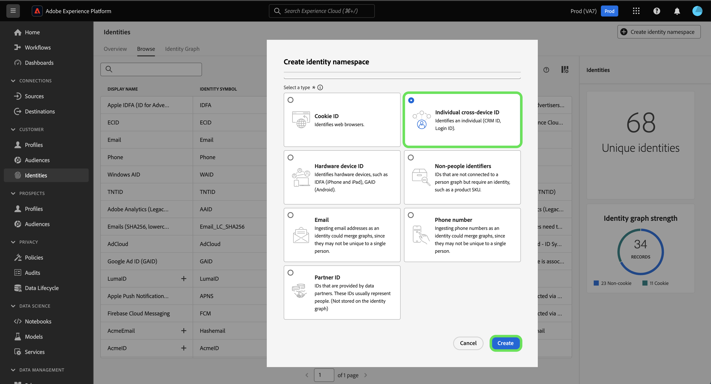

# Übersicht über Identitäts-Namespaces

Lesen Sie das folgende Dokument, um mehr darüber zu erfahren, was Sie mit Identity-Namespaces in Adobe Experience Platform Identity Service tun können.

## Erste Schritte

Identity-Namespaces erfordern ein Verständnis verschiedener Adobe Experience Platform-Services. Bevor Sie Namespaces nutzen, lesen Sie bitte die Dokumentation für folgende Dienste:

* [[!DNL Real-Time Customer Profile]](../../profile/home.md): Bietet ein einheitliches Kundenprofil in Echtzeit, das auf aggregierten Daten aus verschiedenen Quellen basiert.
* [[!DNL Identity Service]](../home.md): Verschaffen Sie sich einen besseren Überblick über einzelne Kunden und deren Verhalten, indem Sie Identitäten geräte- und systemübergreifend verknüpfen.
* [[!DNL Privacy Service]](../../privacy-service/home.md): Identitäts-Namespaces werden in Compliance-Anfragen für gesetzliche Datenschutzbestimmungen wie die Datenschutz-Grundverordnung (DSGVO) verwendet. Jede Datenschutzanfrage wird in Bezug auf einen Namespace gestellt, um festzustellen, welche Verbraucherdaten betroffen sein sollten.

## Identitäts-Namespaces verstehen {#understanding-identity-namespaces}

>[!CONTEXTUALHELP]
>id="platform_identity_namespace"
>title="Identity-Namespaces"
>abstract="Ein Identity-Namespace ist der Kontext einer bestimmten Identität. Beispiel: ein Namespace von `Email` könnte **name@acme.com** entsprechen. Gleichermaßen könnte ein Namespace von `Phone` `555-555-1234` entsprechen."
>text="Learn more in documentation"

>[!CONTEXTUALHELP]
>id="platform_identity_value"
>title="Identitätswerte"
>abstract="Ein Identitätswert ist eine Kennung, die für eine eindeutige Person, eine eindeutige Organisation oder ein eindeutiges Asset steht. Der Kontext oder der Typ der Identität, den der Wert darstellt, wird durch einen entsprechenden Identity-Namespace definiert. Bei der Zuordnung von Eintragsdaten über Profilfragmente hinweg müssen Namespace und Identitätswert übereinstimmen. Bei der Zuordnung von Eintragsdaten über Profilfragmente hinweg müssen Namespace und Identitätswert übereinstimmen."
>text="Learn more in documentation"

Eine vollständig qualifizierte Identität umfasst zwei Komponenten: einen **Identitätswert** und einen **Identity-Namespace**. Wenn beispielsweise der Wert einer Identität `scott@acme.com` ist, bietet ein Namespace Kontext für diesen Wert, indem er ihn als E-Mail-Adresse unterscheidet. Ebenso kann ein Namespace `555-123-456` als Telefonnummer und `3126ABC` als CRMID unterscheiden. Im Wesentlichen **ein Namespace einen Kontext für eine bestimmte Identität**. Bei der Zuordnung von Datensatzdaten zu Profilfragmenten, z. B. beim Zusammenführen von Profildaten durch [!DNL Real-Time Customer Profile], müssen sowohl Identitätswert als auch Namespace übereinstimmen.

Zwei Profilfragmente können beispielsweise unterschiedliche primäre IDs enthalten, aber sie haben denselben Wert für den Namespace „E-Mail“, sodass Experience Platform sehen kann, dass diese Fragmente tatsächlich dieselbe Person sind, und die Daten im Identitätsdiagramm für die Person zusammenführt.

>[!BEGINSHADEBOX]

**Identity-Namespace - Erklärung**

Eine weitere Möglichkeit, das Konzept des Namespace besser zu verstehen, besteht darin, reale Beispiele wie Städte und ihre entsprechenden Staaten zu betrachten. Zum Beispiel sind Portland, Maine und Portland, Oregon zwei verschiedene Orte in den Vereinigten Staaten. Während die Städte denselben Namen haben, fungiert der Staat als Namespace und bietet den notwendigen Kontext, der die beiden Städte voneinander unterscheidet.

Anwenden derselben Logik auf Identity Service:

* Auf einen Blick kann der Identitätswert von `1-234-567-8900` wie eine Telefonnummer aussehen. Aus Systemsicht hätte dieser Wert jedoch als CRMID konfiguriert werden können. Identity Service hätte keine Möglichkeit, den erforderlichen Kontext ohne einen entsprechenden Namespace auf diesen Identitätswert anzuwenden.
* Ein weiteres Beispiel ist der Identitätswert von: `john@gmail.com`. Obwohl dieser Identitätswert leicht als E-Mail angenommen werden kann, ist es durchaus möglich, dass er als benutzerdefinierter Namespace-CRMID konfiguriert ist. Mit einem Namespace können Sie `Email:john@gmail.com` von `CRMID:john@gmail.com` unterscheiden.

>[!ENDSHADEBOX]

### Komponenten eines Namespace

Ein Namespace besteht aus den folgenden Komponenten:

* **Anzeigename**: Der benutzerfreundliche Name für einen bestimmten Namespace.
* **Identitätssymbol**: Ein Code, der intern von Identity Service zur Darstellung eines Namespace verwendet wird.
* **Identitätstyp**: Die Klassifizierung eines bestimmten Namespace.
* **Beschreibung**: (Optional) Alle zusätzlichen Informationen, die Sie zu einem bestimmten Namespace bereitstellen können.

### Identitätstyp {#identity-type}

>[!CONTEXTUALHELP]
>id="platform_identity_create_namespace"
>title="Angeben des Identitätstyps"
>abstract="Der Identitätstyp bestimmt, ob Daten im Identitätsdiagramm gespeichert werden oder nicht. Identitätsdiagramme werden nicht für die folgenden Identitätstypen generiert: Nicht-Personen-IDs und Partner-ID."
>text="Learn more in documentation"

Ein Element eines Identity-Namespace ist der **Identitätstyp**. Der Identitätstyp bestimmt:

* Ob ein Identitätsdiagramm generiert wird:
   * Identitätsdiagramme werden nicht für die folgenden Identitätstypen generiert: Nicht-Personen-IDs und Partner-ID.
   * Identitätsdiagramme werden für alle anderen Identitätstypen generiert.
* Welche Identitäten werden aus dem Identitätsdiagramm entfernt, wenn die Systembeschränkungen erreicht sind. Weitere Informationen finden Sie unter [ für Identitätsdaten ](../guardrails.md).

Die folgenden Identitätstypen sind in Experience Platform verfügbar:

| Identitätstyp | Beschreibung |
| --- | --- |
| Cookie-ID | Cookie-IDs identifizieren Webbrowser. Diese Identitäten sind für Erweiterungen von entscheidender Bedeutung und bilden den Großteil des Identitätsdiagramms. Sie zerfallen jedoch naturgemäß schnell und verlieren mit der Zeit an Wert. |
| Geräteübergreifende ID | Geräteübergreifende IDs identifizieren eine Person und binden in der Regel andere IDs zusammen. Beispiele sind eine Anmelde-ID, eine CRMID und eine Treueprogramm-ID. Dies ist ein Hinweis darauf, dass der Wert sensibel behandelt werden [!DNL Identity Service]. |
| Geräte-ID | Geräte-IDs identifizieren Hardware-Geräte, wie IDFA (iPhone und iPad), GAID (Android) und RIDA (Roku) und können von mehreren Personen in Haushalten gemeinsam verwendet werden. |
| E-Mail-Adresse | E-Mail-Adressen werden oft mit einer einzelnen Person verknüpft und können daher verwendet werden, um diese Person über verschiedene Kanäle hinweg zu identifizieren. Identitäten dieser Art beinhalten personenbezogene Daten (PII). Dies ist ein Hinweis darauf, dass der Wert sensibel behandelt werden [!DNL Identity Service]. |
| Nicht personenbezogene Kennung | Nicht personenbezogene IDs werden für das Speichern von Identifikatoren verwendet, die Namespaces erfordern, aber nicht mit einem Personen-Cluster verbunden sind, z. B. eine Produktnummer oder Daten, die mit Produkten, Organisationen oder Geschäften verbunden sind. |
| Partner-ID | <ul><li>Partner-IDs sind Kennungen, die von Datenpartnern zur Darstellung von Personen verwendet werden. Partner-IDs sind oft pseudonym, um die wahre Identität einer Person nicht preiszugeben, und können probabilistisch sein. In Real-Time Customer Data Platform werden Partner-IDs hauptsächlich für die erweiterte Zielgruppenaktivierung und Datenanreicherung und nicht zum Erstellen von Identitätsdiagramm-Verknüpfungen verwendet.</li><li>Identitätsdiagramme werden bei der Aufnahme einer Identität, die einen als Partner-ID-Typ angegebenen Identity-Namespace enthält, nicht generiert.</li><li>Wenn Partnerdaten nicht mit dem Identitätstyp der Partner-ID aufgenommen werden, kann dies zu Einschränkungen des Systemdiagramms bei Identity Service sowie zu einer unerwünschten Zusammenführung von Profilen führen.</li><ul> |
| Telefonnummer | Telefonnummern werden oft einer einzelnen Person zugeordnet und können daher verwendet werden, um diese Person über verschiedene Kanäle hinweg zu identifizieren. Identitäten dieser Art umfassen PII. Dies ist ein Hinweis darauf, dass der Wert sensibel behandelt werden [!DNL Identity Service]. |

{style="table-layout:auto"}

### Standard-Namespaces {#standard}

Experience Platform bietet mehrere Identity-Namespaces , die für alle Organisationen verfügbar sind. Diese werden als Standard-Namespaces bezeichnet und über die [!DNL Identity Service]-API oder die Experience Platform-Benutzeroberfläche angezeigt.

Die folgenden Standard-Namespaces stehen allen Organisationen in Experience Platform zur Verfügung:

| Anzeigename | Beschreibung |
| ------------ | ----------- |
| AdCloud | Ein Namespace, der Adobe AdCloud darstellt. |
| Adobe Analytics (veraltete ID) | Ein Namespace, der Adobe Analytics darstellt. Weitere Informationen finden Sie im folgenden Dokument zu [Adobe Analytics](https://experienceleague.adobe.com/docs/analytics/admin/data-governance/gdpr-namespaces.html#namespaces)Namespaces. |
| Apple IDFA (ID für Advertiser) | Ein Namespace, der die Apple ID für Advertiser darstellt. Weiteführende Informationen finden Sie im folgenden Dokument zu [Interessensbasierten Anzeigen](https://support.apple.com/de-de/HT202074). |
| Apple Push Notification Service | Ein Namespace, der für Identitäten steht, die mit dem Push-Benachrichtigungs-Service von Apple erfasst wurden. Weitere Informationen finden Sie im folgenden Dokument zum [Apple Push Notification ](https://developer.apple.com/library/archive/documentation/NetworkingInternet/Conceptual/RemoteNotificationsPG/APNSOverview.html#//apple_ref/doc/uid/TP40008194-CH8-SW1)Service). |
| ECID | Ein Namespace, der die ECID darstellt. Dieser Namespace kann auch durch die folgenden Aliase referenziert werden: „Adobe Marketing Cloud ID“, „Adobe Experience Cloud ID“, „Adobe Experience Platform ID“. Weitere Informationen finden Sie im folgenden Dokument [ECID](./ecid.md) . |
| E-Mail | Ein Namespace, der eine E-Mail-Adresse darstellt. Dieser Namespace ist häufig mit einer einzelnen Person verknüpft und kann daher verwendet werden, um diese Person über verschiedene Kanäle hinweg zu identifizieren. |
| E-Mails (SHA256, in Kleinbuchstaben) | Ein Namespace für vorab gehashte E-Mail-Adressen. In diesem Namespace angegebene Werte werden vor dem Hashing mit SHA256 in Kleinbuchstaben umgewandelt. Vor der Normalisierung einer E-Mail-Adresse müssen vorangestellte und nachfolgende Leerzeichen abgeschnitten werden. Diese Einstellung kann nachträglich nicht mehr geändert werden. Weitere Informationen finden Sie im folgenden Dokument [SHA-256](https://experienceleague.adobe.com/docs/id-service/using/reference/hashing-support.html#hashing-support)Hashing-Unterstützung). |
| Firebase Cloud Messaging | Ein Namespace, der Identitäten darstellt, die mit Google Firebase Cloud Messaging für Push-Benachrichtigungen erfasst wurden. Weitere Informationen finden Sie im folgenden Dokument zu [Google Firebase Cloud Messaging](https://firebase.google.com/docs/cloud-messaging) . |
| Google Ad ID (GAID) | Ein Namespace, der eine Google Advertising ID darstellt. Weiterführende Informationen finden Sie im folgenden Dokument zu [Google Advertising IDs](https://support.google.com/googleplay/android-developer/answer/6048248?hl=de). |
| Telefon | Ein Namespace, der eine Telefonnummer darstellt. Dieser Namespace ist häufig mit einer einzelnen Person verknüpft und kann daher verwendet werden, um diese Person über verschiedene Kanäle hinweg zu identifizieren. |
| Telefon (E.164) | Ein Namespace, der unformatierte Telefonnummern darstellt, die im E.164-Format gehasht werden müssen. Das Format E.164 enthält ein Pluszeichen (`+`), eine internationale Landesvorwahl, eine Ortsvorwahl und eine Telefonnummer. Beispiel: `(+)(country code)(area code)(phone number)`. |
| Telefon (SHA256) | Ein Namespace, der Telefonnummern darstellt, die mit SHA256 gehasht werden müssen. Sie müssen Symbole, Buchstaben und vorangestellte Nullen entfernen. Sie müssen auch die Landesvorwahl als Präfix hinzufügen. |
| Phone (SHA256_E.164) | Ein Namespace, der unformatierte Telefonnummern darstellt, die mit dem SHA256- und E.164-Format gehasht werden müssen. |
| TNTID | Ein Namespace, der Adobe Target darstellt. Weitere Informationen finden Sie im folgenden Dokument [Target](https://experienceleague.adobe.com/docs/target/using/target-home.html?lang=de) . |
| Windows AID | Ein Namespace, der eine Windows Advertising ID darstellt. Weitere Informationen finden Sie im folgenden Dokument [Windows Advertising ID](https://docs.microsoft.com/en-us/uwp/api/windows.system.userprofile.advertisingmanager.advertisingid?view=winrt-19041) . |

### Anzeigen von Identitäts-Namespaces {#view-identity-namespaces}

>[!CONTEXTUALHELP]
>id="platform_identity_view_integration_identities"
>title="Anzeigen von Integrationsidentitäten"
>abstract="Integrationsidentitäten sind Namespaces, die zur Verbindung mit anderen Systemen verwendet werden. Sie werden nicht bei der Identitätsauflösung oder zum Zusammenfügen von Identitäten verwendet.   Diese Identitäten sind standardmäßig ausgeblendet. Mit dem Umschalter können Sie Integrations-Namespaces anzeigen."

Um Identity-Namespaces in der Benutzeroberfläche anzuzeigen, klicken Sie im linken Navigationsbereich auf **[!UICONTROL Identities]** und dann auf **[!UICONTROL Browse]**.

Es wird ein Verzeichnis mit Namespaces in Ihrer Organisation angezeigt, in dem Informationen zu Namen, Identitätssymbolen, Datum der letzten Aktualisierung, entsprechenden Identitätstypen und Beschreibung angezeigt werden.

## Erstellen benutzerdefinierter Namespaces {#create-namespaces}

Abhängig von Ihren Unternehmensdaten und Anwendungsfällen können Sie benutzerdefinierte Namespaces benötigen. Benutzerdefinierte Namespaces können mithilfe der [[!DNL Identity Service]](../api/create-custom-namespace.md)-API oder über die Benutzeroberfläche erstellt werden.

Um einen benutzerdefinierten Namespace zu erstellen, wählen Sie **[!UICONTROL Create identity namespace]** aus.

>[!TIP]
>
>Integrationsidentitäten sind Namespaces, die zur Verbindung mit anderen Systemen verwendet werden. Sie werden weder in der Identitätsauflösung noch zum Zusammenfügen von Identitäten verwendet. Wählen Sie **[!UICONTROL View integration identities]** aus, um die Liste zu aktualisieren und Integrationsidentitäten einzuschließen. Integrationsidentitäten sind jedoch standardmäßig ausgeblendet, da sie nur zur Ansicht bestimmt sind und Sie sie nicht konfigurieren müssen.

Das [!UICONTROL Create identity namespace] wird angezeigt. Zunächst müssen Sie einen Anzeigenamen und ein Identitätssymbol für den benutzerdefinierten Namespace angeben, den Sie erstellen möchten. Sie können optional auch eine Beschreibung angeben, um dem erstellten benutzerdefinierten Namespace mehr Kontext hinzuzufügen.

Wählen Sie als Nächstes den Identitätstyp aus, den Sie dem benutzerdefinierten Namespace zuweisen möchten. Wenn Sie fertig sind, wählen Sie **[!UICONTROL Create]** aus.

>[!IMPORTANT]
>
>* Namespaces, die Sie definieren, sind für Ihre Organisation privat und benötigen ein eindeutiges Identitätssymbol, um erfolgreich erstellt zu werden.
>
>* Nachdem ein Namespace erstellt wurde, kann er nicht mehr gelöscht werden und sein Identitätssymbol und Typ können nicht mehr geändert werden.
>
>* Doppelte Namespaces werden nicht unterstützt. Sie können beim Erstellen eines neuen Namespace keinen vorhandenen Anzeigenamen und kein Identitätssymbol verwenden.

## Namespaces in Identitätsdaten

Die Angabe des Namespace für eine Identität hängt von der Methode ab, mit der Sie Identitätsdaten bereitstellen. Details zur Bereitstellung von Daten-Identitätsdaten finden Sie im [[!DNL Identity Service] Implementierungshandbuch](../implementation.md).

## Nächste Schritte

Sie kennen nun die Schlüsselkonzepte von Identity-Namespaces und können als Nächstes erfahren, wie Sie Ihr Identitätsdiagramm mithilfe des [Identitätsdiagramm-Viewers“ ](../features/identity-graph-viewer.md).
