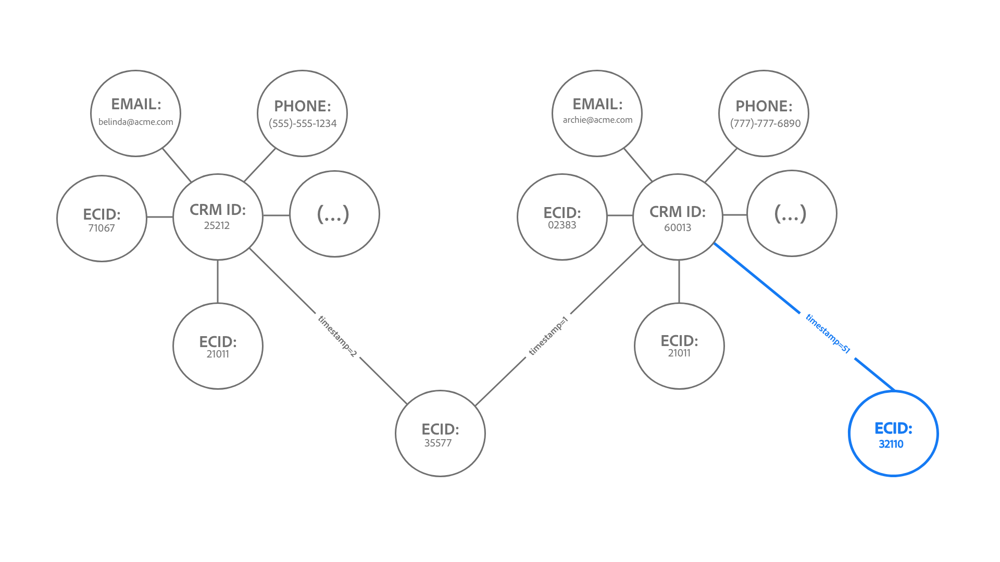

# Limits [!DNL Identity Service] data

Dieses Dokument enthält Informationen über die Verwendung und die Ratenbeschränkungen für [!DNL Identity Service]-Daten, um Ihnen bei der optimalen Nutzung des Identitätsdiagramms zu helfen. Bei der Überprüfung der folgenden Leitplanken wird davon ausgegangen, dass Sie die Daten korrekt modelliert haben. Wenden Sie sich bei Fragen zum Modellieren Ihrer Daten an Ihren Kundenbetreuer.

>[!IMPORTANT]
>
>Überprüfen Sie Ihre Lizenzberechtigungen in Ihrem Kundenauftrag und den entsprechenden [Produktbeschreibung](https://helpx.adobe.com/de/legal/product-descriptions.html) über die tatsächlichen Nutzungsbeschränkungen zusätzlich zu dieser Limits-Seite.

## Erste Schritte

Die folgenden Experience Platform-Dienste sind an der Modellierung von Identitätsdaten beteiligt:

* [Identitäten](home.md): Überbrücken von Identitäten aus unterschiedlichen Datenquellen, während sie in Platform aufgenommen werden.
* [[!DNL Real-Time Customer Profile]](../profile/home.md): Erstellen einheitlicher Verbraucherprofile anhand von Daten aus mehreren Quellen.

## Datenmodellbeschränkungen

Die folgenden Tabellen enthalten Anleitungen zu Leitlinien für statische Beschränkungen sowie zu berücksichtigende Validierungsregeln für Identity-Namespaces.

### Statische Beschränkungen

In der folgenden Tabelle sind statische Beschränkungen für Identitätsdaten aufgeführt.

| Leitplanke | Limit | Anmerkungen |
| --- | --- | --- |
| Anzahl der Identitäten in einem Diagramm | 50 | Wenn ein Diagramm mit 50 verknüpften Identitäten aktualisiert wird, wendet Identity Service einen &quot;First-in-First-out&quot;-Mechanismus an und löscht die älteste Identität, um Platz für die neueste Identität für dieses Diagramm zu schaffen (**Hinweis**: Echtzeit-Kundenprofil ist nicht betroffen). Das Löschen basiert auf Identitätstyp und Zeitstempel. Die Beschränkung wird auf Sandbox-Ebene angewendet. Weitere Informationen finden Sie im Abschnitt unter [die Löschlogik verstehen](#deletion-logic). |
| Anzahl der Links zu einer Identität für eine Batch-Erfassung | 50 | Ein einzelner Batch kann anomale Identitäten enthalten, die unerwünschte Zusammenführungen von Diagrammen verursachen. Um dies zu verhindern, erfasst Identity Service keine Identitäten, die bereits mit 50 oder mehr Identitäten verknüpft sind. |
| Anzahl der Identitäten in einem XDM-Eintrag | 20 | Die erforderliche Mindestanzahl von XDM-Einträgen beträgt zwei. |
| Anzahl der benutzerdefinierten Namespaces | Keine | Die Anzahl der benutzerdefinierten Namespaces, die Sie erstellen können, ist unbegrenzt. |
| Anzahl der Zeichen für einen Namespace-Anzeigenamen oder ein Identitätssymbol | Keine | Die Anzahl der Zeichen eines Namespace-Anzeigenamens oder Identitätssymbols ist unbegrenzt. |

{style="table-layout:auto"}

### Überprüfung des Identitätswerts

In der folgenden Tabelle sind die vorhandenen Regeln aufgeführt, die Sie befolgen müssen, um eine erfolgreiche Überprüfung Ihres Identitätswerts sicherzustellen.

| Namespace | Validierungsregel | Systemverhalten bei Verletzung einer Regel |
| --- | --- | --- |
| ECID | <ul><li>Der Identitätswert einer ECID muss genau 38 Zeichen betragen.</li><li>Der Identitätswert einer ECID darf nur aus Zahlen bestehen.</li></ul> | <ul><li>Wenn der Identitätswert der ECID nicht genau 38 Zeichen beträgt, wird der Eintrag übersprungen.</li><li>Wenn der Identitätswert der ECID nicht-numerische Zeichen enthält, wird der Eintrag übersprungen.</li></ul> |
| Nicht-ECID | <ul><li>Der Identitätswert darf 1024 Zeichen nicht überschreiten.</li><li>Identitätswerte dürfen nicht &quot;null&quot;, &quot;anonymous&quot;, &quot;invalid&quot;oder eine leere Zeichenfolge sein (z. B.: &quot;&quot;, &quot;&quot;, &quot;&quot;).</li></ul> | <ul><li>Wenn der Identitätswert 1024 Zeichen überschreitet, wird der Eintrag übersprungen.</li><li>Die Identität wird von der Erfassung ausgeschlossen.</li></ul> |

{style="table-layout:auto"}

### Aufnahme von Identity-Namespaces

Ab dem 31. März 2023 blockiert Identity Service die Aufnahme der Adobe Analytics ID (AAID) für neue Kundinnen und Kunden. Diese Identität wird normalerweise über die [Adobe Analytics-Quelle](../sources/connectors/adobe-applications/analytics.md) und die [Adobe Audience Manager-Quelle](../sources//connectors/adobe-applications/audience-manager.md) aufgenommen und ist überflüssig, da die ECID denselben Webbrowser darstellt. Wenn Sie diese Standardkonfiguration ändern möchten, wenden Sie sich an Ihr Adobe-Accountteam.

## Grundlegendes zur Löschlogik bei Aktualisierung eines Identitätsdiagramms bei Kapazität {#deletion-logic}

Wenn ein vollständiges Identitätsdiagramm aktualisiert wird, löscht Identity Service die älteste Identität im Diagramm, bevor die neueste Identität hinzugefügt wird. Dies dient der Gewährleistung der Genauigkeit und Relevanz von Identitätsdaten. Dieser Löschvorgang folgt zwei Hauptregeln:

### Regel 1: Löschung wird basierend auf dem Identitätstyp eines Namespace priorisiert

Die Löschpriorität lautet wie folgt:

1. Cookie-ID
2. Geräte-ID
3. Geräteübergreifende ID, E-Mail und Telefon

### Regel 2: Löschung basiert auf dem Zeitstempel, der in der Identität gespeichert ist

Jede in einem Diagramm verknüpfte Identität hat einen eigenen Zeitstempel. Wenn ein vollständiges Diagramm aktualisiert wird, löscht Identity Service die Identität mit dem ältesten Zeitstempel.

Wenn ein vollständiges Diagramm mit einer neuen Identität aktualisiert wird, bestimmen diese beiden Regeln gemeinsam, welche der älteren Identitäten gelöscht wird. Identity Service löscht zunächst die älteste Cookie-ID, dann die älteste Geräte-ID und schließlich die älteste geräteübergreifende ID/E-Mail/Telefon.

>[!NOTE]
>
>Wenn die zu löschende Identität mit mehreren anderen Identitäten im Diagramm verknüpft ist, werden auch die Verknüpfungen, die diese Identität verbinden, gelöscht.

### Auswirkungen auf die Implementierung

In den folgenden Abschnitten werden die Implikationen erläutert, die die Löschlogik für Identity Service, Echtzeit-Kundenprofil und WebSDK hat.

#### Identity Service: Änderung des benutzerdefinierten Namespace-Identitätstyps

Wenden Sie sich an Ihr Adobe-Account-Team, um eine Änderung des Identitätstyps anzufordern, wenn Ihre Produktions-Sandbox Folgendes enthält:

* Ein benutzerdefinierter Namespace, bei dem die Personen-IDs (z. B. CRM-IDs) als Cookie-/Geräte-Identitätstyp konfiguriert sind.
* Ein benutzerdefinierter Namespace, bei dem Cookie-/Geräte-IDs als geräteübergreifender Identitätstyp konfiguriert sind.

Sobald diese Funktion verfügbar ist, werden Diagramme, die die Grenze von 50 Identitäten überschreiten, auf bis zu 50 Identitäten reduziert. Bei Real-Time CDP B2C Edition konnte dies zu einem minimalen Anstieg der Anzahl der Profile führen, die sich für eine Zielgruppe qualifizieren, da diese Profile zuvor in Segmentierung und Aktivierung ignoriert wurden.

#### Echtzeit-Kundenprofil: Auswirkung auf adressierbare Zielgruppen

Das Löschen erfolgt nur für Daten im Identity Service, nicht aber für Echtzeit-Kundenprofile.

* Dieses Verhalten könnte folglich mehr Profile mit einer einzigen ECID erstellen, da die ECID nicht mehr Teil des Identitätsdiagramms ist.
* Damit Sie sich innerhalb Ihrer adressierbaren Zielgruppen-Berechtigungsnummern befinden, sollten Sie die Option [pseudonyme Profildaten ablaufen](../profile/pseudonymous-profiles.md) , um Ihre alten Profile zu löschen.

#### Echtzeit-Kundenprofil und WebSDK: Primäres Löschen von Identitäten

Wenn Sie Ihre authentifizierten Ereignisse mit der CRM-ID vergleichen möchten, sollten Sie Ihre primären IDs von ECID in CRM-ID ändern. In den folgenden Dokumenten finden Sie Anweisungen zur Implementierung dieser Änderung:

* [Identitätszuordnung für Experience Platform-Tags konfigurieren](../tags/extensions/client/web-sdk/data-element-types.md#identity-map).
* [Identitätsdaten im Experience Platform Web SDK](../web-sdk/identity/overview.md#using-identitymap)

### Beispielszenarien

#### Beispiel 1: typisches großes Diagramm

*Diagrammnotizen:*

* `t` = Zeitstempel.
* Der Wert eines Zeitstempels entspricht der Neuigkeit einer bestimmten Identität. Beispiel: `t1` stellt die erste verknüpfte Identität (älteste) dar und `t51` würde die neueste verknüpfte Identität darstellen.

In diesem Beispiel löscht Identity Service zuerst die vorhandene Identität mit dem ältesten Zeitstempel, bevor das Diagramm auf der linken Seite mit einer neuen Identität aktualisiert werden kann. Da die älteste Identität jedoch eine Geräte-ID ist, überspringt Identity Service diese Identität, bis er zum Namespace mit einem Typ gelangt, der höher in der Liste mit Löschprioritäten ist, was in diesem Fall `ecid-3` ist. Sobald die älteste Identität mit einer höheren Löschpriorität entfernt wurde, wird das Diagramm mit einer neuen Verknüpfung, `ecid-51`, aktualisiert.

* In dem seltenen Fall, dass es zwei Identitäten mit demselben Zeitstempel und Identitätstyp gibt, sortiert Identity Service die IDs basierend auf [XID](./api/list-native-id.md) und führen Löschung durch.

#### Beispiel 2: &quot;Diagrammaufteilung&quot;

>[!BEGINTABS]

>[!TAB Eingehendes Ereignis]

*Diagrammnotizen:*

* Das folgende Diagramm geht davon aus, dass bei `timestamp=50`, sind im Identitätsdiagramm 50 Identitäten vorhanden.
* `(...)` bezeichnet die anderen Identitäten, die bereits im Diagramm verknüpft sind.

In diesem Beispiel wird ECID:32110 erfasst und mit einem großen Diagramm unter `timestamp=51`, wodurch die Grenze von 50 Identitäten überschritten wird.

>[!TAB Löschvorgang]

Daher löscht Identity Service die älteste Identität basierend auf Zeitstempel und Identitätstyp. In diesem Fall wird ECID:35577 nur aus dem Identitätsdiagramm gelöscht.

>[!TAB Diagrammausgabe]

Infolge des Löschens von ECID:35577 werden auch die Edges gelöscht, die die CRM-ID:60013 und die CRM-ID:25212 mit der inzwischen gelöschten ECID:35577 verknüpft haben. Dieser Löschvorgang führt dazu, dass das Diagramm in zwei kleinere Diagramme aufgeteilt wird.

>[!ENDTABS]

#### Beispiel 3: &quot;Hub-and-Spoke&quot;

>[!BEGINTABS]

>[!TAB Eingehendes Ereignis]

*Diagrammnotizen:*

* Das folgende Diagramm geht davon aus, dass bei `timestamp=50`, sind im Identitätsdiagramm 50 Identitäten vorhanden.
* `(...)` bezeichnet die anderen Identitäten, die bereits im Diagramm verknüpft sind.

Aufgrund der Löschlogik können auch einige &quot;Hub&quot;-Identitäten gelöscht werden. Diese Hub-Identitäten beziehen sich auf Knoten, die mit mehreren individuellen Identitäten verknüpft sind, die sonst nicht verknüpft wären.

Im folgenden Beispiel wird ECID:21011 erfasst und mit dem Diagramm unter `timestamp=51`, wodurch die Grenze von 50 Identitäten überschritten wird.

>[!TAB Löschvorgang]

Daher löscht Identity Service die älteste Identität nur aus dem Identitätsdiagramm, in diesem Fall ECID:35577. Durch das Löschen von ECID:35577 wird auch Folgendes gelöscht:

* Die Verknüpfung zwischen CRM-ID 60013 und der inzwischen gelöschten ECID:35577, was zu einem Diagrammaufspaltungsszenario führte.
* IDFA: 32110, IDFA: 02383 und die verbleibenden Identitäten, vertreten durch `(...)`. Diese Identitäten werden gelöscht, da sie einzeln nicht mit anderen Identitäten verknüpft sind und daher nicht in einem Diagramm dargestellt werden können.

>[!TAB Diagrammausgabe]

Schließlich liefert der Löschvorgang zwei kleinere Diagramme.

>[!ENDTABS]

## Nächste Schritte

Weitere Informationen über [!DNL Identity Service] finden Sie in der folgenden Dokumentation:

* [[!DNL Identity Service] – Übersicht](home.md)
* [Identitätsdiagramm-Viewer](features/identity-graph-viewer.md)

Weitere Informationen zu anderen Limits für Experience Platform-Services, End-to-End-Latenzinformationen und Lizenzinformationen aus Real-Time CDP Product Description-Dokumenten finden Sie in der folgenden Dokumentation:

* [Limits in Real-Time CDP](/help/rtcdp/guardrails/overview.md)
* [End-to-End-Latenzdiagramme](https://experienceleague.adobe.com/docs/blueprints-learn/architecture/architecture-overview/deployment/guardrails.html?lang=en#end-to-end-latency-diagrams) für verschiedene Experience Platform-Dienste.
* [Real-time Customer Data Platform (B2C Edition - Prime und Ultimate Packages)](https://helpx.adobe.com/de/legal/product-descriptions/real-time-customer-data-platform-b2c-edition-prime-and-ultimate-packages.html)
* [Real-time Customer Data Platform (B2P - Prime und Ultimate Packages)](https://helpx.adobe.com/legal/product-descriptions/real-time-customer-data-platform-b2p-edition-prime-and-ultimate-packages.html)
* [Real-time Customer Data Platform (B2B - Prime und Ultimate Packages)](https://helpx.adobe.com/legal/product-descriptions/real-time-customer-data-platform-b2b-edition-prime-and-ultimate-packages.html)
