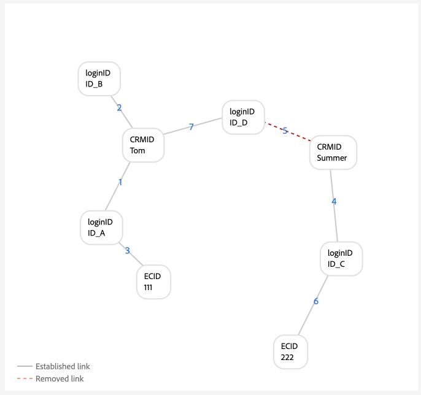

# Beispiele für Diagrammkonfigurationen

>[!AVAILABILITY]
>
>Die Regeln zur Verknüpfung von Identitätsdiagrammen befinden sich derzeit in der Beta-Phase. Wenden Sie sich an Ihr Adobe-Account-Team, um Informationen zu den Teilnahmekriterien zu erhalten. Die Funktion und die Dokumentation können sich ändern.

>[!NOTE]
>
>* &quot;CRMID&quot;und &quot;loginID&quot;sind benutzerdefinierte Namespaces. In diesem Dokument ist &quot;CRMID&quot;eine Personen-ID und &quot;loginID&quot;eine Anmelde-Kennung, die mit einer bestimmten Person verknüpft ist.
>* Um die in diesem Dokument beschriebenen Beispieldiagrammszenarien zu simulieren, müssen Sie zunächst zwei benutzerdefinierte Namespaces erstellen, einen mit dem Identitätssymbol &quot;CRMID&quot;und einen anderen mit dem Identitätssymbol &quot;loginID&quot;. Bei Identitätssymbolen wird zwischen Groß- und Kleinschreibung unterschieden.


In diesem Dokument werden Beispiele für die Diagrammkonfiguration gängiger Szenarien beschrieben, auf die Sie bei der Arbeit mit Regeln zur Identitätsdiagrammverknüpfung und Identitätsdaten stoßen können.

## Nur CRMID

Dies ist ein Beispiel für ein einfaches Implementierungsszenario, bei dem Online-Ereignisse (CRMID und ECID) erfasst und Offline-Ereignisse (Profildatensätze) nur für die CRMID gespeichert werden.

**Implementierung:**

| Verwendete Namespaces | Webverhalten-Erfassungsmethode |
| --- | --- |
| CRMID, ECID | Web SDK |

**Ereignisse:**

Sie können dieses Szenario in der Diagrammsimulation erstellen, indem Sie die folgenden Ereignisse in den Textmodus kopieren:

```shell
CRMID: Tom, ECID: 111
```

**Algorithmuskonfiguration:**

Sie können dieses Szenario in der Diagrammsimulation erstellen, indem Sie die folgende Einrichtung für Ihre Algorithmuskonfiguration konfigurieren:

| Priorität | Anzeigename | Identitätstyp | Eindeutig pro Diagramm |
| ---| --- | --- | --- |
| 1 | CRMID | CROSS_DEVICE | Ja |
| 2 | ECID | COOKIE | Nein |

**Primäre Identitätsauswahl für Echtzeit-Kundenprofil:**

Im Kontext dieser Konfiguration wird die primäre Identität wie folgt definiert:

| Authentifizierungsstatus | Namespace(s) in Ereignissen | Primäre Identität |
| --- | --- | --- |
| Authentifiziert | CRMID, ECID | CRMID |
| Nicht authentifiziert | ECID | ECID |

**Diagrammbeispiele**

>[!BEGINTABS]

>[!TAB Ideal für ein einzelnes Diagramm]

Im Folgenden finden Sie ein Beispiel für ein ideales Diagramm für eine Einzelperson, in dem CRMID eindeutig ist und die höchste Priorität erhält.


>[!TAB Diagramm für mehrere Personen]

Im Folgenden finden Sie ein Beispiel für ein Diagramm mit mehreren Personen. In diesem Beispiel wird ein Szenario mit einem &quot;freigegebenen Gerät&quot;angezeigt, in dem zwei CRMIDs vorhanden sind und die mit dem älteren eingerichteten Link entfernt wird.


**Eingabe für Diagrammsimulationsereignisse**

```shell
CRMID: Tom, ECID: 111
CRMID: Summer, ECID: 111
```

>[!ENDTABS]

## CRMID mit Hash-E-Mail

In diesem Szenario wird eine CRMID erfasst und stellt sowohl Online- (Erlebnisereignis-) als auch Offline-Daten (Profildatensatz) dar. Dieses Szenario umfasst auch die Erfassung einer Hash-E-Mail, die einen anderen Namespace darstellt, der im CRM-Datensatz zusammen mit der CRMID gesendet wird.

>[!IMPORTANT]
>
>**Es ist wichtig, dass die CRMID immer für jeden Benutzer gesendet wird**. Andernfalls kann es zu einem &quot;gefährlichen&quot;Anmelde-ID-Szenario kommen, bei dem davon ausgegangen wird, dass eine Entität einer einzelnen Person ein Gerät mit einer anderen Person teilt.

**Implementierung:**

| Verwendete Namespaces | Webverhalten-Erfassungsmethode |
| --- | --- |
| CRMID, Email_LC_SHA256, ECID | Web SDK |

**Ereignisse:**

Sie können dieses Szenario in der Diagrammsimulation erstellen, indem Sie die folgenden Ereignisse in den Textmodus kopieren:

```shell
CRMID: Tom, Email_LC_SHA256: tom<span>@acme.com
CRMID: Tom, ECID: 111
CRMID: Summer, Email_LC_SHA256: summer<span>@acme.com
CRMID: Summer, ECID: 222
```

**Algorithmuskonfiguration:**

Sie können dieses Szenario in der Diagrammsimulation erstellen, indem Sie die folgende Einrichtung für Ihre Algorithmuskonfiguration konfigurieren:

| Priorität | Anzeigename | Identitätstyp | Eindeutig pro Diagramm |
| ---| --- | --- | --- |
| 1 | CRMID | CROSS_DEVICE | Ja |
| 2 | E-Mails (SHA256, in Kleinbuchstaben) | E-Mail | Nein |
| 3 | ECID | COOKIE | Nein |

**Primäre Identitätsauswahl für Profil:**

Im Kontext dieser Konfiguration wird die primäre Identität wie folgt definiert:

| Authentifizierungsstatus | Namespace(s) in Ereignissen | Primäre Identität |
| --- | --- | --- |
| Authentifiziert | CRMID, ECID | CRMID |
| Nicht authentifiziert | ECID | ECID |

**Diagrammbeispiele**

>[!BEGINTABS]

>[!TAB Ideal für ein einzelnes Diagramm]

Im Folgenden finden Sie Beispiele für ein Paar idealer Diagramme für einzelne Personen, in denen jede CRMID mit dem jeweiligen Hash-E-Mail-Namespace und der ECID verknüpft ist.


>[!TAB Diagramm für mehrere Personen: freigegebenes Gerät]

Im Folgenden finden Sie ein Beispiel für ein Diagramm mit mehreren Personen, bei dem ein Gerät von zwei Personen gemeinsam genutzt wird.


**Eingabe für Diagrammsimulationsereignisse**

```shell
CRMID: Tom, Email_LC_SHA256: aabbcc
CRMID: Tom, ECID: 111
CRMID: Summer, Email_LC_SHA256: ddeeff
CRMID: Summer, ECID: 222
CRMID: Summer, ECID: 111
```

>[!TAB Diagramm für mehrere Personen: nicht eindeutige E-Mail-Adresse]

Im Folgenden finden Sie ein Beispiel für ein Diagramm mit mehreren Personen, bei dem E-Mail nicht eindeutig ist und mit zwei verschiedenen CRMIDs verknüpft wird.


**Eingabe für Diagrammsimulationsereignisse**

```shell
CRMID: Tom, Email_LC_SHA256: aabbcc
CRMID: Tom, ECID: 111
CRMID: Summer, Email_LC_SHA256: ddeeff
CRMID: Summer, ECID: 222
CRMID: Summer, Email_LC_SHA256: aabbcc
```

>[!ENDTABS]

## CRMID mit Hash-E-Mail, Hash-Telefon, GAID und IDFA

Dieses Szenario ähnelt dem vorherigen. In diesem Szenario werden Hash-E-Mails und -Telefone jedoch als Identitäten markiert, die in [[!DNL Segment Match]](../../segmentation/ui/segment-match/overview.md) verwendet werden sollen.

>[!IMPORTANT]
>
>**Es ist wichtig, dass die CRMID immer für jeden Benutzer gesendet wird**. Andernfalls kann es zu einem &quot;gefährlichen&quot;Anmelde-ID-Szenario kommen, bei dem davon ausgegangen wird, dass eine Entität einer einzelnen Person ein Gerät mit einer anderen Person teilt.

**Implementierung:**

| Verwendete Namespaces | Webverhalten-Erfassungsmethode |
| --- | --- |
| CRMID, Email_LC_SHA256, Phone_SHA256, GAID, IDFA, ECID | Web SDK |

**Ereignisse:**

Sie können dieses Szenario in der Diagrammsimulation erstellen, indem Sie die folgenden Ereignisse in den Textmodus kopieren:

```shell
CRMID: Tom, Email_LC_SHA256: aabbcc, Phone_SHA256: 123-4567
CRMID: Tom, ECID: 111
CRMID: Tom, ECID: 222, IDFA: A-A-A
CRMID: Summer, Email_LC_SHA256: ddeeff, Phone_SHA256: 765-4321
CRMID: Summer, ECID: 333
CRMID: Summer, ECID: 444, GAID:B-B-B
```

**Algorithmuskonfiguration:**

Sie können dieses Szenario in der Diagrammsimulation erstellen, indem Sie die folgende Einrichtung für Ihre Algorithmuskonfiguration konfigurieren:

| Priorität | Anzeigename | Identitätstyp | Eindeutig pro Diagramm |
| ---| --- | --- | --- |
| 1 | CRMID | CROSS_DEVICE | Ja |
| 2 | E-Mails (SHA256, in Kleinbuchstaben) | E-Mail | Nein |
| 3 | Telefon (SHA256) | Telefon | Nein |
| 4 | Google Ad ID (GAID) | GERÄT | Nein |
| 5 | Apple IDFA (ID für Apple) | GERÄT | Nein |
| 6 | ECID | COOKIE | Nein |

**Primäre Identitätsauswahl für Profil:**

Im Kontext dieser Konfiguration wird die primäre Identität wie folgt definiert:

| Authentifizierungsstatus | Namespace(s) in Ereignissen | Primäre Identität |
| --- | --- | --- |
| Authentifiziert | CRMID, IDFA, ECID | CRMID |
| Authentifiziert | CRMID, GAID, ECID | CRMID |
| Authentifiziert | CRMID, ECID | CRMID |
| Nicht authentifiziert | GAID, ECID | GAID |
| Nicht authentifiziert | IDFA, ECID | IDFA |
| Nicht authentifiziert | ECID | ECID |

**Diagrammbeispiele**

>[!BEGINTABS]

>[!TAB Ideal für ein einzelnes Diagramm]

Im Folgenden finden Sie ein ideales Diagramm für eine Person, bei dem Hash-E-Mail und Hash-Telefon als Identitäten für die Verwendung in [!DNL Segment Match] markiert sind. In diesem Szenario werden die Diagramme in zwei unterteilt, um unterschiedliche Personen darzustellen.


>[!TAB Diagramm für mehrere Personen: freigegebenes Gerät, freigegebener Computer]

Im Folgenden finden Sie ein Diagramm mit mehreren Personen, in dem ein Gerät (Computer) von zwei Personen gemeinsam genutzt wird. In diesem Szenario wird der freigegebene Computer durch `{ECID: 111}` repräsentiert und mit `{CRMID: Summer}` verknüpft, da dieser Link der zuletzt eingerichtete Link ist. `{CRMID: Tom}` wird entfernt, da die Verknüpfung zwischen `{CRMID: Tom}` und `{ECID: 111}` älter ist und CRMID der in dieser Konfiguration angegebene eindeutige Namespace ist.


**Eingabe für Diagrammsimulationsereignisse**

```shell
CRMID: Tom, Email_LC_SHA256: aabbcc, Phone_SHA256: 123-4567
CRMID: Tom, ECID: 111
CRMID: Tom, ECID: 222, IDFA: A-A-A
CRMID: Summer, Email_LC_SHA256: ddeeff, Phone_SHA256: 765-4321
CRMID: Summer, ECID: 333
CRMID: Summer, ECID: 444, GAID:B-B-B
CRMID: Summer, ECID: 111
```

>[!TAB Diagramm für mehrere Personen: freigegebenes Gerät, Android-Mobilgerät]

Im Folgenden finden Sie ein Diagramm mit mehreren Personen, in dem ein Android-Gerät von zwei Personen gemeinsam genutzt wird. In diesem Szenario wird CRMID als eindeutiger Namespace konfiguriert. Daher ersetzt der neuere Link von `{CRMID: Tom, GAID: B-B-B, ECID:444}` den älteren `{CRMID: Summer, GAID: B-B-B, ECID:444}`.


**Eingabe für Diagrammsimulationsereignisse**

```shell
CRMID: Tom, Email_LC_SHA256: aabbcc, Phone_SHA256: 123-4567
CRMID: Tom, ECID: 111
CRMID: Tom, ECID: 222, IDFA: A-A-A
CRMID: Summer, Email_LC_SHA256: ddeeff, Phone_SHA256: 765-4321
CRMID: Summer, ECID: 333
CRMID: Summer, ECID: 444, GAID: B-B-B
CRMID: Tom, ECID: 444, GAID: B-B-B
```

>[!TAB Diagramm für mehrere Personen: freigegebenes Gerät, Apple-Mobilgerät, kein ECID-Zurücksetzen]

Im Folgenden finden Sie ein Diagramm mit mehreren Personen, in dem ein Apple-Gerät von zwei Personen gemeinsam genutzt wird. In diesem Szenario wird der IDFA freigegeben, aber die ECID wird nicht zurückgesetzt.


**Eingabe für Diagrammsimulationsereignisse**

```shell
CRMID: Tom, Email_LC_SHA256: aabbcc, Phone_SHA256: 123-4567
CRMID: Tom, ECID: 111
CRMID: Tom, ECID: 222, IDFA: A-A-A
CRMID: Summer, Email_LC_SHA256: ddeeff, Phone_SHA256: 765-4321
CRMID: Summer, ECID: 333
CRMID: Summer, ECID: 444, GAID: B-B-B
CRMID: Summer, ECID: 222, IDFA: A-A-A
```

>[!TAB Diagramm für mehrere Personen: freigegebenes Gerät, Apfel, ECID wird zurückgesetzt]

Im Folgenden finden Sie ein Diagramm mit mehreren Personen, in dem ein Apple-Gerät von zwei Personen gemeinsam genutzt wird. In diesem Szenario wird die ECID zurückgesetzt, der IDFA bleibt jedoch gleich.


**Eingabe für Diagrammsimulationsereignisse**

```shell
CRMID: Tom, Email_LC_SHA256: aabbcc, Phone_SHA256: 123-4567
CRMID: Tom, ECID: 111
CRMID: Tom, ECID: 222, IDFA: A-A-A
CRMID: Summer, Email_LC_SHA256: ddeeff, Phone_SHA256: 765-4321
CRMID: Summer, ECID: 333
CRMID: Summer, ECID: 444, GAID: B-B-B
CRMID: Summer, ECID: 555, IDFA: A-A-A
```

>[!TAB Diagramm für mehrere Personen: Nicht eindeutiges Telefon]

Im Folgenden finden Sie ein Diagramm mit mehreren Personen, in dem dieselbe Telefonnummer von zwei Personen geteilt wird.


**Eingabe für Diagrammsimulationsereignisse**

```shell
CRMID: Tom, Email_LC_SHA256: aabbcc, Phone_SHA256: 123-4567
CRMID: Tom, ECID: 111
CRMID: Tom, ECID: 222, IDFA: A-A-A
CRMID: Summer, Email_LC_SHA256: ddeeff, Phone_SHA256: 765-4321
CRMID: Summer, ECID: 333
CRMID: Summer, ECID: 444, GAID: B-B-B
CRMID: Summer, Phone_SHA256: 123-4567
```

In diesem Beispiel wird `{Phone_SHA256}` auch als eindeutiger Namespace markiert. Daher kann ein Diagramm nicht mehr als eine Identität mit dem Namespace `{Phone_SHA256}` aufweisen. In diesem Szenario wird die Verknüpfung von `{Phone_SHA256: 765-4321}` mit `{CRMID: Summer}` und `{Email_LC_SHA256: ddeeff}` aufgehoben, da es sich um den älteren Link handelt.


>[!TAB Diagramm für mehrere Personen: Nicht eindeutige E-Mail-Adresse]

Im Folgenden finden Sie ein Diagramm mit mehreren Personen, in dem E-Mails von zwei Personen geteilt werden.


**Eingabe für Diagrammsimulationsereignisse**

```shell
CRMID: Tom, Email_LC_SHA256: aabbcc, Phone_SHA256: 123-4567
CRMID: Tom, ECID: 111
CRMID: Tom, ECID: 222, IDFA: A-A-A
CRMID: Summer, Email_LC_SHA256: ddeeff, Phone_SHA256: 765-4321
CRMID: Summer, ECID: 333
CRMID: Summer, ECID: 444, GAID: B-B-B
CRMID: Summer, Email_LC_SHA256: aabbcc
```

>[!ENDTABS]

## Einzelne CRMID mit mehreren Anmelde-IDs (einfache Version)

In diesem Szenario gibt es eine einzelne CRMID, die eine Personenentität darstellt. Eine Entität kann jedoch über mehrere Anmelde-IDs verfügen:

* Eine bestimmte Personenentität kann unterschiedliche Kontotypen aufweisen (persönlich vs. geschäftlich, Konto nach Staat, Konto nach Marke usw.)
* Eine bestimmte Personenentität kann für eine beliebige Anzahl von Konten unterschiedliche E-Mail-Adressen verwenden.

>[!IMPORTANT]
>
>**Es ist wichtig, dass die CRMID immer für jeden Benutzer gesendet wird**. Andernfalls kann es zu einem &quot;gefährlichen&quot;Anmelde-ID-Szenario kommen, bei dem davon ausgegangen wird, dass eine Entität einer einzelnen Person ein Gerät mit einer anderen Person teilt.

**Implementierung:**

| Verwendete Namespaces | Webverhalten-Erfassungsmethode |
| --- | --- |
| CRMID, loginID, ECID | Web SDK |

**Ereignisse:**

Sie können dieses Szenario in der Diagrammsimulation erstellen, indem Sie die folgenden Ereignisse in den Textmodus kopieren:

```shell
CRMID: Tom, loginID: ID_A
CRMID: Tom, loginID: ID_B
loginID: ID_A, ECID: 111
CRMID: Summer, loginID: ID_C
CRMID: Summer, loginID: ID_D
loginID: ID_C, ECID: 222
```

**Algorithmuskonfiguration:**

Sie können dieses Szenario in der Diagrammsimulation erstellen, indem Sie die folgende Einrichtung für Ihre Algorithmuskonfiguration konfigurieren:

| Priorität | Anzeigename | Identitätstyp | Eindeutig pro Diagramm |
| ---| --- | --- | --- |
| 1 | CRMID | CROSS_DEVICE | Ja |
| 2 | loginID | CROSS_DEVICE | Nein |
| 3 | ECID | COOKIE | Nein |

**Primäre Identitätsauswahl für Profil:**

Im Kontext dieser Konfiguration wird die primäre Identität wie folgt definiert:

| Authentifizierungsstatus | Namespace(s) in Ereignissen | Primäre Identität |
| --- | --- | --- |
| Authentifiziert | loginID, ECID | loginID |
| Authentifiziert | loginID, ECID | loginID |
| Authentifiziert | CRMID, loginID, ECID | CRMID |
| Authentifiziert | CRMID, ECID | CRMID |
| Nicht authentifiziert | ECID | ECID |

**Diagrammbeispiele**

>[!BEGINTABS]

>[!TAB Ideal single person scenario]

Im Folgenden finden Sie ein Einpersonendiagramm mit einer einzelnen CRMID und mehreren Anmelde-IDs.


>[!TAB Diagramm für mehrere Personen: freigegebenes Gerät]

Im Folgenden finden Sie ein Diagramm mit mehreren Personen, in dem ein Gerät von zwei Personen gemeinsam genutzt wird. In diesem Szenario ist `{ECID:111}` sowohl mit `{loginID:ID_A}` als auch mit `{loginID:ID_C}` verknüpft und der ältere festgestellte Link von `{ECID:111, loginID:ID_A}` wird entfernt.


**Eingabe für Diagrammsimulationsereignisse**

```shell
CRMID: Tom, loginID: ID_A
CRMID: Tom, loginID: ID_B
loginID: ID_A, ECID: 111
CRMID: Summer, loginID: ID_C
CRMID: Summer, loginID: ID_D
loginID: ID_C, ECID: 222
loginID: ID_C, ECID: 111
```

>[!TAB Diagramm für mehrere Personen: schlechte Daten]

Im Folgenden finden Sie ein Szenario mit mehreren Personen-Diagrammen, das fehlerhafte Daten enthält. In diesem Szenario ist `{loginID:ID_D}` fälschlicherweise mit zwei unterschiedlichen Benutzern verknüpft und der Link mit dem älteren Zeitstempel wird zugunsten des neueren Links gelöscht.



**Eingabe für Diagrammsimulationsereignisse**

```shell
CRMID: Tom, loginID: ID_A
CRMID: Tom, loginID: ID_B
loginID: ID_A, ECID: 111
CRMID: Summer, loginID: ID_C
CRMID: Summer, loginID: ID_D
loginID: ID_C, ECID: 222
CRMID: Tom, loginID: ID_D
```

>[!TAB &#39;Dangling&#39; loginID]

Das folgende Diagramm simuliert ein &quot;gefährliches&quot;loginID-Szenario. In diesem Beispiel sind zwei verschiedene loginIDs an dieselbe ECID gebunden. `{loginID:ID_C}` ist jedoch nicht mit der CRMID verknüpft. Identity Service kann daher nicht erkennen, dass diese beiden loginIDs zwei verschiedene Entitäten darstellen.


**Eingabe für Diagrammsimulationsereignisse**

```shell
CRMID: Tom, loginID: ID_A
CRMID: Tom, loginID: ID_B
loginID: ID_A, ECID: 111
loginID: ID_C, ECID: 111
```

>[!ENDTABS]

## Einzelne CRMID mit mehreren Anmelde-IDs (komplexe Version)

In diesem Szenario gibt es eine einzelne CRMID, die eine Personenentität darstellt. Eine Entität kann jedoch über mehrere Anmelde-IDs verfügen:

* Eine bestimmte Personenentität kann unterschiedliche Kontotypen aufweisen (persönlich vs. geschäftlich, Konto nach Staat, Konto nach Marke usw.)
* Eine bestimmte Personenentität kann für eine beliebige Anzahl von Konten unterschiedliche E-Mail-Adressen verwenden.

>[!IMPORTANT]
>
>**Es ist wichtig, dass die CRMID immer für jeden Benutzer gesendet wird**. Andernfalls kann es zu einem &quot;gefährlichen&quot;Anmelde-ID-Szenario kommen, bei dem davon ausgegangen wird, dass eine Entität einer einzelnen Person ein Gerät mit einer anderen Person teilt.

**Implementierung:**

| Verwendete Namespaces | Webverhalten-Erfassungsmethode |
| --- | --- |
| CRMID, Email_LC_SHA256, Phone_SHA256, loginID, ECID | Adobe Analytics-Quell-Connector. <br> **Hinweis:** Standardmäßig werden AIDs im Identity Service blockiert. Daher müssen Sie bei der Verwendung der Analytics-Quelle Ihren ECIDs eine höhere Priorität als AIDs einräumen. Weitere Informationen finden Sie im [Implementierungshandbuch](./implementation-guide.md#ingest-your-data) .</br> |

**Ereignisse:**

Sie können dieses Szenario in der Diagrammsimulation erstellen, indem Sie die folgenden Ereignisse in den Textmodus kopieren:

```shell
CRMID: Tom, Email_LC_SHA256: aabbcc, Phone_SHA256: 123-4567
CRMID: Tom, loginID: ID_A
CRMID: Tom, loginID: ID_B
loginID: ID_A, ECID: 111
CRMID: Summer, Email_LC_SHA256: ddeeff, Phone_SHA256: 765-4321
CRMID: Summer, loginID: ID_C
CRMID: Summer, loginID: ID_D
loginID: ID_C, ECID: 222
```

**Algorithmuskonfiguration:**

Sie können dieses Szenario in der Diagrammsimulation erstellen, indem Sie die folgende Einrichtung für Ihre Algorithmuskonfiguration konfigurieren:

| Priorität | Anzeigename | Identitätstyp | Eindeutig pro Diagramm |
| ---| --- | --- | --- | 
| 1 | CRMID | CROSS_DEVICE | Ja |
| 2 | Email_LC_SHA256 | E-Mail | Nein |
| 3 | Phone_SHA256 | Telefon | Nein |
| 4 | loginID | CROSS_DEVICE | Nein |
| 5 | ECID | COOKIE | Nein |
| 6 | AAID | COOKIE | Nein |

**Primäre Identitätsauswahl für Profil:**

Im Kontext dieser Konfiguration wird die primäre Identität wie folgt definiert:

| Authentifizierungsstatus | Namespace(s) in Ereignissen | Primäre Identität |
| --- | --- | --- |
| Authentifiziert | loginID, ECID | loginID |
| Authentifiziert | loginID, ECID | loginID |
| Authentifiziert | CRMID, loginID, ECID | CRMID |
| Authentifiziert | CRMID, ECID | CRMID |
| Nicht authentifiziert | ECID | ECID |

**Diagrammbeispiele**

>[!BEGINTABS]

>[!TAB Ideal für ein einzelnes Diagramm]

Im Folgenden finden Sie ein Beispiel für zwei Diagramme mit einer Person, von denen jede eine CRMID und mehrere loginIDs aufweist.


>[!TAB Diagramm für mehrere Personen: gemeinsam genutztes Gerät 1]

Im Folgenden finden Sie ein Szenario für ein gemeinsam genutztes Gerät mit mehreren Personen, in dem `{ECID:111}` sowohl mit `{loginID:ID_A}` als auch mit `{loginID:ID_C}` verknüpft ist. In diesem Fall werden die älteren etablierten Links zugunsten der aktuelleren Links entfernt.


**Eingabe für Diagrammsimulationsereignisse**

```shell
CRMID: Tom, Email_LC_SHA256: aabbcc, Phone_SHA256: 123-4567
CRMID: Tom, loginID: ID_A
CRMID: Tom, loginID: ID_B
loginID: ID_A, ECID: 111
CRMID: Summer, Email_LC_SHA256: ddeeff, Phone_SHA256: 765-4321
CRMID: Summer, loginID: ID_C
CRMID: Summer, loginID: ID_D
loginID: ID_C, ECID: 222
loginID: ID_C, ECID: 111
```

>[!TAB Diagramm für mehrere Personen: gemeinsam genutztes Gerät 2]

In diesem Szenario werden nicht nur die loginID gesendet, sondern sowohl die loginID als auch die CRMID als Erlebnisereignisse gesendet.


**Eingabe für Diagrammsimulationsereignisse**

```shell
CRMID: Tom, Email_LC_SHA256: aabbcc, Phone_SHA256: 123-4567
CRMID: Tom, loginID: ID_A
CRMID: Tom, loginID: ID_B
loginID: ID_A, ECID: 111
CRMID: Summer, Email_LC_SHA256: ddeeff, Phone_SHA256: 765-4321
CRMID: Summer, loginID: ID_C
CRMID: Summer, loginID: ID_D
loginID: ID_C, ECID: 222
CRMID: Summer, loginID: ID_C, ECID: 111
loginID: ID_A, ECID: 111
```

>[!TAB Diagramm für mehrere Personen: ungültige loginID-Daten]

In diesem Szenario ist `{loginID:ID_C}` sowohl mit `{CRMID:Tom}` als auch mit `{CRMID:Summer}` verknüpft und wird daher als ungültige Daten betrachtet, da ideale Diagrammszenarien nicht die gleichen loginIDs mit zwei unterschiedlichen Benutzern verknüpfen sollten. In diesem Fall werden die älteren etablierten Links zugunsten der kürzlich eingerichteten Links entfernt.


**Eingabe für Diagrammsimulationsereignisse**

```shell
CRMID: Tom, Email_LC_SHA256: aabbcc, Phone_SHA256: 123-4567
CRMID: Tom, loginID: ID_A
CRMID: Tom, loginID: ID_B
loginID: ID_A, ECID: 111
CRMID: Summer, Email_LC_SHA256: ddeeff, Phone_SHA256: 765-4321
CRMID: Summer, loginID: ID_C
CRMID: Summer, loginID: ID_D
loginID: ID_C, ECID: 222
CRMID: Tom, loginID: ID_C
```

>[!TAB Diagramm für mehrere Personen: nicht eindeutige E-Mail-Adresse]

In diesem Szenario wird eine nicht eindeutige E-Mail mit zwei verschiedenen CRMIDs verknüpft. Daher werden die älteren eingerichteten Links zugunsten der kürzlich eingerichteten Links entfernt.


**Eingabe für Diagrammsimulationsereignisse**

```shell
CRMID: Tom, Email_LC_SHA256: aabbcc, Phone_SHA256: 123-4567
CRMID: Tom, loginID: ID_A
CRMID: Tom, loginID: ID_B
loginID: ID_A, ECID: 111
CRMID: Summer, Email_LC_SHA256: ddeeff, Phone_SHA256: 765-4321
CRMID: Summer, loginID: ID_C
CRMID: Summer, loginID: ID_D
loginID: ID_C, ECID: 222
CRMID: Summer, Email_LC_SHA256: aabbcc
```

>[!TAB Diagramm für mehrere Personen: nicht eindeutiges Telefon]

In diesem Szenario wird eine nicht eindeutige Telefonnummer mit zwei verschiedenen CRMIDs verknüpft. Die älteren etablierten Links werden zugunsten der neueren eingerichteten Links entfernt.


**Eingabe für Diagrammsimulationsereignisse**

```shell
CRMID: Tom, Email_LC_SHA256: aabbcc, Phone_SHA256: 123-4567
CRMID: Tom, loginID: ID_A
CRMID: Tom, loginID: ID_B
loginID: ID_A, ECID: 111
CRMID: Summer, Email_LC_SHA256: ddeeff, Phone_SHA256: 765-4321
CRMID: Summer, loginID: ID_C
CRMID: Summer, loginID: ID_D
loginID: ID_C, ECID: 222
CRMID: Tom, Phone_SHA256: 111-1111
CRMID: Summer, Phone_SHA256: 111-1111
```

>[!ENDTABS]

## Verwendung in anderen Adobe Commerce

Die Beispiele für die Diagrammkonfiguration in diesem Abschnitt beschreiben Anwendungsfälle für Adobe Commerce. Die folgenden Beispiele konzentrieren sich auf Einzelhandelskunden mit zwei Benutzertypen:

* Registrierter Benutzer (Benutzer, die ein Konto erstellt haben)
* Gastbenutzer (Benutzer, die nur über eine E-Mail-Adresse verfügen)

>[!IMPORTANT]
>
>**Es ist wichtig, dass die CRMID immer für jeden Benutzer gesendet wird**. Andernfalls kann es zu einem &quot;gefährlichen&quot;Anmelde-ID-Szenario kommen, bei dem davon ausgegangen wird, dass eine Entität einer einzelnen Person ein Gerät mit einer anderen Person teilt.

**Implementierung:**

| Verwendete Namespaces | Webverhalten-Erfassungsmethode |
| --- | --- |
| CRMID, E-Mail, ECID | Web SDK |

**Ereignisse:**

Sie können dieses Szenario in der Diagrammsimulation erstellen, indem Sie die folgenden Ereignisse in den Textmodus kopieren:

```shell
CRMID: Tom, Email: tom@acme.com
CRMID: Tom, ECID: 111
```

**Algorithmuskonfiguration:**

Sie können dieses Szenario in der Diagrammsimulation erstellen, indem Sie die folgende Einrichtung für Ihre Algorithmuskonfiguration konfigurieren:

| Priorität | Anzeigename | Identitätstyp | Eindeutig pro Diagramm |
| ---| --- | --- | --- | 
| 1 | CRMID | CROSS_DEVICE | Ja |
| 2 | E-Mail | E-Mail | Ja |
| 5 | ECID | COOKIE | Nein |

**Primäre Identitätsauswahl für Profil:**

Im Kontext dieser Konfiguration wird die primäre Identität wie folgt definiert:

| Benutzeraktivität | Namespace(s) in Ereignissen | Primäre Identität |
| --- | --- | --- |
| Authentifiziertes Browsen | CRMID, ECID | CRMID |
| Gastkasse | E-Mail, ECID | E-Mail |
| Nicht authentifiziertes Browsen | ECID | ECID |

>[!WARNING]
>
>Registrierte Benutzer müssen sowohl CRMID als auch E-Mail in ihren Profilen verwenden, damit die folgenden Diagrammszenarien funktionieren.

**Diagrammbeispiele**

>[!BEGINTABS]

>[!TAB Ideal für ein einzelnes Diagramm]

Im Folgenden finden Sie ein Beispiel für ein ideales Diagramm für eine Person.


>[!TAB Diagramme für mehrere Personen]

Im Folgenden finden Sie ein Beispiel für ein Diagramm mit mehreren Personen, in dem zwei registrierte Benutzer dasselbe Gerät verwenden.


**Eingabe für Diagrammsimulationsereignisse**

```shell
CRMID: Tom, Email: tom@acme.com
CRMID: Summer, Email: summer@acme.com
CRMID: Tom, ECID: 111
CRMID: Summer, ECID: 111
```

In diesem Szenario verwenden ein registrierter Benutzer und ein Gastbenutzer dasselbe Gerät.


**Eingabe für Diagrammsimulationsereignisse**

```shell
CRMID: Tom, Email: tom@acme.com
CRMID: Tom, ECID: 111
Email: summer@acme.com, ECID: 111
```

In diesem Szenario teilen sich ein registrierter Benutzer und ein Gastbenutzer ein Gerät. Es tritt jedoch ein Implementierungsfehler auf, da die CRMID keinen entsprechenden E-Mail-Namespace enthält. In diesem Szenario ist Tom der registrierte Benutzer, und Summer ist der Gastbenutzer. Im Gegensatz zum vorherigen Szenario werden die beiden Entitäten zusammengeführt, da es keine gemeinsamen E-Mail-Namespaces zwischen den beiden Entitäten gibt.


**Eingabe für Diagrammsimulationsereignisse**

```shell
CRMID: Tom, ECID: 111
Email: summer@acme.com, ECID: 111
```

In diesem Szenario verwenden zwei Gastbenutzer dasselbe Gerät.


**Eingabe für Diagrammsimulationsereignisse**

```shell
Email: tom@acme.com, ECID: 111
Email: summer@acme.com, ECID: 111
```

In diesem Szenario checkt ein Gastbenutzer ein Element aus und registriert sich dann mit demselben Gerät.


**Eingabe für Diagrammsimulationsereignisse**

```shell
Email: tom@acme.com, ECID: 111
Email: tom@acme.com, CRMID: Tom
CRMID: Tom, ECID: 111
```

>[!ENDTABS]

## Nächste Schritte

Weitere Informationen zu Regeln zur Verknüpfung von Identitätsdiagrammen finden Sie in der folgenden Dokumentation:

* [Übersicht über die Verknüpfungsregeln von Identitätsdiagrammen](./overview.md)
* [Identitätsoptimierungsalgorithmus](./identity-optimization-algorithm.md)
* [Implementierungshandbuch](./implementation-guide.md)
* [Fehlerbehebung und häufig gestellte Fragen](./troubleshooting.md)
* [Namespace-Priorität](./namespace-priority.md)
* [Benutzeroberfläche der Diagrammsimulation](./graph-simulation.md)
* [Benutzeroberfläche für Identitätseinstellungen](./identity-settings-ui.md)