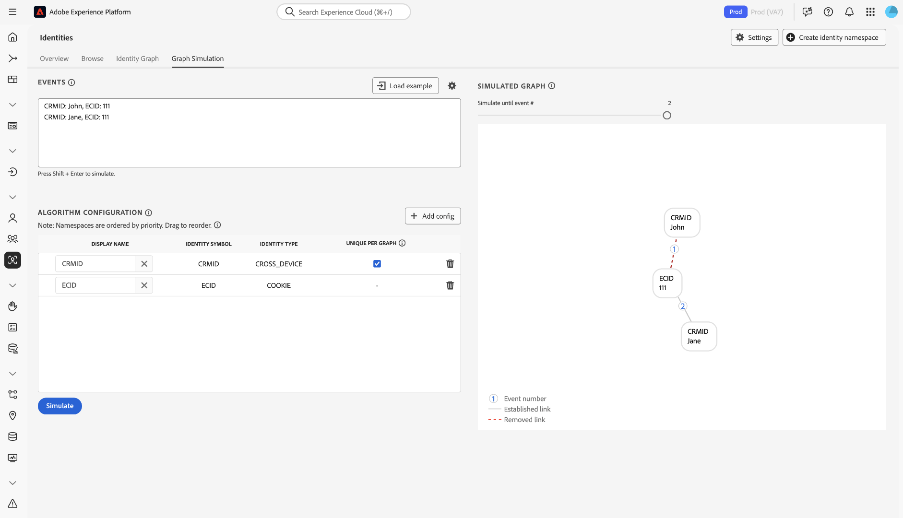

# Handbuch zu [!DNL Identity Graph Linking Rules] {#configurations-guide}

>[!CONTEXTUALHELP]
>id="platform_identities_algorithmconfiguration"
>title="Algorithmuskonfiguration"
>abstract="Konfigurieren Sie den eindeutigen Namespace und die Namespace-Priorität für die aufgenommenen Identitäten."

Lesen Sie dieses Dokument, um mehr über die verschiedenen Implementierungstypen zu erfahren, die Sie mit [!DNL Identity Graph Linking Rules] konfigurieren können.

Kundendiagramm-Szenarien können in drei verschiedene Kategorien gruppiert werden.

* **Basic**: [Basisimplementierungen](#basic-implementations) beinhalten Diagramme, die meist einfache Implementierungen enthalten. Diese Implementierungen drehen sich tendenziell um einen einzigen geräteübergreifenden Namespace (z. B. CRMID). Während grundlegende Implementierungen relativ einfach sind, kann es dennoch zu einer Diagrammreduzierung kommen, häufig aufgrund von Szenarien **gemeinsam genutzte Geräte**.
* **Intermediate**: [Zwischenimplementierungen](#intermediate-implementations) enthalten mehrere Variablen wie **mehrere geräteübergreifende Namespaces**, **nicht eindeutige Identitäten** und **mehrere eindeutige Namespaces**.
* **Erweitert**: [Erweiterte Implementierungen](#advanced-implementations) beinhalten komplexe und mehrschichtige Diagrammszenarien. Bei erweiterten Implementierungen ist es wichtig, die richtige Namespace-Prioritätsreihenfolge festzulegen, um sicherzustellen, dass die entsprechenden Links entfernt werden, um so das Reduzieren von Diagrammen zu verhindern.

## Erste Schritte

Bevor Sie sich mit dem folgenden Dokument befassen, sollten Sie sich mit verschiedenen wichtigen Konzepten von Identity Service und [!DNL Identity Graph Linking Rules] vertraut machen.

* [Identity Service – Übersicht](../home.md)
* [[!DNL Identity Graph Linking Rules] – Übersicht](../identity-graph-linking-rules/namespace-priority.md)
* [Namespace-Priorität](namespace-priority.md)
* [Eindeutiger Namespace](overview.md#unique-namespace)
* [Diagrammsimulation](graph-simulation.md)

## Grundlegende Implementierungen {#basic-implementations}

>[!NOTE]
>
>Um die folgenden Implementierungen durchzuführen, müssen Sie einen benutzerdefinierten Namespace mit dem Identitätssymbol (unter Berücksichtigung der Groß-/Kleinschreibung) erstellen: `CRMID`.

In diesem Abschnitt finden Sie grundlegende Implementierungen von [!DNL Identity Graph Linking Rules].

### Anwendungsfall: einfache Implementierung, die einen geräteübergreifenden Namespace verwendet

Im Allgemeinen verfügen Adobe-Kunden über einen einzigen geräteübergreifenden Namespace, der für alle Eigenschaften verwendet wird, einschließlich Web, Mobile und Anwendungen. Dieses System ist sowohl branchen- als auch geografisch unabhängig, da Kunden in Einzelhandel, Telekommunikation und Finanzdienstleistungen diese Art der Implementierung verwenden.

In der Regel wird ein Endbenutzer durch einen geräteübergreifenden Namespace (häufig eine CRMID) dargestellt, daher sollte die CRMID als eindeutiger Namespace klassifiziert werden. Ein Endbenutzer, der einen Computer und ein [!DNL iPhone] besitzt und sein Gerät nicht freigibt, könnte ein Identitätsdiagramm wie das folgende haben.

Angenommen, Sie sind Datenarchitekt bei einem E-Commerce-Unternehmen namens **ACME**. John und Jane sind Ihre Kunden. Sie sind Endbenutzer, die zusammen in San Jose, Kalifornien leben. Sie teilen sich einen Desktop-Computer und verwenden diesen Computer, um Ihre Website zu durchsuchen. Ähnlich verhält es sich mit John und Jane, die ebenfalls einen [!DNL iPad] teilen und gelegentlich diese [!DNL iPad] verwenden, um im Internet zu surfen, einschließlich Ihrer Website.

**Textmodus**

```json
CRMID: John, ECID: 123
CRMID: John, ECID: 999, IDFA: a-b-c
```

**Algorithmuskonfiguration (Identitätseinstellungen)**

Konfigurieren Sie die folgenden Einstellungen in der Benutzeroberfläche zur Diagrammsimulation, bevor Sie Ihr Diagramm simulieren.

| Anzeigename | Identitätssymbol | Identitätstyp | Nur einmal im Diagramm | Namespace-Priorität |
| --- | --- | --- | --- | --- |
| CRMID | CRMID | CROSS_DEVICE | ✔️ | 1 |
| ECID | ECID | COOKIE | | 2 |
| IDFA | IDFA | GERÄT | | 3 |

**Simulierter Graph**

In diesem Diagramm wird John (der Endbenutzer) durch die CRMID dargestellt. `{ECID: 123}` stellt den Webbrowser dar, den John auf seinem PC verwendet hat, um Ihre E-Commerce-Plattform zu besuchen. `{ECID: 999}` stellt den Browser dar, den er auf seiner [!DNL iPhone] verwendet hat, und `{IDFA: a-b-c}` stellt seine [!DNL iPhone] dar.


**Übung**

Simulieren Sie die folgende Konfiguration in der Diagrammsimulation. Sie können entweder eigene Ereignisse erstellen oder im Textmodus kopieren und einfügen.

>[!BEGINTABS]

>[!TAB Freigegebenes Gerät (PC)]

**Freigegebenes Gerät (PC)**

**Textmodus**

```json
CRMID: John, ECID: 111
CRMID: Jane, ECID: 111
```

**Simulierter Graph**

In diesem Diagramm werden John und Jane durch ihre eigenen CRM-IDs dargestellt:

* `{CRMID: John}`
* `{CRMID: Jane}`

Der Browser auf dem Desktop-Computer, den beide zum Besuch Ihrer E-Commerce-Plattform verwenden, wird durch `{ECID: 111}` dargestellt. In diesem Diagrammszenario ist Jane der letzte authentifizierte Endbenutzer, und daher wird die Verknüpfung zwischen `{ECID: 111}` und `{CRMID: John}` entfernt.



>[!TAB Freigegebenes Gerät (mobil)]

**Freigegebenes Gerät (mobil)**

**Textmodus**

```json
CRMID: John, ECID: 111, IDFA: a-b-c
CRMID: Jane, ECID: 111, IDFA: a-b-c
```

**Simulierter Graph**

In diesem Diagramm werden John und Jane beide durch ihre eigenen CRM-IDs dargestellt. Der von ihnen verwendete Browser wird durch `{ECID: 111}` und die von ihnen freigegebenen [!DNL iPad] durch `{IDFA: a-b-c}` dargestellt. In diesem Diagrammszenario ist Jane der letzte authentifizierte Endbenutzer. Daher werden die Links von `{ECID: 111}` und `{IDFA: a-b-c}` zu `{CRMID: John}` entfernt.


>[!ENDTABS]

## Zwischenlösungen {#intermediate-implementations}

>[!TIP]
>
>Eine **nicht eindeutige Identität** ist eine Identität, die mit einem nicht eindeutigen Namespace verknüpft ist.

Lesen Sie diesen Abschnitt für Zwischenimplementierungen von [!DNL Identity Graph Linking Rules].

### Anwendungsfall: Ihre Daten enthalten nicht eindeutige Identitäten

>[!NOTE]
>
>Um die folgenden Implementierungen durchzuführen, müssen Sie die folgenden benutzerdefinierten Namespaces mit den Identitätssymbolen (von Schreibweise abhängig) erstellen:
>* `CRMID`
>* `CChash` (Dies ist ein benutzerdefinierter Namespace, der eine gehashte Kreditkartennummer darstellt.)

Stellen Sie sich vor, Sie arbeiten als Datenarchitekt für eine Geschäftsbank, die Kreditkarten ausgibt. Ihr Marketing-Team hat mitgeteilt, dass es den Verlauf früherer Kreditkartentransaktionen in ein Profil aufnehmen möchte. Dieses Identitätsdiagramm könnte wie folgt aussehen.

**Textmodus**

```json
CRMID: John, CChash: 1111-2222 
CRMID: John, CChash: 3333-4444 
CRMID: John, ECID: 123 
CRMID: John, ECID: 999, IDFA: a-b-c
```

**Algorithmuskonfiguration (Identitätseinstellungen)**

Konfigurieren Sie die folgenden Einstellungen in der Benutzeroberfläche zur Diagrammsimulation, bevor Sie Ihr Diagramm simulieren.

| Anzeigename | Identitätssymbol | Identitätstyp | Nur einmal im Diagramm | Namespace-Priorität |
| --- | --- | --- | --- | --- |
| CRMID | CRMID | CROSS_DEVICE | ✔️ | 1 |
| Schlag | Schlag | CROSS_DEVICE | | 2 |
| ECID | ECID | COOKIE | | 3 |
| IDFA | IDFA | GERÄT | | 4 |

**Simulierter Graph**


Es gibt keine Garantien, dass diese Kreditkartennummern oder andere nicht eindeutige Namespaces immer einem einzelnen Endbenutzer zugeordnet werden. Zwei Endbenutzer können sich mit derselben Kreditkarte registrieren, es kann jedoch zu nicht eindeutigen Platzhalterwerten kommen, die fälschlicherweise aufgenommen wurden. Einfach ausgedrückt: Es gibt keine Garantie, dass nicht eindeutige Namespaces nicht zu einem Diagrammausfall führen.

Zur Lösung dieses Problems entfernt Identity Service die ältesten Links und behält die neuesten Links bei. Dadurch wird sichergestellt, dass nur eine CRMID in einem Diagramm vorhanden ist, wodurch das Ausblenden des Diagramms verhindert wird.

**Übung**

Simulieren Sie die folgenden Konfigurationen in der Diagrammsimulation. Sie können entweder eigene Ereignisse erstellen oder im Textmodus kopieren und einfügen.

>[!BEGINTABS]

>[!TAB Freigegebenes Gerät]

**Textmodus**

```json
CRMID: John, CChash: 1111-2222
CRMID: Jane, CChash: 3333-4444
CRMID: John, ECID: 123
CRMID: Jane, ECID:123
```

**Simulierter Graph**


>[!TAB Zwei Endbenutzer mit derselben Kreditkarte]

Zwei verschiedene Endbenutzer melden sich mit derselben Kreditkarte für Ihre E-Commerce-Website an. Ihr Marketing-Team möchte das Ausblenden von Diagrammen verhindern, indem es sicherstellt, dass die Kreditkarte nur mit einem einzigen Profil verknüpft ist.

**Textmodus**

```json
CRMID: John, CChash: 1111-2222
CRMID: Jane, CChash: 1111-2222
CRMID: John, ECID: 123
CRMID: Jane, ECID:456
```

**Simulierter Graph**


>[!TAB Ungültige Kreditkartennummer]

Aufgrund unsauberer Daten wird eine ungültige Kreditkartennummer in Experience Platform aufgenommen.

**Textmodus**

```json
CRMID: John, CChash: undefined
CRMID: Jane, CChash: undefined
CRMID: Jack, CChash: undefined
CRMID: Jill, CChash: undefined
```

**Simulierter Graph**


>[!ENDTABS]

### Anwendungsfall: Ihre Daten enthalten sowohl gehashte als auch ungehashte CRMIDs

>[!NOTE]
>
>Um die folgenden Implementierungen durchzuführen, müssen Sie benutzerdefinierte Namespaces mit den Identitätssymbolen (von Schreibweise abhängig) erstellen:
>* `CRMID`
>* `CRMIDhash`

Sie nehmen sowohl eine ungehashte (offline) CRMID als auch eine gehashte (online) CRMID auf. Es wird erwartet, dass eine direkte Beziehung zwischen ungehashten und gehashten CRMIDs besteht. Wenn ein Endbenutzer mit einem authentifizierten Konto surft, wird die Hash-CRMID zusammen mit der Geräte-ID gesendet (dargestellt in Identity Service als ECID).

**Algorithmuskonfiguration (Identitätseinstellungen)**

Konfigurieren Sie die folgenden Einstellungen in der Benutzeroberfläche zur Diagrammsimulation, bevor Sie Ihr Diagramm simulieren.

| Anzeigename | Identitätssymbol | Identitätstyp | Nur einmal im Diagramm | Namespace-Priorität |
| --- | --- | --- | --- | --- | 
| CRMID | CRMID | CROSS_DEVICE | ✔️ | 1 |
| CRMIDhash | CRMIDhash | CROSS_DEVICE | ✔️ | 2 |
| ECID | ECID | COOKIE | | 3 |


**Übung**

Simulieren Sie die folgenden Konfigurationen in der Diagrammsimulation. Sie können entweder eigene Ereignisse erstellen oder im Textmodus kopieren und einfügen.

>[!BEGINTABS]

>[!TAB Freigegebenes Gerät]

John und Jane teilen sich ein Gerät.

**Textmodus**

```json
CRMID: John, CRMIDhash: John
CRMID: Jane, CRMIDhash: Jane
CRMIDhash: John, ECID: 111 
CRMIDhash: Jane, ECID: 111
```


>[!TAB Ungültige Daten]

Aufgrund von Fehlern im Hash-Prozess wird eine nicht eindeutige Hash-CRMID generiert und an Identity Service gesendet.

**Textmodus**

```json
CRMID: John, CRMIDhash: aaaa
CRMID: Jane, CRMIDhash: aaaa
```


>[!ENDTABS]
<!-- 
### Use case: You are using Real-Time CDP and Adobe Commerce

You have two types of end-users:

* **Members**: An end-user who is assigned a CRMID and has an email account registered to your system.
* **Guests**: An end-user who is not a member. They do not have an assigned CRMID and their email accounts are not registered to your system.

In this scenario, your customers are sending data from Adobe Commerce to Real-Time CDP.

**Exercise**

Simulate the following configurations in the graph simulation tool. You can either create your own events, or copy and paste using text mode.

>[!BEGINTABS]

>[!TAB Shared device between two members]

In this scenario, two members share the same device to browse an e-commerce website.

**Text mode**

```json
CRMID: John, Email: john@g
CRMID: Jane, Email: jane@g
CRMID: John, ECID: 111
CRMID: Jane, ECID: 111
```


>[!TAB Shared device between two guests]

In this scenario, two guests share the same device to browse an e-commerce website.

**Text mode**

```json
Email: john@g, ECID: 111
Email: jane@g, ECID: 111
```


>[!TAB Shared device between a member and a guest]

In this scenario, a member and a guest share the same device to browse an e-commerce website.

**Text mode**

```json
CRMID: John, Email: john@g
CRMID: John, ECID: 111
Email: jane@g, ECID: 111
```


>[!ENDTABS] -->

### Anwendungsfall: Ihre Daten enthalten drei eindeutige Namespaces

>[!NOTE]
>
>Um die folgenden Implementierungen durchzuführen, müssen Sie einen benutzerdefinierten Namespace mit dem Identitätssymbol (unter Berücksichtigung der Groß-/Kleinschreibung) erstellen: `CRMID`.

Ihr Kunde definiert eine Einzelpersonen-Entität wie folgt:

* Ein Endbenutzer mit einer zugewiesenen CRMID.
* Ein Endbenutzer, der einer Hash-E-Mail-Adresse zugeordnet ist, damit Profile für Ziele aktiviert werden können, die Hash-E-Mails unterstützen (z. B. [!DNL Facebook]).
* Ein Endbenutzer, der mit einer E-Mail-Adresse verknüpft ist, sodass Support-Mitarbeiter ihr Profil auf Real-Time CDP mithilfe dieser E-Mail-Adresse nachschlagen können.

| Anzeigename | Identitätssymbol | Identitätstyp | Nur einmal im Diagramm | Namespace-Priorität |
| --- | --- | --- | --- | --- |
| CRMID | CRMID | CROSS_DEVICE | ✔️ | 1 |
| E-Mail | E-Mail | E-Mail | ✔️ | 2 |
| Email_LC_SHA256 | Email_LC_SHA256 | E-Mail | ✔️ | 3 |
| ECID | ECID | COOKIE | | 4 |

Simulieren Sie die folgenden Konfigurationen im Tool zur Diagrammsimulation. Sie können entweder eigene Ereignisse erstellen oder im Textmodus kopieren und einfügen.

>[!BEGINTABS]

>[!TAB Freigegebenes Gerät]

In diesem Szenario melden sich John und Jane beide auf einer E-Commerce-Website an.

**Textmodus**

```json
CRMID: John, Email: john@g, Email_LC_SHA256: john_hash 
CRMID: Jane, Email: jane@g, Email_LC_SHA256: jane_hash 
CRMID: John, ECID: 111 
CRMID: Jane, ECID: 111
```


>[!TAB Ein Endbenutzer ändert seine E-Mail]

**Textmodus**

```json
CRMID: John, Email: john@g, Email_LC_SHA256: john_hash
CRMID: John, Email: john@y, Email_LC_SHA256: john_y_hash
```


>[!ENDTABS]

## Erweiterte Implementierungen {#advanced-implementations}

Fortgeschrittene Implementierungen beinhalten komplexe und mehrschichtige Diagrammszenarien. Zu diesen Implementierungstypen gehört die Verwendung von **Namespace-Priorität** um die richtigen Links zu identifizieren, die entfernt werden müssen, um das Ausblenden von Diagrammen zu verhindern.

**Namespace-Priorität** sind Metadaten, die Namespaces nach ihrer Wichtigkeit ordnen. Wenn ein Diagramm zwei Identitäten mit jeweils unterschiedlichen eindeutigen Namespaces enthält, verwendet Identity Service die Namespace-Priorität, um zu entscheiden, welche Links entfernt werden sollen. Weitere Informationen finden Sie in der [Dokumentation zur Namespace-Priorität](../identity-graph-linking-rules/namespace-priority.md).

Die Namespace-Priorität spielt in komplexen Diagrammszenarien eine wichtige Rolle. Diagramme können mehrere Ebenen haben - ein Endbenutzer kann mit mehreren Anmelde-IDs verknüpft sein, und diese Anmelde-IDs können gehasht werden. Darüber hinaus können verschiedene ECIDs mit verschiedenen Anmelde-IDs verknüpft werden. Um sicherzustellen, dass der richtige Link in der rechten Ebene entfernt wird, müssen Ihre Namespace-Prioritätskonfigurationen korrekt sein.

Lesen Sie diesen Abschnitt für erweiterte Implementierungen von [!DNL Identity Graph Linking Rules].

### Anwendungsfall: Sie benötigen Unterstützung für mehrere Geschäftszweige

>[!NOTE]
>
>Um die folgenden Implementierungen durchzuführen, müssen Sie benutzerdefinierte Namespaces mit den Identitätssymbolen (von Schreibweise abhängig) erstellen:
>* `CRMID`
>* `loginID`

Ihre Endbenutzer haben zwei verschiedene Konten, ein persönliches Konto und ein Geschäftskonto. Jedes Konto wird durch eine andere ID identifiziert. In diesem Szenario würde ein typisches Diagramm wie folgt aussehen:

**Textmodus**

```json
CRMID: John, loginID: JohnPersonal
CRMID: John, loginID: JohnBusiness
loginID: JohnPersonal, ECID: 111
loginID: JohnPersonal, ECID: 222
loginID: JohnBusiness, ECID: 222
```

**Algorithmuskonfiguration (Identitätseinstellungen)**

Konfigurieren Sie die folgenden Einstellungen in der Benutzeroberfläche zur Diagrammsimulation, bevor Sie Ihr Diagramm simulieren.

| Anzeigename | Identitätssymbol | Identitätstyp | Nur einmal im Diagramm | Namespace-Priorität |
| --- | --- | --- | --- | --- |
| CRMID | CRMID | CROSS_DEVICE | ✔️ | 1 |
| loginID | loginID | CROSS_DEVICE | | 2 |
| ECID | ECID | COOKIE | | 3 |

**Simulierter Graph**


**Übung**

Simulieren Sie die folgende Konfiguration in der Diagrammsimulation. Sie können entweder eigene Ereignisse erstellen oder im Textmodus kopieren und einfügen.

>[!BEGINTABS]

>[!TAB Freigegebenes Gerät]

**Textmodus**

```json
CRMID: John, loginID: JohnPersonal
CRMID: John, loginID: JohnBusiness
CRMID: Jane, loginID: JanePersonal
CRMID: Jane, loginID: JaneBusiness
loginID: JohnPersonal, ECID: 111
loginID: JanePersonal, ECID: 111
```


>[!TAB Ungültige Daten werden an Real-Time CDP gesendet]

**Textmodus**

```json
CRMID: John, loginID: JohnPersonal
CRMID: John, loginID: error
CRMID: Jane, loginID: JanePersonal
CRMID: Jane, loginID: error
loginID: JohnPersonal, ECID: 111
loginID: JanePersonal, ECID: 222
```


>[!ENDTABS]

### Anwendungsfall: Sie verfügen über komplexe Implementierungen, für die mehrere Namespaces erforderlich sind

>[!NOTE]
>
>Um die folgenden Implementierungen durchzuführen, müssen Sie benutzerdefinierte Namespaces mit den Identitätssymbolen (von Schreibweise abhängig) erstellen:
>* `CRMID`
>* `loyaltyID`
>* `thirdPartyID`
>* `orderID`

Sie sind ein Medien- und Unterhaltungsunternehmen und Ihre Endbenutzer haben Folgendes:

* EINE CRMID
* Eine Treuekennung

Darüber hinaus können Ihre Endbenutzer auf der E-Commerce-Website einen Kauf tätigen, und diese Daten sind an ihre E-Mail-Adresse gebunden. Benutzerdaten werden auch von einem Datenbankanbieter eines Drittanbieters angereichert und in Batches an Experience Platform gesendet.

**Textmodus**

```json
CRMID: John, loyaltyID: John, Email: john@g
Email: john@g, orderID: aaa
CRMID: John, thirdPartyID: xyz
CRMID: John, ECID: 111
```

**Algorithmuskonfiguration (Identitätseinstellungen)**

Konfigurieren Sie die folgenden Einstellungen in der Benutzeroberfläche zur Diagrammsimulation, bevor Sie Ihr Diagramm simulieren.

| Anzeigename | Identitätssymbol | Identitätstyp | Nur einmal im Diagramm | Namespace-Priorität |
| --- | --- | --- | --- | --- |
| CRMID | CRMID | CROSS_DEVICE | ✔️ | 1 |
| LoyaltyID | LoyaltyID | CROSS_DEVICE | ✔️ | 2 |
| E-Mail | E-Mail | E-Mail | ✔️ | 3 |
| thirdPartyID | thirdPartyID | CROSS_DEVICE | | 4 |
| orderID | orderID | CROSS_DEVICE | | 5 |
| ECID | ECID | COOKIE | | 6 |

**Übung**

Simulieren Sie die folgende Konfiguration in der Diagrammsimulation. Sie können entweder eigene Ereignisse erstellen oder im Textmodus kopieren und einfügen.

>[!BEGINTABS]

>[!TAB Freigegebenes Gerät]

**Textmodus**

```json
CRMID: John, loyaltyID: John, Email: john@g
CRMID: Jane, loyaltyID: Jane, Email: jane@g
Email: john@g, orderID: aaa 
CRMID: John, thirdPartyID: xyz 
CRMID: John, ECID: 111
CRMID: Jane, ECID: 111
```


>[!TAB Endbenutzer ändert seine E-Mail-Adresse]

**Textmodus**

```json
CRMID: John, loyaltyID: John, Email: john@g
CRMID: John, loyaltyID: John, Email: john@y
```


>[!TAB Die ThirdPartyID-Verknüpfung ändert sich]

**Textmodus**

```json
CRMID: John, loyaltyID: John, Email: john@g
CRMID: Jane, loyaltyID: Jane, Email: jane@g
CRMID: John, thirdPartyID: xyz
CRMID: Jane, thirdPartyID: xyz
```


>[!TAB Nicht eindeutige orderID]

**Textmodus**

```json
CRMID: John, loyaltyID: John, Email: john@g
CRMID: Jane, loyaltyID: Jane, Email: jane@g
Email: john@g, orderID: aaa
Email: jane@g, orderID: aaa
```


>[!TAB Fehlerhafte LoyaltyID]

**Textmodus**

```json
CRMID: John, loyaltyID: aaa, Email: john@g
CRMID: Jane, loyaltyID: aaa, Email: jane@g
```


>[!ENDTABS]

## Nächste Schritte

Weitere Informationen zu [!DNL Identity Graph Linking Rules] finden Sie in der folgenden Dokumentation:

* [[!DNL Identity Graph Linking Rules] – Übersicht](./overview.md)
* [Algorithmus der Identitätsoptimierung](./identity-optimization-algorithm.md)
* [Implementierungshandbuch](./implementation-guide.md)
* [Fehlerbehebung und häufig gestellte Fragen](./troubleshooting.md)
* [Namespace-Priorität](./namespace-priority.md)
* [Benutzeroberfläche für die Diagrammsimulation](./graph-simulation.md)
* [Benutzeroberfläche für Identitätseinstellungen](./identity-settings-ui.md)