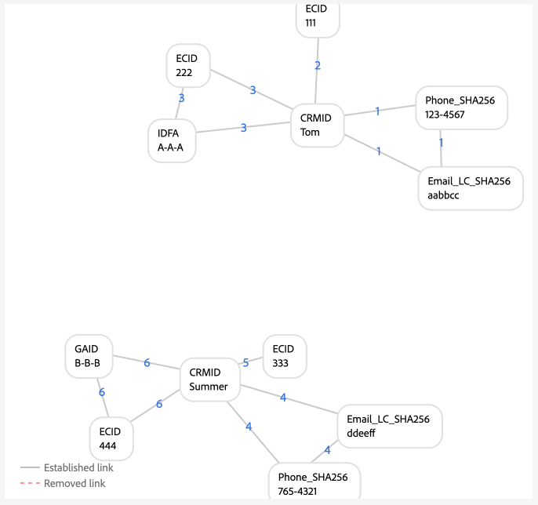
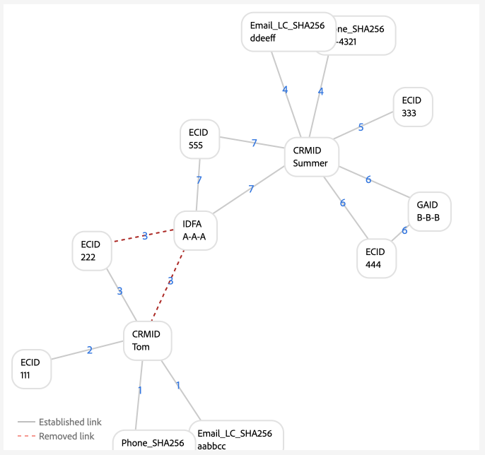
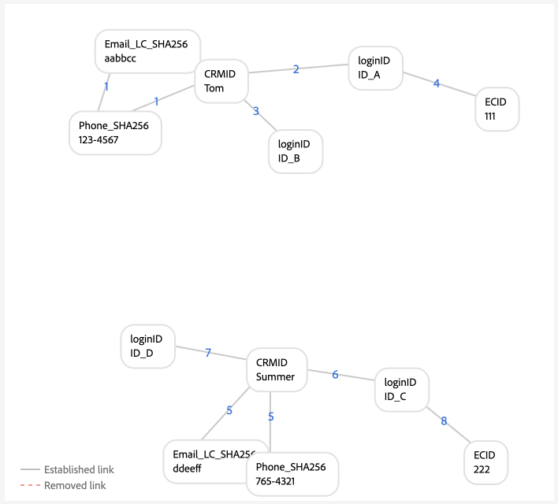

# Beispiele für Diagrammkonfigurationen {#examples-of-graph-configurations}

>[!CONTEXTUALHELP]
>id="platform_identities_algorithmconfiguration"
>title="Algorithmuskonfiguration"
>abstract="Konfigurieren Sie den eindeutigen Namespace und die Namespace-Priorität für die aufgenommenen Identitäten."
>additional-url="https://experienceleague.adobe.com/en/docs/experience-platform/identity/features/identity-graph-linking-rules/example-configurations" text="Weitere Informationen"

>[!AVAILABILITY]
>
>Regeln zur Identitätsdiagramm-Verknüpfung sind derzeit nur eingeschränkt verfügbar. Wenden Sie sich an Ihr Adobe-Konto-Team , um Informationen zum Zugriff auf die Funktion in Entwicklungs-Sandboxes zu erhalten.

>[!NOTE]
>
>* „CRMID“ und „loginID“ sind benutzerdefinierte Namespaces. In diesem Dokument ist „CRMID“ eine Personenkennung und „loginID“ eine mit einer bestimmten Person verknüpfte Anmeldekennung.
>* Um die in diesem Dokument beschriebenen Beispieldiagrammszenarien zu simulieren, müssen Sie zunächst zwei benutzerdefinierte Namespaces erstellen, einen mit dem Identitätssymbol „CRMID“ und einen weiteren mit dem Identitätssymbol „loginID“. Bei Identitätssymbolen wird zwischen Groß- und Kleinschreibung unterschieden.

In diesem Dokument werden Beispiele für die Diagrammkonfiguration beschrieben, die bei der Arbeit mit Regeln zur Identitätsdiagrammverknüpfung und Identitätsdaten häufig vorkommen.

## Nur CRMID

Dies ist ein Beispiel für ein einfaches Implementierungsszenario, in dem Online-Ereignisse (CRMID und ECID) aufgenommen und Offline-Ereignisse (Profildatensätze) nur für die CRMID gespeichert werden.

**Implementierung:**

| Verwendete Namespaces | Methode zur Erfassung des Webverhaltens |
| --- | --- |
| CRMID, ECID | Web SDK |

**Ereignisse:**

Sie können dieses Szenario in der Diagrammsimulation erstellen, indem Sie die folgenden Ereignisse in den Textmodus kopieren:

```shell
CRMID: Tom, ECID: 111
```

**Algorithmuskonfiguration:**

Sie können dieses Szenario in der Diagrammsimulation erstellen, indem Sie die folgende Einrichtung für Ihre Algorithmuskonfiguration konfigurieren:

| Priorität | Anzeigename | Identitätstyp | Nur einmal im Diagramm |
| ---| --- | --- | --- |
| 1 | CRMID | CROSS_DEVICE | Ja |
| 2 | ECID | COOKIE | Nein |

**Primäre Identitätsauswahl für Echtzeit-Kundenprofil:**

Im Kontext dieser Konfiguration wird die primäre Identität wie folgt definiert:

| Authentifizierungsstatus | Namespace(s) in Ereignissen | Primäre Identität |
| --- | --- | --- |
| Authentifiziert | CRMID, ECID | CRMID |
| Nicht authentifiziert | ECID | ECID |

**Beispiele für Diagramme**

>[!BEGINTABS]

>[!TAB Ideales Einzelpersonen-Diagramm]

Im Folgenden finden Sie ein Beispiel für ein ideales Einzelpersonen-Diagramm, bei dem CRMID eindeutig ist und die höchste Priorität hat.


>[!TAB Mehrpersonendiagramm]

Im Folgenden finden Sie ein Beispiel für ein Mehrpersonen-Diagramm. In diesem Beispiel wird ein Szenario mit einem „gemeinsam genutzten Gerät“ angezeigt, in dem zwei CRMIDs vorhanden sind und die mit der älteren eingerichteten Relation entfernt wird.


**Eingabe von Diagrammsimulationsereignissen**

```shell
CRMID: Tom, ECID: 111
CRMID: Summer, ECID: 111
```

>[!ENDTABS]

## CRMID mit Hash-E-Mail

In diesem Szenario wird eine CRMID aufgenommen, die sowohl Online- (Erlebnisereignis) als auch Offline- (Profildatensatz) Daten darstellt. Dieses Szenario beinhaltet auch die Aufnahme einer Hash-E-Mail, die einen anderen Namespace darstellt, der im CRM-Datensatz zusammen mit der CRM-ID gesendet wird.

>[!IMPORTANT]
>
>**Es ist wichtig, dass die CRMID immer für jeden Benutzer gesendet wird**. Andernfalls kann es zu einem „herabhängenden“ Anmelde-ID-Szenario kommen, in dem davon ausgegangen wird, dass eine Einzelpersonen-Entität ein Gerät mit einer anderen Person teilt.

**Implementierung:**

| Verwendete Namespaces | Methode zur Erfassung des Webverhaltens |
| --- | --- |
| CRMID, EMAIL_LC_SHA256, ECID | Web SDK |

**Ereignisse:**

Sie können dieses Szenario in der Diagrammsimulation erstellen, indem Sie die folgenden Ereignisse in den Textmodus kopieren:

```shell
CRMID: Tom, Email_LC_SHA256: tom<span>@acme.com
CRMID: Tom, ECID: 111
CRMID: Summer, Email_LC_SHA256: summer<span>@acme.com
CRMID: Summer, ECID: 222
```

**Algorithmuskonfiguration:**

Sie können dieses Szenario in der Diagrammsimulation erstellen, indem Sie die folgende Einrichtung für Ihre Algorithmuskonfiguration konfigurieren:

| Priorität | Anzeigename | Identitätstyp | Nur einmal im Diagramm |
| ---| --- | --- | --- |
| 1 | CRMID | CROSS_DEVICE | Ja |
| 2 | E-Mails (SHA256, in Kleinbuchstaben) | E-Mail | Nein |
| 3 | ECID | COOKIE | Nein |

**Primäre Identitätsauswahl für Profil:**

Im Kontext dieser Konfiguration wird die primäre Identität wie folgt definiert:

| Authentifizierungsstatus | Namespace(s) in Ereignissen | Primäre Identität |
| --- | --- | --- |
| Authentifiziert | CRMID, ECID | CRMID |
| Nicht authentifiziert | ECID | ECID |

**Beispiele für Diagramme**

>[!BEGINTABS]

>[!TAB Ideales Einzelpersonen-Diagramm]

Im Folgenden finden Sie Beispiele für ein Paar idealer Einzelpersonen-Diagramme, bei denen jede CRMID mit ihrem jeweiligen gehashten E-Mail-Namespace und ihrer ECID verknüpft ist.


>[!TAB Mehrpersonendiagramm: gemeinsam genutztes Gerät]

Im Folgenden finden Sie ein Beispiel für ein mehrpersoniges Diagrammszenario, in dem ein Gerät von zwei Personen gemeinsam genutzt wird.


**Eingabe von Diagrammsimulationsereignissen**

```shell
CRMID: Tom, Email_LC_SHA256: aabbcc
CRMID: Tom, ECID: 111
CRMID: Summer, Email_LC_SHA256: ddeeff
CRMID: Summer, ECID: 222
CRMID: Summer, ECID: 111
```

>[!TAB Mehrpersonendiagramm: Nicht eindeutige E-Mail]

Im Folgenden finden Sie ein Beispiel für ein mehrpersonales Diagrammszenario, in dem die E-Mail nicht eindeutig ist und mit zwei verschiedenen CRM-IDs verknüpft wird.


**Eingabe von Diagrammsimulationsereignissen**

```shell
CRMID: Tom, Email_LC_SHA256: aabbcc
CRMID: Tom, ECID: 111
CRMID: Summer, Email_LC_SHA256: ddeeff
CRMID: Summer, ECID: 222
CRMID: Summer, Email_LC_SHA256: aabbcc
```

>[!ENDTABS]

## CRMID mit Hash-E-Mail, Hash-Telefon, GAID und IDFA

Dieses Szenario ähnelt dem vorherigen. In diesem Szenario werden Hash-E-Mails und -Telefonnummern jedoch als Identitäten markiert, die in [[!DNL Segment Match]](../../segmentation/ui/segment-match/overview.md) verwendet werden sollen.

>[!IMPORTANT]
>
>**Es ist wichtig, dass die CRMID immer für jeden Benutzer gesendet wird**. Andernfalls kann es zu einem „herabhängenden“ Anmelde-ID-Szenario kommen, in dem davon ausgegangen wird, dass eine Einzelpersonen-Entität ein Gerät mit einer anderen Person teilt.

**Implementierung:**

| Verwendete Namespaces | Methode zur Erfassung des Webverhaltens |
| --- | --- |
| CRMID, EMAIL_LC_SHA256, Phone_SHA256, GAID, IDFA, ECID | Web SDK |

**Ereignisse:**

Sie können dieses Szenario in der Diagrammsimulation erstellen, indem Sie die folgenden Ereignisse in den Textmodus kopieren:

```shell
CRMID: Tom, Email_LC_SHA256: aabbcc, Phone_SHA256: 123-4567
CRMID: Tom, ECID: 111
CRMID: Tom, ECID: 222, IDFA: A-A-A
CRMID: Summer, Email_LC_SHA256: ddeeff, Phone_SHA256: 765-4321
CRMID: Summer, ECID: 333
CRMID: Summer, ECID: 444, GAID:B-B-B
```

**Algorithmuskonfiguration:**

Sie können dieses Szenario in der Diagrammsimulation erstellen, indem Sie die folgende Einrichtung für Ihre Algorithmuskonfiguration konfigurieren:

| Priorität | Anzeigename | Identitätstyp | Nur einmal im Diagramm |
| ---| --- | --- | --- |
| 1 | CRMID | CROSS_DEVICE | Ja |
| 2 | E-Mails (SHA256, in Kleinbuchstaben) | E-Mail | Nein |
| 3 | Telefon (SHA256) | Telefon | Nein |
| 4 | Google Ad ID (GAID) | GERÄT | Nein |
| 5 | Apple IDFA (ID für Apple) | GERÄT | Nein |
| 6 | ECID | COOKIE | Nein |

**Primäre Identitätsauswahl für Profil:**

Im Kontext dieser Konfiguration wird die primäre Identität wie folgt definiert:

| Authentifizierungsstatus | Namespace(s) in Ereignissen | Primäre Identität |
| --- | --- | --- |
| Authentifiziert | CRMID, IDFA, ECID | CRMID |
| Authentifiziert | CRMID, GAID, ECID | CRMID |
| Authentifiziert | CRMID, ECID | CRMID |
| Nicht authentifiziert | GAID, ECID | GAID |
| Nicht authentifiziert | IDFA, ECID | IDFA |
| Nicht authentifiziert | ECID | ECID |

**Beispiele für Diagramme**

>[!BEGINTABS]

>[!TAB Ideales Einzelpersonen-Diagramm]

Im Folgenden finden Sie ein ideales Einzelpersonen-Diagrammszenario, in dem Hash-E-Mails und Hash-Telefonnummern als Identitäten für die Verwendung in [!DNL Segment Match] gekennzeichnet werden. In diesem Szenario werden die Diagramme in zwei Teile aufgeteilt, um unterschiedliche Personenentitäten darzustellen.



>[!TAB Mehrpersonendiagramm: Freigegebenes Gerät, freigegebener Computer]

Im Folgenden finden Sie ein mehrpersonales Diagrammszenario, in dem ein Gerät (Computer) von zwei Personen gemeinsam genutzt wird. In diesem Szenario wird der freigegebene Computer durch `{ECID: 111}` dargestellt und ist mit `{CRMID: Summer}` verknüpft, da diese Verknüpfung die zuletzt eingerichtete Verknüpfung ist. `{CRMID: Tom}` wird entfernt, da die Verknüpfung zwischen `{CRMID: Tom}` und `{ECID: 111}` älter ist und CRMID der designierte eindeutige Namespace in dieser Konfiguration ist.


**Eingabe von Diagrammsimulationsereignissen**

```shell
CRMID: Tom, Email_LC_SHA256: aabbcc, Phone_SHA256: 123-4567
CRMID: Tom, ECID: 111
CRMID: Tom, ECID: 222, IDFA: A-A-A
CRMID: Summer, Email_LC_SHA256: ddeeff, Phone_SHA256: 765-4321
CRMID: Summer, ECID: 333
CRMID: Summer, ECID: 444, GAID:B-B-B
CRMID: Summer, ECID: 111
```

>[!TAB Mehrpersonendiagramm: Freigegebenes Gerät, Android-Mobilgerät]

Im Folgenden finden Sie ein Multi-Person-Diagramm-Szenario, in dem ein Android-Gerät von zwei Personen gemeinsam genutzt wird. In diesem Szenario wird CRMID als eindeutiger Namespace konfiguriert, weshalb der neuere Link von `{CRMID: Tom, GAID: B-B-B, ECID:444}` den älteren `{CRMID: Summer, GAID: B-B-B, ECID:444}` ersetzt.


**Eingabe von Diagrammsimulationsereignissen**

```shell
CRMID: Tom, Email_LC_SHA256: aabbcc, Phone_SHA256: 123-4567
CRMID: Tom, ECID: 111
CRMID: Tom, ECID: 222, IDFA: A-A-A
CRMID: Summer, Email_LC_SHA256: ddeeff, Phone_SHA256: 765-4321
CRMID: Summer, ECID: 333
CRMID: Summer, ECID: 444, GAID: B-B-B
CRMID: Tom, ECID: 444, GAID: B-B-B
```

>[!TAB Mehrpersonendiagramm: Freigegebenes Gerät, Apple-Mobilgerät, kein Zurücksetzen der ECID]

Im Folgenden finden Sie ein mehrpersonales Diagrammszenario, in dem ein Apple-Gerät von zwei Personen gemeinsam genutzt wird. In diesem Szenario wird der IDFA freigegeben, aber die ECID wird nicht zurückgesetzt.


**Eingabe von Diagrammsimulationsereignissen**

```shell
CRMID: Tom, Email_LC_SHA256: aabbcc, Phone_SHA256: 123-4567
CRMID: Tom, ECID: 111
CRMID: Tom, ECID: 222, IDFA: A-A-A
CRMID: Summer, Email_LC_SHA256: ddeeff, Phone_SHA256: 765-4321
CRMID: Summer, ECID: 333
CRMID: Summer, ECID: 444, GAID: B-B-B
CRMID: Summer, ECID: 222, IDFA: A-A-A
```

>[!TAB Mehrpersonendiagramm: Freigegebenes Gerät, Apple, ECID-Zurücksetzungen]

Im Folgenden finden Sie ein mehrpersonales Diagrammszenario, in dem ein Apple-Gerät von zwei Personen gemeinsam genutzt wird. In diesem Szenario wird die ECID zurückgesetzt, aber der IDFA bleibt gleich.



**Eingabe von Diagrammsimulationsereignissen**

```shell
CRMID: Tom, Email_LC_SHA256: aabbcc, Phone_SHA256: 123-4567
CRMID: Tom, ECID: 111
CRMID: Tom, ECID: 222, IDFA: A-A-A
CRMID: Summer, Email_LC_SHA256: ddeeff, Phone_SHA256: 765-4321
CRMID: Summer, ECID: 333
CRMID: Summer, ECID: 444, GAID: B-B-B
CRMID: Summer, ECID: 555, IDFA: A-A-A
```

>[!TAB Mehrpersonendiagramm: Nicht eindeutiges Telefon]

Im Folgenden finden Sie ein mehrpersonales Diagrammszenario, in dem dieselbe Telefonnummer von zwei Personen gemeinsam genutzt wird.


**Eingabe von Diagrammsimulationsereignissen**

```shell
CRMID: Tom, Email_LC_SHA256: aabbcc, Phone_SHA256: 123-4567
CRMID: Tom, ECID: 111
CRMID: Tom, ECID: 222, IDFA: A-A-A
CRMID: Summer, Email_LC_SHA256: ddeeff, Phone_SHA256: 765-4321
CRMID: Summer, ECID: 333
CRMID: Summer, ECID: 444, GAID: B-B-B
CRMID: Summer, Phone_SHA256: 123-4567
```

In diesem Beispiel wird `{Phone_SHA256}` auch als eindeutiger Namespace markiert. Daher kann ein Diagramm nicht mehr als eine Identität mit dem `{Phone_SHA256}` Namespace haben. In diesem Szenario wird die Verknüpfung von `{Phone_SHA256: 765-4321}` mit `{CRMID: Summer}` und `{Email_LC_SHA256: ddeeff}` aufgehoben, da es sich um den älteren Link handelt.


>[!TAB Mehrpersonendiagramm: Nicht eindeutige E-Mail]

Im Folgenden finden Sie ein mehrpersonales Diagrammszenario, in dem E-Mails von zwei Personen gemeinsam genutzt werden.


**Eingabe von Diagrammsimulationsereignissen**

```shell
CRMID: Tom, Email_LC_SHA256: aabbcc, Phone_SHA256: 123-4567
CRMID: Tom, ECID: 111
CRMID: Tom, ECID: 222, IDFA: A-A-A
CRMID: Summer, Email_LC_SHA256: ddeeff, Phone_SHA256: 765-4321
CRMID: Summer, ECID: 333
CRMID: Summer, ECID: 444, GAID: B-B-B
CRMID: Summer, Email_LC_SHA256: aabbcc
```

>[!ENDTABS]

## Einzelne CRMID mit mehreren Anmelde-IDs (einfache Version)

In diesem Szenario gibt es eine einzelne CRMID, die eine Personenentität darstellt. Eine Personenentität kann jedoch über mehrere Anmelde-IDs verfügen:

* Eine bestimmte Personenentität kann über verschiedene Kontotypen verfügen (privates oder geschäftliches Konto, Konto nach Bundesland, Konto nach Marke usw.)
* Eine bestimmte Personenentität kann für eine beliebige Anzahl von Konten unterschiedliche E-Mail-Adressen verwenden.

>[!IMPORTANT]
>
>**Es ist wichtig, dass die CRMID immer für jeden Benutzer gesendet wird**. Andernfalls kann es zu einem „herabhängenden“ Anmelde-ID-Szenario kommen, in dem davon ausgegangen wird, dass eine Einzelpersonen-Entität ein Gerät mit einer anderen Person teilt.

**Implementierung:**

| Verwendete Namespaces | Methode zur Erfassung des Webverhaltens |
| --- | --- |
| CRMID, loginID, ECID | Web SDK |

**Ereignisse:**

Sie können dieses Szenario in der Diagrammsimulation erstellen, indem Sie die folgenden Ereignisse in den Textmodus kopieren:

```shell
CRMID: Tom, loginID: ID_A
CRMID: Tom, loginID: ID_B
loginID: ID_A, ECID: 111
CRMID: Summer, loginID: ID_C
CRMID: Summer, loginID: ID_D
loginID: ID_C, ECID: 222
```

**Algorithmuskonfiguration:**

Sie können dieses Szenario in der Diagrammsimulation erstellen, indem Sie die folgende Einrichtung für Ihre Algorithmuskonfiguration konfigurieren:

| Priorität | Anzeigename | Identitätstyp | Nur einmal im Diagramm |
| ---| --- | --- | --- |
| 1 | CRMID | CROSS_DEVICE | Ja |
| 2 | loginID | CROSS_DEVICE | Nein |
| 3 | ECID | COOKIE | Nein |

**Primäre Identitätsauswahl für Profil:**

Im Kontext dieser Konfiguration wird die primäre Identität wie folgt definiert:

| Authentifizierungsstatus | Namespace(s) in Ereignissen | Primäre Identität |
| --- | --- | --- |
| Authentifiziert | loginID, ECID | loginID |
| Authentifiziert | loginID, ECID | loginID |
| Authentifiziert | CRMID, loginID, ECID | CRMID |
| Authentifiziert | CRMID, ECID | CRMID |
| Nicht authentifiziert | ECID | ECID |

**Beispiele für Diagramme**

>[!BEGINTABS]

>[!TAB Ideales Einzelpersonen-Szenario]

Im Folgenden finden Sie ein Einzelpersonen-Diagrammszenario mit einer einzelnen CRMID und mehreren Anmelde-IDs.


>[!TAB Multi-Person-Diagramm-Szenario: Freigegebenes Gerät]

Im Folgenden finden Sie ein mehrpersonales Diagrammszenario, in dem ein Gerät von zwei Personen gemeinsam genutzt wird. In diesem Szenario ist `{ECID:111}` sowohl mit `{loginID:ID_A}` als auch mit `{loginID:ID_C}` verknüpft, und die ältere etablierte Verknüpfung von `{ECID:111, loginID:ID_A}` wird entfernt.


**Eingabe von Diagrammsimulationsereignissen**

```shell
CRMID: Tom, loginID: ID_A
CRMID: Tom, loginID: ID_B
loginID: ID_A, ECID: 111
CRMID: Summer, loginID: ID_C
CRMID: Summer, loginID: ID_D
loginID: ID_C, ECID: 222
loginID: ID_C, ECID: 111
```

>[!TAB Multi-Personen-Diagramm-Szenario: fehlerhafte Daten]

Im Folgenden finden Sie ein Mehrpersonen-Diagrammszenario, das fehlerhafte Daten enthält. In diesem Szenario wird `{loginID:ID_D}` fälschlicherweise mit zwei unterschiedlichen Benutzenden verknüpft und die Relation mit dem älteren Zeitstempel wird zugunsten der kürzlich eingerichteten Relation gelöscht.


**Eingabe von Diagrammsimulationsereignissen**

```shell
CRMID: Tom, loginID: ID_A
CRMID: Tom, loginID: ID_B
loginID: ID_A, ECID: 111
CRMID: Summer, loginID: ID_C
CRMID: Summer, loginID: ID_D
loginID: ID_C, ECID: 222
CRMID: Tom, loginID: ID_D
```

>[!TAB &#39;Dangling&#39; loginID]

Das folgende Diagramm simuliert ein „verwaistes“ Anmelde-ID-Szenario. In diesem Beispiel sind zwei verschiedene Anmelde-IDs an dieselbe ECID gebunden. `{loginID:ID_C}` ist jedoch nicht mit der CRMID verknüpft. Daher kann Identity Service nicht erkennen, dass diese beiden Anmelde-IDs zwei verschiedene Entitäten darstellen.


**Eingabe von Diagrammsimulationsereignissen**

```shell
CRMID: Tom, loginID: ID_A
CRMID: Tom, loginID: ID_B
loginID: ID_A, ECID: 111
loginID: ID_C, ECID: 111
```

>[!ENDTABS]

## Einzelne CRMID mit mehreren Anmelde-IDs (komplexe Version)

In diesem Szenario gibt es eine einzelne CRMID, die eine Personenentität darstellt. Eine Personenentität kann jedoch über mehrere Anmelde-IDs verfügen:

* Eine bestimmte Personenentität kann über verschiedene Kontotypen verfügen (privates oder geschäftliches Konto, Konto nach Bundesland, Konto nach Marke usw.)
* Eine bestimmte Personenentität kann für eine beliebige Anzahl von Konten unterschiedliche E-Mail-Adressen verwenden.

>[!IMPORTANT]
>
>**Es ist wichtig, dass die CRMID immer für jeden Benutzer gesendet wird**. Andernfalls kann es zu einem „herabhängenden“ Anmelde-ID-Szenario kommen, in dem davon ausgegangen wird, dass eine Einzelpersonen-Entität ein Gerät mit einer anderen Person teilt.

**Implementierung:**

| Verwendete Namespaces | Methode zur Erfassung des Webverhaltens |
| --- | --- |
| CRMID, Email_LC_SHA256, Phone_SHA256, loginID, ECID | Adobe Analytics-Quell-Connector. <br> **Hinweis** Standardmäßig sind AAIDs in Identity Service blockiert. Daher müssen Sie Ihren ECIDs eine höhere Priorität einräumen als AAIDs, wenn Sie die Analytics-Quelle verwenden. Weitere Informationen finden Sie [Implementierungshandbuch](./implementation-guide.md#ingest-your-data).</br> |

**Ereignisse:**

Sie können dieses Szenario in der Diagrammsimulation erstellen, indem Sie die folgenden Ereignisse in den Textmodus kopieren:

```shell
CRMID: Tom, Email_LC_SHA256: aabbcc, Phone_SHA256: 123-4567
CRMID: Tom, loginID: ID_A
CRMID: Tom, loginID: ID_B
loginID: ID_A, ECID: 111
CRMID: Summer, Email_LC_SHA256: ddeeff, Phone_SHA256: 765-4321
CRMID: Summer, loginID: ID_C
CRMID: Summer, loginID: ID_D
loginID: ID_C, ECID: 222
```

**Algorithmuskonfiguration:**

Sie können dieses Szenario in der Diagrammsimulation erstellen, indem Sie die folgende Einrichtung für Ihre Algorithmuskonfiguration konfigurieren:

| Priorität | Anzeigename | Identitätstyp | Nur einmal im Diagramm |
| ---| --- | --- | --- | 
| 1 | CRMID | CROSS_DEVICE | Ja |
| 2 | Email_LC_SHA256 | E-Mail | Nein |
| 3 | phone_SHA256 | Telefon | Nein |
| 4 | loginID | CROSS_DEVICE | Nein |
| 5 | ECID | COOKIE | Nein |
| 6 | AAID | COOKIE | Nein |

**Primäre Identitätsauswahl für Profil:**

Im Kontext dieser Konfiguration wird die primäre Identität wie folgt definiert:

| Authentifizierungsstatus | Namespace(s) in Ereignissen | Primäre Identität |
| --- | --- | --- |
| Authentifiziert | loginID, ECID | loginID |
| Authentifiziert | loginID, ECID | loginID |
| Authentifiziert | CRMID, loginID, ECID | CRMID |
| Authentifiziert | CRMID, ECID | CRMID |
| Nicht authentifiziert | ECID | ECID |

**Beispiele für Diagramme**

>[!BEGINTABS]

>[!TAB Ideales Einzelpersonen-Diagramm]

Im Folgenden finden Sie ein Beispiel für zwei Einzelpersonen-Diagramme, die jeweils eine CRMID und mehrere Anmelde-IDs haben.



>[!TAB Mehrpersonendiagramm: gemeinsam genutztes Gerät 1]

Im Folgenden finden Sie ein Szenario mit einem gemeinsam genutzten Gerät für mehrere Personen, bei dem `{ECID:111}` sowohl mit `{loginID:ID_A}` als auch mit `{loginID:ID_C}` verknüpft ist. In diesem Fall werden die älteren etablierten Links zugunsten der neueren Links entfernt.


**Eingabe von Diagrammsimulationsereignissen**

```shell
CRMID: Tom, Email_LC_SHA256: aabbcc, Phone_SHA256: 123-4567
CRMID: Tom, loginID: ID_A
CRMID: Tom, loginID: ID_B
loginID: ID_A, ECID: 111
CRMID: Summer, Email_LC_SHA256: ddeeff, Phone_SHA256: 765-4321
CRMID: Summer, loginID: ID_C
CRMID: Summer, loginID: ID_D
loginID: ID_C, ECID: 222
loginID: ID_C, ECID: 111
```

>[!TAB Mehrpersonendiagramm: gemeinsam genutztes Gerät 2]

In diesem Szenario werden nicht nur die Anmelde-ID, sondern auch die Anmelde-ID und die CRMID als Erlebnisereignisse gesendet.


**Eingabe von Diagrammsimulationsereignissen**

```shell
CRMID: Tom, Email_LC_SHA256: aabbcc, Phone_SHA256: 123-4567
CRMID: Tom, loginID: ID_A
CRMID: Tom, loginID: ID_B
loginID: ID_A, ECID: 111
CRMID: Summer, Email_LC_SHA256: ddeeff, Phone_SHA256: 765-4321
CRMID: Summer, loginID: ID_C
CRMID: Summer, loginID: ID_D
loginID: ID_C, ECID: 222
CRMID: Summer, loginID: ID_C, ECID: 111
loginID: ID_A, ECID: 111
```

>[!TAB Mehrpersonendiagramm: fehlerhafte LoginID-Daten]

In diesem Szenario ist `{loginID:ID_C}` sowohl mit `{CRMID:Tom}` als auch mit `{CRMID:Summer}` verknüpft und gilt daher als fehlerhafte Daten, da ideale Diagrammszenarien nicht dieselben Login-IDs mit zwei unterschiedlichen Benutzern verknüpfen sollten. In diesem Fall werden die älteren etablierten Links zugunsten der neueren Links entfernt.


**Eingabe von Diagrammsimulationsereignissen**

```shell
CRMID: Tom, Email_LC_SHA256: aabbcc, Phone_SHA256: 123-4567
CRMID: Tom, loginID: ID_A
CRMID: Tom, loginID: ID_B
loginID: ID_A, ECID: 111
CRMID: Summer, Email_LC_SHA256: ddeeff, Phone_SHA256: 765-4321
CRMID: Summer, loginID: ID_C
CRMID: Summer, loginID: ID_D
loginID: ID_C, ECID: 222
CRMID: Tom, loginID: ID_C
```

>[!TAB Mehrpersonendiagramm: Nicht eindeutige E-Mail]

In diesem Szenario wird eine nicht eindeutige E-Mail mit zwei verschiedenen CRM-IDs verknüpft. Daher werden die älteren etablierten Links zugunsten der kürzlich eingerichteten Links entfernt.


**Eingabe von Diagrammsimulationsereignissen**

```shell
CRMID: Tom, Email_LC_SHA256: aabbcc, Phone_SHA256: 123-4567
CRMID: Tom, loginID: ID_A
CRMID: Tom, loginID: ID_B
loginID: ID_A, ECID: 111
CRMID: Summer, Email_LC_SHA256: ddeeff, Phone_SHA256: 765-4321
CRMID: Summer, loginID: ID_C
CRMID: Summer, loginID: ID_D
loginID: ID_C, ECID: 222
CRMID: Summer, Email_LC_SHA256: aabbcc
```

>[!TAB Mehrpersonendiagramm: Nicht eindeutiges Telefon]

In diesem Szenario wird eine nicht eindeutige Telefonnummer mit zwei verschiedenen CRM-IDs verknüpft. Die älteren etablierten Links werden zugunsten der kürzlich eingerichteten Links entfernt.


**Eingabe von Diagrammsimulationsereignissen**

```shell
CRMID: Tom, Email_LC_SHA256: aabbcc, Phone_SHA256: 123-4567
CRMID: Tom, loginID: ID_A
CRMID: Tom, loginID: ID_B
loginID: ID_A, ECID: 111
CRMID: Summer, Email_LC_SHA256: ddeeff, Phone_SHA256: 765-4321
CRMID: Summer, loginID: ID_C
CRMID: Summer, loginID: ID_D
loginID: ID_C, ECID: 222
CRMID: Tom, Phone_SHA256: 111-1111
CRMID: Summer, Phone_SHA256: 111-1111
```

>[!ENDTABS]

## Verwendung in anderen Adobe Commerce

Die Beispiele für Diagrammkonfigurationen in diesem Abschnitt beschreiben Anwendungsfälle für Adobe Commerce. Die folgenden Beispiele konzentrieren sich auf Einzelhandelskunden mit zwei Benutzertypen:

* Registrierte Benutzer (Benutzer, die ein Konto erstellt haben)
* Gastbenutzer (Benutzer, die nur eine E-Mail-Adresse haben)

>[!IMPORTANT]
>
>**Es ist wichtig, dass die CRMID immer für jeden Benutzer gesendet wird**. Andernfalls kann es zu einem „herabhängenden“ Anmelde-ID-Szenario kommen, in dem davon ausgegangen wird, dass eine Einzelpersonen-Entität ein Gerät mit einer anderen Person teilt.

**Implementierung:**

| Verwendete Namespaces | Methode zur Erfassung des Webverhaltens |
| --- | --- |
| CRMID, E-Mail, ECID | Web SDK |

**Ereignisse:**

Sie können dieses Szenario in der Diagrammsimulation erstellen, indem Sie die folgenden Ereignisse in den Textmodus kopieren:

```shell
CRMID: Tom, Email: tom@acme.com
CRMID: Tom, ECID: 111
```

**Algorithmuskonfiguration:**

Sie können dieses Szenario in der Diagrammsimulation erstellen, indem Sie die folgende Einrichtung für Ihre Algorithmuskonfiguration konfigurieren:

| Priorität | Anzeigename | Identitätstyp | Nur einmal im Diagramm |
| ---| --- | --- | --- | 
| 1 | CRMID | CROSS_DEVICE | Ja |
| 2 | E-Mail | E-Mail | Ja |
| 5 | ECID | COOKIE | Nein |

**Primäre Identitätsauswahl für Profil:**

Im Kontext dieser Konfiguration wird die primäre Identität wie folgt definiert:

| Benutzeraktivität | Namespace(s) in Ereignissen | Primäre Identität |
| --- | --- | --- |
| Authentifiziertes Browsen | CRMID, ECID | CRMID |
| Gast-Checkout | E-Mail, ECID | E-Mail |
| Nicht authentifiziertes Browsen | ECID | ECID |

>[!WARNING]
>
>Registrierte Benutzer müssen sowohl CRMID als auch E-Mail in ihren Profilen haben, damit die folgenden Diagrammszenarien funktionieren.

**Beispiele für Diagramme**

>[!BEGINTABS]

>[!TAB Ideales Einzelpersonen-Diagramm]

Im Folgenden finden Sie ein Beispiel für ein ideales Einzelpersonen-Diagramm.


>[!TAB Diagramme für mehrere Personen]

Im Folgenden finden Sie ein Beispiel für ein Diagramm mit mehreren Personen, in dem zwei registrierte Benutzer mit demselben Gerät navigieren.


**Eingabe von Diagrammsimulationsereignissen**

```shell
CRMID: Tom, Email: tom@acme.com
CRMID: Summer, Email: summer@acme.com
CRMID: Tom, ECID: 111
CRMID: Summer, ECID: 111
```

In diesem Szenario teilen sich ein registrierter Benutzer und ein Gastbenutzer dasselbe Gerät.


**Eingabe von Diagrammsimulationsereignissen**

```shell
CRMID: Tom, Email: tom@acme.com
CRMID: Tom, ECID: 111
Email: summer@acme.com, ECID: 111
```

In diesem Szenario teilen ein registrierter Benutzer und ein Gastbenutzer ein Gerät. Ein Implementierungsfehler tritt jedoch auf, da die CRMID keinen entsprechenden E-Mail-Namespace enthält. In diesem Szenario ist Tom der registrierte Benutzer und Summer der Gastbenutzer. Im Gegensatz zum vorherigen Szenario werden die beiden Entitäten zusammengeführt, da es keine gemeinsamen E-Mail-Namespaces zwischen den beiden Personenentitäten gibt.


**Eingabe von Diagrammsimulationsereignissen**

```shell
CRMID: Tom, ECID: 111
Email: summer@acme.com, ECID: 111
```

In diesem Szenario verwenden zwei Gastbenutzer dasselbe Gerät.


**Eingabe von Diagrammsimulationsereignissen**

```shell
Email: tom@acme.com, ECID: 111
Email: summer@acme.com, ECID: 111
```

In diesem Szenario checkt ein Gastbenutzer ein Element aus und registriert es dann mit demselben Gerät.


**Eingabe von Diagrammsimulationsereignissen**

```shell
Email: tom@acme.com, ECID: 111
Email: tom@acme.com, CRMID: Tom
CRMID: Tom, ECID: 111
```

>[!ENDTABS]

## Nächste Schritte

Weitere Informationen zu Verknüpfungsregeln für Identitätsdiagramme finden Sie in der folgenden Dokumentation:

* [Übersicht über Verknüpfungsregeln für Identitätsdiagramme](./overview.md)
* [Algorithmus zur Identitätsoptimierung](./identity-optimization-algorithm.md)
* [Implementierungshandbuch](./implementation-guide.md)
* [Fehlerbehebung und häufig gestellte Fragen](./troubleshooting.md)
* [Namespace-Priorität](./namespace-priority.md)
* [Benutzeroberfläche für die Diagrammsimulation](./graph-simulation.md)
* [Benutzeroberfläche für Identitätseinstellungen](./identity-settings-ui.md)