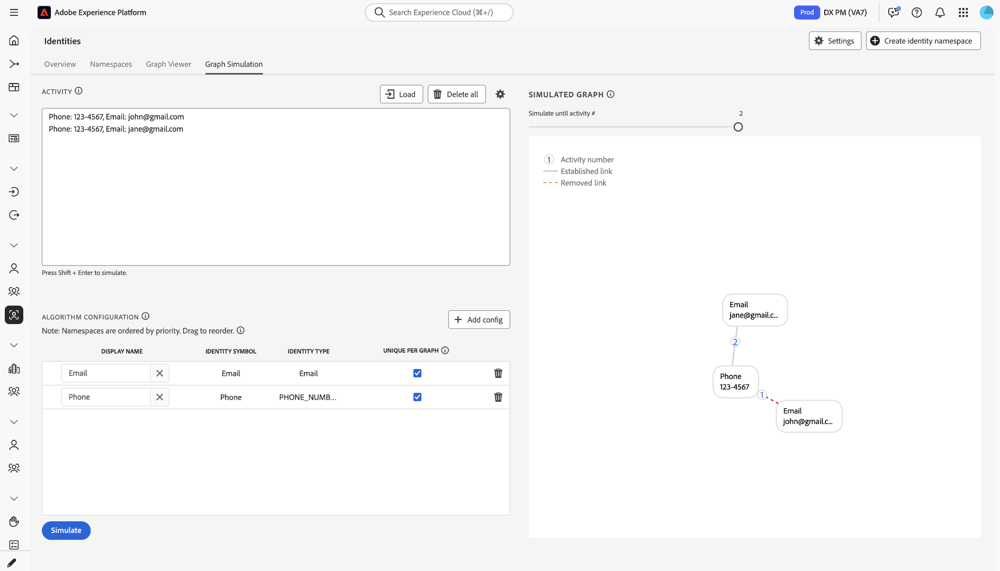

# Handbuch für die [!DNL Graph Simulation]-Benutzeroberfläche {#graph-simulation}

>[!CONTEXTUALHELP]
>id="platform_identities_graphsimulation"
>title="Diagrammsimulation"
>abstract="Simulieren Sie Diagramme, um zu verstehen, wie Identitäten von Identity Service verknüpft werden und wie der Algorithmus der Identitätsoptimierung funktioniert."

[!DNL Graph Simulation] ist ein Tool in der Identity Service-Benutzeroberfläche, mit dem Sie simulieren können, wie sich ein Identitätsdiagramm basierend auf den von Ihnen bereitgestellten Identitäten verhält und wie Sie den [Identitätsoptimierungsalgorithmus“ &#x200B;](./identity-optimization-algorithm.md).

Verwenden Sie sie, um das Diagrammverhalten sicher zu testen, bevor Sie [!DNL Identity Graph Linking Rules] auf Produktionsdaten anwenden. Durch die Definition von Beispielereignissen und die Konfiguration des Identitätsoptimierungsalgorithmus, einschließlich Namespace-Prioritäten und Einstellungen „eindeutig pro Diagramm“, können Sie sehen, ob Identitäten in einem Diagramm zusammengeführt werden oder getrennt bleiben. Passen Sie dann Ihre Konfiguration nach Bedarf an. Verwenden Sie diese Funktion, um:

* Verhindern Sie das Ausblenden von Diagrammen (z. B. wenn mehrere Personen ein Gerät oder eine Telefonnummer gemeinsam nutzen)
* Namespace-Prioritäten anpassen (z. B. ob E-MAIL oder CRM_ID dominant sein soll)
* Bewerten, wie sich qualitativ minderwertige oder wiederverwendete Kennungen auf das Zusammenfügen in Ihrer Umgebung auswirken können.

Sie können auch Konfigurationsänderungen wiederholen und Identitätsprobleme debuggen, die in nachgelagerten Anwendungen auftreten. Wenn beispielsweise Zielgruppengrößen oder zusammengeführte Profile falsch aussehen, können Sie die relevanten Ereignisse in neu erstellen, [!DNL Graph Simulation] zu sehen, wie Ihre aktuellen Regeln das Diagramm formen, und sicherere Alternativen auszuprobieren.

Die integrierten Beispielszenarien helfen Ihnen, das Identitätsverhalten und das Diagrammausblendrisiko für Stakeholder zu erklären und unterstützen die Akzeptanz für die Datenqualität und die Identitäts-Governance.

## Grundlegendes zur [!DNL Graph Simulation]

Um auf [!DNL Graph Simulation] zuzugreifen, navigieren Sie in der Benutzeroberfläche von Adobe Experience Platform zum Arbeitsbereich Identity Service und wählen Sie **[!UICONTROL Graph Simulation]** aus.

Die Benutzeroberfläche ist in drei Hauptabschnitte unterteilt:

>[!BEGINTABS]

>[!TAB Aktivität]

Verwenden Sie das Bedienfeld **[!UICONTROL Activity]** , um Identitäten hinzuzufügen und so ein Diagramm zu simulieren. Jede Identität benötigt einen Namespace und einen Wert. Zum Ausführen einer Simulation müssen mindestens zwei Identitäten hinzugefügt werden. Sie können auch **[!UICONTROL Load]** auswählen, um ein vorkonfiguriertes Ereignis und eine vorkonfigurierte Algorithmuseinrichtung zu importieren oder ein vorhandenes Diagramm zu öffnen.

>[!TAB Algorithmuskonfiguration]

Verwenden Sie das Bedienfeld **[!UICONTROL Algorithm configuration]** , um den Optimierungsalgorithmus für Ihre Namespaces hinzuzufügen und zu konfigurieren. Namespace-Zeilen per Drag-and-Drop verschieben, um die Prioritätsreihenfolge zu ändern. Sie können auch **[!UICONTROL Unique Per Graph]** auswählen, um zu markieren, ob ein Namespace innerhalb des Diagramms eindeutig sein muss.

>[!TAB Simulierter Graph]

Verwenden Sie die **[!UICONTROL Simulated graph]** Anzeige, um das aus Ihren Aktivitäten und Algorithmuseinstellungen erstellte Diagramm zu überprüfen. Eine durchgezogene Linie zwischen zwei Identitäten bedeutet, dass die Relation beibehalten wird. Eine gepunktete Linie bedeutet, dass der Algorithmus diese Relation entfernt.

>[!ENDTABS]

## Workflow [!DNL Graph Simulation]

### Hinzufügen von Aktivitäten

Um mit der Simulation von Identitätsdiagrammen zu beginnen, wählen Sie **[!UICONTROL Add Activity]** aus.

Wenn das Popup-Fenster für [!UICONTROL Activity #1] angezeigt wird, wählen Sie einen Identity-Namespace aus und geben Sie seinen Wert ein. Sie können einen Namespace aus dem Dropdown-Menü auswählen oder einige Buchstaben eingeben, um die Liste zu filtern. Nachdem Sie einen Namespace ausgewählt haben, geben Sie den entsprechenden Identitätswert ein.

>[!TIP]
>
>Bei der Verwendung von [!DNL Graph Simulation] müssen keine echten Identitätswerte verwendet werden.

Die [!UICONTROL Activity] wird aktualisiert und zeigt Ihre erste Aktivität an.

Wählen Sie erneut **[!UICONTROL Add Activity]** und schließen Sie eine zweite Aktivität ab. Sie benötigen mindestens zwei vollqualifizierte Identitäten (Namespace plus Wert), um ein Diagramm zu generieren.

### Algorithmus konfigurieren

>[!IMPORTANT]
>
>Der von Ihnen konfigurierte Algorithmus steuert, wie Identity Service die Namespaces in Ihren Aktivitäten behandelt. Nichts, was Sie im [!DNL Graph Simulation UI] einrichten, wird in den Identity Service-Identitätseinstellungen gespeichert.

Nachdem Sie Ihre Aktivitäten eingerichtet haben, konfigurieren Sie den Algorithmus für die Simulation. Wählen Sie **[!UICONTROL Add config]** aus.

Fügen Sie jeden Namespace hinzu, den der Algorithmus berücksichtigen soll. Verwenden Sie das Dropdown, um zu suchen, oder geben Sie die ersten Buchstaben ein, um die Liste einzugrenzen.

* **Namespace-Priorität**: Sie steuern die Reihenfolge der Wichtigkeit für jeden Namespace in Ihrem Identitätsdiagramm. Wenn Ihr Diagramm beispielsweise CRMID, ECID, E-Mail und Apple IDFA verwendet, können Sie deren Priorität so einstellen, dass sie widerspiegelt, was beim Verknüpfen von Identitäten zuerst berücksichtigt werden sollte. Der Namespace am Anfang Ihrer Liste hat die höchste Priorität.
* **Eindeutiger Namespace**: Wenn ein Namespace als eindeutig markiert ist, stellt Identity Service sicher, dass in einem Diagramm nur eine Identität mit diesem Namespace angezeigt wird. Wenn beispielsweise die E-Mail-Adresse als eindeutig festgelegt ist, enthält jedes Diagramm nur eine E-Mail-Identität. Wenn mehrere Identitäten mit derselben E-Mail vorhanden sind, wird die älteste Verbindung entfernt, um die Eindeutigkeit zu wahren.

Ziehen Sie die Namespace-Zeilen in die Prioritätsreihenfolge: Die oberste Zeile hat die höchste Priorität und die unterste ist die niedrigste. Um einen Namespace innerhalb des Diagramms als eindeutig zu behandeln, aktivieren Sie das entsprechende **[!UICONTROL Unique Per Graph]**.

Wenn Sie fertig sind, wählen Sie **[!UICONTROL Simulate]** aus.

### Anzeigen eines simulierten Diagramms

Im [!UICONTROL Simulated Graph] Abschnitt werden die Diagramme angezeigt, die aus Ihren Aktivitäten und der Algorithmuskonfiguration erstellt wurden.

| Diagrammsymbole | Beschreibung |
| --- | --- |
| Durchgezogene Linie | Eine durchgezogene Linie stellt eine feste Verbindung zwischen zwei Identitäten dar. |
| gestrichelte Linie | Eine gepunktete Linie stellt eine entfernte Verknüpfung zwischen zwei Identitäten dar. |
| Nummer online | Eine Zahl in einer Zeile gibt an, wann diese Relation relativ zu den anderen gebildet wurde. Die niedrigste Zahl (1) ist die früheste Relation. |

## Zusätzliche Funktionen

Sie können auch Aktivitäten bearbeiten oder löschen, Aktivitäten im Textmodus eingeben, ein Beispielszenario laden oder ein vorhandenes Diagramm aus Identity Service abrufen.

### Aktivität bearbeiten {#edit-activity}

Um eine Aktivität zu bearbeiten, wählen Sie die Auslassungspunkte (`...`) neben einer bestimmten Aktivität aus und klicken Sie dann auf **[!UICONTROL Edit]**.

### Aktivität löschen {#delete-activity}

Um eine Aktivität zu löschen, wählen Sie die Auslassungspunkte (`...`) neben einer bestimmten Aktivität aus und klicken Sie dann auf **[!UICONTROL Delete]**.

### Textmodus verwenden {#use-text-mode}

Sie können den Textmodus verwenden, um Ihre Aktivitäten zu konfigurieren. Um den Textmodus zu verwenden, klicken Sie auf das Symbol Einstellungen und dann auf **[!UICONTROL Text (Advanced users)]**.

Geben Sie im Textmodus jede Identität wie `namespace:value` ein. Trennen Sie mehrere Identitäten im selben Ereignis durch ein Komma (`,`). Beginnen Sie für jedes Ereignis eine neue Zeile.

### Beispiel laden {#load-example}

Wählen Sie **[!UICONTROL Load example]** aus, um ein vorgefertigtes Diagramm mit voreingestellten Aktivitäten und Algorithmuseinstellungen zu laden.

In einem Dialogfeld werden die Szenarien aufgelistet, die Sie öffnen können:

| Beispieldiagramm | Beschreibung | Beispiel |
| --- | --- | --- |
| Gemeinsam genutztes Gerät | Zwei verschiedene Benutzer melden sich auf demselben Gerät an. | Ehemann und Ehefrau teilen sich ein iPad zum Surfen und E-Commerce. |
| Ungültige (nicht eindeutige) Telefonnummer | Zwei verschiedene Benutzer registrieren sich mit derselben Telefonnummer. | Mutter und Tochter verwenden eine gemeinsame private Telefonnummer, um sich für E-Commerce-Konten anzumelden. |
| „Ungültige“ Identitätswerte | Bei Implementierungsfehlern werden doppelte oder Platzhalter-IDs gesendet (z. B. dieselbe IDFA für viele Benutzer). | Web SDK sendet bei jeder Aktivität aufgrund eines Codefehlers einen `user_null`. |

Wählen Sie ein Szenario aus, um [!DNL Graph Simulation] mit übereinstimmenden Aktivitäten und Algorithmuseinstellungen zu laden. Sie können das Ergebnis wie jede andere Simulation bearbeiten.

### Vorhandenes Diagramm laden {#load-existing-graph}

Sie können [!DNL Graph Simulation] verwenden, um ein vorhandenes Diagramm zu laden und seine Aktivitäten, Algorithmuskonfiguration und Diagramme anzuzeigen.

Wählen Sie **[!UICONTROL Load]** und dann **[!UICONTROL Existing graph]** aus.

Geben Sie im Dialogfeld einen Namespace und einen Identitätswert ein, die zu dem Diagramm gehören, das Sie überprüfen möchten.

Wenn das Laden erfolgreich war, zeigt [!DNL Graph Simulation] das Diagramm an, das diese Identität enthält.

>[!TIP]
>
>Nachdem Sie Ihre Einstellungen auf dem ersten Bildschirm [Identitätseinstellungen](./identity-settings-ui.md) konfiguriert haben, können Sie die Option **Vorhandene Diagramme laden** verwenden, um Ihr Diagramm basierend auf diesen exakten Einstellungen zu simulieren. Die Simulation verwendet die von Ihnen definierte Konfiguration.

## Nächste Schritte

Mithilfe von [!DNL Graph Simulation] können Sie sehen, wie Identity Service Identitäten unter verschiedenen Regeln verknüpft, bevor Sie die Produktionseinstellungen ändern. Weitere Informationen finden Sie in der folgenden Dokumentation:

* [[!DNL Identity Graph Linking Rules] – Übersicht](./overview.md)
* [Algorithmus der Identitätsoptimierung](./identity-optimization-algorithm.md)
* [Implementierungshandbuch](./implementation-guide.md)
* [Fehlerbehebung und häufig gestellte Fragen](./troubleshooting.md)
* [Beispiele für Diagrammkonfigurationen](./example-configurations.md)
* [Namespace-Priorität](./namespace-priority.md)
* [Benutzeroberfläche für Identitätseinstellungen](./identity-settings-ui.md)
