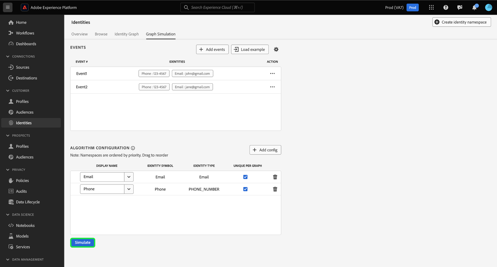

# Handbuch für die [!DNL Graph Simulation]-Benutzeroberfläche

[!DNL Graph Simulation] ist ein Tool in der Identity Service-Benutzeroberfläche, mit dem Sie simulieren können, wie sich ein Identitätsdiagramm bei einer bestimmten Kombination von Identitäten verhält und wie Sie die [Identitätsoptimierungsalgorithmus](./identity-optimization-algorithm.md).

In diesem Dokument erfahren Sie, wie Sie [!DNL Graph Simulation] , um das Verhalten von Identitätsdiagrammen und die Funktionsweise des Diagrammalgorithmus besser zu verstehen.

## Lernen Sie die [!DNL Graph Simulation] Benutzeroberfläche {#interface}

Sie können auf [!DNL Graph Simulation] in der Adobe Experience Platform-Benutzeroberfläche. Auswählen **[!UICONTROL Identitäten]** aus der linken Navigation und wählen Sie dann **[!UICONTROL Diagrammsimulation]** aus der oberen Kopfzeile.

Die [!DNL Graph Simulation] -Schnittstelle kann in drei Abschnitte unterteilt werden:

>[!BEGINTABS]

>[!TAB Ereignisse]

Ereignisse: Verwenden Sie die **[!UICONTROL Veranstaltungen]** -Bedienfeld, um Identitäten hinzuzufügen, um ein Diagramm zu simulieren. Eine vollständig qualifizierte Identität muss über einen Identitäts-Namespace und den zugehörigen Identitätswert verfügen. Sie müssen mindestens zwei Identitäten hinzufügen, um ein Diagramm zu simulieren. Sie können auch **[!UICONTROL Ladebeispiel]** , um ein vorkonfiguriertes Ereignis und eine Algorithmuseinrichtung einzugeben.

>[!TAB Algorithmuskonfiguration]

Algorithmuskonfiguration: Verwenden Sie die **[!UICONTROL Algorithmuskonfiguration]** um den Optimierungsalgorithmus für Ihre Namespaces hinzuzufügen und zu konfigurieren. Sie können einen Namespace per Drag-and-Drop verschieben, um die jeweilige Prioritätsstufe zu ändern. Sie können auch **[!UICONTROL Eindeutige pro Diagramm]** um zu ermitteln, ob ein Namespace eindeutig ist.

>[!TAB Simulierter Diagramm-Viewer]

Simulierter Diagramm-Viewer: Der simulierte Diagramm-Viewer zeigt das resultierende Diagramm basierend auf den hinzugefügten Ereignissen und dem von Ihnen konfigurierten Algorithmus an. Eine gerade Linie zwischen zwei Identitäten bedeutet, dass eine Verbindung hergestellt wird. Eine gepunktete Linie zeigt an, dass ein Link entfernt wurde.

>[!ENDTABS]

## Ereignisse hinzufügen {#add-events}

Wählen Sie zunächst **[!UICONTROL Ereignisse hinzufügen]**.

Ein Popup-Fenster wird angezeigt für [!UICONTROL Ereignis 1]. Geben Sie hier Ihre Kombination aus Identitäts-Namespace und Identitätswert ein. Über das Dropdown-Menü können Sie einen Identitäts-Namespace auswählen. Alternativ können Sie die ersten Buchstaben eines Namespace eingeben und dann die Optionen im Dropdown-Menü auswählen. Nachdem Sie Ihren Namespace ausgewählt haben, geben Sie einen Identitätswert an, der Ihrem Namespace entspricht.

>[!TIP]
>
>Der Identitätswert, den Sie während der [!DNL Graph Simulation] Übungen müssen keine echten Identitätswerte sein und können einfache Platzhalter sein.

Nachdem Ihre erste Identität abgeschlossen ist, wählen Sie das Symbol zum Hinzufügen (**`+`**), um eine zweite Identität hinzuzufügen.

Wiederholen Sie die gleichen Schritte und fügen Sie eine zweite Identität hinzu. Für die Erstellung eines Identitätsdiagramms sind zwei vollständig qualifizierte Identitäten erforderlich. Im folgenden Beispiel wird eine ECID als Namespace hinzugefügt und der Wert `111`. Klicken Sie abschließend auf **[!UICONTROL Speichern]**.

Die [!UICONTROL Veranstaltungen] -Benutzeroberfläche aktualisiert, um Ihr erstes Ereignis anzuzeigen, in diesem Fall: `{Email: tom@acme.com, ECID: 111}`.

Wiederholen Sie die gleichen Schritte, um ein zweites Ereignis hinzuzufügen. Fügen Sie für Ereignis Nr. 2 `{Email: summer@acme.com}` als erste Identität und fügen Sie dann dasselbe hinzu `{ECID: 111}` als zweite Identität bezeichnet, wodurch ein zweites Ereignis von erstellt wird: `{Email: summer@acme.com}, {ECID: 111}`. Wenn Sie fertig sind, sollten Sie über zwei Ereignisse verfügen: eines für `{Email: tom@acme.com, ECID: 111}` und eines für `{Email: summer@acme.com}, {ECID: 111}`.

### Beispiel laden {#load-example}

Auswählen **[!UICONTROL Beispiel laden]** , um ein Beispieldiagramm mit einem vordefinierten Algorithmus und einer Ereigniskonfiguration einzurichten.

Es wird ein Popup-Fenster mit verfügbaren Diagrammszenarien angezeigt, aus denen Sie Folgendes auswählen können:

| Beispieldiagramm | Beschreibung | Beispiel |
| --- | --- | --- |
| Gemeinsam genutztes Gerät | Freigegebenes Gerät bezieht sich auf Szenarien, in denen sich zwei verschiedene Benutzer auf demselben Gerät anmelden. | Ein Ehemann und eine Ehefrau teilen sich eine iPad für Internet-Browsing und E-Commerce. |
| Ungültige (nicht eindeutige) Telefonnummer | Ungültiges oder nicht eindeutiges Telefon bezieht sich auf Szenarien, in denen zwei verschiedene Benutzer dieselbe Telefonnummer verwenden, um ein Konto zu erstellen. | Eine Mutter und ihre Tochter verwenden ihre gemeinsam genutzte Festnetztelefonnummer, um sich für E-Commerce-Konten anzumelden. |
| „Ungültige“ Identitätswerte | &quot;Ungültige&quot;Identitätswerte beziehen sich auf Szenarien, in denen Identity Service aufgrund einer fehlerhaften Implementierung nicht eindeutige IDFAs generiert. | WebSDK sendet fälschlicherweise eine `user_null` -Wert für jedes Ereignis aufgrund von Code-Implementierungsproblemen. |

Wählen Sie eine der zu ladenden Optionen aus [!DNL Graph Simulation] mit vorkonfigurierten Ereignissen und Algorithmen. Sie können weiterhin weitere Konfigurationen an allen vorab geladenen Diagrammszenarios vornehmen.

Wählen Sie zum Abschluss **[!UICONTROL Simulieren]**.

### Textversion verwenden {#use-text-version}

Sie können auch den Textmodus verwenden, um Ereignisse zu konfigurieren. Um den Textmodus zu verwenden, wählen Sie das Einstellungssymbol und dann **[!UICONTROL Text (erweiterte Benutzer)]**.

Sie können Ihre Identitäten manuell im Textmodus eingeben. Verwenden Sie einen Doppelpunkt (`:`), um den Identitätswert zu unterscheiden, der dem von Ihnen eingegebenen Namespace entspricht, und dann ein Komma (`,`), um Ihre Identitäten zu trennen. Um verschiedene Ereignisse voneinander zu unterscheiden, verwenden Sie für jedes Ereignis eine neue Zeile.

### Ereignis bearbeiten {#edit-event}

Um ein Ereignis zu bearbeiten, wählen Sie die Auslassungszeichen (`...`) neben einem bestimmten Ereignis klicken und dann **[!UICONTROL Bearbeiten]**.

### Ereignis löschen {#delete-event}

Um ein Ereignis zu löschen, wählen Sie die Auslassungszeichen (`...`) neben einem bestimmten Ereignis klicken und dann **[!UICONTROL Löschen]**.

## Algorithmus konfigurieren {#configure-algorithm}

>[!IMPORTANT]
>
>Der von Ihnen konfigurierte Algorithmus bestimmt, wie Identity Service die in Ihre Ereignisse eingegebenen Namespaces behandelt. Jede Konfiguration, die Sie in der [!DNL Graph Simulation UI] werden nicht in Identitätseinstellungen gespeichert.

Nachdem Sie Ihre Ereignisse hinzugefügt haben, können Sie jetzt den Algorithmus konfigurieren, der zur Simulation Ihres Diagramms verwendet wird. Wählen Sie zunächst **[!UICONTROL Konfiguration hinzufügen]**.

Eine leere Konfigurationszeile wird angezeigt. Geben Sie zunächst den Namespace ein, den Sie für Ihre Ereignisse verwendet haben. Beginnen Sie in diesem Fall mit der Eingabe von E-Mail. Sobald Sie Ihren Namespace eingeben, werden die Spalten für [!UICONTROL Identitätssymbol] und [!UICONTROL Identitätstyp] automatisch ausgefüllt.

Wiederholen Sie die gleichen Schritte und fügen Sie den zweiten Namespace hinzu, in diesem Fall die ECID. Sobald alle Namespaces eingegeben wurden, können Sie mit der Konfiguration ihrer Prioritäten und Einzigartigkeit beginnen.

* **Namespace-Priorität**: Die Priorität eines Namespace bestimmt seine relative Bedeutung im Vergleich zu den anderen Namespaces in einem bestimmten Identitätsdiagramm. Wenn Ihr Identitätsdiagramm beispielsweise vier verschiedene Namespaces aufweist: CRM-ID, ECID, E-Mail und Apple IDFA, können Sie Prioritäten konfigurieren, um eine Reihenfolge von Bedeutung für den vier Namespace zu bestimmen.
* **Eindeutiger Namespace**: Wenn ein Namespace als eindeutig gekennzeichnet ist, generiert Identity Service Diagramme mit dem Vorbehalt, dass nur eine Identität mit einem bestimmten eindeutigen Namespace vorhanden sein kann. Wenn beispielsweise der E-Mail-Namespace als eindeutiger Namespace gekennzeichnet ist, kann ein Diagramm nur eine Identität mit E-Mail enthalten. Wenn mehr als eine Identität mit dem E-Mail-Namespace vorhanden ist, wird der älteste Link entfernt.

Um die Namespace-Priorität zu konfigurieren, wählen Sie die Namespace-Zeilen aus und ziehen Sie sie in die gewünschte Prioritätsreihenfolge, wobei die oberste Zeile die höhere Priorität und die untere Zeile die niedrigere Priorität darstellt. Um einen Namespace als eindeutig festzulegen, wählen Sie die **[!UICONTROL Eindeutige pro Diagramm]** aktivieren.

Wählen Sie zum Abschluss **[!UICONTROL Simulieren]**.

## Simuliertes Diagramm anzeigen

Die [!UICONTROL Simuliertes Diagramm] zeigt die Identitätsdiagramme an, die basierend auf den von Ihnen hinzugefügten Ereignissen und dem von Ihnen konfigurierten Algorithmus generiert wurden.

| Diagrammsymbole | Beschreibung |
| --- | --- |
| Durchgehende Linie | Eine durchgehende Linie stellt eine festgestellte Verknüpfung zwischen zwei Identitäten dar. |
| gepunktete Linie | Eine gepunktete Linie stellt eine entfernte Verknüpfung zwischen zwei Identitäten dar. |
| Nummer in Zeilen | Eine Zahl in einer Zeile steht für den Zeitstempel des Zeitpunkts, zu dem der angegebene Link generiert wurde. Die niedrigste Zahl (1) stellt die früheste eingerichtete Verknüpfung dar. |

Im unten stehenden Beispieldiagramm existiert eine gepunktete Linie zwischen `{Email: tom@acme.com}` und `{ECID: 111}` aus folgenden Gründen:

* E-Mail wurde während des Algorithmuskonfigurationsschritts als eindeutig gekennzeichnet. Daher kann in einem Diagramm nur eine Identität mit einem E-Mail-Namespace vorhanden sein.
* Die Verbindung zwischen `{Email: tom@acme.com}` und `{ECID: 111}` war die erste festgestellte Identität (Ereignis Nr. 1). Es ist der älteste Link und wird daher entfernt.

## Nächste Schritte

Durch Lesen dieses Dokuments wissen Sie jetzt, wie Sie die [!DNL Graph Simulation] -Tool, um besser zu verstehen, wie Ihre Identitätsdaten mit einem bestimmten Satz von Regeln und Konfigurationen behandelt werden. Weitere Informationen finden Sie in den folgenden Dokumenten:

* [Verknüpfungsregeln für Identitätsdiagramme](overview.md)
* [Identitätsoptimierungsalgorithmus](identity-optimization-algorithm.md)
* [Namespace-Priorität](namespace-priority.md)