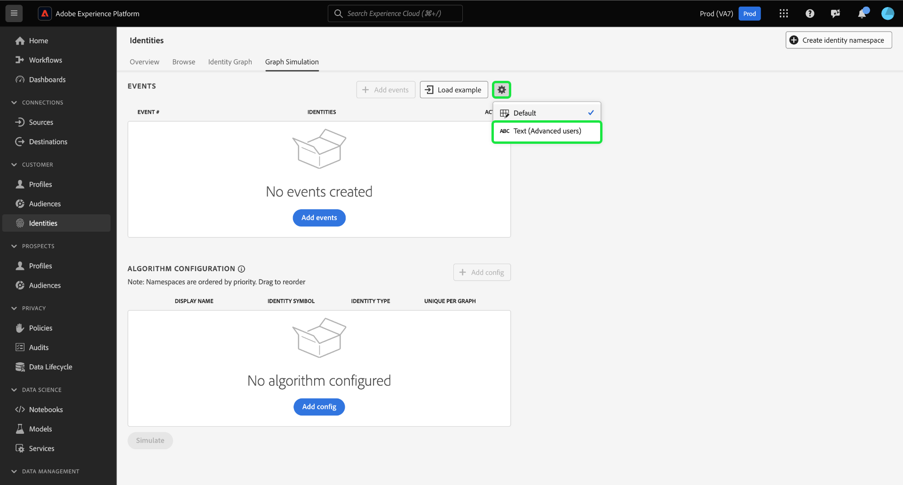

# Handbuch für die [!DNL Graph Simulation]-Benutzeroberfläche

>[!AVAILABILITY]
>
>Regeln zur Identitätsdiagramm-Verknüpfung sind derzeit nur eingeschränkt verfügbar. Wenden Sie sich an Ihr Adobe-Konto-Team , um Informationen zum Zugriff auf die Funktion in Entwicklungs-Sandboxes zu erhalten.

[!DNL Graph Simulation] ist ein Tool in der Identity Service-Benutzeroberfläche, mit dem Sie simulieren können, wie sich ein Identitätsdiagramm bei einer bestimmten Kombination von Identitäten verhält und wie Sie den [Identitätsoptimierungsalgorithmus“ ](./identity-optimization-algorithm.md).

Lesen Sie dieses Dokument, um zu erfahren, wie Sie [!DNL Graph Simulation] verwenden können, um das Verhalten von Identitätsdiagrammen und die Funktionsweise des Diagrammalgorithmus besser zu verstehen.

## Kennenlernen der [!DNL Graph Simulation] {#interface}

Sie können auf [!DNL Graph Simulation] über die Adobe Experience Platform-Benutzeroberfläche zugreifen. Wählen Sie **[!UICONTROL linken Navigationsbereich die Option]** Identitäten“ und dann **[!UICONTROL Diagrammsimulation]** aus der oberen Kopfzeile aus.

Die [!DNL Graph Simulation] kann in drei Abschnitte unterteilt werden:

>[!BEGINTABS]

>[!TAB Ereignisse]

Ereignisse: Verwenden Sie das Bedienfeld **[!UICONTROL Ereignisse]** um Identitäten hinzuzufügen, um ein Diagramm zu simulieren. Eine vollqualifizierte Identität muss einen Identity-Namespace und den entsprechenden Identitätswert haben. Sie müssen mindestens zwei Identitäten hinzufügen, um ein Diagramm zu simulieren. Sie können auch **[!UICONTROL Beispiel laden]** auswählen, um ein vorkonfiguriertes Ereignis und eine vorkonfigurierte Algorithmuseinrichtung einzugeben.

>[!TAB Algorithmuskonfiguration]

Algorithmuskonfiguration: Verwenden Sie das Bedienfeld **[!UICONTROL Algorithmuskonfiguration]**, um den Optimierungsalgorithmus für Ihre Namespaces hinzuzufügen und zu konfigurieren. Sie können einen Namespace per Drag-and-Drop verschieben, um die jeweilige Prioritätsreihenfolge zu ändern. Sie können auch &quot;**[!UICONTROL pro Diagramm“ auswählen]** um festzustellen, ob ein Namespace eindeutig ist.

>[!TAB Viewer für simulierte Diagramme]

Viewer für simulierte Diagramme : Der Viewer für simulierte Diagramme zeigt das resultierende Diagramm basierend auf den hinzugefügten Ereignissen und dem konfigurierten Algorithmus an. Eine gerade Linie zwischen zwei Identitäten bedeutet, dass eine Verbindung hergestellt wird. Eine gepunktete Linie zeigt an, dass eine Relation entfernt wurde.

>[!ENDTABS]

## Ereignisse hinzufügen {#add-events}

>[!CONTEXTUALHELP]
>id="platform_identities_graphsimulation"
>title="Ereignisse hinzufügen"
>abstract="Diagramme simulieren, um zu verstehen, wie Identitäten von Identity Service verknüpft werden und wie der Algorithmus für die Identitätsoptimierung funktioniert."

Wählen Sie zunächst **[!UICONTROL Ereignisse hinzufügen]** aus.

Es wird ein Popup-Fenster für [!UICONTROL Ereignis-#1] angezeigt. Geben Sie von hier aus Ihre Kombination aus Identitäts-Namespace und Identitätswert ein. Sie können das Dropdown-Menü verwenden, um einen Identity-Namespace auszuwählen. Alternativ können Sie die ersten Buchstaben eines Namespace eingeben und dann die Optionen aus dem Dropdown-Menü auswählen. Nachdem Sie Ihren Namespace ausgewählt haben, geben Sie einen Identitätswert an, der Ihrem Namespace entspricht.

>[!TIP]
>
>Der Identitätswert, den Sie bei [!DNL Graph Simulation] Übungen eingeben, muss keine echten Identitätswerte sein und kann einfache Platzhalter sein.

Nachdem die erste Identität abgeschlossen ist, klicken Sie auf das Symbol zum Hinzufügen (**`+`**), um eine zweite Identität hinzuzufügen.

Als Nächstes wiederholen Sie dieselben Schritte und fügen eine zweite Identität hinzu. Zwei vollständig qualifizierte Identitäten sind erforderlich, um ein Identitätsdiagramm zu generieren. Im folgenden Beispiel wird eine ECID als Namespace hinzugefügt und mit dem Wert `111` bereitgestellt. Klicken Sie abschließend auf **[!UICONTROL Speichern]**.

Die Benutzeroberfläche [!UICONTROL Ereignisse] wird aktualisiert, um Ihr erstes Ereignis anzuzeigen, in diesem Fall: `{Email: tom@acme.com, ECID: 111}`.

Als Nächstes wiederholen Sie die gleichen Schritte, um ein zweites Ereignis hinzuzufügen. Fügen Sie für #2 Ereignis `{Email: summer@acme.com}` als erste Identität hinzu und fügen Sie dann dieselbe `{ECID: 111}` wie für die zweite Identität hinzu, um ein zweites Ereignis von `{Email: summer@acme.com}, {ECID: 111}` zu erstellen. Wenn Sie fertig sind, sollten Sie zwei Ereignisse haben, eines für `{Email: tom@acme.com, ECID: 111}` und eines für `{Email: summer@acme.com}, {ECID: 111}`.

### Beispiel laden {#load-example}

Wählen Sie **[!UICONTROL Beispiel laden]**, um ein Beispieldiagramm mit einem vordefinierten Algorithmus und einer vordefinierten Ereigniskonfiguration einzurichten.

Es wird ein Popup-Fenster angezeigt, in dem verfügbare Diagrammszenarien zur Auswahl stehen:

| Beispieldiagramm | Beschreibung | Beispiel |
| --- | --- | --- |
| Gemeinsam genutztes Gerät | Gemeinsam genutztes Gerät bezieht sich auf Szenarien, in denen sich zwei verschiedene Benutzer beim selben Gerät anmelden. | Ehemann und Ehefrau teilen sich ein iPad für Internet-Browsing und E-Commerce. |
| Ungültige (nicht eindeutige) Telefonnummer | Ungültige oder nicht eindeutige Telefonnummern beziehen sich auf Szenarien, in denen zwei verschiedene Benutzer dieselbe Telefonnummer verwenden, um ein Konto zu erstellen. | Eine Mutter und ihre Tochter verwenden ihre gemeinsame private Telefonnummer, um sich für E-Commerce-Konten anzumelden. |
| „Ungültige“ Identitätswerte | „Fehlerhafte“ Identitätswerte beziehen sich auf Szenarien, in denen Identity Service aufgrund einer fehlerhaften Implementierung nicht eindeutige IDFAs generiert. | WebSDK sendet aufgrund von Code-Implementierungsproblemen fälschlicherweise einen `user_null` für jedes Ereignis. |

Wählen Sie eine der Optionen aus, um [!DNL Graph Simulation] mit vorkonfigurierten Ereignissen und Algorithmen zu laden. Sie können dennoch weitere Konfigurationen an allen vorab geladenen Diagrammszenarien vornehmen.

Wenn Sie fertig sind, wählen Sie **[!UICONTROL Simulieren]** aus.

### Textversion verwenden {#use-text-version}

Sie können auch den Textmodus zum Konfigurieren von Ereignissen verwenden. Um den Textmodus zu verwenden, wählen Sie das Einstellungssymbol aus und dann **[!UICONTROL Text (Erweiterte Benutzer)]**.

Sie können Ihre Identitäten im Textmodus manuell eingeben. Verwenden Sie einen Doppelpunkt (`:`), um den Identitätswert zu unterscheiden, der dem von Ihnen eingegebenen Namespace entspricht, und verwenden Sie dann ein Komma (`,`), um Ihre Identitäten zu trennen. Um verschiedene Ereignisse voneinander zu unterscheiden, verwenden Sie für jedes Ereignis eine neue Zeile.

### Ereignis bearbeiten {#edit-event}

Um ein Ereignis zu bearbeiten, klicken Sie auf die Auslassungszeichen (`...`) neben einem bestimmten Ereignis und wählen Sie dann **[!UICONTROL Bearbeiten]** aus.

### Ereignis löschen {#delete-event}

Um ein Ereignis zu löschen, klicken Sie auf die Auslassungszeichen (`...`) neben einem bestimmten Ereignis und wählen Sie dann **[!UICONTROL Löschen]**.

## Algorithmus konfigurieren {#configure-algorithm}

>[!CONTEXTUALHELP]
>id="platform_identities_algorithmconfiguration"
>title="Algorithmuskonfiguration"
>abstract="Konfigurieren Sie den eindeutigen Namespace und die Namespace-Priorität für die aufgenommenen Identitäten."

>[!CONTEXTUALHELP]
>id="platform_identities_namespacepriority"
>title="Algorithmuskonfiguration"
>abstract="Die Namespace-Priorität bestimmt, wie Links aus dem Identitätsdiagramm entfernt werden."

>[!IMPORTANT]
>
>Der von Ihnen konfigurierte Algorithmus bestimmt, wie Identity Service die Namespaces behandelt, die Sie in Ihre Ereignisse eingegeben haben. Konfigurationen, die Sie im [!DNL Graph Simulation UI] zusammenstellen, werden nicht in den Identitätseinstellungen gespeichert.

Nachdem Sie Ihre Ereignisse hinzugefügt haben, können Sie jetzt den Algorithmus konfigurieren, der zur Simulation Ihres Diagramms verwendet wird. Wählen Sie zunächst **[!UICONTROL Konfiguration hinzufügen]** aus.

Eine leere Konfigurationszeile wird angezeigt. Geben Sie zunächst denselben Namespace ein, den Sie für Ihre Ereignisse verwendet haben. In diesem Fall geben Sie zunächst die E-Mail-Adresse ein. Nachdem Sie Ihren Namespace eingegeben haben, werden die Spalten für [!UICONTROL Identitätssymbol] und [!UICONTROL Identitätstyp] automatisch ausgefüllt.

Wiederholen Sie anschließend dieselben Schritte und fügen Sie Ihren zweiten Namespace hinzu, in diesem Fall die ECID. Sobald alle Ihre Namespaces eingegeben wurden, können Sie mit der Konfiguration ihrer Prioritäten und Eindeutigkeit beginnen.

* **Namespace-Priorität**: Die Priorität eines Namespace bestimmt seine relative Bedeutung im Vergleich zu den anderen Namespaces in einem bestimmten Identitätsdiagramm. Wenn Ihr Identitätsdiagramm beispielsweise über vier verschiedene Namespaces verfügt: CRMID, ECID, E-Mail und Apple IDFA, können Sie Prioritäten konfigurieren, um eine Reihenfolge der Wichtigkeit für die vier Namespaces zu bestimmen.
* **Eindeutiger Namespace**: Wenn ein Namespace als eindeutig gekennzeichnet ist, generiert Identity Service Diagramme mit dem Vorbehalt, dass nur eine Identität mit einem bestimmten eindeutigen Namespace vorhanden sein kann. Wenn beispielsweise der Namespace E-Mail als eindeutiger Namespace angegeben ist, kann ein Diagramm nur eine Identität mit E-Mail aufweisen. Wenn mehr als eine Identität mit dem E-Mail-Namespace vorhanden ist, wird der älteste Link entfernt.

Um die Namespace-Priorität zu konfigurieren, wählen Sie die Namespace-Zeilen aus und ziehen Sie sie in die gewünschte Prioritätsreihenfolge, wobei die obere Zeile eine höhere Priorität darstellt und die untere Zeile eine niedrigere Priorität. Um einen Namespace als eindeutig festzulegen, aktivieren Sie das Kontrollkästchen **[!UICONTROL Eindeutig pro Diagramm]**.

Wenn Sie fertig sind, wählen Sie **[!UICONTROL Simulieren]** aus.

## Anzeigen eines simulierten Diagramms

Im Abschnitt [!UICONTROL Simuliertes Diagramm] werden die Identitätsdiagramme angezeigt, die auf der Grundlage der von Ihnen hinzugefügten Ereignisse und des von Ihnen konfigurierten Algorithmus generiert wurden.

| Diagrammsymbole | Beschreibung |
| --- | --- |
| Durchgezogene Linie | Eine durchgezogene Linie stellt eine feste Verbindung zwischen zwei Identitäten dar. |
| gestrichelte Linie | Eine gepunktete Linie stellt eine entfernte Verknüpfung zwischen zwei Identitäten dar. |
| Nummer online | Eine Zahl in einer Zeile stellt den Zeitstempel dar, zu dem diese bestimmte Relation generiert wurde. Die niedrigste Zahl (1) stellt die früheste etablierte Relation dar. |

Im folgenden Beispieldiagramm gibt es aus den folgenden Gründen eine gepunktete Linie zwischen `{Email: tom@acme.com}` und `{ECID: 111}`:

* E-Mail wurde während des Algorithmus-Konfigurationsschritts als eindeutig gekennzeichnet. Daher kann in einem Diagramm nur eine Identität mit einem E-Mail-Namespace vorhanden sein.
* Die Verbindung zwischen `{Email: tom@acme.com}` und `{ECID: 111}` war die erste etablierte Identität (#1). Es ist der älteste Link und wird daher entfernt.

## Nächste Schritte

Durch das Lesen dieses Dokuments wissen Sie jetzt, wie Sie mit dem [!DNL Graph Simulation]-Tool besser verstehen können, wie Ihre Identitätsdaten mit einem bestimmten Satz von Regeln und Konfigurationen behandelt werden. Weitere Informationen finden Sie in den folgenden Dokumenten:

* [Übersicht über Verknüpfungsregeln für Identitätsdiagramme](./overview.md)
* [Algorithmus zur Identitätsoptimierung](./identity-optimization-algorithm.md)
* [Implementierungshandbuch](./implementation-guide.md)
* [Fehlerbehebung und häufig gestellte Fragen](./troubleshooting.md)
* [Beispiele für Diagrammkonfigurationen](./example-configurations.md)
* [Namespace-Priorität](./namespace-priority.md)
* [Benutzeroberfläche für Identitätseinstellungen](./identity-settings-ui.md)