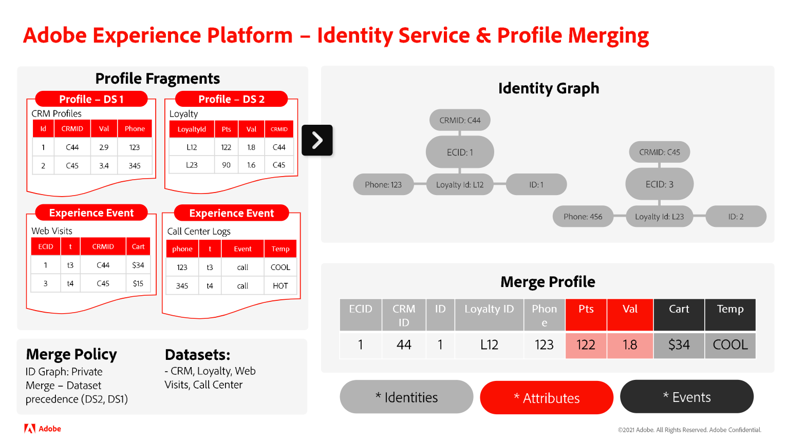

# Verstehen der Beziehung zwischen Identity Service und Echtzeit-Kundenprofil

>[!IMPORTANT]
>
>* Verknüpfungsregeln für Identitätsdiagramme befinden sich derzeit im Alpha. Die Funktion und die Dokumentation können sich ändern.
>
>* Auf dieser Seite wird davon ausgegangen, dass die Zusammenführungsrichtlinie das Identitätsdiagramm verwendet. Weitere Informationen zu Zusammenführungsrichtlinien im Echtzeit-Kundenprofil finden Sie in der Dokumentation unter [Zusammenführungsrichtlinien und Identitätszusammenfügung](../../profile/merge-policies/overview.md#identity-stitching).

Sie können Identity Service und Echtzeit-Kundenprofil zwar gemeinsam verwenden, aber die beiden Funktionen von Adobe Experience Platform sind von Natur aus nicht identisch.

* Sie können Identity Service verwenden, um das Identitätsdiagramm zu generieren und zu verwalten, das die unterschiedlichen Identitäten eines einzelnen Kunden zusammenführt.
* Sie können Echtzeit-Kundenprofil verwenden, um verschiedene Profilfragmente zusammenzuführen und ein zusammengeführtes Profil zu erstellen. Dieser Prozess erfordert die Verwendung des Identitätsdiagramms.

In diesem Dokument werden die Ähnlichkeiten, Unterschiede und die Beziehung zwischen Identity Service und Echtzeit-Kundenprofil beschrieben.

## Identity Service und Echtzeit-Kundenprofil

Die wichtigsten Unterschiede zwischen Identity Service und Echtzeit-Kundenprofil sind:

| | Identity Service | Echtzeit-Kundenprofil |
| --- | --- |--- |
| **Zweck** | <ul><li>Mit Identity Service können Sie Identitätsdiagramme erstellen und verwalten.</li></ul> | Sie können das Echtzeit-Kundenprofil verwenden, um: <ul><li>Erstellen Sie eine 360-Grad-Ansicht eines Kundenprofils.</li><li>Profile anzeigen und verwalten</li><li>Segmentieren Sie Profile, um Audiences zu erstellen.</li></ul> |
| **Eingabe** | <ul><li>Um Identity Service zu verwenden, müssen Sie Datensatzdaten oder Zeitreihenereignisse mit mindestens zwei Feldern erfassen, die als Identität markiert sind. Die Felder, die Sie als Identität markieren, werden dann in Identity Service erfasst.</li></ul> | **Um Profile zusammenzuführen, müssen Sie**: <ul><li>Profilfragmente: stellen eine eindeutige primäre Identität und die entsprechenden Datensatz- oder Ereignisdaten für diese ID in einem bestimmten Datensatz dar.</li><li>Identitätsdiagramme: Das Profil verweist auf das Identitätsdiagramm für ein bestimmtes Kundenprofil, um alle Profilfragmente mit denselben primären Identitäten zu identifizieren.</li></ul> **Für die Segmentqualifizierung müssen Sie**: <ul><li>Zusammengeführte Profile: Ein zusammengeführtes Profil ist eine Einzelansicht eines Kunden, in der unterschiedliche Profilfragmente und Identitäten in einer umfassenden Ansicht erfasst werden.</li></ul> |
| **Prozess** | <ul><li>Nachdem Sie mindestens zwei Identitäten erfasst haben, verknüpft Identity Service diese Identitäten miteinander.</li></ul> | <ul><li>Das Echtzeit-Kundenprofil führt Profilfragmente zusammen, während auf die entsprechenden Identitätsdiagramme verwiesen wird.</li><li>Profile anhand von Segmentierungskriterien für Segmente qualifizieren</li></ul> |
| **Ausgabe** | <ul><li>Das Ergebnis ist ein Identitätsdiagramm, bei dem es sich um einen Satz von Identitäten handelt, die mit einer Person verbunden sind.</li></ul> | <ul><li>Das Ergebnis ist ein zusammengeführtes Profil, das eine einzige und umfassende Ansicht eines bestimmten Kunden darstellt.</li><li>Profile mit definierten Segmentmitgliedschaften</li></ul> |

{style="table-layout:auto"}

>[!BEGINSHADEBOX]

## Wie wird ein zusammengeführtes Profil erstellt?

Lesen Sie die folgenden Schritte, um ein besseres Verständnis des Prozesses zum Erstellen eines zusammengeführten Profils zu erhalten:

* Zunächst verweist das Echtzeit-Kundenprofil auf ein Identitätsdiagramm und ruft alle Identitäten ab.
* Als Nächstes ruft Profil alle Profilfragmente ab, die mit jeder Identität verbunden sind.
* Nach dem Erfolg führt Profil als alle vorhandenen Ereignisse und Attribute zusammen.
   * Wenden Sie bei Bedarf Prioritätsregeln an, um zu bestimmen, welches Attribut oder Ereignis verwendet werden soll

>[!ENDSHADEBOX]

### Was bedeutet es, ein Feld als Identität zu markieren?

Ein Feld als Identität zu markieren oder zu kennzeichnen ist eine Anweisung für Experience Platform, dieses Feld beim Identity Service zu erfassen. Diese Bezeichnung ermöglicht dann die Zusammenführung von Profilfragmenten im Echtzeit-Kundenprofil. Wenn der Identität keine Profilfragmente zugeordnet sind, weisen Sie sie nicht als Identität zu.

#### Grundlegendes zu primären und sekundären Identitäten

Sobald Sie Felder als Identitäten markieren, können sie entweder als primäre oder sekundäre Identitäten definiert werden. Primäre und sekundäre Identitäten sind Konzepte, die Teil des Echtzeit-Kundenprofils sind.

* Die primäre Identität (manchmal auch als &quot;Primärschlüssel&quot;bezeichnet) ist die Identität, in der Profilfragmente gespeichert werden.
* Wenn eine Datenzeile nur eine Identität enthält, wird diese einzelne Identität als primär bezeichnet.
* Wenn es zwei oder mehr Identitäten gibt, wird eine als primär bezeichnet und die verbleibenden als sekundär gekennzeichnet.

Identity Service erfasst nur Felder, die als Identität gekennzeichnet sind. Identity Service speichert keine Informationen darüber, ob eine Identität primär oder sekundär ist.

## Nächste Schritte

Weitere Informationen zu Regeln zur Verknüpfung von Identitätsdiagrammen finden Sie in der folgenden Dokumentation:

* [Übersicht über die Verknüpfungsregeln von Identitätsdiagrammen](./overview.md)
* [Beispielszenarien für die Konfiguration von Regeln für die Zuordnung von Identitätsdiagrammen](./example-scenarios.md)
* [Identitätsverknüpfungslogik](./identity-linking-logic.md)