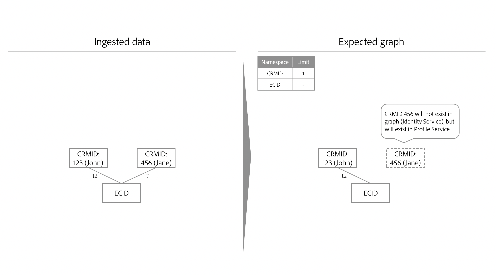

# Identitätsoptimierungsalgorithmus

>[!IMPORTANT]
>
>Der Identitätsoptimierungsalgorithmus befindet sich im Alpha. Die Funktion und die Dokumentation können sich ändern.

Der Identitätsoptimierungsalgorithmus ist eine Regel, die sicherstellt, dass ein Identitätsdiagramm für eine einzelne Person repräsentativ ist, und daher das unerwünschte Zusammenführen von Identitäten mit dem Echtzeit-Kundenprofil verhindert.

## Eingabeparameter

Ein einzelnes zusammengeführtes Profil und das zugehörige Identitätsdiagramm sollten eine einzelne Person (Personenentität) repräsentieren. Eine einzelne Person wird in der Regel durch CRM-IDs und/oder Anmelde-IDs dargestellt. Es wird erwartet, dass nicht zwei Personen (CRM-IDs) zu einem Profil oder Diagramm zusammengeführt werden.

Sie müssen mithilfe des Identitätsoptimierungsalgorithmus angeben, welche Namespaces eine Personenentität in Identity Service darstellen. Wenn beispielsweise in einer CRM-Datenbank ein Benutzerkonto definiert wird, das mit einer einzelnen CRM-ID und einer einzelnen E-Mail-Adresse verknüpft werden soll, würden die Identitätseinstellungen für diese Sandbox wie folgt aussehen:

* CRM-ID-Namespace = eindeutig
* Email namespace = unique

Ein Namespace, den Sie als eindeutig deklarieren, wird automatisch so konfiguriert, dass er innerhalb eines bestimmten Identitätsdiagramms eine maximale Begrenzung von 1 aufweist. Wenn Sie beispielsweise einen CRM-ID-Namespace als eindeutig deklarieren, darf ein Identitätsdiagramm nur eine Identität enthalten, die einen CRM-ID-Namespace enthält.

>[!NOTE]
>
>* Derzeit unterstützt der Algorithmus nur die Verwendung einer einzelnen Anmelde-Kennung (eines Anmelde-Namespace). Mehrere Anmelde-IDs (mehrere Identitäts-Namespaces, die zur Anmeldung verwendet werden), Entitätsdiagramme für Haushalte und hierarchische Diagrammstrukturen werden derzeit nicht unterstützt.
>
>* Alle Namespaces, bei denen es sich um Personen-IDs handelt und die in der Sandbox zum Generieren von Identitätsdiagrammen verwendet werden, müssen als eindeutiger Namespace markiert werden. Andernfalls kann es zu unerwünschten Verknüpfungsergebnissen kommen.

## Prozess

Beim Erfassen neuer Identitäten prüft Identity Service, ob die neuen Identitäten und die zugehörigen Namespaces dazu führen, dass die konfigurierten Beschränkungen überschritten werden. Wenn die Beschränkungen nicht überschritten werden, wird die Aufnahme neuer Identitäten fortgesetzt und diese Identitäten werden mit dem Diagramm verknüpft. Wenn die Grenzwerte jedoch überschritten werden, aktualisiert der Identitätsoptimierungsalgorithmus das Diagramm so, dass der neueste Zeitstempel berücksichtigt wird und die ältesten Links mit den Namespaces mit der niedrigeren Priorität entfernt werden.

## Beispielszenarien für den Identitätsoptimierungsalgorithmus

Im folgenden Abschnitt wird beschrieben, wie sich der Identitätsoptimierungsalgorithmus in Szenarien wie der gemeinsamen Nutzung von Geräten oder der Erfassung von Daten mit demselben Zeitstempel verhält.

### Freigegebenes Gerät

Ein freigegebenes Gerät bezieht sich auf ein Gerät, das von mehr als einer Person verwendet wird. Beispielsweise kann ein gemeinsam genutztes Gerät ein Laptop oder ein Tablet sein, das Sie mit einem Partner oder einer Familie teilen, ein Bibliothekscomputer oder ein öffentliches Terminal.

>[!BEGINTABS]

>[!TAB Beispiel 1]

| Namespace | Limit |
| --- | --- |
| CRM-ID | 1 |
| E-Mail | 1 |
| ECID | K. A. |

In diesem Beispiel werden sowohl die CRM-ID als auch die E-Mail-Adresse als eindeutige Namespaces bezeichnet. At `timestamp=0`, wird ein CRM-Datensatz-Datensatz erfasst und erstellt zwei verschiedene Diagramme aufgrund der Begrenzungskonfiguration. Jedes Diagramm enthält eine CRM-ID und einen E-Mail-Namespace.

* `timestamp=1`: Jane meldet sich mit einem Laptop bei Ihrer E-Commerce-Website an. Jane wird durch ihre CRM-ID und E-Mail repräsentiert, während der Webbrowser auf dem Laptop, den sie verwendet, durch eine ECID repräsentiert wird.
* `timestamp=2`: John meldet sich mit demselben Laptop bei Ihrer E-Commerce-Website an. John wird durch seine CRM-ID und E-Mail repräsentiert, während der von ihm verwendete Webbrowser bereits durch eine ECID repräsentiert wird. Da dieselbe ECID mit zwei verschiedenen Diagrammen verknüpft ist, kann Identity Service wissen, dass dieses Gerät (Laptop) ein gemeinsam genutztes Gerät ist.
* Aufgrund der Begrenzungskonfiguration, die maximal einen CRM-ID-Namespace und einen E-Mail-Namespace pro Diagramm festlegt, teilt der Identitätsoptimierungsalgorithmus das Diagramm dann in zwei auf.
   * Da John der letzte authentifizierte Benutzer ist, bleibt die ECID, die den Laptop darstellt, mit seinem Diagramm verknüpft und nicht mit der von Jane.

>[!TAB Beispiel 2]

| Namespace | Limit |
| --- | --- |
| CRM-ID | 1 |
| ECID | K. A. |

In diesem Beispiel wird der CRM-ID-Namespace als eindeutiger Namespace bezeichnet.

* `timestamp=1`: Jane meldet sich mit einem Laptop bei Ihrer E-Commerce-Website an. Sie wird durch ihre CRM-ID repräsentiert und der Webbrowser auf dem Laptop wird durch die ECID repräsentiert.
* `timestamp=2`: John meldet sich mit demselben Laptop bei Ihrer E-Commerce-Website an. Er wird durch seine CRM-ID repräsentiert und der von ihm verwendete Webbrowser wird durch dieselbe ECID repräsentiert.
   * Dieses Ereignis verknüpft zwei unabhängige CRM-IDs mit derselben ECID, die die konfigurierte Grenze einer CRM-ID überschreitet.
   * Daher entfernt der Identitätsoptimierungsalgorithmus den älteren Link, in diesem Fall die CRM-ID von Jane, die mit `timestamp=1`.
   * Obwohl die CRM-ID von Jane nicht mehr als Diagramm zum Identity Service vorhanden ist, bleibt sie dennoch als Profil im Echtzeit-Kundenprofil bestehen. Der Grund dafür ist, dass ein Identitätsdiagramm mindestens zwei verknüpfte Identitäten enthalten muss. Durch das Entfernen der Links hat Janes CRM-ID keine andere Identität mehr, mit der eine Verknüpfung hergestellt werden kann.

>[!ENDTABS]

### Schlechte E-Mail

Es gibt Fälle, in denen ein Benutzer falsche Werte für seine E-Mail- und/oder Telefonnummern eingeben kann.

| Namespace | Limit |
| --- | --- |
| CRM-ID | 1 |
| E-Mail | 1 |
| ECID | K. A. |

In diesem Beispiel werden die CRM-ID und E-Mail-Namespaces als eindeutig gekennzeichnet. Betrachten wir das Szenario, dass Jane und John sich mit einem schlechten E-Mail-Wert bei Ihrer E-Commerce-Website angemeldet haben (z. B. testen@test.com).

* `timestamp=1`: Jane meldet sich mit Safari in ihrer iPhone bei Ihrer E-Commerce-Website an und ermittelt dabei ihre CRM-ID (Anmeldeinformationen) und ihre ECID (Browser).
* `timestamp=2`: John meldet sich mit Google Chrome in seiner iPhone bei Ihrer E-Commerce-Website an und stellt seine CRM-ID (Anmeldeinformationen) und ECID (Browser) ein.
* `timestamp=3`: Ihr Data Engineer erfasst den CRM-Datensatz von Jane, was zur Folge hat, dass seine CRM-ID mit der fehlerhaften E-Mail verknüpft wird.
* `timestamp=4`: Ihr Data Engineer erfasst den CRM-Datensatz von John, was zur Folge hat, dass seine CRM-ID mit der fehlerhaften E-Mail verknüpft wird.
   * Dies verstößt dann gegen die konfigurierten Beschränkungen, da ein einzelnes Diagramm mit zwei CRM-ID-Namespaces erstellt wird.
   * Daher löscht der Identitätsoptimierungsalgorithmus den älteren Link, der in diesem Fall die Verknüpfung zwischen der Identität von Jane mit dem CRM-ID-Namespace und der Identität mit Test ist@test.

Mit dem Identitätsoptimierungsalgorithmus werden ungültige Identitätswerte wie falsche E-Mails oder Telefonnummern nicht über mehrere Identitätsdiagramme hinweg übertragen.

### Anonyme Ereigniszuordnung

ECIDs speichern nicht authentifizierte (anonyme) Ereignisse, während CRM-ID authentifizierte Ereignisse speichert. Bei freigegebenen Geräten wird die ECID (Träger nicht authentifizierter Ereignisse) mit der **zuletzt authentifizierter Benutzer**.

Sehen Sie sich das folgende Diagramm an, um besser zu verstehen, wie die anonyme Ereigniszuordnung funktioniert:

* Kevin und Nora teilen sich ein Tablet.
   * `timestamp=1`: Kevin meldet sich mit seinem Konto bei einer E-Commerce-Website an und ermittelt dadurch seine CRM-ID (Anmeldeinformationen) und eine ECID (Browser). Zum Zeitpunkt der Anmeldung wird Kevin jetzt als der zuletzt authentifizierte Benutzer betrachtet.
   * `timestamp=2`: Nora meldet sich mit ihrem Konto bei einer E-Commerce-Website an und ermittelt dadurch ihre CRM-ID (Anmeldeinformationen) und dieselbe ECID. Zum Zeitpunkt der Anmeldung wird Nora jetzt als der zuletzt authentifizierte Benutzer betrachtet.
   * `timestamp=3`: Kevin verwendet das Tablet, um die E-Commerce-Website zu durchsuchen, meldet sich aber nicht mit seinem Konto an. Die Suchaktivität von Kevin wird dann in der ECID gespeichert, die wiederum mit Nora verknüpft ist, da sie der letzte authentifizierte Benutzer ist. Zu diesem Zeitpunkt gehören Nora die anonymen Ereignisse.
      * Bis sich Kevin erneut anmeldet, wird das zusammengeführte Profil von Nora mit allen nicht authentifizierten Ereignissen verknüpft, die gegen die ECID gespeichert sind (wobei Ereignisse, bei denen ECID die primäre Identität ist).
   * `timestamp=4`: Kevin meldet sich ein zweites Mal an. An dieser Stelle wird er wieder der zuletzt authentifizierte Benutzer und besitzt jetzt auch die nicht authentifizierten Ereignisse:
      * Vor seiner ersten Anmeldung vor `timestamp=1`und
      * Alle Aktivitäten, die er oder Nora bei der anonymen Navigation zwischen Kevins erster und zweiter Anmeldung durchführte.

## Nächste Schritte

Weitere Informationen zu Regeln zur Verknüpfung von Identitätsdiagrammen finden Sie in der folgenden Dokumentation:

* [Übersicht über die Verknüpfungsregeln von Identitätsdiagrammen](./overview.md)
* [Beispielszenarien für die Konfiguration von Regeln für die Zuordnung von Identitätsdiagrammen](./example-scenarios.md)
* [Identitätsverknüpfungslogik](../features/identity-linking-logic.md)
* [Identity Service und Echtzeit-Kundenprofil](../identity-and-profile.md)
