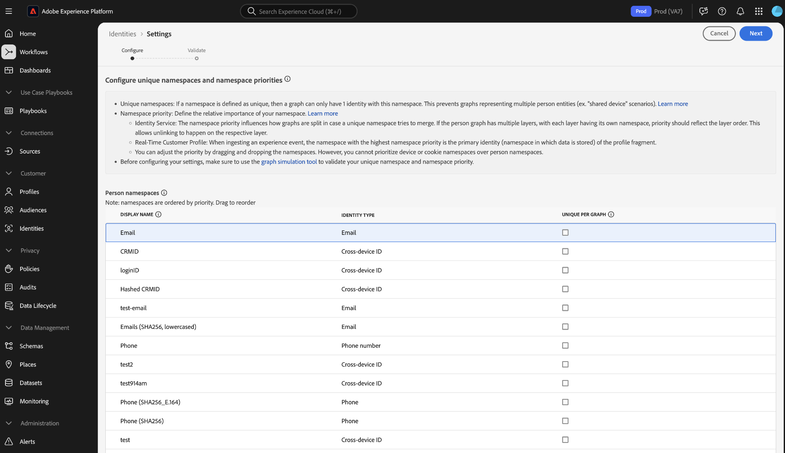
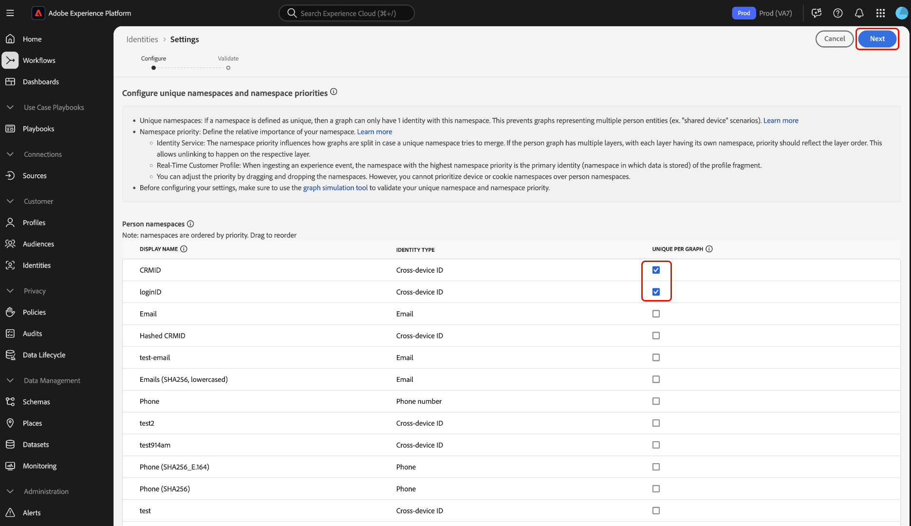

# Benutzeroberfläche für Identitätseinstellungen

>[!IMPORTANT]
>
>[!DNL Identity Graph Linking Rules] ist jetzt allgemein verfügbar. Wenden Sie sich an Ihr Adobe-Konto-Team oder den Adobe-Support, wenn Sie eine bestehende Sandbox haben, in der reduzierte Diagramme nach dem Aktivieren der Identitätseinstellungen wieder reduziert („korrigiert„) werden müssen.

Identitätseinstellungen sind eine Funktion in der Adobe Experience Platform Identity Service-Benutzeroberfläche, mit der Sie eindeutige Namespaces festlegen und die Namespace-Priorität konfigurieren können.

Sehen Sie sich das folgende Video an, um zusätzliche Informationen zur Verwendung der [!DNL Graph Simulation] im Arbeitsbereich der Identity Service-Benutzeroberfläche zu erhalten:

>[!VIDEO](https://video.tv.adobe.com/v/3475971/?captions=ger&learn=on&enablevpops)

Lesen Sie dieses Handbuch, um zu erfahren, wie Sie Ihre Identitätseinstellungen in der Benutzeroberfläche konfigurieren.

## Voraussetzungen

Lesen Sie die folgenden Dokumente, bevor Sie mit Identitätseinstellungen arbeiten:

* [[!DNL Identity Graph Linking Rules]](./overview.md)
* [Algorithmus der Identitätsoptimierung](./identity-optimization-algorithm.md)
* [Implementierungshandbuch](./implementation-guide.md)
* [Beispiele für Diagrammkonfigurationen](./example-configurations.md)
* [Namespace-Priorität](./namespace-priority.md)
* [Diagrammsimulation](./graph-simulation.md)

### Berechtigungen festlegen {#set-permissions}

Als Nächstes müssen Sie sicherstellen, dass Ihr Konto mit den folgenden Berechtigungen ausgestattet ist:

* **[!UICONTROL Identitätseinstellungen anzeigen]**: Wenden Sie diese Berechtigung an, um eindeutige Namespaces und die Namespace-Priorität auf der Seite zum Durchsuchen von Identitäts-Namespaces anzeigen zu können.
* **[!UICONTROL Identitätseinstellungen bearbeiten]**: Wenden Sie diese Berechtigung an, um Ihre Identitätseinstellungen bearbeiten und speichern zu können.

Wenden Sie sich an Ihren Administrator, wenn Sie diese Berechtigungen nicht haben. Weitere Informationen finden Sie im [Handbuch zu Berechtigungen](../../access-control/abac/ui/permissions.md).

## Konfigurieren der Identitätseinstellungen

Um auf die Identitätseinstellungen zuzugreifen, navigieren Sie in der Benutzeroberfläche von Adobe Experience Platform zum Arbeitsbereich Identity Service und wählen Sie **[!UICONTROL Einstellungen]** aus.

Die Seite mit den Identitätseinstellungen ist in zwei Abschnitte unterteilt: [!UICONTROL Personen-]) und [!UICONTROL Geräte- oder Cookie-]. Personen-Namespaces sind Bezeichner für einzelne Personen. Dabei kann es sich um geräteübergreifende IDs, E-Mail-Adressen und Telefonnummern handeln. Geräte- oder Cookie-Namespaces sind Bezeichner für Geräte und Webbrowser und können keine höhere Priorität als Personen-Namespaces erhalten. Sie können auch keinen Geräte- oder Cookie-Namespace als eindeutigen Namespace festlegen.

### Namespace-Priorität konfigurieren

Um die Namespace-Priorität zu konfigurieren, wählen Sie im Menü Identitätseinstellungen einen Namespace aus und ziehen Sie diesen Namespace dann per Drag-and-Drop in die gewünschte Reihenfolge. Platzieren Sie einen Namespace höher auf der Liste, um ihm eine höhere Priorität zu verleihen, und platzieren Sie umgekehrt einen Namespace niedriger auf der Liste, um ihm eine niedrigere Priorität zu verleihen. Der Namespace mit der höchsten Priorität sollte auch als eindeutiger Namespace gekennzeichnet werden.

### Eindeutigen Namespace festlegen

Um einen eindeutigen Namespace festzulegen, aktivieren Sie das Kontrollkästchen [!UICONTROL Eindeutig pro Diagramm], das diesem Namespace entspricht. Sie können (**bis zu drei eindeutige Namespaces) für** Konfiguration Ihrer Identitätseinstellungen auswählen.

Sobald Ihre eindeutigen Namespaces eingerichtet sind, können Diagramme nicht mehr mehrere Identitäten haben, die einen eindeutigen Namespace enthalten. Wenn Sie beispielsweise CRMID als eindeutigen Namespace angegeben haben, kann ein Diagramm nur eine Identität mit dem CRMID-Namespace haben. Weitere Informationen finden Sie unter [Übersicht über den Identitätsoptimierungsalgorithmus](./identity-optimization-algorithm.md#unique-namespace).

Wenn Sie mit den Konfigurationen fertig sind, klicken Sie auf **[!UICONTROL Weiter]** um fortzufahren.

Von hier aus müssen Sie Folgendes bestätigen, bevor Sie mit dem letzten Schritt fortfahren:

1. Die ausgewählten eindeutigen Namespaces.
2. Das Vorhandensein einer Identität mit dem höchsten priorisierten eindeutigen Namespace in jedem bekannten Profil.
3. Die Reihenfolge der Namespace-Priorität.

### Bestätigen der Einstellungen {#confirm-your-settings}

>[!IMPORTANT]
>
>* Der letzte Schritt ist eine weitere Bestätigungsmeldung, die angibt, dass vorhandene Diagramme nur vom Diagrammalgorithmus betroffen sind **nur wenn die Diagramme nach dem Speichern Ihrer Einstellungen aktualisiert werden** und dass die primäre Identität von Ereignisfragmenten im Echtzeit-Kundenprofil auch nach Änderungen der Namespace-Priorität nicht aktualisiert wird.
>
>* Es kann bis zu **24 Stunden** dauern, bis Ihre neuen oder aktualisierten Einstellungen wirksam werden. Geben Sie zur Bestätigung Ihren Sandbox-Namen ein und wählen Sie **[!UICONTROL Bestätigen]**.
>
>* Ihre Daten werden erst geändert, wenn Sie Ihre Identitätseinstellungen speichern.

## Nächste Schritte

Weitere Informationen zu [!DNL Identity Graph Linking Rules] finden Sie in der folgenden Dokumentation:

* [[!DNL Identity Graph Linking Rules] – Übersicht](./overview.md)
* [Algorithmus der Identitätsoptimierung](./identity-optimization-algorithm.md)
* [Implementierungshandbuch](./implementation-guide.md)
* [Beispiele für Diagrammkonfigurationen](./example-configurations.md)
* [Fehlerbehebung und häufig gestellte Fragen](./troubleshooting.md)
* [Namespace-Priorität](./namespace-priority.md)
* [Benutzeroberfläche für die Diagrammsimulation](./graph-simulation.md)