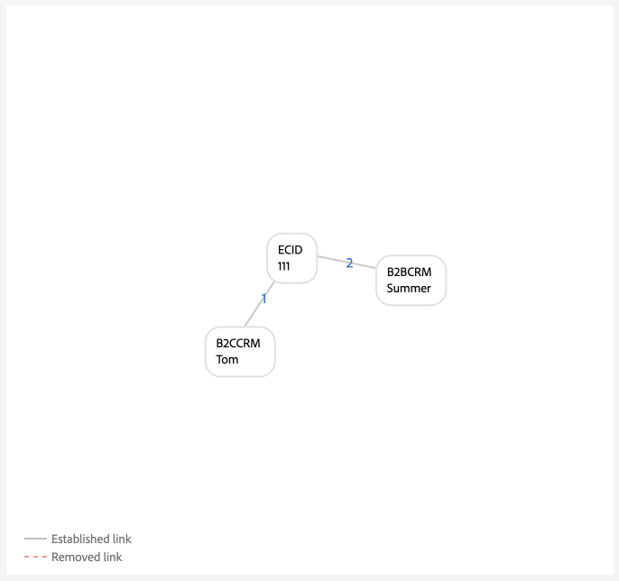
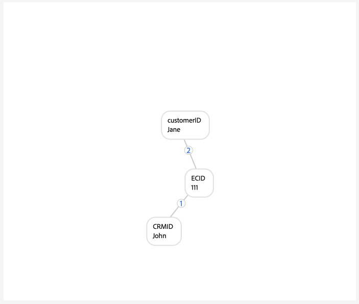

# Implementierungshandbuch für [!DNL Identity Graph Linking Rules]

>[!IMPORTANT]
>
>In diesem Dokument wird davon ausgegangen, dass Sie Ihre Implementierung in einer neuen Sandbox ohne Daten starten.

Lesen Sie dieses Dokument für eine schrittweise Anleitung, die Sie bei der Implementierung Ihrer Daten mit Adobe Experience Platform Identity Service befolgen können.

Schrittweise Anleitung:

1. [Vollständige Voraussetzungen für die Implementierung](#prerequisites-for-implementation)
2. [Erstellen der erforderlichen Identity-Namespaces](#namespace)
3. [Verwenden Sie das Tool zur Diagrammsimulation, um sich mit dem Identitätsoptimierungs-Algorithmus vertraut zu machen.](#graph-simulation)
4. [Verwenden Sie die Benutzeroberfläche „Identitätseinstellungen“, um Ihre eindeutigen Namespaces festzulegen und Prioritätsreihenfolgen für Ihre Namespaces zu konfigurieren](#identity-settings)
5. [Erstellen eines Experience-Datenmodell (XDM)-Schemas](#schema)
6. [Erstellen eines Datensatzes](#dataset)
7. [Aufnehmen von Daten in Experience Platform](#ingest)

## Voraussetzungen für die Implementierung {#prerequisites-for-implementation}

In diesem Abschnitt werden die erforderlichen Schritte beschrieben, die Sie vor der Implementierung von [!DNL Identity Graph Linking Rules] in Ihren Daten ausführen müssen.

### Eindeutiger Namespace

#### Namespace-Anforderung für einzelne Person {#single-person-namespace-requirement}

Sie müssen sicherstellen, dass der eindeutige Namespace mit der höchsten Priorität immer in jedem bekannten Profil vorhanden ist. Dadurch kann Identity Service die entsprechende Personenkennung in einem bestimmten Diagramm erkennen.

+++Auswählen, um ein Beispiel für ein Diagramm ohne Namespace für eine einzelne Personenkennung anzuzeigen

Ohne einen eindeutigen Namespace zur Darstellung Ihrer Personenkennungen erhalten Sie möglicherweise ein Diagramm, das mit verschiedenen Personenkennungen mit derselben ECID verknüpft ist. In diesem Beispiel sind B2BCRM und B2CCRM gleichzeitig mit derselben ECID verknüpft. Dieses Diagramm zeigt, dass Tom über sein B2C-Anmeldekonto ein Gerät mit Summer über ihr B2B-Anmeldekonto geteilt hat. Das System erkennt jedoch, dass es sich um ein Profil handelt (Diagrammausblendung).

{zoomable="yes"}

+++

+++Wählen Sie diese Option aus, um ein Beispiel für ein Diagramm mit einem Namespace für eine einzelne Personenkennung anzuzeigen

Bei einem eindeutigen Namespace (in diesem Fall eine CRMID anstelle von zwei unterschiedlichen Namespaces) kann Identity Service die Personenkennung erkennen, die zuletzt mit der ECID verknüpft war. Da in diesem Beispiel eine eindeutige CRM-ID vorhanden ist, kann Identity Service ein Szenario mit einem „gemeinsamen Gerät“ erkennen, in dem zwei Entitäten dasselbe Gerät gemeinsam nutzen.

{zoomable="yes"}

+++

### Namespace-Prioritätskonfiguration

Wenn Sie den [Adobe Analytics-Quell-Connector](../../sources/tutorials/ui/create/adobe-applications/analytics.md) zum Aufnehmen von Daten verwenden, müssen Sie Ihren ECIDs eine höhere Priorität als der Adobe Analytics ID (AAID) einräumen, da Identity Service AAID blockiert. Durch Priorisierung von ECID können Sie das Echtzeit-Kundenprofil anweisen, nicht authentifizierte Ereignisse in ECID anstatt in AAID zu speichern.

### XDM-Erlebnisereignisse {#xdm-experience-events}

>[!CONTEXTUALHELP]
>id="platform_identities_linkingrules_xdm"
>title="Sicherstellen, dass Sie über eine Personenkennung verfügen"
>abstract="Während des Vorab-Implementierungsprozesses müssen Sie sicherstellen, dass die authentifizierten Ereignisse, die Ihr System an Experience Platform sendet, immer eine **einzelne** Personenkennung enthalten, z. B. eine CRMID."

Während des Vorab-Implementierungsprozesses müssen Sie sicherstellen, dass die authentifizierten Ereignisse, die Ihr System an Experience Platform sendet, immer eine **einzelne** Personenkennung enthalten, z. B. eine CRMID.

* (Empfohlen) Authentifizierte Ereignisse mit einer eindeutigen Personenkennung.
* (Nicht empfohlen) Authentifizierte Ereignisse mit zwei eindeutigen Personenkennungen. Wenn Sie mehr als eine eindeutige Personenkennung haben, kann es zu einem unerwünschten Reduzieren des Diagramms kommen.
* (Nicht empfohlen) Authentifizierte Ereignisse ohne eindeutige Personenkennungen. Wenn Sie keine eindeutigen Personenkennungen haben, werden nicht authentifizierte und authentifizierte Ereignisse in der ECID gespeichert.

>[!BEGINTABS]

>[!TAB Authentifizierte Ereignisse mit einer Personenkennung]

```json
{
  "_id": "test_id",
  "identityMap": {
      "ECID": [
          {
              "id": "62486695051193343923965772747993477018",
              "primary": false
          }
      ],
      "CRMID": [
          {
              "id": "John",
              "primary": true
          }
      ]
  },
  "timestamp": "2024-09-24T15:02:32+00:00",
  "web": {
      "webPageDetails": {
          "URL": "https://business.adobe.com/",
          "name": "Adobe Business"
      }
  }
}
```

>[!TAB Authentifizierte Ereignisse mit zwei Personenkennungen]

Wenn Ihr System zwei Personen-IDs sendet, kann die Implementierung die Anforderung an einen Ein-Personen-Namespace nicht erfüllen. Wenn beispielsweise die identityMap in Ihrer WebSDK-Implementierung eine CRMID, eine customerID und einen ECID-Namespace enthält, gibt es keine Garantie, dass jedes einzelne Ereignis sowohl CRMID als auch customerID enthält.

Sie sollten **nicht** eine Payload wie die folgende senden:

```json
{
  "_id": "test_id",
  "identityMap": {
      "ECID": [
          {
              "id": "62486695051193343923965772747993477018",
              "primary": false
          }
      ],
      "CRMID": [
          {
              "id": "John",
              "primary": true
          }
      ],
      "customerID": [
          {
            "id": "Jane",
            "primary": false
          }
      ],
  },
  "timestamp": "2024-09-24T15:02:32+00:00",
  "web": {
      "webPageDetails": {
          "URL": "https://business.adobe.com/",
          "name": "Adobe Business"
      }
  }
}
```

Beachten Sie jedoch, dass Sie zwar zwei Personenkennungen senden können, es jedoch keine Garantie dafür gibt, dass ein unerwünschtes Diagrammausblenden aufgrund von Implementierungs- oder Datenfehlern verhindert wird. Betrachten Sie das folgende Szenario:

* `timestamp1` = John meldet sich an -> System erfasst `CRMID: John, ECID: 111`. `customerID: John` ist jedoch nicht in dieser Ereignis-Payload vorhanden.
* `timestamp2` = Jane meldet sich an -> System erfasst `customerID: Jane, ECID: 111`. `CRMID: Jane` ist jedoch nicht in dieser Ereignis-Payload vorhanden.

Daher empfiehlt es sich, mit Ihren authentifizierten Ereignissen nur eine Personenkennung zu senden.

In der Diagrammsimulation kann diese Aufnahme wie folgt aussehen:

{zoomable="yes"}

>[!TAB Authentifizierte Ereignisse ohne Personenkennungen]

In diesem Beispiel können Sie davon ausgehen, dass das folgende Ereignis an Experience Platform gesendet wurde, während John (der Endbenutzer) während der Authentifizierung Ihre Website durchsuchte. Trotz der Authentifizierung kann Experience Platform John jedoch nicht identifizieren, da in dem Ereignis keine Personenkennungen vorhanden sind. Daher wird dieses Ereignis als anonymer Benutzer interpretiert, der die Adobe Business-Website durchsucht, anstatt es als eine speziell mit John verknüpfte Online-Aktivität zu erkennen.

```json
{
    "_id": "test_id",
    "identityMap": {
        "ECID": [
            {
                "id": "62486695051193343923965772747993477018",
                "primary": false
            }
        ]
    },
    "timestamp": "2024-09-24T15:02:32+00:00",
    "web": {
        "webPageDetails": {
            "URL": "https://business.adobe.com/",
            "name": "Adobe Business"
        }
    }
}
```

>[!ENDTABS]

## Berechtigungen festlegen {#set-permissions}

Der erste Schritt im Implementierungsprozess für Identity Service besteht darin sicherzustellen, dass Ihr Experience Platform-Konto zu einer Rolle hinzugefügt wird, die über die erforderlichen Berechtigungen verfügt. Ihr Administrator kann die Berechtigungen für Ihr Konto konfigurieren, indem er zur Benutzeroberfläche „Berechtigungen“ in Adobe Experience Cloud navigiert. Von dort aus muss Ihr Konto zu einer Rolle mit den folgenden Berechtigungen hinzugefügt werden:

* [!UICONTROL Identitätseinstellungen anzeigen]: Wenden Sie diese Berechtigung an, um eindeutige Namespaces und die Namespace-Priorität auf der Seite zum Durchsuchen von Identitäts-Namespaces anzeigen zu können.
* [!UICONTROL Identitätseinstellungen bearbeiten]: Wenden Sie diese Berechtigung an, um Ihre Identitätseinstellungen bearbeiten und speichern zu können.

Weitere Informationen zu Berechtigungen finden Sie im [Handbuch zu Berechtigungen](../../access-control/abac/ui/permissions.md).

## Erstellen von Identity-Namespaces {#namespace}

Wenn Ihre Daten dies erfordern, müssen Sie zunächst die entsprechenden Namespaces für Ihre Organisation erstellen. Anweisungen zum Erstellen eines benutzerdefinierten Namespace finden Sie im Handbuch unter [Erstellen eines benutzerdefinierten Namespace in der Benutzeroberfläche](../features/namespaces.md#create-custom-namespaces).

## Graph-Simulationswerkzeug verwenden {#graph-simulation}

Navigieren Sie anschließend zum [Diagrammsimulations-Tool](./graph-simulation.md) im Arbeitsbereich der Identity Service-Benutzeroberfläche. Sie können das Diagrammsimulations-Tool verwenden, um Identitätsdiagramme zu simulieren, die mit einer Vielzahl verschiedener eindeutiger Namespace- und Namespace-Prioritätskonfigurationen erstellt wurden.

Durch das Erstellen verschiedener Konfigurationen können Sie das Tool zur Diagrammsimulation verwenden, um zu erfahren und besser zu verstehen, wie sich der Algorithmus zur Identitätsoptimierung und bestimmte Konfigurationen auf das Verhalten Ihres Diagramms auswirken können.

## Konfigurieren von Identitätseinstellungen {#identity-settings}

Sobald Sie eine bessere Vorstellung davon haben, wie sich Ihr Diagramm verhalten soll, navigieren Sie zur [Benutzeroberfläche für Identitätseinstellungen](./identity-settings-ui.md) im Arbeitsbereich der Benutzeroberfläche von Identity Service. Um auf die Benutzeroberfläche für Identitätseinstellungen zuzugreifen, wählen Sie **[!UICONTROL linken Navigationsbereich die Option]** Identitäten“ und dann **[!UICONTROL Einstellungen]** aus.

{zoomable="yes"}

Verwenden Sie die Benutzeroberfläche für Identitätseinstellungen, um Ihre eindeutigen Namespaces festzulegen und Ihre Namespaces nach Priorität zu konfigurieren. Nachdem Sie die Einstellungen angewendet haben, müssen Sie mindestens sechs Stunden warten, bevor Sie mit der Datenaufnahme fortfahren können, da es mindestens sechs Stunden dauert, bis neue Einstellungen in Identity Service übernommen werden.

Weitere Informationen finden Sie im [Handbuch zur Benutzeroberfläche für Identitätseinstellungen](./identity-settings-ui.md).

## Erstellen eines XDM-Schemas {#schema}

Nachdem Sie Ihre eindeutigen Namespaces und Namespace-Prioritäten festgelegt haben, können Sie jetzt mit der erforderlichen Einrichtung fortfahren, um Ihre Daten aufzunehmen. Zunächst müssen Sie ein XDM-Schema erstellen. Abhängig von Ihren -Daten müssen Sie möglicherweise ein Schema sowohl für das individuelle XDM-Profil als auch für XDM ExperienceEvent erstellen.

Um Daten in das Echtzeit-Kundenprofil aufzunehmen, müssen Sie sicherstellen, dass Ihr Schema mindestens ein Feld enthält, das als primäre Identität festgelegt wurde. Durch Festlegen einer primären Identität können Sie ein bestimmtes Schema für die Profilaufnahme aktivieren.

Anweisungen zum Erstellen eines Schemas finden Sie im Handbuch unter [Erstellen eines XDM-Schemas in der Benutzeroberfläche](../../xdm/tutorials/create-schema-ui.md).

## Erstellen eines Datensatzes {#dataset}

Erstellen Sie als Nächstes einen Datensatz, um eine Struktur für die aufzunehmenden Daten bereitzustellen. Ein Datensatz ist ein Konstrukt zur Datenspeicherung und -verwaltung, in dem Daten (in der Regel) in einer Tabelle erfasst werden, die ein Schema (Spalten) und Felder (Zeilen) beinhaltet. Datensätze arbeiten mit Schemata zusammen und um Daten in das Echtzeit-Kundenprofil aufzunehmen, muss Ihr Datensatz für die Profilaufnahme aktiviert sein. Damit Ihr Datensatz für das Profil aktiviert werden kann, muss er auf ein Schema verweisen, das für die Profilaufnahme aktiviert ist.

Anweisungen zum Erstellen eines Datensatzes finden Sie im [Handbuch zur Datensatz-Benutzeroberfläche](../../catalog/datasets/user-guide.md).

## Aufnehmen von Daten {#ingest}

Zu diesem Zeitpunkt sollten Sie über Folgendes verfügen:

* Die erforderlichen Berechtigungen für den Zugriff auf Identity Service-Funktionen.
* Namespaces für Ihre Daten.
* Spezifische Namespaces und konfigurierte Prioritäten für Ihre Namespaces.
* Mindestens ein XDM-Schema. (Abhängig von Ihren Daten und Ihrem spezifischen Anwendungsfall müssen Sie möglicherweise sowohl Profil- als auch Erlebnisereignis-Schemas erstellen.)
* Ein Datensatz, der auf Ihrem Schema basiert.

Sobald alle oben aufgeführten Elemente vorhanden sind, können Sie mit der Aufnahme Ihrer Daten in Experience Platform beginnen. Die Datenaufnahme kann auf verschiedene Weise durchgeführt werden. Sie können die folgenden Services verwenden, um Ihre Daten in Experience Platform zu übertragen:

* [Batch- und Streaming-Aufnahme](../../ingestion/home.md)
* [Datenerfassung in Experience Platform](../../collection/home.md)
* [Experience Platform-Quellen](../../sources/home.md)

>[!TIP]
>
>Sobald Ihre Daten aufgenommen wurden, ändert sich die Payload der XDM-Rohdaten nicht mehr. Möglicherweise werden Ihre primären Identitätskonfigurationen weiterhin in der Benutzeroberfläche angezeigt. Diese Konfigurationen werden jedoch durch Identitätseinstellungen überschrieben.

Verwenden Sie für Feedback die Option **[!UICONTROL Beta-Feedback]** im Arbeitsbereich der Identity Service-Benutzeroberfläche.

## Validieren von Diagrammen {#validate}

Verwenden Sie das Identitäts-Dashboard, um Einblicke in den Status Ihrer Identitätsdiagramme zu erhalten, z. B. die Gesamtzahl der Identitätsdiagramme und die Anzahl der Diagramme, die Anzahl der Identitäten nach Namespace und die Anzahl der Diagramme nach Größe. Sie können auch das Identitäts-Dashboard verwenden, um Trends in Diagrammen mit zwei oder mehr Identitäten anzuzeigen, sortiert nach Namespace.

Klicken Sie auf die Auslassungszeichen (`...`) und dann auf **[!UICONTROL Weitere anzeigen]** um weitere Informationen anzuzeigen und zu überprüfen, ob es keine reduzierten Diagramme gibt.

{zoomable="yes"}

Verwenden Sie das angezeigte Fenster, um Informationen zu Ihren reduzierten Diagrammen anzuzeigen. In diesem Beispiel werden E-Mail und Telefon als eindeutiger Namespace markiert, sodass es keine reduzierten Diagramme in Ihrer Sandbox gibt.

{zoomable="yes"}

## Anhang {#appendix}

Lesen Sie diesen Abschnitt für zusätzliche Informationen, die Sie bei der Implementierung Ihrer Identitätseinstellungen und eindeutigen Namespaces benötigen.

### Szenario mit verwaister Anmelde-ID {#dangling-loginid-scenario}

Das folgende Diagramm simuliert ein „verwaistes“ Anmelde-ID-Szenario. In diesem Beispiel sind zwei verschiedene Anmelde-IDs an dieselbe ECID gebunden. `{loginID: ID_C}` ist jedoch nicht mit der CRMID verknüpft. Daher kann Identity Service nicht erkennen, dass diese beiden Anmelde-IDs zwei verschiedene Entitäten darstellen.

>[!BEGINTABS]

>[!TAB Mehrdeutige Anmelde-ID]

In diesem Beispiel bleibt `{loginID: ID_C}` hängen und ist nicht mit einer CRMID verknüpft. Daher ist die Entität der Person, mit der diese Anmelde-ID verknüpft werden soll, nicht eindeutig.

{zoomable="yes"}

>[!TAB loginID ist mit einer CRMID verknüpft]

In diesem Beispiel ist `{loginID: ID_C}` mit `{CRMID: Tom}` verknüpft. Daher kann das System erkennen, dass diese Anmelde-ID mit Tom verbunden ist.

{zoomable="yes"}

>[!TAB loginID ist mit einer anderen CRMID verknüpft]

In diesem Beispiel ist `{loginID: ID_C}` mit `{CRMID: Summer}` verknüpft. Daher kann das System erkennen, dass diese Anmelde-ID mit einer anderen Personenentität verknüpft ist, in diesem Fall Summer.

Dieses Beispiel zeigt auch, dass Tom und Summer sich in verschiedenen Personenentitäten befinden, die ein Gerät teilen, das durch `{ECID: 111}` dargestellt wird.

{zoomable="yes"}

>[!ENDTABS]

## Nächste Schritte

Weitere Informationen zu [!DNL Identity Graph Linking Rules] finden Sie in der folgenden Dokumentation:

* [[!DNL Identity Graph Linking Rules] – Übersicht](./overview.md)
* [Algorithmus der Identitätsoptimierung](./identity-optimization-algorithm.md)
* [Beispiele für Diagrammkonfigurationen](./example-configurations.md)
* [Fehlerbehebung und häufig gestellte Fragen](./troubleshooting.md)
* [Namespace-Priorität](./namespace-priority.md)
* [Benutzeroberfläche für die Diagrammsimulation](./graph-simulation.md)
* [Benutzeroberfläche für Identitätseinstellungen](./identity-settings-ui.md)
