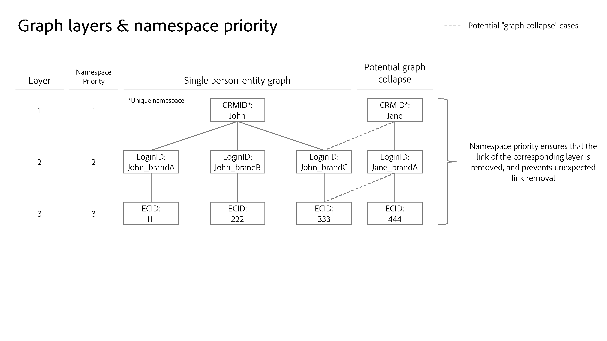

# Namespace-Priorität

>[!AVAILABILITY]
>
>Die Regeln zur Verknüpfung von Identitätsdiagrammen sind derzeit nur eingeschränkt verfügbar. Wenden Sie sich an Ihr Adobe-Account-Team, um Informationen zum Zugriff auf die Funktion in Entwicklungs-Sandboxes zu erhalten.

Jede Kundenimplementierung ist einzigartig und auf die Ziele eines bestimmten Unternehmens zugeschnitten. Daher variiert die Bedeutung eines bestimmten Namespace von Kunde zu Kunde. Beispiele aus der realen Welt:

* Ihr Unternehmen kann davon ausgehen, dass jede E-Mail-Adresse eine Einzelperson darstellt, und daher [Identitätseinstellungen](./identity-settings-ui.md) verwenden, um den E-Mail-Namespace als eindeutig zu konfigurieren. Ein anderes Unternehmen könnte jedoch Einzelpersonen als Entitäten mit mehreren E-Mail-Adressen darstellen und so den E-Mail-Namespace als nicht eindeutig konfigurieren. Diese Unternehmen müssen einen anderen Identitäts-Namespace als eindeutig verwenden, z. B. einen CRMID-Namespace, sodass eine Einzelperson-Kennung vorhanden sein kann, die mit mehreren E-Mail-Adressen verknüpft ist.
* Sie können das Online-Verhalten mithilfe des Namespace &quot;Anmelde-ID&quot;erfassen. Diese Anmelde-ID kann eine 1:1-Beziehung zur CRMID aufweisen, die dann Attribute aus einem CRM-System speichert und als der wichtigste Namespace betrachtet werden kann. In diesem Fall bestimmen Sie dann, dass der CRMID-Namespace eine genauere Darstellung einer Person darstellt, während der Anmelde-ID-Namespace der zweitwichtigste ist.

Sie müssen im Identity Service Konfigurationen vornehmen, die die Wichtigkeit Ihrer Namespaces widerspiegeln, da dies beeinflusst, wie Profile und die zugehörigen Identitätsdiagramme gebildet und aufgeteilt werden.

## Legen Sie Ihre Prioritäten fest

Die Bestimmung der Namespace-Priorität basiert auf den folgenden Faktoren:

### Identitätsdiagrammstruktur

Wenn die Diagrammstruktur Ihres Unternehmens auf einer Ebene angeordnet ist, sollte die Namespace-Priorität dies widerspiegeln, damit die richtigen Links im Falle eines Diagrammausfalls entfernt werden.

>[!TIP]
>
>* &quot;Diagrammausfall&quot;bezieht sich auf Szenarien, in denen versehentlich mehrere unterschiedliche Profile zu einem Identitätsdiagramm zusammengeführt werden.
>
>* Ein Diagramm mit Ebenen bezieht sich auf Identitätsdiagramme mit mehreren Ebenen von Links. Sehen Sie sich das folgende Bild an, um ein Beispiel für ein Diagramm mit drei Ebenen anzuzeigen.

### Semantische Bedeutung des Namespace

Eine Identität stellt ein Objekt der realen Welt dar. Im Identitätsdiagramm werden drei Objekte dargestellt. In der Reihenfolge ihrer Bedeutung sind sie:

* Personen (geräteübergreifend, E-Mail, Telefonnummer)
* Hardwaregerät
* Webbrowser (Cookie)

Personen-Namespaces sind im Vergleich zu Hardwaregeräten (wie IDFA, GAID), die im Vergleich zu Webbrowsern relativ unveränderlich sind, relativ unveränderlich. Grundsätzlich sind Sie (die Person) immer eine Einheit, die über mehrere Hardwaregeräte (Smartphone, Laptop, Tablet usw.) und mehrere Browser (Google Chrome, Safari, FireFox usw.) verfügen kann.

Eine andere Möglichkeit, dieses Thema anzugehen, ist die Kardinalität. Wie viele Identitäten werden für eine bestimmte Entität erstellt? In den meisten Fällen verfügt eine Person über eine CRMID, eine Handvoll von Hardware-Geräte-IDs (IDFA/GAID-Resets sollten nicht oft auftreten) und sogar über mehr Cookies (eine Person könnte möglicherweise mehrere Geräte durchsuchen, den Inkognito-Modus verwenden oder Cookies jederzeit zurücksetzen). Im Allgemeinen gibt **niedrigere Kardinalität einen Namespace mit einem höheren Wert an**.

## Validieren der Namespace-Prioritätseinstellungen

Sobald Sie eine Vorstellung davon haben, wie Sie Ihre Namespaces priorisieren, können Sie das Tool zur Diagrammsimulation in der Benutzeroberfläche verwenden, um verschiedene Szenarien zum Reduzieren von Diagrammen zu testen und sicherzustellen, dass Ihre Prioritätskonfigurationen die erwarteten Diagrammergebnisse zurückgeben. Weitere Informationen finden Sie im Handbuch zur Verwendung des [Diagrammsimulations-Tools](./graph-simulation.md).

## Namespace-Priorität konfigurieren

Die Namespace-Priorität kann über die Benutzeroberfläche mit den [Identitätseinstellungen](./identity-settings-ui.md) konfiguriert werden. In der Benutzeroberfläche für Identitätseinstellungen können Sie einen Namespace per Drag-and-Drop verschieben, um dessen relative Bedeutung zu bestimmen.

>[!IMPORTANT]
>
>Sie können Geräte-/Cookie-Namespaces nicht den Personen-Namespaces vorziehen. Diese Einschränkung stellt sicher, dass keine Fehlkonfigurationen auftreten.

## Verwendung der Namespace-Priorität

Derzeit beeinflusst die Namespace-Priorität das Systemverhalten des Echtzeit-Kundenprofils. Das folgende Diagramm zeigt dieses Konzept. Weitere Informationen finden Sie im Handbuch zu [Architekturdiagrammen zu Adobe Experience Platform und Anwendungen](https://experienceleague.adobe.com/en/docs/blueprints-learn/architecture/architecture-overview/platform-applications).

### Identity Service: Identitätsoptimierungsalgorithmus

Bei relativ komplexen Diagrammstrukturen spielt die Namespace-Priorität eine wichtige Rolle, um sicherzustellen, dass beim Reduzieren von Diagrammen die richtigen Links entfernt werden. Weitere Informationen finden Sie in der Übersicht über den [Identitätsoptimierungsalgorithmus](../identity-graph-linking-rules/identity-optimization-algorithm.md) .

### Echtzeit-Kundenprofil: primäre Identitätsfeststellung für Erlebnisereignisse

* Nachdem Sie Identitätseinstellungen für eine bestimmte Sandbox konfiguriert haben, wird die primäre Identität für Erlebnisereignisse durch die höchste Namespace-Priorität in der Konfiguration bestimmt.
   * Dies liegt daran, dass Erlebnisereignisse von Natur aus dynamisch sind. Eine Identitätszuordnung kann drei oder mehr Identitäten enthalten. Mit der Namespace-Priorität wird sichergestellt, dass der wichtigste Namespace mit dem Erlebnisereignis verknüpft ist.
* Daher werden die folgenden Konfigurationen **nicht mehr vom Echtzeit-Kundenprofil** verwendet:
   * Die primäre Identitätskonfiguration (`primary=true`) beim Senden von Identitäten in der identityMap mithilfe des Web SDK, des Mobile SDK oder der Edge Network Server-API (Identitäts-Namespace und Identitätswert werden weiterhin im Profil verwendet). **Hinweis**: Dienste außerhalb des Echtzeit-Kundenprofils wie Daten-Lake-Speicher oder Adobe Target verwenden weiterhin die primäre Identitätskonfiguration (`primary=true`).
   * Alle Felder, die in einem XDM Experience Event Class-Schema als primäre Identität markiert sind.
   * Standardmäßige primäre Identitätseinstellungen im Adobe Analytics-Quell-Connector (ECID oder AAID).
* Andererseits bestimmt die Namespace-Priorität **nicht die primäre Identität für Profildatensätze**.
   * Für Profildatensätze sollten Sie weiterhin Ihre Identitätsfelder im Schema definieren, einschließlich der primären Identität. Weitere Informationen finden Sie im Handbuch zum Definieren von Identitätsfeldern in der Benutzeroberfläche ](../../xdm/ui/fields/identity.md) .[

>[!TIP]
>
>* Namespace-Priorität ist **eine Eigenschaft eines Namespace**. Es handelt sich um einen numerischen Wert, der einem Namespace zugewiesen wird, um dessen relative Bedeutung anzugeben.
>
>* Primäre Identität ist die Identität, mit der ein Profilfragment gespeichert wird. Ein Profilfragment ist ein Datensatz mit Daten, die Informationen über einen bestimmten Benutzer speichern: Attribute (z. B. CRM-Datensätze) oder Ereignisse (z. B. Website-Browsing).

### Beispielszenario

In diesem Abschnitt finden Sie ein Beispiel dafür, wie sich die Prioritätskonfiguration auf Ihre Daten auswirken kann.

Angenommen, die folgenden Konfigurationen werden für eine bestimmte Sandbox festgelegt:

| Namespace | Echtzeit-Anwendung des Namespace | Priorität |
| --- | --- | --- |
| CRMID | Benutzer | 1 |
| IDFA | Apple-Hardwaregerät (iPhone, IPad usw.) | 2 |
| GAID | Google-Hardwaregerät (Google Pixel, Pixelbook usw.) | 3 |
| ECID | Webbrowser (Firefox, Safari, Google Chrome usw.) | 4 |
| AAID | Webbrowser | 5 |

{style="table-layout:auto"}

In Anbetracht der oben beschriebenen Konfigurationen werden Benutzeraktionen und die Bestimmung der primären Identität als solche aufgelöst:

| Benutzeraktion (Erlebnisereignis) | Authentifizierungsstatus | Datenquelle | Namespaces im Ereignis | Namespace der primären Identität |
| --- | --- | --- | --- | --- |
| Angebotsseite für Kreditkarten anzeigen | Nicht authentifiziert (anonym) | Web SDK | `{ECID}` | ECID |
| Hilfeseite anzeigen | Nicht authentifiziert | Mobile SDK | `{ECID, IDFA}` | IDFA |
| Kontoübersicht anzeigen | Authentifiziert | Web SDK | `{CRMID, ECID}` | CRMID |
| Für Eigenheimdarlehen anmelden | Authentifiziert | Analytics-Quell-Connector | `{CRMID, ECID, AAID}` | CRMID |
| 1.000 USD aus der Überprüfung auf Einsparungen übertragen | Authentifiziert | Mobile SDK | `{CRMID, GAID, ECID}` | CRMID |

{style="table-layout:auto"}

### Segmentierungsdienst: Metadatenspeicherung von Segmentmitgliedschaften

Für ein bestimmtes zusammengeführtes Profil werden Segmentmitgliedschaften mit der Identität mit der höchsten Namespace-Priorität gespeichert.

Angenommen, es gibt zwei Profile:

* Profil 1 steht für John.
   * Johns Profil ist für S1 qualifiziert (Segmentmitgliedschaft 1). S1 könnte beispielsweise auf ein Segment von Kunden verweisen, die sich als männlich identifizieren.
   * John&#39;s Profil qualifiziert sich auch für S2 (Segmentmitgliedschaft 2). Dies kann sich auf ein Segment von Kunden beziehen, deren Treuestatus Gold ist.
* Profil 2 steht für Jane.
   * Janes Profil ist für S3 qualifiziert (Segmentmitgliedschaft 3). Dies könnte sich auf ein Segment von Kunden beziehen, die sich als weiblich identifizieren.
   * Janes Profil ist auch für S4 qualifiziert (Segmentmitgliedschaft 4). Dies kann sich auf ein Segment von Kunden beziehen, deren Treuestatus Platin ist.

Wenn John und Jane ein Gerät gemeinsam nutzen, wird die ECID (Webbrowser) von einer Person an eine andere übertragen. Dies hat jedoch keinen Einfluss auf die Informationen zur Segmentmitgliedschaft, die für John und Jane gespeichert wurden.

Wenn die Segmentqualifikationskriterien ausschließlich auf anonymen Ereignissen basieren, die mit der ECID gespeichert wurden, würde Jane sich für dieses Segment qualifizieren

## Auswirkungen auf andere Experience Platform-Dienste {#implications}

In diesem Abschnitt wird beschrieben, wie sich die Namespace-Priorität auf andere Experience Platform-Dienste auswirken kann.

### Erweiterte Lebenszyklusverwaltung

Löschanfragen von Datensammlungen funktionieren für eine bestimmte Identität wie folgt:

* Echtzeit-Kundenprofil: Löscht alle Profilfragmente mit der angegebenen Identität als primäre Identität. **Die primäre Identität für das Profil wird jetzt anhand der Namespace-Priorität bestimmt.**
* Data Lake: Löscht jeden Datensatz mit der angegebenen Identität als primäre Identität. Im Gegensatz zum Echtzeit-Kundenprofil basiert die primäre Identität im Data Lake auf der primären Identität, die im WebSDK (`primary=true`) angegeben ist, oder auf einem Feld, das als primäre Identität markiert ist

Weitere Informationen finden Sie in der [Übersicht über die erweiterte Lebenszyklusverwaltung](../../hygiene/home.md) .

### Berechnete Attribute

Wenn die Identitätseinstellungen aktiviert sind, verwenden berechnete Attribute die Namespace-Priorität, um den berechneten Attributwert zu speichern. Für ein bestimmtes Ereignis hat die Identität mit der höchsten Namespace-Priorität den Wert des berechneten Attributs, das dagegen geschrieben wurde. Weitere Informationen finden Sie im Benutzerhandbuch für berechnete Attribute ](../../profile/computed-attributes/ui.md).[

### Data Lake

Die Datenerfassung in Data Lake berücksichtigt weiterhin die primären Identitätseinstellungen, die für das [Web SDK](../../tags/extensions/client/web-sdk/data-element-types.md#identity-map) und Schemas konfiguriert wurden.

Data Lake bestimmt die primäre Identität nicht basierend auf der Namespace-Priorität. Adobe Customer Journey Analytics verwendet beispielsweise weiterhin Werte in der Identitätszuordnung, auch wenn die Namespace-Priorität aktiviert ist (z. B. Hinzufügen eines Datensatzes zu einer neuen Verbindung), da Customer Journey Analytics ihre Daten aus dem Data Lake verbraucht.

### Experience-Datenmodell (XDM)-Schemas

Jedes Schema, das kein XDM-Erlebnisereignis ist, z. B. individuelle XDM-Profile, berücksichtigt weiterhin alle [Felder, die Sie als Identität markieren](../../xdm/ui/fields/identity.md).

Weitere Informationen zu XDM-Schemas finden Sie in der [Übersicht über Schemas](../../xdm/home.md).

### Intelligente Dienste

Bei der Auswahl Ihrer Daten müssen Sie einen Namespace angeben, der verwendet wird, um die Ereignisse zu bestimmen, die Bewertungen berechnen, sowie die Ereignisse, die die berechneten Bewertungen speichern. Es wird empfohlen, den Namespace auszuwählen, der eine Person darstellt.

* Wenn Sie Web-Verhaltensdaten mit WebSDk erfassen, sollten Sie den CRMID-Namespace in der Identitätszuordnung auswählen.
* Wenn Sie Webverhaltensdaten mit dem Analytics-Quell-Connector erfassen, sollten Sie den Identitätsdeskriptor (CRMID) auswählen.

Diese Konfiguration führt dazu, dass Bewertungen nur mit authentifizierten Ereignissen berechnet werden.

Weitere Informationen finden Sie in den Dokumenten unter [Attribution AI](../../intelligent-services/attribution-ai/overview.md) und [Customer AI](../../intelligent-services/customer-ai/overview.md).

### Partnerdefinierte Ziele

Aktualisierte Ergebnisse zur Zielgruppendisqualifizierung für Profile, die mit einem freigegebenen Gerät verknüpft sind, werden möglicherweise nicht an nachgelagerte Ziele gesendet. Dies kann in bestimmten seltenen Fällen auftreten, wenn:

* Die Zielgruppenqualifizierung basiert nur auf einer anonymen Aktivität.
* Anmeldungen über mehrere Profile hinweg treten in einem kurzen Zeitraum auf.

Weitere Informationen zu Partnerzielen finden Sie in der [Zielübersicht](../../destinations/home.md#adobe-built-and-partner-built-destinations).

### Privacy Service

[Privacy Service-Löschanfragen](../privacy.md) funktionieren wie folgt für eine bestimmte Identität:

* Echtzeit-Kundenprofil: Löscht alle Profilfragmente mit dem angegebenen Identitätswert als primäre Identität. **Die primäre Identität für das Profil wird jetzt anhand der Namespace-Priorität bestimmt.**
* Data Lake: Löscht jeden Datensatz mit der angegebenen Identität als primäre oder sekundäre Identität.

Weitere Informationen finden Sie in der [Übersicht über den Datenschutzdienst](../../privacy-service/home.md) .

### Adobe Target

Adobe Target kann bei Verwendung der Kantensegmentierung zu unerwartetem Benutzer-Targeting für Szenarien mit freigegebenen Geräten führen.