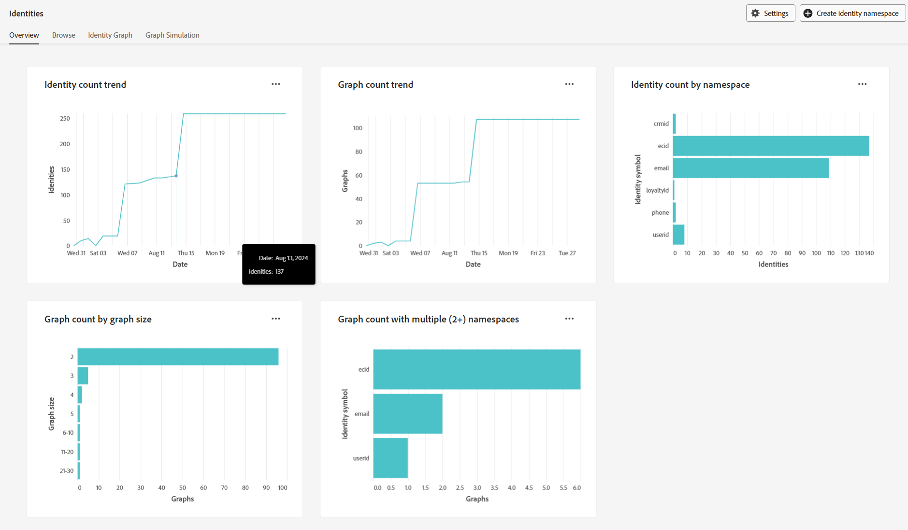

# Handbuch zur Fehlerbehebung bei Regeln für die Verknüpfung von Identitätsdiagrammen

>[!AVAILABILITY]
>
>Regeln zur Identitätsdiagramm-Verknüpfung sind derzeit nur eingeschränkt verfügbar. Wenden Sie sich an Ihr Adobe-Konto-Team , um Informationen zum Zugriff auf die Funktion in Entwicklungs-Sandboxes zu erhalten.

Beim Testen und Validieren von Regeln zur Identitätsdiagramm-Verknüpfung können Probleme im Zusammenhang mit der Datenaufnahme und dem Verhalten im Diagramm auftreten. Lesen Sie dieses Dokument, um zu erfahren, wie Sie einige häufige Probleme beheben können, die beim Arbeiten mit Regeln zur Identitätsdiagramm-Verknüpfung auftreten können.

## Übersicht über den Datenaufnahmefluss {#data-ingestion-flow-overview}

Die folgende Abbildung zeigt eine vereinfachte Darstellung des Datenflusses in Adobe Experience Platform und Programme. Verwenden Sie dieses Diagramm als Referenz, um ein besseres Verständnis des Inhalts dieser Seite zu erhalten.


Beachten Sie die folgenden Faktoren:

* Für Streaming-Daten beginnen Echtzeit-Kundenprofil, Identity Service und Data Lake mit der Verarbeitung der Daten, wenn die Daten gesendet werden. Die Latenz für den Abschluss der Datenverarbeitung hängt jedoch vom Service ab. Normalerweise dauert die Verarbeitung von Data Lake im Vergleich zu Profil und Identität länger.
   * Wenn die Daten beim Ausführen einer Abfrage für einen Datensatz auch nach einigen Stunden nicht angezeigt werden, ist es wahrscheinlich, dass die Daten nicht in Experience Platform aufgenommen wurden.
* Bei Batch-Daten fließen alle Daten zuerst in den Data Lake, dann werden die Daten an Profil und Identität weitergegeben, wenn der Datensatz für Profil und Identität aktiviert ist.
* Bei Problemen im Zusammenhang mit der Aufnahme ist es wichtig, dass das Problem auf Service-Ebene isoliert wird, um genaues Debugging und Fehlerbehebung zu ermöglichen. Es gibt drei mögliche Problemtypen, die berücksichtigt werden müssen:

| Problemtyp für die Aufnahme | Werden die Daten in den Data Lake aufgenommen? | Werden die Daten in das Profil aufgenommen? | Werden die Daten in Identity Service aufgenommen? |
| --- | --- | --- | --- |
| Allgemeines Aufnahmeproblem | Nein | Nein | Nein |
| Diagrammausgabe | Ja | Ja | Nein |
| Problem mit Profilfragmenten | Ja | Nein | Ja |

## Probleme bei der Datenaufnahme {#data-ingestion-issues}

>[!NOTE]
>
>* In diesem Abschnitt wird davon ausgegangen, dass die Daten erfolgreich in den Data Lake aufgenommen wurden und dass keine Syntax- oder anderen Fehler aufgetreten sind, die die Aufnahme der Daten in den Experience Platform verhindert hätten.
>
>* In den Beispielen wird ECID als Cookie-Namespace und CRMID als Personen-Namespace verwendet.

### Meine Identitäten werden nicht in Identity Service aufgenommen{#my-identities-are-not-getting-ingested-into-identity-service}

Es gibt verschiedene Gründe, warum dies passieren könnte, darunter die folgenden:

* [Der Datensatz ist nicht für Profil aktiviert](../../catalog/datasets/enable-for-profile.md).
* Der Datensatz wird übersprungen, da das Ereignis nur eine Identität enthält.
* [Im Identity Service ist ein Validierungsfehler aufgetreten](../guardrails.md#identity-value-validation).
   * Eine ECID könnte beispielsweise die maximale Länge von 38 Zeichen überschritten haben.
* Standardmäßig werden [AAIDs für die Aufnahme blockiert](../guardrails.md#identity-namespace-ingestion).
* Die Identität wird aufgrund von [Systemschutzmechanismen](../guardrails.md#understanding-the-deletion-logic-when-an-identity-graph-at-capacity-is-updated) entfernt.

Im Kontext von Verknüpfungsregeln für Identitätsdiagramme kann ein Datensatz von Identity Service abgelehnt werden, da das eingehende Ereignis zwei oder mehr Identitäten mit demselben eindeutigen Namespace, aber unterschiedlichen Identitätswerten hat. Dieses Szenario geschieht normalerweise aufgrund von Implementierungsfehlern.

Betrachten Sie das folgende Ereignis mit zwei Annahmen:

1. Der Feldname „CRMID“ wird als Identität mit dem Namespace „CRMID“ markiert.
2. Der Namespace „CRMID“ wird als eindeutiger Namespace definiert.

Das folgende Ereignis gibt eine Fehlermeldung zurück, die angibt, dass die Aufnahme fehlgeschlagen ist.

<!-- because the ingestion of this erroneous event would have resulted in graph collapse. In the following event, two entities (Alice and Bob) are both associated with the same namespace (CRMID). -->

```json
{ 
  "_id": "random_string", 
  "eventType": "web browsing event", 
  "identityMap": { 
    "ECID": [ 
      { 
        "id": "11111111111111111111111111111111111111", 
        "primary": false 
      } 
    ], 
    "CRMID": [ 
      { 
        "id": "Alice", 
        "primary": true 
      } 
    ] 
  }, 
  "CRMID": "Bob", 
  "timestamp": "2024-08-17T15:22:51+00:00", 
  "web": { 
    "webPageDetails": { 
      "URL": "https://www.adobe.com/acrobat.html", 
      "name": "Adobe Acrobat" 
    } 
  } 
} 
```

**Schritte zur Fehlerbehebung**

Um diesen Fehler zu beheben, müssen Sie zunächst die folgenden Informationen erfassen:

* Der Identitätswert (`identity_value`), den Sie für das Identitätsdiagramm erwartet haben.
* Der Datensatz (`dataset_name`), in dem das Ereignis gesendet wurde.

Verwenden Sie als Nächstes [Adobe Experience Platform Query Service](../../query-service/home.md) und führen Sie die folgende Abfrage aus:

>[!TIP]
>
>Ersetzen Sie `dataset_name` und `identity_value` durch die von Ihnen erfassten Informationen.

```sql
  SELECT key, col.id as identityValue, timestamp, _id, identityMap, * 
  FROM (SELECT key, explode(value), * 
  FROM (SELECT explode(identityMap), * 
  FROM dataset_name)) WHERE col.id = 'identity_value' 
```

Suchen Sie nach dem Ausführen Ihrer Abfrage den Ereignisdatensatz, von dem Sie erwartet haben, dass er ein Diagramm generiert, und überprüfen Sie dann, ob die Identitätswerte in derselben Zeile unterschiedlich sind. Sehen Sie sich die folgende Abbildung für ein Beispiel an:


>[!NOTE]
>
>Wenn die beiden Identitäten genau identisch sind und das Ereignis über Streaming aufgenommen wird, deduplizieren sowohl Identität als auch Profil die Identität.

### ExperienceEvents nach der Authentifizierung werden dem falschen authentifizierten Profil zugeordnet

Die Namespace-Priorität spielt eine wichtige Rolle bei der Bestimmung der primären Identität durch Ereignisfragmente.

* Nachdem Sie Ihre [Identitätseinstellungen“ für ](./identity-settings-ui.md) Sandbox konfiguriert und gespeichert haben, verwendet das Profil [Namespace-Priorität](namespace-priority.md#real-time-customer-profile-primary-identity-determination-for-experience-events), um die primäre Identität zu bestimmen. Im Fall von identityMap verwendet das Profil dann nicht mehr das `primary=true`-Flag.
* Während das Profil nicht mehr auf dieses Flag verweist, können andere Services auf dem Experience Platform weiterhin das `primary=true`-Flag verwenden.

Damit [authentifizierte Benutzerereignisse](implementation-guide.md#ingest-your-data) mit dem Personen-Namespace verknüpft werden können, müssen alle authentifizierten Ereignisse den Personen-Namespace (CRMID) enthalten. Das bedeutet, dass der Personen-Namespace auch nach der Anmeldung eines Benutzers bei jedem authentifizierten Ereignis vorhanden sein muss.

Möglicherweise wird beim Suchen eines Profils im Profil-Viewer weiterhin `primary=true` Markierung „Ereignisse“ angezeigt. Dies wird jedoch ignoriert und vom Profil nicht verwendet.

AAIDs sind standardmäßig blockiert. Wenn Sie also den [Adobe Analytics-Quell-Connector](../../sources/tutorials/ui/create/adobe-applications/analytics.md) verwenden, müssen Sie sicherstellen, dass die ECID höher als die ECID priorisiert ist, damit die nicht authentifizierten Ereignisse die Hauptidentität „ECID“ haben.

**Schritte zur Fehlerbehebung**

1. Um zu überprüfen, ob authentifizierte Ereignisse sowohl den Personen- als auch den Cookie-Namespace enthalten, lesen Sie die Schritte im Abschnitt [Fehlerbehebung bei Daten, die nicht in Identity Service aufgenommen werden](#my-identities-are-not-getting-ingested-into-identity-service).
2. Um zu überprüfen, ob authentifizierte Ereignisse die primäre Identität des Personen-Namespace aufweisen (z. B. CRMID), durchsuchen Sie den Personen-Namespace im Profil-Viewer mithilfe einer Zusammenführungsrichtlinie ohne Zuordnung (dies ist die Zusammenführungsrichtlinie, die kein privates Diagramm verwendet). Diese Suche gibt nur Ereignisse zurück, die mit dem Namespace der Person verknüpft sind.

### Meine Erlebnisereignisfragmente werden nicht in Profile aufgenommen {#my-experience-event-fragments-are-not-getting-ingested-into-profile}

Es gibt verschiedene Gründe dafür, warum Ihre Erlebnisereignisfragmente nicht in Profile aufgenommen werden. Dazu gehören unter anderem:

* [Der Datensatz ist nicht für Profil aktiviert](../../catalog/datasets/enable-for-profile.md).
* [Im Profil ist möglicherweise ein Validierungsfehler aufgetreten](../../xdm/classes/experienceevent.md).
   * Beispielsweise muss ein Erlebnisereignis sowohl einen `_id` als auch einen `timestamp` enthalten.
   * Darüber hinaus muss die `_id` für jedes Ereignis (Datensatz) eindeutig sein.

Im Kontext der Namespace-Priorität lehnt das Profil jedes Ereignis ab, das zwei oder mehr Identitäten mit der höchsten Namespace-Priorität enthält. Wenn beispielsweise GAID nicht als eindeutiger Namespace markiert ist und zwei Identitäten sowohl mit einem GAID-Namespace als auch mit unterschiedlichen Identitätswerten eingingen, speichert das Profil keines der Ereignisse.

**Schritte zur Fehlerbehebung**

Wenn Ihre Daten an den Data Lake, aber nicht an das Profil gesendet werden und Sie glauben, dass dies darauf zurückzuführen ist, dass in einem einzigen Ereignis zwei oder mehr Identitäten mit der höchsten Namespace-Priorität gesendet wurden, können Sie die folgende Abfrage ausführen, um zu überprüfen, ob zwei verschiedene Identitätswerte für denselben Namespace gesendet wurden:

>[!TIP]
>
>In den folgenden Abfragen müssen Sie:
>
>* Ersetzen Sie `_testimsorg.identification.core.email` durch den Pfad, der die Identität sendet.
>* Ersetzen Sie `Email` durch den Namespace mit der höchsten Priorität. Dies ist derselbe Namespace, der nicht aufgenommen wird.
>* Ersetzen Sie `dataset_name` durch den Datensatz, den Sie abfragen möchten.

```sql
  SELECT identityMap, key, col.id as identityValue, _testimsorg.identification.core.email, _id, timestamp 
  FROM (SELECT key, explode(value), * 
  FROM (SELECT explode(identityMap), * 
  FROM dataset_name)) WHERE col.id != _testimsorg.identification.core.email and key = 'Email' 
```

Diese Abfrage geht davon aus, dass:

* Eine Identität wird von identityMap und eine andere Identität von einem Identitätsdeskriptor gesendet. **HINWEIS**: In Experience-Datenmodell (XDM)-Schemata ist der Identitätsdeskriptor das Feld, das als Identität markiert ist.
* Die CRMID wird über identityMap gesendet. Wenn die CRMID als Feld gesendet wird, entfernen Sie die `key='Email'` aus der WHERE-Klausel.

## Probleme mit dem Diagrammverhalten {#graph-behavior-related-issues}

In diesem Abschnitt werden häufige Probleme im Zusammenhang mit dem Verhalten des Identitätsdiagramms beschrieben.

### Nicht authentifizierte ExperienceEvents werden an das falsche authentifizierte Profil angehängt

Der Algorithmus zur Identitätsoptimierung berücksichtigt [die zuletzt eingerichteten Links und entfernt die ältesten Links](./identity-optimization-algorithm.md#identity-optimization-algorithm-details). Daher ist es möglich, dass ECIDs von einer Person zur anderen neu zugewiesen (neu verknüpft) werden, sobald diese Funktion aktiviert ist. Gehen Sie wie folgt vor, um den Verlauf der Verknüpfung einer Identität im Laufe der Zeit zu verstehen:

**Schritte zur Fehlerbehebung**

>[!NOTE]
>
>Mit den folgenden Schritten werden Informationen unter den folgenden Annahmen abgerufen:
>
>* Ein einzelner Datensatz wird verwendet (dadurch werden nicht mehrere Datensätze abgefragt).
>
>* Die Daten werden aufgrund des Löschens durch [Advanced Data Lifecycle Management](../../hygiene/home.md), [Privacy Service ](../../privacy-service/home.md) oder andere Services, die den Löschvorgang durchführen, nicht aus dem Data Lake gelöscht.

Zunächst müssen Sie die folgenden Informationen erfassen:

1. Das Identitätssymbol (namespaceCode) des Cookie-Namespace (z. B. ECID) und der Personen-Namespace (z. B. CRMID), die gesendet wurden.
1.1. Bei Implementierungen von Web SDK sind dies normalerweise die in der identityMap enthaltenen Namespaces.
1.2. Bei Implementierungen des Analytics-Quell-Connectors sind dies die Cookie-Kennungen, die in der identityMap enthalten sind. Die Personenkennung ist ein eVar-Feld, das als Identität markiert ist.
2. Der Datensatz, in dem das Ereignis gesendet wurde (dataset_name).
3. Der Identitätswert des zu suchenden Cookie-Namespace (identity_value).

Bei Identitätssymbolen (namespaceCode) wird zwischen Groß- und Kleinschreibung unterschieden. Um alle Identitätssymbole für einen bestimmten Datensatz in der identityMap abzurufen, führen Sie die folgende Abfrage aus:

```sql
SELECT distinct explode(*)FROM (SELECT map_keys(identityMap) FROM dataset_name)
```

Wenn Sie den Identitätswert Ihrer Cookie-Kennung nicht kennen und nach einer Cookie-ID suchen möchten, die mit mehreren Personen-IDs verknüpft wäre, müssen Sie die folgende Abfrage ausführen. Bei dieser Abfrage wird von einer ECID als Cookie-Namespace und einer CRMID als Personen-Namespace ausgegangen.

>[!BEGINTABS]

>[!TAB Implementierung von Web SDK]

```sql
  SELECT identityMap['ECID'][0]['id'], count(distinct identityMap['CRMID'][0]['id']) as crmidCount FROM dataset_name GROUP BY identityMap['ECID'][0]['id'] ORDER BY crmidCount desc 
```

>[!TAB Implementierung des Analytics-Quell-Connectors]

```sql
  SELECT identityMap['ECID'][0]['id'], count(distinct personID) as crmidCount FROM dataset_name group by identityMap['ECID'][0]['id'] ORDER BY crmidCount desc 
```

**Hinweis:** personID bezieht sich auf den Pfad des Deskriptors. Diese Informationen finden Sie unter Schemata .

>[!ENDTABS]

Nachdem Sie nun die Cookie-Werte identifiziert haben, die mit mehreren Personen-IDs verknüpft sind, nehmen Sie eine der Ergebnisse und verwenden Sie sie in der folgenden Abfrage, um eine chronologische Ansicht zu erhalten, wann dieser Cookie-Wert mit einer anderen Personen-ID verknüpft war:

>[!BEGINTABS]

>[!TAB Implementierung von Web SDK]

```sql
  SELECT identityMap['CRMID'][0]['id'] as personEntity, * 
  FROM dataset_name 
  WHERE identitymap['ECID'][0].id ='identity_value' 
  ORDER BY timestamp desc 
```

>[!TAB Implementierung des Analytics-Quell-Connectors]

```sql
SELECT _experience.analytics.customDimensions.eVars.eVar10 as personEntity, * 
FROM dataset_name 
WHERE identitymap['ECID'][0].id ='identity_value' 
ORDER BY timestamp desc 
```

**Hinweis**: In diesem Beispiel wird davon ausgegangen, dass `eVar10` als Identität markiert ist. Für Ihre Konfigurationen müssen Sie die eVar basierend auf der Implementierung Ihres eigenen Unternehmens ändern.

>[!ENDTABS]

### Der Algorithmus für die Identitätsoptimierung funktioniert nicht erwartungsgemäß

**Schritte zur Fehlerbehebung**

Weitere Informationen finden Sie in [ Dokumentation zum ](./identity-optimization-algorithm.md) Identitätsoptimierungsalgorithmus sowie zu den unterstützten Diagrammstrukturtypen.

* Beispiele für unterstützte Diagrammstrukturen [ Sie im ](./example-configurations.md) zur Diagrammkonfiguration .
* Beispiele für nicht unterstützte Diagrammstrukturen [ Sie auch im ](./implementation-guide.md#appendix)Implementierungshandbuch“. Es gibt zwei mögliche Szenarien:
   * Kein einzelner Namespace für alle Profile.
   * Ein [ Szenario mit einer &quot;](./implementation-guide.md#dangling-loginid-scenario)&quot; tritt auf. In diesem Szenario kann Identity Service nicht ermitteln, ob die verwaiste ID mit einer der Personenentitäten in den Diagrammen verknüpft ist.

Sie können auch das [Diagrammsimulations-Tool in der Benutzeroberfläche verwenden, um Ereignisse ](./graph-simulation.md) simulieren und Ihre eigenen eindeutigen Namespace- und Namespace-Prioritätseinstellungen zu konfigurieren. Auf diese Weise erhalten Sie einen grundlegenden Einblick in das Verhalten des Identitätsoptimierungsalgorithmus.

Wenn Ihre Simulationsergebnisse den Verhaltenserwartungen Ihres Diagramms entsprechen, können Sie überprüfen, ob Ihre [Identitätseinstellungen](./identity-settings-ui.md) mit den Einstellungen übereinstimmen, die Sie in Ihrer Simulation konfiguriert haben.

### Selbst nach der Konfiguration von Identitätseinstellungen sehe ich ausgeblendete Diagramme in meiner Sandbox

Identitätsdiagramme halten Ihren konfigurierten eindeutigen Namespace und die Namespace-Priorität ein _nachdem_ Einstellungen gespeichert wurden. Alle „reduzierten“ Diagramme, die _zuvor)_ Speichern der neuen Einstellungen vorhanden sind, sind nicht betroffen, bis neue Daten aufgenommen werden, sodass das reduzierte Diagramm aktualisiert wird. Die primäre Identität von Ereignisfragmenten im Echtzeit-Kundenprofil wird auch nach Änderungen der Namespace-Priorität nicht aktualisiert.

**Schritte zur Fehlerbehebung**

Mit dem [Identitätsdiagramm-Viewer](../features/identity-graph-viewer.md) können Sie überprüfen, ob Ihr Diagramm vor oder nach Ihren Einstellungen aufgenommen wurde. Untersuchen Sie den Zeitstempel der letzten Aktualisierung unter [!UICONTROL Link-Eigenschaften], um zu sehen, wann Identity Service das Diagramm aufgenommen hat. Wenn der Zeitstempel vor der Konfiguration liegt, deutet dies darauf hin, dass das „reduzierte“ Diagramm vor der Aktivierung der Funktion erstellt wurde.


### Ich möchte wissen, wie viele „reduzierte“ Diagramme in meiner Sandbox vorhanden sind

Verwenden Sie das Identitäts-Dashboard, um Einblicke in den Status Ihres Identitätsdiagramms zu erhalten, z. B. die Anzahl der Identitäten und Diagramme. Unter der Metrik „Diagrammanzahl mit mehreren Namespaces“ finden Sie eine Zählung von Diagrammen, die reduziert wurden. Hierbei handelt es sich um Diagramme, die zwei oder mehr Identitäten mit demselben Namespace enthalten. Wenn die Sandbox keine Daten enthält und Sie einen Namespace (z. B. CRMID) als eindeutig konfiguriert haben, wird erwartet, dass es keine Diagramme mit zwei oder mehr CRMIDs gibt. Im folgenden Beispiel gibt es zwei Diagramme, die zwei oder mehr E-Mail-Adressen enthalten.



Eine detaillierte Aufschlüsselung des Exportdatensatzes [Profilschnappschuss“ finden Sie ](../../dashboards/query.md) Data Lake, indem Sie die folgende Abfrage ausführen:

>[!NOTE]
>
>* Ersetzen Sie `dataset_name` durch den tatsächlichen Namen Ihres Datensatzes.
>
>* Die Zahlen stimmen möglicherweise nicht genau überein. Das Identitäts-Dashboard basiert auf der Anzahl der Identitätsdiagramme und die folgende Abfrage basiert auf der Anzahl der Profile mit zwei oder mehr Identitäten. Die Daten werden unabhängig vom Service verarbeitet und aktualisiert.

```sql
  SELECT key, identityCountInGraph, count(identityCountInGraph) as graphCount 
  FROM (SELECT key, cardinality(value) as identityCountInGraph 
  FROM (SELECT explode(identityMap) 
  FROM dataset_name 
  WHERE cardinality(identityMap) > 1)) /* by definition, graphs have 2 or more identities */ 
  WHERE key not in ('ecid', 'aaid', 'idfa', 'gaid') /* filter out common device/cookie namespaces */ 
  GROUP BY 1, 2 
  ORDER BY 1, 2 asc 
```

Sie können die folgende Abfrage im Profil-Schnappschuss-Exportdatensatz verwenden, um Beispielidentitäten aus „reduzierten“ Diagrammen abzurufen.

```sql
  SELECT identityMap 
  FROM dataset_name 
  WHERE cardinality(identityMap['CRMID'])>1 /* any graphs with 2+ CRMID. Change CRMID namespace if needed */ 
```

>[!TIP]
>
>Die beiden oben aufgeführten Abfragen liefern die erwarteten Ergebnisse, wenn die Sandbox nicht für den Zwischenansatz mit gemeinsamen Geräten aktiviert ist und sich anders verhält als die Verknüpfungsregeln für Identitätsdiagramme.

## Häufig gestellte Fragen {#faq}

In diesem Abschnitt finden Sie eine Liste von Antworten auf häufig gestellte Fragen zu Regeln für die Verknüpfung von Identitätsdiagrammen.

## Algorithmus zur Identitätsoptimierung {#identity-optimization-algorithm}

In diesem Abschnitt finden Sie Antworten auf häufig gestellte Fragen zum [Identitätsoptimierungsalgorithmus](./identity-optimization-algorithm.md).

### Ich habe eine CRMID für jede meiner Geschäftseinheiten (B2C CRMID, B2B CRMID), aber ich habe keinen eindeutigen Namespace für alle meine Profile. Was passiert, wenn ich B2C CRMID und B2B CRMID als eindeutig markiere und meine Identitätseinstellungen aktiviere?

Dieses Szenario wird nicht unterstützt. Daher können Diagramme in Fällen ausgeblendet werden, in denen ein Benutzer seine B2C-CRMID zur Anmeldung verwendet und ein anderer Benutzer seine B2B-CRMID zur Anmeldung verwendet. Weitere Informationen finden Sie im Abschnitt [Anforderung an Namespace für einzelne ](./implementation-guide.md#single-person-namespace-requirement)) auf der Seite Implementierung.

### Korrigiert der Identitätsoptimierungsalgorithmus vorhandene reduzierte Diagramme?

Vorhandene reduzierte Diagramme werden nur dann vom Diagrammalgorithmus beeinflusst („fixiert„), wenn diese Diagramme nach dem Speichern der neuen Einstellungen aktualisiert werden.

### Was passiert mit den Ereignissen, wenn sich zwei Personen mit demselben Gerät an- und abmelden? Werden alle Ereignisse an den letzten authentifizierten Benutzer übertragen?

* Anonyme Ereignisse (Ereignisse mit ECID als primäre Identität im Echtzeit-Kundenprofil) werden an den letzten authentifizierten Benutzer übertragen. Dies liegt daran, dass die ECID mit der CRMID des letzten authentifizierten Benutzers (auf Identity Service) verknüpft wird.
* Alle authentifizierten Ereignisse (Ereignisse mit als primäre Identität definierter CRMID) verbleiben bei der Person.

Weitere Informationen finden Sie im Handbuch unter [Bestimmen der primären Identität für Erlebnisereignisse](../identity-graph-linking-rules/namespace-priority.md#real-time-customer-profile-primary-identity-determination-for-experience-events).

### Wie wirken sich Journey in Adobe Journey Optimizer aus, wenn die ECID von einer Person auf eine andere übertragen wird?

Die CRMID des letzten authentifizierten Benutzers wird mit der ECID (Shared Device) verknüpft. ECIDs können basierend auf dem Benutzerverhalten von einer Person an eine andere Person neu zugewiesen werden. Die Auswirkungen hängen davon ab, wie die Journey aufgebaut ist. Daher ist es wichtig, dass Kunden die Journey in einer Entwicklungs-Sandbox-Umgebung testen, um das Verhalten zu validieren.

Die wichtigsten hervorzuhebenden Punkte sind:

* Wenn ein Profil auf eine Journey gelangt, führt die ECID-Neuzuweisung nicht dazu, dass das Profil mitten auf einer Journey beendet wird.
   * Journey-Ausstiege werden nicht durch Diagrammänderungen ausgelöst.
* Wenn ein Profil nicht mehr mit einer ECID verknüpft ist, kann dies dazu führen, dass der Journey-Pfad geändert wird, falls eine Bedingung vorliegt, die die Zielgruppen-Qualifizierung verwendet.
   * Durch das Entfernen von ECID können sich mit einem Profil verknüpfte Ereignisse ändern, was zu Änderungen in der Zielgruppen-Qualifizierung führen kann.
* Der Wiedereintritt einer Journey hängt von den Journey-Eigenschaften ab.
   * Wenn Sie den erneuten Eintritt einer Journey deaktivieren und ein Profil von dieser Journey beendet wird, tritt es 91 Tage lang nicht erneut ein (basierend auf der globalen Journey-Zeitüberschreitung).
* Wenn eine Journey mit einem ECID-Namespace beginnt, geben Sie das eintretende Profil und das Profil an, das die Aktion erhält (z. B. E-Mail, Angebot) kann je nach Design der Journey unterschiedlich sein.
   * Wenn beispielsweise eine Wartebedingung zwischen Aktionen vorliegt und die ECID während der Wartezeit übertragen wird, kann ein anderes Profil angesprochen werden.
   * Mit dieser Funktion sind ECIDs nicht mehr immer mit einem Profil verknüpft.
   * Es wird empfohlen, Journey mit Personen-Namespaces (CRMID) zu beginnen.

>[!TIP]
>
>Journey sollten ein Profil mit eindeutigen Namespaces suchen, da ein nicht eindeutiger Namespace einem anderen Benutzer neu zugewiesen werden kann.
>
>* ECIDs und nicht eindeutige E-Mail-/Telefon-Namespaces können von einer Person zur anderen verschoben werden.
>* Wenn eine Journey eine Wartebedingung aufweist und diese nicht eindeutigen Namespaces zum Nachschlagen eines Profils auf einer Journey verwendet werden, wird die Journey-Nachricht möglicherweise an die falsche Person gesendet.

## Namespace-Priorität

In diesem Abschnitt finden Sie Antworten auf häufig gestellte Fragen zu [Namespace-Priorität](./namespace-priority.md).

### Ich habe meine Identitätseinstellungen aktiviert. Was passiert mit meinen Einstellungen, wenn ich einen benutzerdefinierten Namespace hinzufügen möchte, nachdem die Einstellungen aktiviert wurden?

Es gibt zwei „Buckets“ von Namespaces: Personen-Namespaces und Geräte-/Cookie-Namespaces. Der neu erstellte benutzerdefinierte Namespace hat in jedem „Bucket“ die niedrigste Priorität, sodass dieser neue benutzerdefinierte Namespace keine Auswirkungen auf die vorhandene Datenaufnahme hat.

### Wenn das Echtzeit-Kundenprofil nicht mehr die Markierung „primary“ auf identityMap verwendet, muss dieser Wert dennoch gesendet werden?

Ja, das Flag „primary“ auf identityMap wird von anderen Services verwendet. Weitere Informationen finden Sie im Handbuch unter [Auswirkungen der Namespace-Priorität auf andere Experience Platform-Services](../identity-graph-linking-rules/namespace-priority.md#implications-on-other-experience-platform-services).

### Wird die Namespace-Priorität auf Profil-Datensatz-Datensätze im Echtzeit-Kundenprofil angewendet?

Nein. Die Namespace-Priorität gilt nur für Erlebnisereignis-Datensätze, die die XDM ExperienceEvent-Klasse verwenden.

### Wie funktioniert diese Funktion zusammen mit den Leitplanken für Identitätsdiagramme von 50 Identitäten pro Diagramm? Wirkt sich die Namespace-Priorität auf diese vom System definierte Leitplanke aus?

Der Algorithmus zur Identitätsoptimierung wird zuerst angewendet, um die Darstellung der Entität einer Person sicherzustellen. Wenn das Diagramm anschließend versucht, die [Leitplanke für Identitätsdiagramme“ (50 ](../guardrails.md) pro Diagramm) zu überschreiten, wird diese Logik angewendet. Die Namespace-Priorität hat keinen Einfluss auf die Löschlogik der 50-Grad-Leitplanke für Identitäten/Diagramme.

## Testen

In diesem Abschnitt finden Sie Antworten auf häufig gestellte Fragen zu Test- und Debugging-Funktionen in Regeln zur Verknüpfung von Identitätsdiagrammen.

### Welche Szenarien sollte ich in einer Entwicklungs-Sandbox-Umgebung testen?

Im Allgemeinen sollten Tests in einer Entwicklungs-Sandbox die Anwendungsfälle imitieren, die Sie in Ihrer Produktions-Sandbox ausführen möchten. In der folgenden Tabelle finden Sie einige wichtige Bereiche, die bei der Durchführung umfassender Tests zu validieren sind:

| Testfall | Testschritte | Erwartetes Ergebnis |
| --- | --- | --- |
| Präzise Darstellung der Entität der Person | <ul><li>Anonymes Browsen imitieren</li><li>Nachahmen von zwei Personen (John, Jane), die sich mit demselben Gerät anmelden</li></ul> | <ul><li>Sowohl John als auch Jane sollten ihren Attributen und authentifizierten Ereignissen zugeordnet werden.</li><li>Der letzte authentifizierte Benutzer sollte mit den anonymen Browser-Ereignissen verknüpft werden.</li></ul> |
| Segmentierung | Erstellen Sie vier Segmentdefinitionen (**HINWEIS**: Für jedes Paar von Segmentdefinitionen sollte eine mithilfe von Batch und die andere Streaming ausgewertet werden.) <ul><li>Segmentdefinition A: Segmentqualifikation basierend auf den authentifizierten Ereignissen und/oder Attributen von John.</li><li>Segmentdefinition B: Segmentqualifikation basierend auf den authentifizierten Ereignissen und/oder Attributen von Jane.</li></ul> | Unabhängig von gemeinsam genutzten Geräteszenarien sollten John und Jane immer für ihre jeweiligen Segmente qualifiziert sein. |
| Zielgruppen-Qualifizierung/einheitliche Journey in Adobe Journey Optimizer | <ul><li>Erstellen Sie eine Journey, die mit einer Audience-Qualifizierungsaktivität beginnt (z. B. der oben erstellten Streaming-Segmentierung).</li><li>Erstellen Sie eine Journey, die mit einem unitären Ereignis beginnt. Dieses unitäre Ereignis sollte ein authentifiziertes Ereignis sein.</li><li>Sie müssen den erneuten Eintritt deaktivieren, wenn Sie diese Journey erstellen.</li></ul> | <ul><li>Unabhängig von gemeinsam genutzten Geräteszenarien sollten John und Jane die jeweiligen Journey mit Triggern versehen, die sie eingeben sollten.</li><li>John und Jane sollten die Journey nicht erneut betreten, wenn die ECID wieder auf sie übertragen wird.</li></ul> |

{style="table-layout:auto"}

### Wie kann ich überprüfen, ob diese Funktion erwartungsgemäß funktioniert?

Verwenden Sie das [Diagrammsimulations-Tool](./graph-simulation.md) um zu überprüfen, ob die Funktion auf individueller Diagrammebene funktioniert.

Informationen zur Validierung der Funktion auf Sandbox-Ebene finden Sie im Abschnitt [!UICONTROL Diagrammanzahl mit mehreren ]&quot; im Identitäts-Dashboard.