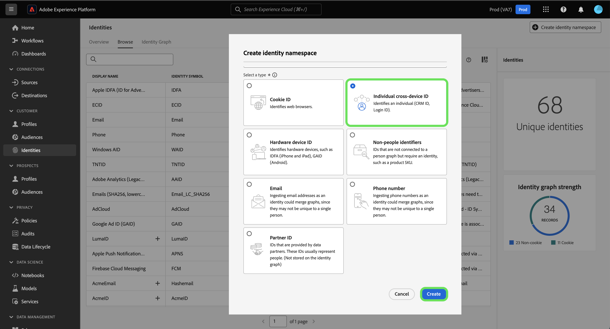

# Übersicht über Identitäts-Namespaces

Im folgenden Dokument erfahren Sie mehr über die Möglichkeiten von Identitäts-Namespaces im Adobe Experience Platform Identity Service.

## Erste Schritte

Identitäts-Namespaces erfordern ein Verständnis verschiedener Adobe Experience Platform-Dienste. Bevor Sie Namespaces nutzen, lesen Sie bitte die Dokumentation für folgende Dienste:

* [[!DNL Real-Time Customer Profile]](../profile/home.md): Bietet ein einheitliches Kundenprofil in Echtzeit, das auf aggregierten Daten aus mehreren Quellen basiert.
* [[!DNL Identity Service]](./home.md): Verschaffen Sie sich einen besseren Überblick über einzelne Kundinnen und Kunden und deren Verhalten, indem Sie Identitäten geräte- und systemübergreifend verknüpfen.
* [[!DNL Privacy Service]](../privacy-service/home.md): Identitäts-Namespaces werden in Compliance-Anfragen für gesetzliche Datenschutzbestimmungen wie die Datenschutz-Grundverordnung (DSGVO) verwendet. Jede Datenschutzanfrage wird in Bezug auf einen Namespace gestellt, um zu ermitteln, welche Verbraucherdaten betroffen sein sollen.

## Identitäts-Namespaces verstehen

Eine voll qualifizierte Identität umfasst zwei Komponenten: eine **Identitätswert** und **Identitäts-Namespace**. Wenn beispielsweise der Wert einer Identität `scott@acme.com`eingeben, stellt ein Namespace einen Kontext für diesen Wert bereit, indem er ihn als E-Mail-Adresse unterscheidet. Auf ähnliche Weise kann ein Namespace `555-123-456` als Telefonnummer und `3126ABC` als CRM-ID. Grundsätzlich gilt: **Ein Namespace stellt Kontext für eine bestimmte Identität bereit**. Beim Abgleich von Datensatzdaten über Profilfragmente hinweg, wie zum Beispiel wenn [!DNL Real-Time Customer Profile] Führt Profildaten zusammen, sowohl der Identitätswert als auch der Namespace müssen übereinstimmen.

Zwei Profilfragmente können beispielsweise unterschiedliche primäre IDs enthalten, für den Namespace &quot;E-Mail&quot;jedoch denselben Wert verwenden. Daher kann Experience Platform sehen, dass diese Fragmente eigentlich dieselbe Person sind und die Daten im Identitätsdiagramm für die Person zusammenführen.

### Komponenten eines Namespace

Ein Namespace besteht aus den folgenden Komponenten:

* **Anzeigename**: Der benutzerfreundliche Name für einen bestimmten Namespace.
* **Identitätssymbol**: Ein Code, der intern von Identity Service zur Darstellung eines Namespace verwendet wird.
* **Identitätstyp**: Die Classification eines bestimmten Namespace.
* **Beschreibung**: (Optional) Alle zusätzlichen Informationen, die Sie zu einem bestimmten Namespace bereitstellen können.

### Identitätstyp {#identity-type}

>[!CONTEXTUALHELP]
>id="platform_identity_create_namespace"
>title="Angeben des Identitätstyps"
>abstract="Der Identitätstyp bestimmt, ob Daten im Identitätsdiagramm gespeichert werden oder nicht. Identitätsdiagramme werden nicht für die folgenden Identitätstypen generiert: Identifikatoren ohne Person und Partner-ID."
>text="Learn more in documentation"

Ein Element eines Identitäts-Namespace ist die **Identitätstyp**. Der Identitätstyp bestimmt:

* Ob ein Identitätsdiagramm generiert wird:
   * Identitätsdiagramme werden nicht für die folgenden Identitätstypen generiert: Identifikatoren ohne Person und Partner-ID.
   * Identitätsdiagramme werden für alle anderen Identitätstypen generiert.
* Welche Identitäten werden aus dem Identitätsdiagramm entfernt, wenn Systembeschränkungen erreicht werden. Weitere Informationen finden Sie im Abschnitt [Limits für Identitätsdaten](guardrails.md).

Die folgenden Identitätstypen sind innerhalb von Experience Platform verfügbar:

| Identitätstyp | Beschreibung |
| --- | --- |
| Cookie ID | Cookie-IDs identifizieren Webbrowser. Diese Identitäten sind für Erweiterungen von entscheidender Bedeutung und bilden den Großteil des Identitätsdiagramms. Sie verfallen jedoch naturgemäß schnell und verlieren mit der Zeit ihren Wert. |
| Geräteübergreifende ID | Geräteübergreifende IDs identifizieren eine Person und verbinden normalerweise andere IDs miteinander. Beispiele sind eine Anmelde-ID, CRM-ID und Loyalitäts-ID. Dies deutet darauf hin, dass [!DNL Identity Service] um den Wert sensibel zu behandeln. |
| Geräte-ID | Geräte-IDs identifizieren Hardwaregeräte wie IDFA (iPhone und iPad), GAID (Android) und RIDA (Roku) und können von mehreren Personen in Haushalten gemeinsam genutzt werden. |
| E-Mail Adresse | E-Mail-Adressen sind oft mit einer einzelnen Person verknüpft und können daher zur kanalübergreifenden Identifizierung dieser Person verwendet werden. Identitäten dieser Art beinhalten personenbezogene Daten (PII). Dies deutet darauf hin, dass [!DNL Identity Service] um den Wert sensibel zu behandeln. |
| Nichtpersonenkennung | Nicht-Personen-IDs werden zum Speichern von Kennungen verwendet, die Namespaces erfordern, aber nicht mit einem Personen-Cluster verbunden sind. Beispielsweise eine Produkt-SKU, Daten, die sich auf Produkte, Organisationen oder Geschäfte beziehen. |
| Partner-ID | <ul><li>Partner-IDs sind Kennungen, die von Datenpartnern zur Darstellung von Personen verwendet werden. Partner-IDs sind häufig pseudonym, sodass die wahre Identität einer Person nicht erkennbar ist und probabilistisch sein kann. In Real-time Customer Data Platform werden Partner-IDs primär für die erweiterte Zielgruppenaktivierung und Datenanreicherung und nicht zum Erstellen von Identitätsdiagrammverknüpfungen verwendet.</li><li>Identitätsdiagramme werden nicht bei der Erfassung einer Identität generiert, die einen Identitäts-Namespace enthält, der als Partner-ID-Typ angegeben wurde.</li><li>Wenn Partnerdaten nicht mit dem Identitätstyp Partner-ID erfasst werden, können für Identity Service Systemdiagrammbeschränkungen sowie unerwünschte Profilzusammenführungen auftreten.</li><ul> |
| Telefonnummer | Telefonnummern sind häufig mit einer einzelnen Person verknüpft und können daher zur kanalübergreifenden Identifizierung dieser Person verwendet werden. Identitäten dieser Art umfassen PII. Dies deutet auf [!DNL Identity Service] um den Wert sensibel zu behandeln. |

{style="table-layout:auto"}

### Standard-Namespaces {#standard}

 Experience Platform bietet verschiedene Identitäts-Namespaces, die für alle Organisationen verfügbar sind. Diese werden als Standard-Namespaces bezeichnet und sind mithilfe der Variablen [!DNL Identity Service] API oder über die Platform-Benutzeroberfläche.

Folgende Standard-Namespaces stehen allen Organisationen in Platform zur Verfügung:

| Anzeigename | Beschreibung |
| ------------ | ----------- |
| AdCloud | Ein Namespace, der Adobe AdCloud darstellt. |
| Adobe Analytics (Legacy-ID) | Ein Namespace, der Adobe Analytics darstellt. Siehe folgendes Dokument unter [Adobe Analytics-Namespaces](https://experienceleague.adobe.com/docs/analytics/admin/data-governance/gdpr-namespaces.html?lang=en#namespaces) für weitere Informationen. |
| Apple IDFA (ID für Advertiser) | Ein Namespace, der die Apple ID für Advertiser darstellt. Weiteführende Informationen finden Sie im folgenden Dokument zu [Interessensbasierten Anzeigen](https://support.apple.com/de-de/HT202074). |
| Apple Push Notification Service | Ein Namespace, der Identitäten darstellt, die mit dem Apple Push Notification Service erfasst wurden. Siehe folgendes Dokument unter [Apple Push Notification Service](https://developer.apple.com/library/archive/documentation/NetworkingInternet/Conceptual/RemoteNotificationsPG/APNSOverview.html#//apple_ref/doc/uid/TP40008194-CH8-SW1) für weitere Informationen. |
| CORE | Ein Namespace, der Adobe Audience Manager darstellt. Auf diesen Namespace kann auch der ältere Name &quot;Adobe AudienceManager&quot;verweisen. Siehe folgendes Dokument unter [Audience Manager-IDs](https://experienceleague.adobe.com/docs/audience-manager/user-guide/overview/data-privacy/data-privacy-reference/data-privacy-ids.html?lang=en#aam-ids) für weitere Informationen. |
| ECID | Ein Namespace, der die ECID darstellt. Dieser Namespace kann auch durch die folgenden Aliase referenziert werden: „Adobe Marketing Cloud ID“, „Adobe Experience Cloud ID“, „Adobe Experience Platform ID“. Siehe folgendes Dokument unter [ECID](./ecid.md) für weitere Informationen. |
| E-Mail | Ein Namespace, der eine E-Mail-Adresse darstellt. Dieser Namespace ist häufig mit einer einzelnen Person verknüpft und kann daher zur kanalübergreifenden Identifizierung dieser Person verwendet werden. |
| E-Mails (SHA256, in Kleinbuchstaben) | Ein Namespace für vorab gehashte E-Mail-Adressen. In diesem Namespace angegebene Werte werden vor dem Hashing mit SHA256 in Kleinbuchstaben umgewandelt. Vor der Normalisierung einer E-Mail-Adresse müssen vorangestellte und nachfolgende Leerzeichen abgeschnitten werden. Diese Einstellung kann nachträglich nicht mehr geändert werden. Siehe folgendes Dokument unter [SHA-256-Hashing-Unterstützung](https://experienceleague.adobe.com/docs/id-service/using/reference/hashing-support.html?lang=de#hashing-support) für weitere Informationen. |
| Firebase Cloud Messaging | Ein Namespace, der Identitäten darstellt, die mit Google Firebase Cloud Messaging für Push-Benachrichtigungen erfasst wurden. Siehe folgendes Dokument unter [Google Firebase Cloud Messaging](https://firebase.google.com/docs/cloud-messaging) für weitere Informationen. |
| Google Ad ID (GAID) | Ein Namespace, der eine Google Advertising ID darstellt. Weiterführende Informationen finden Sie im folgenden Dokument zu [Google Advertising IDs](https://support.google.com/googleplay/android-developer/answer/6048248?hl=de). |
| Google-Klick-ID | Ein Namespace, der eine Google-Klick-ID darstellt. Siehe folgendes Dokument unter [Klick-Tracking in Google Ads](https://developers.google.com/adwords/api/docs/guides/click-tracking) für weitere Informationen. |
| Telefon | Ein Namespace, der eine Telefonnummer darstellt. Dieser Namespace ist häufig mit einer einzelnen Person verknüpft und kann daher zur kanalübergreifenden Identifizierung dieser Person verwendet werden. |
| Telefon (E.164) | Ein Namespace, der rohe Telefonnummern darstellt, die im E.164-Format gehasht werden müssen. Das E.164-Format enthält ein Pluszeichen (`+`), einer internationalen Telefonnummer, einer lokalen Ortsvorwahl und einer Telefonnummer. Beispiel: `(+)(country code)(area code)(phone number)`. |
| Telefon (SHA256) | Ein Namespace, der Telefonnummern darstellt, die mit SHA256 gehasht werden müssen. Sie müssen Symbole, Buchstaben und alle führenden Nullen entfernen. Sie müssen auch den Länderaufrufscode als Präfix hinzufügen. |
| Phone (SHA256_E.164) | Ein Namespace, der unformatierte Telefonnummern darstellt, die mit dem SHA256- und E.164-Format gehasht werden müssen. |
| TNTID | Ein Namespace, der Adobe Target darstellt. Siehe folgendes Dokument unter [Target](https://experienceleague.adobe.com/docs/target/using/target-home.html?lang=de) für weitere Informationen. |
| Windows AID | Ein Namespace, der eine Windows Advertising-ID darstellt. Siehe folgendes Dokument unter [Windows Advertising ID](https://docs.microsoft.com/en-us/uwp/api/windows.system.userprofile.advertisingmanager.advertisingid?view=winrt-19041) für weitere Informationen. |

### Anzeigen von Identitäts-Namespaces {#view-identity-namespaces}

>[!CONTEXTUALHELP]
>id="platform_identity_view_integration_identities"
>title="Anzeigen von Integrationsidentitäten"
>abstract="Integrationsidentitäten sind Namespaces, die zur Verbindung mit anderen Systemen verwendet werden. Sie werden nicht bei der Identitätsauflösung oder zum Zusammenfügen von Identitäten verwendet.   Diese Identitäten sind standardmäßig ausgeblendet. Mit dem Umschalter können Sie Integrations-Namespaces anzeigen."

Um Identitäts-Namespaces in der Benutzeroberfläche anzuzeigen, wählen Sie **[!UICONTROL Identitäten]** in der linken Navigation und wählen Sie dann **[!UICONTROL Durchsuchen]**.

Es wird ein Verzeichnis der Namespaces in Ihrer Organisation angezeigt, in dem Informationen zu ihren Namen, Identitätssymbolen, zuletzt aktualisierten Daten, entsprechenden Identitätstypen und Beschreibungen angezeigt werden.

## Benutzerdefinierte Namespaces erstellen {#create-namespaces}

Je nach den Daten und Anwendungsfällen in Ihrer Organisation benötigen Sie möglicherweise benutzerdefinierte Namespaces. Benutzerdefinierte Namespaces können mit der [[!DNL Identity Service]](./api/create-custom-namespace.md) API oder über die Benutzeroberfläche.

Um einen benutzerdefinierten Namespace zu erstellen, wählen Sie **[!UICONTROL Identitäts-Namespace erstellen]**.

Die [!UICONTROL Identitäts-Namespace erstellen] angezeigt. Zunächst müssen Sie einen Anzeigenamen und ein Identitätssymbol für den benutzerdefinierten Namespace angeben, den Sie erstellen möchten. Sie können optional auch eine Beschreibung angeben, um dem benutzerdefinierten Namespace, den Sie erstellen, mehr Kontext hinzuzufügen.

Wählen Sie anschließend den Identitätstyp aus, den Sie dem benutzerdefinierten Namespace zuweisen möchten. Klicken Sie abschließend auf **[!UICONTROL Erstellen]**.

>[!IMPORTANT]
>
>* Die von Ihnen definierten Namespaces sind für Ihre Organisation privat und erfordern ein eindeutiges Identitätssymbol, damit sie erfolgreich erstellt werden können.
>
>* Nachdem ein Namespace erstellt wurde, kann er nicht mehr gelöscht werden und sein Identitätssymbol und Typ können nicht mehr geändert werden.
>
>* Doppelte Namespaces werden nicht unterstützt. Sie können beim Erstellen eines neuen Namespace keinen vorhandenen Anzeigenamen und kein Identitätssymbol verwenden.

## Namespaces in Identitätsdaten

Die Angabe des Namespace für eine Identität hängt von der Methode ab, mit der Sie Identitätsdaten bereitstellen. Einzelheiten zur Bereitstellung von Identitätsdaten finden Sie im Abschnitt zum [Bereitstellen von Identitätsdaten](./home.md#supplying-identity-data-to-identity-service) in der Übersicht über den [!DNL Identity Service]

## Nächste Schritte

Nachdem Sie nun die Schlüsselkonzepte von Identitäts-Namespaces kennen, können Sie lernen, wie Sie mit Ihrem Identitätsdiagramm arbeiten, indem Sie die [Identitätsdiagramm-Viewer](./ui/identity-graph-viewer.md).
