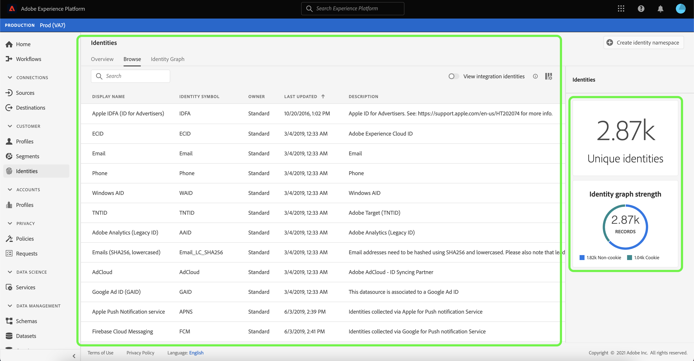

# Übersicht über Identitäts-Namespaces

Identitäts-Namespaces sind eine Komponente des [[!DNL Identity Service]](./home.md), die als Indikatoren für den Kontext dient, auf den sich eine Identität bezieht. Sie unterscheiden beispielsweise den Wert von „name@email.com“ als E-Mail-Adresse oder „443522“ als numerische CRM-ID.

## Erste Schritte

Das Verwenden von Identitäts-Namespaces setzt ein Verständnis der verschiedenen beteiligten Adobe Experience Platform-Dienste voraus. Bevor Sie Namespaces nutzen, lesen Sie bitte die Dokumentation für folgende Dienste:

- [[!DNL Real-Time Customer Profile]](../profile/home.md): Bietet ein einheitliches Kundenprofil in Echtzeit, das auf aggregierten Daten aus mehreren Quellen basiert.
- [[!DNL Identity Service]](./home.md): Verschaffen Sie sich einen besseren Überblick über einzelne Kundinnen und Kunden und deren Verhalten, indem Sie Identitäten geräte- und systemübergreifend verknüpfen.
- [[!DNL Privacy Service]](../privacy-service/home.md): Identitäts-Namespaces werden in Compliance-Anfragen für gesetzliche Datenschutzbestimmungen wie die Datenschutz-Grundverordnung (DSGVO) verwendet. Jede Datenschutzanfrage wird in Bezug auf einen Namespace gestellt, um zu ermitteln, welche Verbraucherdaten betroffen sein sollen.

## Identitäts-Namespaces verstehen

Eine vollqualifizierte Identität umfasst einen ID-Wert und einen Namespace. Beim Abgleich von Datensatzdaten über Profilfragmente hinweg, wie zum Beispiel wenn [!DNL Real-Time Customer Profile] Führt Profildaten zusammen, sowohl der Identitätswert als auch der Namespace müssen übereinstimmen.

Zwei Profilfragmente können beispielsweise unterschiedliche primäre IDs enthalten, für den Namespace &quot;E-Mail&quot;jedoch denselben Wert verwenden. [!DNL Platform] kann sehen, dass diese Fragmente tatsächlich dieselbe Person sind und die Daten im Identitätsdiagramm für die Person zusammenführen.

### Identitätstypen {#identity-types}

>[!CONTEXTUALHELP]
>id="platform_identity_create_namespace"
>title="Angeben des Identitätstyps"
>abstract="Der Identitätstyp bestimmt, ob Daten im Identitätsdiagramm gespeichert werden oder nicht. Nicht-Personen-IDs werden nicht gespeichert. Alle anderen Identitätstypen werden gespeichert."
>text="Learn more in documentation"

Daten können anhand verschiedener Identitätstypen identifiziert werden. Der Identitätstyp wird zum Zeitpunkt der Erstellung des Identitäts-Namespace angegeben und steuert, ob die Daten im Identitätsdiagramm persistiert werden oder nicht. Außerdem gibt es spezielle Anweisungen zum Umgang mit diesen Daten. Alle Identitätstypen außer **Personenidentifizierung** Gehen Sie genauso vor wie beim Zuordnen eines Namespace und des zugehörigen ID-Werts zu einem Identitätsdiagramm-Cluster. Daten werden bei Verwendung von **Personenidentifizierung**.

Die folgenden Identitätstypen sind in [!DNL Platform]:

| Identitätstyp | Beschreibung |
| --- | --- |
| Cookie ID | Cookie-IDs identifizieren Webbrowser. Diese Identitäten sind für Erweiterungen von entscheidender Bedeutung und bilden den Großteil des Identitätsdiagramms. Sie verfallen jedoch naturgemäß schnell und verlieren mit der Zeit ihren Wert. |
| Geräteübergreifende ID | Geräteübergreifende IDs identifizieren eine Person und verbinden normalerweise andere IDs miteinander. Beispiele sind eine Anmelde-ID, CRM-ID und Loyalitäts-ID. Dies deutet darauf hin, dass [!DNL Identity Service] um den Wert sensibel zu behandeln. |
| Geräte-ID | Geräte-IDs identifizieren Hardwaregeräte wie IDFA (iPhone und iPad), GAID (Android) und RIDA (Roku) und können von mehreren Personen in Haushalten gemeinsam genutzt werden. |
| E-Mail Adresse | E-Mail-Adressen sind oft mit einer einzelnen Person verknüpft und können daher zur kanalübergreifenden Identifizierung dieser Person verwendet werden. Identitäten dieser Art beinhalten personenbezogene Daten (PII). Dies deutet darauf hin, dass [!DNL Identity Service] um den Wert sensibel zu behandeln. |
| Nichtpersonenkennung | Nicht-Personen-IDs werden zum Speichern von Kennungen verwendet, die Namespaces erfordern, aber nicht mit einem Personen-Cluster verbunden sind. Beispielsweise eine Produkt-SKU, Daten, die sich auf Produkte, Organisationen oder Geschäfte beziehen. |
| Telefonnummer | Telefonnummern sind häufig mit einer einzelnen Person verknüpft und können daher zur kanalübergreifenden Identifizierung dieser Person verwendet werden. Identitäten dieser Art umfassen PII. Dies deutet darauf hin, dass [!DNL Identity Service] um den Wert sensibel zu behandeln. |

### Standard-Namespaces {#standard}

 Experience Platform bietet verschiedene Identitäts-Namespaces, die für alle Organisationen verfügbar sind. Diese werden als Standard-Namespaces bezeichnet und sind mithilfe der Variablen [!DNL Identity Service] API oder über die Platform-Benutzeroberfläche.

Folgende Standard-Namespaces stehen allen Organisationen in Platform zur Verfügung:

| Anzeigename | Beschreibung |
| ------------ | ----------- |
| AdCloud | Ein Namespace, der die Adobe AdCloud darstellt. |
| Adobe Analytics (Legacy-ID) | Ein Namespace, der Adobe Analytics darstellt. Siehe folgendes Dokument unter [Adobe Analytics-Namespaces](https://experienceleague.adobe.com/docs/analytics/admin/data-governance/gdpr-namespaces.html?lang=en#namespaces) für weitere Informationen. |
| Apple IDFA (ID für Advertiser) | Ein Namespace, der die Apple ID für Advertiser darstellt. Weiteführende Informationen finden Sie im folgenden Dokument zu [Interessensbasierten Anzeigen](https://support.apple.com/de-de/HT202074). |
| Apple Push Notification Service | Ein Namespace, der Identitäten darstellt, die mit dem Apple Push Notification Service erfasst wurden. Siehe folgendes Dokument unter [Apple Push Notification Service](https://developer.apple.com/library/archive/documentation/NetworkingInternet/Conceptual/RemoteNotificationsPG/APNSOverview.html#//apple_ref/doc/uid/TP40008194-CH8-SW1) für weitere Informationen. |
| CORE | Ein Namespace, der Adobe Audience Manager darstellt. Dieser Namespace kann auch durch seinen alten Namen referenziert werden: &quot;Adobe AudienceManager&quot;. Siehe folgendes Dokument unter [Audience Manager-IDs](https://experienceleague.adobe.com/docs/audience-manager/user-guide/overview/data-privacy/data-privacy-reference/data-privacy-ids.html?lang=en#aam-ids) für weitere Informationen. |
| ECID | Ein Namespace, der die ECID darstellt. Dieser Namespace kann auch durch die folgenden Aliase referenziert werden: „Adobe Marketing Cloud ID“, „Adobe Experience Cloud ID“, „Adobe Experience Platform ID“. Siehe folgendes Dokument unter [ECID](./ecid.md) für weitere Informationen. |
| E-Mail | Ein Namespace, der eine E-Mail-Adresse darstellt. Dieser Namespace ist häufig mit einer einzelnen Person verknüpft und kann daher zur kanalübergreifenden Identifizierung dieser Person verwendet werden. |
| E-Mails (SHA256, in Kleinbuchstaben) | Ein Namespace für vorab gehashte E-Mail-Adressen. In diesem Namespace angegebene Werte werden vor dem Hashing mit SHA256 in Kleinbuchstaben umgewandelt. Vor der Normalisierung einer E-Mail-Adresse müssen vorangestellte und nachfolgende Leerzeichen abgeschnitten werden. Diese Einstellung kann nachträglich nicht mehr geändert werden. Siehe folgendes Dokument unter [SHA-256-Hashing-Unterstützung](https://experienceleague.adobe.com/docs/id-service/using/reference/hashing-support.html?lang=de#hashing-support) für weitere Informationen. |
| Firebase Cloud Messaging | Ein Namespace, der Identitäten darstellt, die mit Google Firebase Cloud Messaging für Push-Benachrichtigungen erfasst wurden. Siehe folgendes Dokument unter [Google Firebase Cloud Messaging](https://firebase.google.com/docs/cloud-messaging) für weitere Informationen. |
| Google Ad ID (GAID) | Ein Namespace, der eine Google Advertising ID darstellt. Weiterführende Informationen finden Sie im folgenden Dokument zu [Google Advertising IDs](https://support.google.com/googleplay/android-developer/answer/6048248?hl=de). |
| Google-Klick-ID | Ein Namespace, der eine Google-Klick-ID darstellt. Siehe folgendes Dokument unter [Klick-Tracking in Google Ads](https://developers.google.com/adwords/api/docs/guides/click-tracking) für weitere Informationen. |
| Telefon | Ein Namespace, der eine Telefonnummer darstellt. Dieser Namespace ist häufig mit einer einzelnen Person verknüpft und kann daher zur kanalübergreifenden Identifizierung dieser Person verwendet werden. |
| Telefon (E.164) | Ein Namespace, der rohe Telefonnummern darstellt, die im E.164-Format gehasht werden müssen. Das E.164-Format enthält ein Pluszeichen (`+`), einer internationalen Telefonnummer, einer lokalen Ortsvorwahl und einer Telefonnummer. Beispiel: `(+)(country code)(area code)(phone number)`. |
| Telefon (SHA256) | Ein Namespace, der Telefonnummern darstellt, die mit SHA256 gehasht werden müssen. Sie müssen Symbole, Buchstaben und alle führenden Nullen entfernen. Sie müssen auch den Länderaufrufscode als Präfix hinzufügen. |
| Phone (SHA256_E.164) | Ein Namespace, der unformatierte Telefonnummern darstellt, die mit dem SHA256- und E.164-Format gehasht werden müssen. |
| TNTID | Ein Namespace, der Adobe Target darstellt. Siehe folgendes Dokument unter [Target](https://experienceleague.adobe.com/docs/target/using/target-home.html?lang=de) für weitere Informationen. |
| Windows AID | Ein Namespace, der eine Windows Advertising-ID darstellt. Siehe folgendes Dokument unter [Windows Advertising ID](https://docs.microsoft.com/en-us/uwp/api/windows.system.userprofile.advertisingmanager.advertisingid?view=winrt-19041) für weitere Informationen. |

### Anzeigen von Identitäts-Namespaces {#view-identity-namespaces}

>[!CONTEXTUALHELP]
>id="platform_identity_view_integration_identities"
>title="Anzeigen von Integrationsidentitäten"
>abstract="Integrationsidentitäten sind Namespaces, die zur Verbindung mit anderen Systemen verwendet werden. Sie werden nicht bei der Identitätsauflösung oder zum Zusammenfügen von Identitäten verwendet.   Diese Identitäten sind standardmäßig ausgeblendet. Mit dem Umschalter können Sie Integrations-Namespaces anzeigen."

Um Identitäts-Namespaces in der Benutzeroberfläche anzuzeigen, wählen Sie **[!UICONTROL Identitäten]** in der linken Navigation und wählen Sie dann **[!UICONTROL Durchsuchen]**.

Auf der Hautoberfläche der Seite wird eine Liste von Identitäts-Namespaces angezeigt, die Informationen zu ihren Namen, Identitätssymbolen, dem letzten aktualisierten Datum und dazu enthalten, ob es sich um einen Standard- oder einen benutzerdefinierten Namespace handelt. Die rechte Leiste enthält Informationen zu [!UICONTROL Stärke des Identitätsdiagramms].

Platform bietet auch Namespaces für Integrationszwecke. Diese Namespaces sind standardmäßig ausgeblendet, da sie zur Verbindung mit anderen Systemen verwendet werden und nicht zum Zuordnen von Identitäten verwendet werden. Um Integrations-Namespaces anzuzeigen, wählen Sie **[!UICONTROL Integrationsidentitäten anzeigen]**.

Wählen Sie einen Identitäts-Namespace aus der Liste aus, um Informationen zu einem bestimmten Namespace anzuzeigen. Bei Auswahl eines Identitäts-Namespace wird die Anzeige in der rechten Leiste aktualisiert, um Metadaten zum ausgewählten Identitäts-Namespace anzuzeigen, einschließlich der Anzahl der aufgenommenen Identitäten und der Anzahl fehlgeschlagener und übersprungener Datensätze.

## Verwalten benutzerdefinierter Namespaces {#manage-namespaces}

Je nach den Daten und Anwendungsfällen in Ihrer Organisation benötigen Sie möglicherweise benutzerdefinierte Namespaces. Benutzerdefinierte Namespaces können mit der [[!DNL Identity Service]](./api/create-custom-namespace.md) API oder über die Benutzeroberfläche.

Um mithilfe der Benutzeroberfläche einen benutzerdefinierten Namespace zu erstellen, navigieren Sie zum **[!UICONTROL Identitäten]** Arbeitsbereich, wählen Sie **[!UICONTROL Durchsuchen]** und wählen Sie **[!UICONTROL Identitäts-Namespace erstellen]**.

Die **[!UICONTROL Identitäts-Namespace erstellen]** angezeigt. Bereitstellen einer eindeutigen **[!UICONTROL Anzeigename]** und **[!UICONTROL Identitätssymbol]** und wählen Sie dann den Identitätstyp aus, den Sie erstellen möchten. Sie können auch eine optionale Beschreibung hinzufügen, um weitere Informationen zum Namespace hinzuzufügen. Alle Identitätstypen außer **Personenidentifizierung** folgt dem gleichen Verhalten wie beim Stitching. Wenn Sie **Personenidentifizierung** als Identitätstyp bei der Erstellung eines Namespace festgelegt ist, erfolgt keine Zuordnung. Spezifische Informationen zu den einzelnen Identitätstypen finden Sie in der Tabelle unter [Identitätstypen](#identity-types).

Klicken Sie abschließend auf **[!UICONTROL Erstellen]**.

>[!IMPORTANT]
>
>Die von Ihnen definierten Namespaces sind für Ihre Organisation privat und erfordern ein eindeutiges Identitätssymbol, damit sie erfolgreich erstellt werden können.

Ähnlich wie bei Standard-Namespaces können Sie einen benutzerdefinierten Namespace aus dem **[!UICONTROL Durchsuchen]** um die Details anzuzeigen. Mit einem benutzerdefinierten Namespace können Sie jedoch auch dessen Anzeigenamen und Beschreibung im Detailbereich bearbeiten.

>[!NOTE]
>
>Nachdem ein Namespace erstellt wurde, kann er nicht mehr gelöscht werden und sein Identitätssymbol und Typ können nicht mehr geändert werden.

## Namespaces in Identitätsdaten

Die Angabe des Namespace für eine Identität hängt von der Methode ab, mit der Sie Identitätsdaten bereitstellen. Einzelheiten zur Bereitstellung von Identitätsdaten finden Sie im Abschnitt zum [Bereitstellen von Identitätsdaten](./home.md#supplying-identity-data-to-identity-service) in der Übersicht über den [!DNL Identity Service]

## Nächste Schritte

Nachdem Sie nun die Schlüsselkonzepte von Identitäts-Namespaces kennen, können Sie lernen, wie Sie mit Ihrem Identitätsdiagramm arbeiten, indem Sie die [Identitätsdiagramm-Viewer](./ui/identity-graph-viewer.md).
