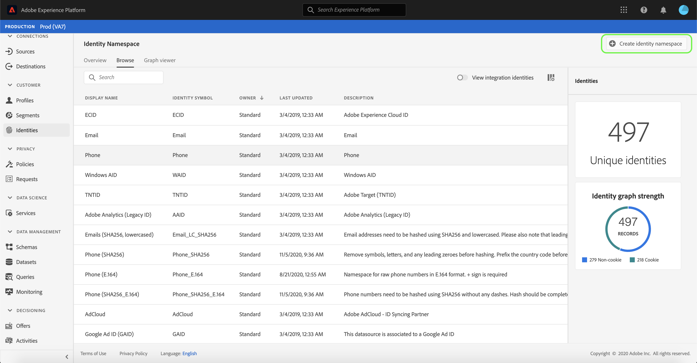

# Übersicht über Identitäts-Namespaces

Identitäts-Namespaces sind eine Komponente des [[!DNL Identity Service]](./home.md), die als Indikatoren für den Kontext dient, auf den sich eine Identität bezieht. Sie unterscheiden beispielsweise den Wert von „name@email.com“ als E-Mail-Adresse oder „443522“ als numerische CRM-ID.

## Erste Schritte

Das Verwenden von Identitäts-Namespaces setzt ein Verständnis der verschiedenen beteiligten Adobe Experience Platform-Dienste voraus. Bevor Sie Namespaces nutzen, lesen Sie bitte die Dokumentation für folgende Dienste:

- [[!DNL Real-time Customer Profile]](../profile/home.md): Bietet ein einheitliches, kundenspezifisches Profil in Echtzeit, das auf aggregierten Daten aus mehreren Quellen basiert.
- [[!DNL Identity Service]](./home.md): Sorgt für eine bessere Darstellung einzelner Kunden und deren Verhalten, indem Identitäten zwischen Geräten und Systemen überbrückt werden.
- [[!DNL Privacy Service]](../privacy-service/home.md): Identitäts-Namespaces werden zur Einhaltung der Datenschutz-Grundverordnung (DSGVO) verwendet, laut der DSGVO-Anfragen für einen Namespace gestellt werden können.

## Identitäts-Namespaces verstehen

Eine vollqualifizierte Identität umfasst einen ID-Wert und einen Namespace. Bei der Zuordnung von Datensatzdaten zu Profil-Fragmenten, z. B. wenn [!DNL Real-time Customer Profile] Profil-Daten zusammenführt, müssen sowohl der Identitätswert als auch der Namensraum übereinstimmen.

Zwei Profil-Fragmente können z. B. unterschiedliche primäre IDs enthalten, für den &quot;E-Mail&quot;-Namensraum jedoch denselben Wert verwenden. [!DNL Platform] kann daher erkennen, dass diese Fragmente tatsächlich dieselbe Person sind und die Daten im Identitätsdiagramm für die Einzelperson zusammenführen.

### Identitätstypen

Daten können anhand verschiedener Identitätstypen identifiziert werden. Der Identitätstyp wird zum Zeitpunkt der Erstellung des Identitäts-Namespace angegeben und steuert, ob die Daten im Identitätsdiagramm persistiert werden oder nicht. Außerdem gibt es spezielle Anweisungen zum Umgang mit diesen Daten. Alle Identitätstypen mit Ausnahme von **Kennung für Nicht-Personen** folgen demselben Verhalten beim Verbinden eines Namensraums und des zugehörigen ID-Werts zu einem Identitätsdiagramm-Cluster. Daten werden bei Verwendung von **Kennung eines Nichtpersonals** nicht zusammengeführt.

Die folgenden Identitätstypen sind innerhalb von [!DNL Platform] verfügbar:

| Identitätstyp | Beschreibung |
| --- | --- |
| Cookie ID | Cookie-IDs identifizieren Webbrowser. Diese Identitäten sind für Erweiterungen von entscheidender Bedeutung und bilden den Großteil des Identitätsdiagramms. Sie verfallen jedoch naturgemäß schnell und verlieren mit der Zeit ihren Wert. |
| Geräteübergreifende ID | Geräteübergreifende IDs identifizieren eine einzelne ID und verbinden normalerweise andere IDs. Beispiele sind eine Anmelde-ID, eine CRM-ID und eine Loyalität-ID. Dies ist ein Hinweis auf [!DNL Identity Service], um den Wert sensibel zu behandeln. |
| Geräte-ID | Geräte-IDs identifizieren Hardwaregeräte wie IDFA (iPhone und iPad), GAID (Android) und RIDA (Roku) und können von mehreren Personen in Haushalten gemeinsam genutzt werden. |
| E-Mail  Adresse | E-Mail-Adressen werden oft einer einzelnen Person zugeordnet und können daher für die Identifizierung dieser Person über verschiedene Kanal hinweg verwendet werden. Identitäten dieser Art beinhalten personenbezogene Daten (PII). Dies ist ein Hinweis auf [!DNL Identity Service], um den Wert sensibel zu behandeln. |
| Kennung für Nicht-Personen | Nicht-Personen-IDs werden zum Speichern von Identifikatoren verwendet, für die Namensraum erforderlich sind, die jedoch nicht mit einem Personenzentrum verbunden sind. Beispielsweise eine Produkt-SKU, Daten zu Produkten, Organisationen oder Stores. |
| Telefonnummer | Telefonnummern werden oft mit einer einzigen Person verknüpft und können daher zur Identifizierung dieser Person über verschiedene Kanal hinweg verwendet werden. Identitäten dieser Art umfassen PII. Dies ist ein Hinweis auf [!DNL Identity Service], um den Wert sensibel zu behandeln. |

### Standard-Namespaces

 Experience Platform bietet verschiedene Identitäts-Namespaces, die für alle Organisationen verfügbar sind. Diese werden als Standard-Namensraum bezeichnet und sind mit der API oder über die Plattform-Benutzeroberfläche sichtbar.[!DNL Identity Service]

Folgende Standard-Namespaces stehen allen Organisationen in Platform zur Verfügung:

| Anzeigename | Beschreibung |
| ------------ | ----------- |
| AdCloud | Ein Namensraum, der die Adobe AdCloud darstellt. |
| Adobe Analytics (Legacy-ID) | Ein Namensraum, der Adobe Analytics repräsentiert. Weitere Informationen finden Sie im folgenden Dokument unter [Adobe Analytics-Namensraum](https://experienceleague.adobe.com/docs/analytics/admin/data-governance/gdpr-namespaces.html?lang=en#namespaces). |
| Apple IDFA (ID für Werbetreibende) | Ein Namensraum, der die Apple-ID für Werbetreibende darstellt. Weitere Informationen finden Sie im folgenden Dokument zu [Interessensbasierte Anzeigen](https://support.apple.com/de-de/HT202074). |
| Apple Push-Benachrichtigungsdienst | Ein Namensraum, der Identitäten darstellt, die mit dem Apple Push Notification-Dienst erfasst wurden. Weitere Informationen finden Sie im folgenden Dokument unter [Apple Push Notification service](https://developer.apple.com/library/archive/documentation/NetworkingInternet/Conceptual/RemoteNotificationsPG/APNSOverview.html#//apple_ref/doc/uid/TP40008194-CH8-SW1). |
| CORE | Ein Namensraum, der Adobe Audience Manager repräsentiert. Dieser Namensraum kann auch durch seinen Legacy-Namen referenziert werden: &quot;Adobe AudienceManager&quot;. Weitere Informationen finden Sie im folgenden Dokument unter [Audience Manager-IDs](https://experienceleague.adobe.com/docs/audience-manager/user-guide/overview/data-privacy/data-privacy-reference/data-privacy-ids.html?lang=en#aam-ids). |
| ECID | Ein Namensraum, der die ECID darstellt. Dieser Namensraum kann auch durch folgende Aliase referenziert werden: &quot;Adobe Marketing Cloud ID&quot;, &quot;Adobe Experience Cloud ID&quot;, &quot;Adobe Experience Platform ID&quot;. Weitere Informationen finden Sie im folgenden Dokument unter [ECID](./ecid.md). |
| E-Mail  | Ein Namensraum, der eine E-Mail-Adresse darstellt. Dieser Namensraum wird oft einer einzelnen Person zugeordnet und kann daher für die Identifizierung dieser Person über verschiedene Kanäle hinweg verwendet werden. |
| E-Mails (SHA256, Kleinbuchstaben) | Ein Namensraum für eine E-Mail-Adresse mit einem Hash-Code. Die in diesem Namensraum bereitgestellten Werte werden vor dem Hashing mit SHA256 in Kleinbuchstaben umgewandelt. Vor der Normalisierung einer E-Mail-Adresse müssen Leerzeichen am Anfang und Ende abgeschnitten werden. Diese Einstellung kann nicht rückwirkend geändert werden. Weitere Informationen finden Sie im folgenden Dokument unter [SHA256 Hashing support](https://experienceleague.adobe.com/docs/id-service/using/reference/hashing-support.html?lang=en#hashing-support). |
| Firebase Cloud Messaging | Ein Namensraum, der Identitäten darstellt, die mit Google Firebase Cloud Messaging für Push-Benachrichtigungen erfasst wurden. Weitere Informationen finden Sie im folgenden Dokument unter [Google Firebase Cloud Messaging](https://firebase.google.com/docs/cloud-messaging). |
| Google Ad ID (GAID) | Ein Namensraum, der eine Google Advertising-ID darstellt. Weitere Informationen finden Sie im folgenden Dokument unter [Google Advertising ID](https://support.google.com/googleplay/android-developer/answer/6048248?hl=en). |
| Google Click-ID | Ein Namensraum, der eine Google Click-ID darstellt. Weitere Informationen finden Sie im folgenden Dokument unter [Klick-Tracking in Google Ads](https://developers.google.com/adwords/api/docs/guides/click-tracking). |
| Telefon | Ein Namensraum, der eine Telefonnummer darstellt. Dieser Namensraum wird oft einer einzelnen Person zugeordnet und kann daher für die Identifizierung dieser Person über verschiedene Kanäle hinweg verwendet werden. |
| Telefon (E.164) | Ein Namensraum, der rohe Telefonnummern darstellt, die im E.164-Format als Hashing verwendet werden müssen. Das E.164-Format enthält ein Pluszeichen (`+`), ein internationales Land, das den Code anruft, einen lokalen Gebietscode und eine Telefonnummer. Beispiel: `(+)(country code)(area code)(phone number)`. |
| Telefon (SHA256) | Ein Namensraum, der Telefonnummern darstellt, die mit SHA256 als Hash erfolgen müssen. Sie müssen Symbole, Buchstaben und alle führenden Nullen entfernen. Sie müssen auch den Länderaufrufcode als Präfix hinzufügen. |
| Telefon (SHA256_E.164) | Ein Namensraum, der rohe Telefonnummern darstellt, die im SHA256- und E.164-Format mit Hashing versehen werden müssen. |
| TNTID | Ein Namensraum, der Adobe Target repräsentiert. Weitere Informationen finden Sie im folgenden Dokument unter [Zielgruppe](https://experienceleague.adobe.com/docs/target/using/target-home.html?lang=en). |
| Windows AID | Ein Namensraum, der eine Windows-Anzeigen-ID darstellt. Weitere Informationen finden Sie im folgenden Dokument unter [Windows Advertising ID](https://docs.microsoft.com/en-us/uwp/api/windows.system.userprofile.advertisingmanager.advertisingid?view=winrt-19041). |

Um standardmäßige Namensraum in der Benutzeroberfläche Ansicht, wählen Sie im linken Navigationsbereich **[!UICONTROL Identitäten]** aus und klicken Sie dann auf die Registerkarte **[!UICONTROL Durchsuchen]**, um eine Liste der standardmäßigen Identitäts-Namensraum anzuzeigen, auf die Ihr Unternehmen zugreifen kann. Sie können die Namensraum alphabetisch nach **[!UICONTROL Anzeigename]**, **[!UICONTROL Identitätssymbol]** oder **[!UICONTROL Inhaber]** sortieren. Alternativ dazu können Sie die Namensraum chronologisch nach ihrem neuesten Aktualisierungsdatum sortieren.

Wählen Sie einen Namensraum aus, um genauere Informationen auf der rechten Leiste anzuzeigen.

>[!NOTE]
>
>Die Plattform bietet auch Namensraum für Integrationszwecke. Diese Namensraum werden standardmäßig ausgeblendet, da sie zur Verbindung mit anderen Systemen verwendet werden und nicht zum Verbinden von Identitäten verwendet werden. Um Namensraum zur Ansicht-Integration auszuwählen, wählen Sie **[!UICONTROL Ansicht-Integrationsidentitäten]**.

## Verwalten von benutzerdefinierten Namensräumen {#manage-namespaces}

Je nach den Daten und Anwendungsfällen in Ihrer Organisation benötigen Sie möglicherweise benutzerdefinierte Namespaces. Benutzerdefinierte Namensraum können mit der API oder über die Benutzeroberfläche erstellt werden.[[!DNL Identity Service]](./api/create-custom-namespace.md)

Um einen benutzerspezifischen Namensraum mithilfe der Benutzeroberfläche zu erstellen, navigieren Sie zum Arbeitsbereich **[!UICONTROL Identitäten]**, wählen Sie **[!UICONTROL Durchsuchen]** und dann **[!UICONTROL Identitäts-Namensraum erstellen]**.

Das Dialogfeld **[!UICONTROL Identität erstellen]** wird angezeigt. Geben Sie ein eindeutiges **[!UICONTROL Anzeigename]** und **[!UICONTROL Identitätssymbol]** an und wählen Sie dann den Identitätstyp, den Sie erstellen möchten. Sie können auch eine optionale Beschreibung zu weiteren Informationen über den Namensraum hinzufügen. Alle Identitätstypen mit Ausnahme von **Kennung für Nicht-Personen** folgen demselben Verhalten wie das Verbinden. Wenn Sie beim Erstellen eines Namensraums **Kennung eines Nichtpersonals** als Identitätstyp auswählen, erfolgt keine Verknüpfung. Spezifische Informationen zu jedem Identitätstyp finden Sie in der Tabelle unter [Identitätstypen](#identity-types).

Wenn Sie fertig sind, wählen Sie **[!UICONTROL Erstellen]**.

>[!IMPORTANT]
>
>Namensraum, die Sie definieren, sind für Ihr Unternehmen privat und erfordern ein eindeutiges Identitätssymbol, damit sie erfolgreich erstellt werden können.

Ähnlich wie bei standardmäßigen Namensräumen können Sie einen benutzerspezifischen Namensraum auf der Registerkarte **[!UICONTROL Durchsuchen]** auswählen, um die Details Ansicht. Mit einem benutzerdefinierten Namensraum können Sie jedoch auch den Anzeigenamen und die Beschreibung im Detailbereich bearbeiten.

>[!NOTE]
>
>Nachdem ein Namensraum erstellt wurde, kann er nicht gelöscht werden und sein Identitätssymbol und Typ können nicht mehr geändert werden.

## Namespaces in Identitätsdaten

Die Angabe des Namespace für eine Identität hängt von der Methode ab, mit der Sie Identitätsdaten bereitstellen. Einzelheiten zur Bereitstellung von Identitätsdaten finden Sie im Abschnitt zum [Bereitstellen von Identitätsdaten](./home.md#supplying-identity-data-to-identity-service) in der Übersicht über den [!DNL Identity Service]

## Nächste Schritte

Nachdem Sie die Schlüsselkonzepte von Identitätsdiagrammen verstanden haben, können Sie mit dem [Identitätsdiagramm-Viewer](./ui/identity-graph-viewer.md) lernen, wie Sie mit Ihrem Identitätsdiagramm arbeiten.
