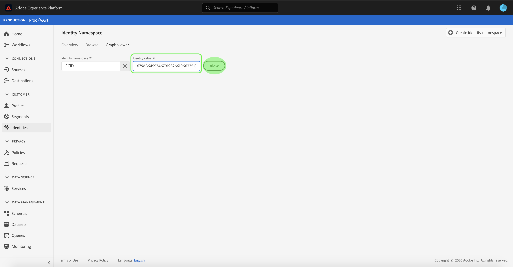
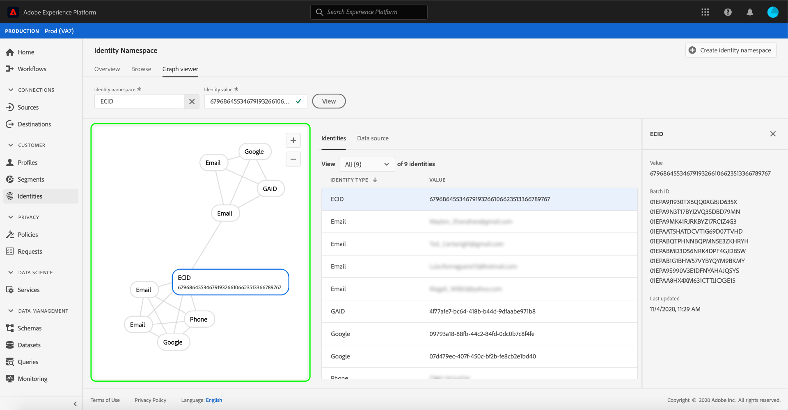
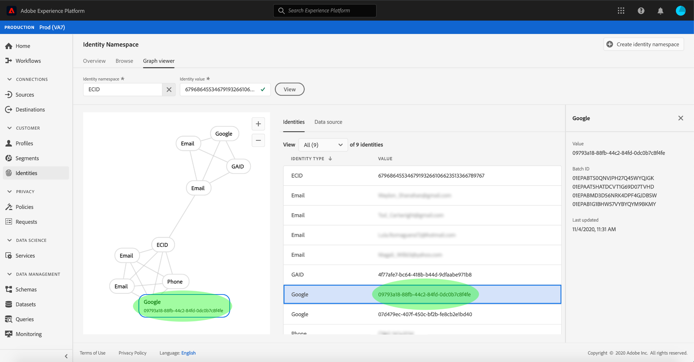
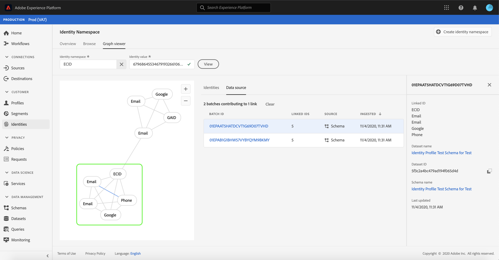
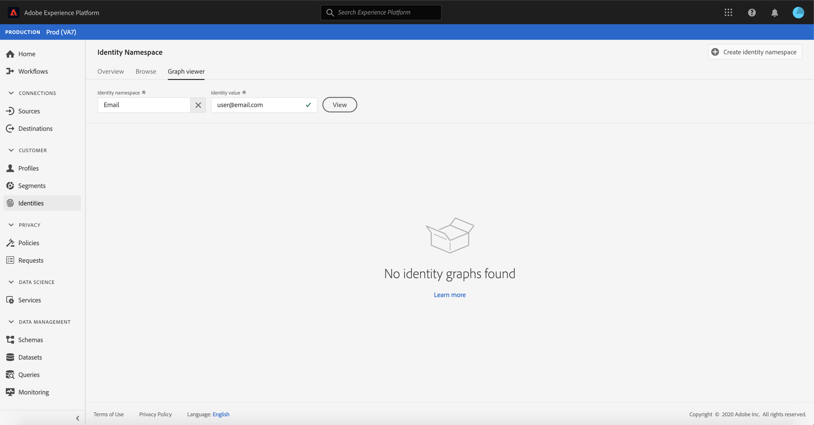

# Übersicht über den Identitätsdiagramm-Viewer

Ein Identitätsdiagramm ist eine Zusammenstellung der Beziehungen zwischen verschiedenen Identitäten eines bestimmten Kunden und bietet Ihnen eine visuelle Darstellung der Interaktion Ihres Kunden mit Ihrer Marke über verschiedene Kanal hinweg. Alle Kundenidentitätsdiagramme werden von Adobe Experience Platform Identity Service in Echtzeit verwaltet und aktualisiert, um die Aktivität der Kunden zu gewährleisten.

Mit dem Identitätsdiagramm-Viewer in der Benutzeroberfläche der Plattform können Sie visualisieren und besser verstehen, welche Kundenidentitäten zusammengeführt werden und auf welche Weise. Mit dem Viewer können Sie verschiedene Teile des Diagramms ziehen und mit ihnen interagieren. So können Sie komplexe Identitätsbeziehungen untersuchen, effizienter debuggen und von einer größeren Transparenz bei der Verwendung von Informationen profitieren.

## Tutorial

Das folgende Video soll Ihnen das Verständnis des Identitätsdiagramm-Viewers erleichtern.

>[!VIDEO](https://video.tv.adobe.com/v/331030/?quality=12&learn=on)

## Erste Schritte

Die Arbeit mit dem Identitätsdiagramm-Viewer erfordert ein Verständnis der verschiedenen beteiligten Adobe Experience Platform-Dienste. Bevor Sie mit der Arbeit mit dem Identitätsdiagramm-Viewer beginnen, lesen Sie bitte die Dokumentation für die folgenden Dienste:

- [[!DNL Identity Service]](../home.md): Sorgt für eine bessere Darstellung einzelner Kunden und deren Verhalten, indem Identitäten zwischen Geräten und Systemen überbrückt werden.

### Terminologie

- **Identität (Node):** Eine Identität oder eine Node sind Daten, die für eine Entität, normalerweise eine Person, eindeutig sind. Eine Identität besteht aus einem Namensraum und einem Identitätswert.
- **Verknüpfung (Kante):** Ein Link oder eine Kante stellt die Verbindung zwischen Identitäten dar.
- **Diagramm (Cluster):** Ein Diagramm oder ein Cluster ist eine Gruppe von Identitäten und Links, die eine Person repräsentieren.

## Zugriff auf den Identitätsdiagramm-Viewer

Um den Identitätsdiagramm-Viewer in der Benutzeroberfläche zu verwenden, wählen Sie **[!UICONTROL Identities]** in der linken Navigation und dann die Registerkarte **[!UICONTROL Identitätsdiagramm]**. Klicken Sie im Bildschirm **[!UICONTROL Identity Namensraum]** auf das Symbol **[!UICONTROL Identität auswählen]**, um nach dem Namensraum zu suchen, den Sie verwenden möchten.

Das Bedienfeld **[!UICONTROL Identität auswählen]** wird angezeigt. Dieser Bildschirm enthält eine Liste von Namensräumen, die für Ihr Unternehmen zur Verfügung stehen, einschließlich Informationen zu den folgenden Elementen: **[!UICONTROL Anzeigename]**, **[!UICONTROL Identitätssymbol]**, **[!UICONTROL Inhaber]**, **[!UICONTROL Letzte Aktualisierung]** und **[!UICONTROL Beschreibung]**. Sie können einen beliebigen Namensraum verwenden, sofern ein gültiger Identitätswert mit ihm verbunden ist.

Wählen Sie den gewünschten Namensraum aus und klicken Sie auf **[!UICONTROL Wählen Sie]**, um fortzufahren.

Wenn Sie einen Namensraum ausgewählt haben, geben Sie den entsprechenden Kundenwert in das Textfeld **[!UICONTROL Identitätswert]** ein und wählen Sie **[!UICONTROL Ansicht]**.

### Zugriff auf den Identitätsdiagramm-Viewer von Datasets

Sie können auch über die DataSets-Oberfläche auf den Identitätsdiagramm-Viewer zugreifen. Wählen Sie auf der Seite &quot;Datensätze [!UICONTROL Durchsuchen]&quot;einen Datensatz, mit dem Sie interagieren möchten, und wählen Sie **[!UICONTROL Vorschau-Datensatz]**.

Wählen Sie im Fenster &quot;Vorschau&quot;ein Fingerabdrucksymbol aus, um die Identitäten im Identitätsdiagramm-Viewer anzuzeigen.

>[!TIP]
>
>Das Symbol &quot;Fingerabdruck&quot;wird nur angezeigt, wenn der Datensatz zwei oder mehr Identitäten aufweist.

Der Identitätsdiagramm-Viewer wird angezeigt. Auf der linken Seite des Bildschirms befindet sich das Identitätsdiagramm mit allen Identitäten, die mit dem ausgewählten Namensraum verknüpft sind, sowie dem eingegebenen Identitätswert. Jeder Identitätsknoten besteht aus einem Namensraum und dem zugehörigen ID-Wert. Sie können eine beliebige Identität auswählen und halten, um das Diagramm zu ziehen und mit ihm zu interagieren. Alternativ können Sie den Mauszeiger über eine Identität bewegen, um Informationen zum ID-Wert anzuzeigen. Die Diagrammausgabe wird auch als eingebrachte Liste in der Mitte des Bildschirms angezeigt.

>[!IMPORTANT]
>
>Ein Identitätsdiagramm erfordert mindestens zwei verknüpfte Identitäten sowie ein gültiges Namensraum- und ID-Paar. Die maximale Anzahl von Identitäten, die der Diagramm-Viewer anzeigen kann, beträgt 150. Weitere Informationen finden Sie im Abschnitt [Anhang](#appendix).

Wählen Sie eine Identität aus, um die hervorgehobene Zeile in der Tabelle **[!UICONTROL Identities]** zu aktualisieren und die Informationen in der rechten Leiste zu aktualisieren. Dazu gehören **[!UICONTROL Wert]**, **[!UICONTROL Stapel-ID]** und das **[!UICONTROL Letzte aktualisierte]** Datum.

Mit der Sortieroption über der Tabelle **[!UICONTROL Identities]** können Sie durch ein Diagramm filtern und einen bestimmten Namensraum isolieren. Wählen Sie im Dropdownmenü den Namensraum aus, den Sie markieren möchten.

Der Diagramm-Viewer gibt den ausgewählten Namensraum wieder. Mit der Filteroption wird auch die Tabelle **[!UICONTROL Identities]** aktualisiert, sodass nur Informationen für den ausgewählten Namensraum zurückgegeben werden.

Die obere rechte Ecke des Diagrammansichtsfelds enthält Optionen zur Vergrößerung. Wählen Sie das Symbol **(+)**, um in das Diagramm zu zoomen, oder das Symbol **(-)**, um es auszuzoomen.

Sie können weitere Informationen zu Stapeln durch Auswahl von **[!UICONTROL Datenquelle]** in der Kopfzeile Ansicht haben. Die Tabelle **[!UICONTROL Datenquelle]** zeigt eine Liste von **[!UICONTROL Stapel-IDs]**, die mit dem Diagramm verknüpft sind, sowie deren **[!UICONTROL Verknüpfte IDs]**, Quell-Schema und das Erfassungsdatum.

Sie können einen der Links in einem Identitätsdiagramm auswählen, um alle Quellstapel anzuzeigen, die zu dem Link beigetragen haben.

Alternativ können Sie einen Stapel auswählen, um alle Links anzuzeigen, zu denen dieser Stapel beigetragen hat.

Identitätsdiagramme mit größeren Gruppen von Identitäten können auch über den Identitätsdiagramm-Viewer aufgerufen werden.

## Anhang

Im folgenden Abschnitt finden Sie weitere Informationen zum Arbeiten mit dem Identitätsdiagramm-Viewer.

### Fehlermeldungen

Fehler können beim Zugriff auf den Identitätsdiagramm-Viewer auftreten. Im Folgenden finden Sie eine Liste der Voraussetzungen und Einschränkungen, die beim Arbeiten mit dem Identitätsdiagramm-Viewer zu beachten sind.

- Im ausgewählten Namensraum muss ein Identitätswert vorhanden sein.
- Für den Identitätsdiagramm-Viewer sind mindestens zwei verknüpfte Identitäten erforderlich. Es ist möglich, dass es nur einen Identitätswert und keine verknüpften Identitäten gibt. In diesem Fall wäre der Wert nur im Viewer [!DNL Profile] vorhanden.
- Der Identitätsdiagramm-Viewer darf nicht länger als 150 Identitäten sein.

## Nächste Schritte

Durch Lesen dieses Dokuments haben Sie gelernt, wie Sie die Identitätsdiagramme Ihrer Kunden in der Plattform-Benutzeroberfläche erkunden können. Weitere Informationen zu Identitäten in der Plattform finden Sie unter [Übersicht über den Identitätsdienst](../home.md)

## Änderungsprotokoll

| Datum | Aktion |
| ---- | ------ |
| 2021-01 | <ul><li>Unterstützung für Streaming von erfassten Daten und Nicht-Produktions-Sandbox hinzugefügt.</li><li>Geringfügige Fehlerbehebungen.</li></ul> |
| 2021-02 | <ul><li>Der Identitätsdiagramm-Viewer wird über die DataSet-Vorschau zugänglich gemacht.</li><li>Geringfügige Fehlerbehebungen.</li><li>Der Identitätsdiagramm-Viewer ist im Allgemeinen verfügbar.</li></ul> |
