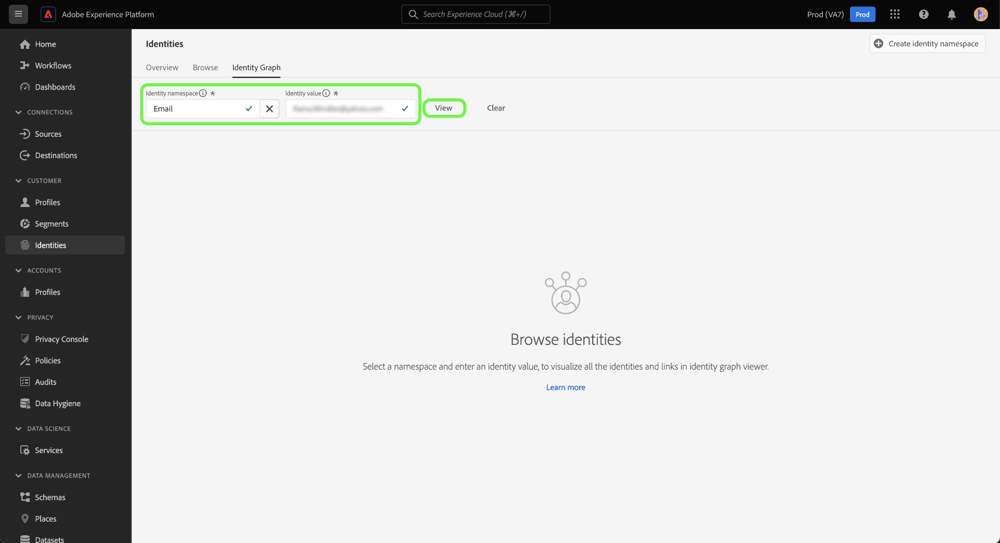

# Identitätsdiagramm-Viewer

Ein Identitätsdiagramm ist eine Zusammenstellung der Beziehungen zwischen verschiedenen Identitäten für einen bestimmten Kunden und bietet Ihnen eine visuelle Darstellung, wie Ihr Kunde über verschiedene Kanäle hinweg mit Ihrer Marke interagiert. Alle Identitätsdiagramme werden von Adobe Experience Platform Identity Service bei Kundenaktivität nahezu in Echtzeit verwaltet und aktualisiert.

Mit dem Identitätsdiagramm-Viewer in der Benutzeroberfläche von Platform können Sie visualisieren und besser verstehen, welche Kundenidentitäten zusammengeführt werden und auf welche Weise. Mit dem Viewer können Sie verschiedene Teile des Diagramms per Drag-and-drop verschieben und mit ihnen interagieren, sodass Sie komplexe Identitätsbeziehungen untersuchen, Fehler effizient beheben und von einer erhöhten Transparenz bei der Verwendung von Informationen profitieren können. 

Das folgende Dokument enthält Schritte zum Zugreifen auf und Verwenden des Identitätsdiagramm-Viewers in der Platform-Benutzeroberfläche.

## Anleitungsvideo

Das folgende Video soll Ihr Verständnis des Identitätsdiagramm-Viewers unterstützen.

>[!VIDEO](https://video.tv.adobe.com/v/331030/?quality=12&learn=on)

## Erste Schritte

Die Arbeit mit dem Identitätsdiagramm-Viewer erfordert ein Verständnis der verschiedenen beteiligten Adobe Experience Platform-Dienste. Bevor Sie mit dem Identitätsdiagramm-Viewer arbeiten, lesen Sie bitte die Dokumentation für die folgenden Dienste:

- [[!DNL Identity Service]](../home.md): Verschaffen Sie sich einen besseren Überblick über einzelne Kundinnen und Kunden und deren Verhalten, indem Sie Identitäten geräte- und systemübergreifend verknüpfen.
- [Echtzeit-Kundenprofil](../../profile/home.md): Identitätsdiagramme werden vom Echtzeit-Kundenprofil genutzt, um eine umfassende und einzigartige Ansicht Ihrer Kundenattribute und -verhalten zu erstellen.

### Terminologie

- **Identität (Knoten):** Eine Identität oder ein Knoten sind Daten, die für eine Entität, normalerweise eine Person, eindeutig sind. Eine Identität besteht aus einem Identitäts-Namespace und einem Identitätswert. Eine vollständig qualifizierte Identität könnte beispielsweise aus einem Identitäts-Namespace für **Email**, kombiniert mit dem Identitätswert von **robin@email.com**.
- **Verknüpfung (Kante):** Ein Link oder ein Edge stellt die Verbindung zwischen Identitäten dar. Identitätslinks enthalten Eigenschaften wie zum Beispiel die ersten und zuletzt aktualisierten Zeitstempel. Der erste festgelegte Zeitstempel definiert das Datum und die Uhrzeit, zu der eine neue Identität mit einer vorhandenen Identität verknüpft wird. Der letzte aktualisierte Zeitstempel definiert das Datum und die Uhrzeit der letzten Aktualisierung eines vorhandenen Identitätslinks.
- **Diagramm (Cluster):** Ein Diagramm oder ein Cluster ist eine Gruppe von Identitäten und Links, die eine Person repräsentieren.

## Zugriff auf den Identitätsdiagramm-Viewer {#access-identity-graph-viewer}

Wählen Sie in der Platform-Benutzeroberfläche die Option **[!UICONTROL Identitäten]** in der linken Navigation und wählen Sie dann **[!UICONTROL Identitätsdiagramm]** aus der Liste der Registerkarten in der Kopfzeile.

Um ein Identitätsdiagramm anzuzeigen, geben Sie einen Identitäts-Namespace und den zugehörigen Wert ein und wählen Sie **[!UICONTROL Ansicht]**.

>[!TIP]
>
>Tabellensymbol auswählen  um ein Bedienfeld mit einer Liste aller in Ihrem Unternehmen verfügbaren Identitäts-Namespaces anzuzeigen. Sie können einen beliebigen Identitäts-Namespaces verwenden, solange ein gültiger Identitätswert mit ihm verbunden ist. Weitere Informationen finden Sie im Abschnitt [Identitäts-Namespace-Handbuch](../namespaces.md).

## Grundlegendes zur Viewer-Oberfläche für Identitätsdiagramme

Die Viewer-Oberfläche für Identitätsdiagramme besteht aus mehreren Elementen, mit denen Sie Ihre Identitätsdaten besser verstehen und verwenden können.

Das Identitätsdiagramm zeigt alle Identitäten an, die mit dem von Ihnen eingegebenen Identitäts-Namespace und der von Ihnen eingegebenen Wertkombination verknüpft sind. Jeder Knoten besteht aus einem Identitäts-Namespace und dem zugehörigen Wert. Sie können jeden Knoten auswählen, halten und ziehen, um mit dem Diagramm zu interagieren. Alternativ können Sie den Mauszeiger über einen Knoten bewegen, um Informationen zum zugehörigen Identitätswert anzuzeigen. Auswählen **[!UICONTROL Diagramm anzeigen]** um das Diagramm ein- oder auszublenden.

>[!IMPORTANT]
>
>Ein Identitätsdiagramm erfordert die Generierung von mindestens zwei verknüpften Identitäten sowie eine gültige Identitäts-Namespace- und Wertkombination. Die maximale Anzahl von Identitäten, die der Diagramm-Viewer anzeigen kann, beträgt 150. Siehe [Anhang](#appendix) unten für weitere Informationen.

Wählen Sie einen Link im Diagramm aus, um den Datensatz und die Batch-Kennung anzuzeigen, die zu diesem Link beitragen. Durch die Auswahl eines Links wird auch die rechte Leiste aktualisiert, um weitere Informationen zu Datenquellendetails sowie Eigenschaften wie zum Beispiel erstmalig eingerichtete und zuletzt aktualisierte Zeitstempel bereitzustellen.

Die [!UICONTROL Identitäten] bietet eine andere Ansicht Ihrer Identitätsdaten und listet den Identitäts-Namespace und die Kombination der Identitätswerte in einem tabellarischen Format auf. Durch die Auswahl eines Knotens im Diagramm wird das hervorgehobene Zeilenelement im [!UICONTROL Identitäten] Tabelle.

Verwenden Sie das Dropdown-Menü, um die Diagrammdaten zu sortieren und Informationen zu einem bestimmten Identitäts-Namespace hervorzuheben. Wählen Sie beispielsweise **[!UICONTROL Email]** aus dem Menü, um die für den E-Mail-Identitäts-Namespace spezifischen Daten anzuzeigen.

Die rechte Leiste zeigt Informationen zu einer ausgewählten Identität an, einschließlich des zuletzt aktualisierten Zeitstempels. Die rechte Leiste zeigt außerdem Informationen zur Datenquelle an, die der ausgewählten Identität entspricht, einschließlich Batch-Kennung, Datensatzname, Datensatz-ID und Schemaname.

Die folgende Tabelle enthält zusätzliche Informationen zu den Datenquelleneigenschaften, die in der rechten Leiste angezeigt werden:

| Datenquelle | Beschreibung |
| --- | --- | 
| Batch-ID | Die automatisch generierte Kennung, die Ihren Batch-Daten entspricht. |
| Datensatz-ID | Die automatisch generierte Kennung, die Ihrem Datensatz entspricht. |
| Datensatzname | Der Name des Datensatzes, der Ihre Batch-Daten enthält. |
| Schemaname | Der Name des Schemas. Das Schema bietet einen Regelsatz, der die Struktur und das Format der Daten darstellt und validiert. |

Sie können auch die *[!UICONTROL Datenquelle]* um eine Liste der Datenquellen anzuzeigen, die zu Ihren Identitäten beitragen. Auswählen [!UICONTROL Datenquelle] für eine tabellarische Ansicht Ihrer Datensätze und Batch-IDs.

Mit dem Schieberegler können Sie Diagrammdaten nach dem Zeitpunkt filtern, zu dem Identitäten zum ersten Mal ermittelt wurden. Standardmäßig zeigt der Identitätsdiagramm-Viewer alle Identitäten an, die mit dem Diagramm verknüpft sind. Halten Sie den Schieberegler gedrückt, um die Zeit an den letzten Zeitstempel anzupassen, mit dem eine neue Identität mit dem Diagramm verknüpft wurde. Im folgenden Beispiel zeigt das Diagramm an, dass der letzte Identitätslink (GAID) auf **[!UICONTROL 19.8.2020, 4:29:14:00 Uhr]**.

Passen Sie den Schieberegler an, um zu sehen, dass ein anderer Identitätslink (E-Mail) eingerichtet wurde auf **[!UICONTROL 19.8.2020, 4:25:150 Uhr]**.

Sie können den Schieberegler auch so einstellen, dass er die früheste Iteration des Diagramms anzeigt. Im folgenden Beispiel zeigt der Identitätsdiagramm-Viewer an, dass das Diagramm zuerst in **[!UICONTROL 19.8.2020, 4:11:16 Uhr]**, wobei die ersten Links ECID, E-Mail und Telefon sind.

## Anhang

Im folgenden Abschnitt finden Sie zusätzliche Informationen zum Arbeiten mit dem Identitätsdiagramm-Viewer.

### Grundlagen zu Fehlermeldungen

Beim Zugriff auf den Identitätsdiagramm-Viewer können Fehler auftreten. Im Folgenden finden Sie eine Liste von Voraussetzungen und Einschränkungen, die bei der Arbeit mit dem Identitätsdiagramm-Viewer zu beachten sind.

- Im ausgewählten Namespace muss ein Identitätswert vorhanden sein.
- Der Identitätsdiagramm-Viewer erfordert mindestens zwei verknüpfte Identitäten, die generiert werden müssen. Es ist möglich, dass es nur einen Identitätswert und keine verknüpften Identitäten gibt. In diesem Fall würde der Wert nur in [!DNL Profile] Viewer.
- Der Identitätsdiagramm-Viewer darf die maximal 150 Identitäten nicht überschreiten.

### Zugriff auf den Identitätsdiagramm-Viewer aus Datensätzen

Sie können auch über die Oberfläche für Datensätze auf den Viewer für Identitätsdiagramme zugreifen. Aus den Datensätzen [!UICONTROL Durchsuchen] , wählen Sie einen Datensatz aus, mit dem Sie interagieren möchten, und klicken Sie auf **[!UICONTROL Vorschau des Datensatzes anzeigen]**

Wählen Sie im Vorschaufenster ein Fingerabdrucksymbol aus, um die Identitäten anzuzeigen, die durch den Identitätsdiagramm-Viewer dargestellt werden.

>[!TIP]
>
>Das Symbol &quot;Fingerabdruck&quot;wird nur angezeigt, wenn der Datensatz zwei oder mehr Identitäten aufweist.

## Nächste Schritte

Durch Lesen dieses Dokuments haben Sie erfahren, wie Sie die Identitätsdiagramme Ihrer Kunden in der Platform-Benutzeroberfläche untersuchen. Weiterführende Informationen zu Identitäten in Platform finden Sie im Abschnitt [Identity Service - Übersicht](../home.md)

## Änderungsprotokoll

| Datum | Aktion |
| ---- | ------ |
| 2021-01 | <ul><li>Unterstützung für Streaming von erfassten Daten und Nicht-Produktions-Sandbox hinzugefügt.</li><li>Geringfügige Fehlerbehebungen.</li></ul> |
| 2021-02 | <ul><li>Der Identitätsdiagramm-Viewer wird über die Datensatzvorschau verfügbar gemacht.</li><li>Geringfügige Fehlerbehebungen.</li><li>Der Identitätsdiagramm-Viewer wird allgemein verfügbar gemacht.</li></ul> |
| 2023-01 | <ul><li>Aktualisierungen der Benutzeroberfläche.</li></ul> |
