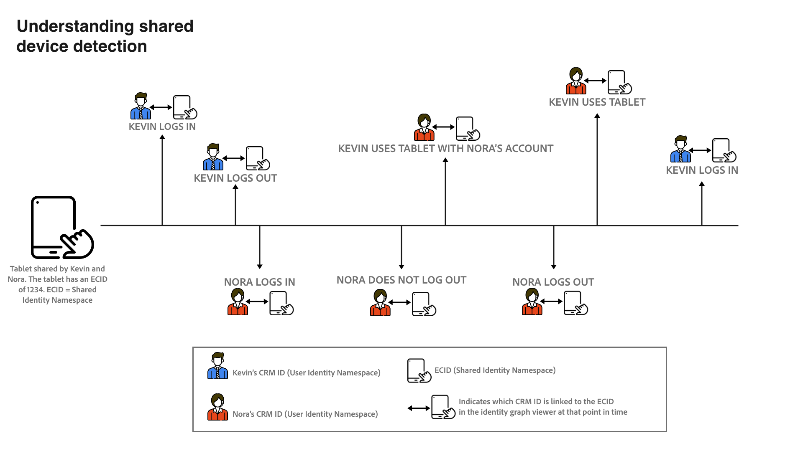

# Übersicht über die Erkennung freigegebener Geräte (Beta)

>[!IMPORTANT]
>
>Die [!DNL Shared Device Detection] -Funktion ist in der Beta-Phase. Ihre Funktionen und Dokumentation können sich ändern.

Adobe Experience Platform [!DNL Identity Service] hilft Ihnen, sich einen besseren Überblick über Ihre Kunden und ihr Verhalten zu verschaffen, indem Identitäten geräte- und systemübergreifend zusammengeführt werden. So können Sie in Echtzeit für effektive und persönliche digitale Erlebnisse sorgen.

[!DNL Shared Device] bezeichnet Geräte, die von mehr als einer Person verwendet werden. Beispiele für gemeinsam genutzte Geräte sind Tablets, Bibliothekscomputer und Kiosks. Durch die [!DNL Shared Device Detection] -Funktion kann verhindert werden, dass verschiedene Benutzer desselben Geräts mit einer Identität zusammengeführt werden, wodurch eine genauere Darstellung einer Person ermöglicht wird.

Mit [!DNL Shared Device Detection] können Sie:

* Erstellen Sie separate Identitätsdiagramme für verschiedene Benutzer desselben Geräts.
* Verhindern der Vermischung von Daten verschiedener Personen mit demselben Gerät;
* Erstellen Sie eine sauberere und genauere Ansicht Ihrer Kunden.

>[!TIP]
>
>Konfigurationen für [!DNL Shared Device Detection] müssen vor der Aktivierung von Profil für Datensatz ausgefüllt werden, da Sie die Einstellungen nach der Erstellung von Diagrammen in nicht mehr ändern können. [!DNL Identity Service].

## Erste Schritte mit [!DNL Shared Device Detection]

Arbeiten mit [!DNL Shared Device Detection] erfordert ein Verständnis der verschiedenen beteiligten Platform-Dienste. Vorbereitung [!DNL Shared Device Detection]lesen Sie bitte die Dokumentation für die folgenden Dienste:

* [[!DNL Identity Service]](../home.md): Verschaffen Sie sich einen besseren Überblick über einzelne Kundinnen und Kunden und deren Verhalten, indem Sie Identitäten geräte- und systemübergreifend verknüpfen.
   * [Identitätsdiagramm-Viewer](./identity-graph-viewer.md): Visualisieren Sie den Identitätsdiagramm-Viewer und interagieren Sie mit ihm, um besser zu verstehen, wie Kundenidentitäten zusammengeführt werden und auf welche Weise.
   * [Identitäts-Namespaces](../namespaces.md): Sehen Sie sich die Komponenten einer vollständig qualifizierten Identität an und erfahren Sie, wie Sie mithilfe von Identitäts-Namespaces den Kontext und den Typ einer Identität unterscheiden können.

## Grundlagen zu [!DNL Shared Device Detection]

Bei der Arbeit mit
[!DNL Shared Device Detection]. Die nachstehende Tabelle enthält eine Liste der Begriffe, die für das Verständnis von [!DNL Shared Device Detection].

### Terminologie

| Begriffe | Definition |
| --- | --- |
| Freigegebenes Gerät | Ein freigegebenes Gerät ist ein Gerät, das von mehr als einer Person verwendet wird. Beispiele für gemeinsam genutzte Geräte sind Tablets, Bibliothekscomputer und Kiosks. |
| [!DNL Shared Device Detection] | [!DNL Shared Device Detection] bezieht sich auf eine Konfigurationseinstellung, mit der Daten verschiedener Benutzer desselben Geräts voneinander getrennt werden können. |
| Freigegebener Identitäts-Namespace | Der Shared Identity-Namespace stellt das Gerät dar, das von mehreren Benutzern verwendet werden kann. Der freigegebene Identitäts-Namespace ist normalerweise die ECID, kann jedoch auf andere Geräte-IDs festgelegt werden. |
| Benutzeridentitäts-Namespace | Der User Identity-Namespace stellt den authentifizierten (angemeldeten) Benutzer eines gemeinsam genutzten Geräts dar. |
| Letzter authentifizierter Benutzer | Der zuletzt authentifizierte Benutzer stellt den Benutzer dar, der zuletzt bei einem Gerät angemeldet war, wenn ein Gerät von mehreren Konten angemeldet wird. |

{style="table-layout:auto"}

[!DNL Shared Device Detection] erstellt zwei Namespaces: die **Freigegebener Identitäts-Namespace** und **Benutzeridentitäts-Namespace**.

* Der Shared Identity-Namespace stellt das Gerät dar, das von mehreren Benutzern verwendet werden kann. Adobe empfiehlt Kunden, ECID als gemeinsam genutzten Gerätebezeichner zu verwenden.
* Der Benutzer-Identitäts-Namespace wird dem Identitäts-Namespace zugeordnet, der der Anmelde-ID eines Benutzers entspricht. Dabei kann es sich um die CRM-ID eines Benutzers, die E-Mail-Adresse, die gehashte E-Mail-Adresse oder Telefonnummer handeln.

Ein gemeinsam genutztes Gerät, wie ein Tablet, verfügt über eine **Freigegebener Identitäts-Namespace**. Andererseits hat jeder Benutzer eines gemeinsam genutzten Geräts seine eigene **Benutzeridentitäts-Namespace** , die ihren jeweiligen Anmelde-IDs entspricht. Beispielsweise verfügt ein Tablet, das Kevin und Nora für die Verwendung im E-Commerce freigeben, über eine eigene ECID von `1234`, während Kevin über einen eigenen Benutzer-Identitäts-Namespace verfügt, der seinem `kevin@email.com` -Konto und Nora hat ihren eigenen Benutzer-Identitäts-Namespace zugeordnet `nora@email.com` -Konto.

[!DNL Shared Device Detection] kann zwischen mehreren Benutzern desselben Geräts unterscheiden, indem der freigegebene Identitäts-Namespace (z. B. ECID) mit dem zuletzt authentifizierten Benutzer-Identitäts-Namespace (Anmelde-ID).

### Senden von Identitätsdaten an ein Identitätsdiagramm

Im folgenden Beispiel erfahren Sie, wie Sie [!DNL Shared Device Detection] funktioniert:

>[!NOTE]
>
>In diesem Diagramm ist der Freigegebene Identitäts-Namespace für ECID und der Benutzer-Identitäts-Namespace für CRM-ID konfiguriert.

* Kevin und Nora teilen sich ein Tablet, um eine E-Commerce-Website zu besuchen. Sie verfügen jedoch beide über eigene unabhängige Konten, die sie jeweils verwenden, um online zu surfen und einzukaufen.
   * Als freigegebenes Gerät verfügt das Tablet über eine entsprechende ECID, die die Cookie-ID des Tablet-Webbrowsers darstellt.
* Nehmen wir an, Kevin verwendet die Tablette und **anmelden** auf sein E-Commerce-Konto, um nach Kopfhörern zu suchen, bedeutet dies, dass Kevins CRM-ID (**Benutzeridentitäts-Namespace**) ist nun mit der ECID des Tablets (**Freigegebener Identitäts-Namespace**). Die Browserdaten des Tablets sind jetzt in Kevins Identitätsdiagramm integriert.
   * Wenn Kevin **Abmelden** und Nora verwendet die Tablette und **anmelden** auf ihr eigenes Konto zugreifen und eine Kamera kaufen, dann ist ihre CRM-ID jetzt mit der ECID des Tablets verknüpft. Daher sind die Browserdaten des Tablets jetzt in das Identitätsdiagramm von Nora integriert.
   * Wenn Nora **meldet sich nicht ab** und Kevin verwenden die Tablette, aber **meldet sich nicht an**, sind die Browserdaten des Tablets weiterhin in Nora integriert, da sie als authentifizierter Benutzer verbleibt und ihre CRM-ID weiterhin mit der ECID des Tablets verknüpft ist.
   * Wenn Nora **meldet sich ab** und Kevin verwenden die Tablette, aber **meldet sich nicht an**, dann sind die Browserdaten des Tablets weiterhin in das Identitätsdiagramm von Nora integriert, da als **zuletzt authentifizierter Benutzer**, bleibt die CRM-ID mit der ECID des Tablets verknüpft.
   * Wenn Kevin **anmelden** erneut verwendet wird, wird die CRM-ID nun mit der ECID des Tablets verknüpft, da er nun der letzte authentifizierte Benutzer ist und die Browserdaten des Tablets jetzt in sein Identitätsdiagramm integriert sind.

### How [!DNL Profile Service] führt Profilfragmente mit zusammen [!DNL Shared Device Detection] enabled

[!DNL Profile Service] nimmt Profilfragmente und zusammengeführte Profile zur Kenntnis. Jedes einzelne Kundenprofil besteht aus mehreren Profilfragmenten, die zu einer einzigen Ansicht dieses Kunden zusammengefügt wurden. Wenn ein Kunde beispielsweise über mehrere Kanäle mit Ihrer Marke interagiert, verfügt Ihr Unternehmen über mehrere Profilfragmente, die sich auf diesen einzelnen Kunden beziehen und in mehreren Datensätzen enthalten sind. Wenn diese Fragmente in Platform aufgenommen werden, werden sie zusammengeführt, sodass ein zentrales Profil für diesen Kunden entsteht.

Wann [!DNL Shared Device Detection] aktiviert ist, [!DNL Profile] definiert die primäre Identität des Profilfragments basierend darauf, ob das Erlebnisereignis authentifiziert oder nicht authentifiziert ist.

Ein **authentifiziertes Erlebnisereignis** ist eine Aktion, die von einem Benutzer bei der Anmeldung auf einem Gerät abgeschlossen wird. Bei authentifizierten Erlebnisereignissen ist die primäre Identität die **Benutzeridentitäts-Namespace** (Anmelde-ID). Ein **nicht authentifiziertes Erlebnisereignis** ist eine Aktion, die von einem Benutzer abgeschlossen wird, der nicht bei einem Gerät angemeldet ist. Bei nicht authentifizierten Erlebnisereignissen ist die primäre Identität die **Freigegebener Identitäts-Namespace** (ECID).

Weiterführende Informationen finden Sie in der [[!DNL Real-Time Customer Profile] Übersicht](../../profile/home.md).

## Benutzeroberfläche für freigegebene Geräte

Wählen Sie in der Platform-Benutzeroberfläche die Option **[!UICONTROL Identitäten]** aus der linken Navigation und wählen Sie dann **[!UICONTROL Identitätseinstellungen]**.

Die [!UICONTROL Einstellungen für freigegebene Geräte] angezeigt werden. Sie erhalten eine Oberfläche zum Konfigurieren der Einstellungen für freigegebene Geräte für Ihre Daten. Die Einstellungen für freigegebene Geräte sind standardmäßig deaktiviert.

Wenn diese Option aktiviert ist, können Daten von verschiedenen Benutzern desselben Geräts voneinander getrennt werden. Diese Konfigurationseinstellung ermöglicht eine sauberere und genauere Darstellung von Identitätsdiagrammen, bei denen Benutzeridentitäten desselben Geräts nicht miteinander kombiniert werden.

Auswählen **[!UICONTROL Aktivieren]** , um Ihre Einstellungen für freigegebene Geräte zu ändern.

Die [!UICONTROL Freigegebener Identitäts-Namespace] und [!UICONTROL Benutzeridentitäts-Namespace] Konfigurationsoptionen angezeigt, mit denen Sie die gewünschten Identitäts-Namespaces ändern können.

[!UICONTROL Freigegebener Identitäts-Namespace] stellt ein einzelnes Gerät dar, das von mehreren verschiedenen Benutzern verwendet wird. Dieser Namespace ist immer auf **[!UICONTROL ECID]** weil alle Platform-Benutzer **[!UICONTROL ECID]** als Webbrowser-Kennung.

Die [!UICONTROL Benutzeridentitäts-Namespace] ermöglicht es Ihnen, verschiedene Benutzer desselben Geräts zu identifizieren und zu verhindern, dass Daten in demselben Identitätsdiagramm kombiniert werden.

Wählen Sie die **[!UICONTROL Benutzeridentitäts-Namespace]** Suchleiste ein und geben Sie entweder einen Identitäts-Namespace ein oder wählen Sie einen Identitäts-Namespace aus dem Dropdown-Menü aus.

>[!TIP]
>
>Die [!UICONTROL Benutzeridentitäts-Namespace] sollte dem Identitäts-Namespace zugeordnet sein, der der Anmelde-ID des Endbenutzers entspricht. Zu den Optionen gehören Kunden-ID, E-Mail und gehashte E-Mail.

Nachdem Sie die [!UICONTROL Freigegebene Geräteeinstellungen]auswählen **[!UICONTROL Speichern]**.

In einem Popup-Fenster werden Sie aufgefordert, Ihre Auswahl zu bestätigen. Auswählen **[!UICONTROL Ja]** , um die Konfigurationseinstellung abzuschließen.

