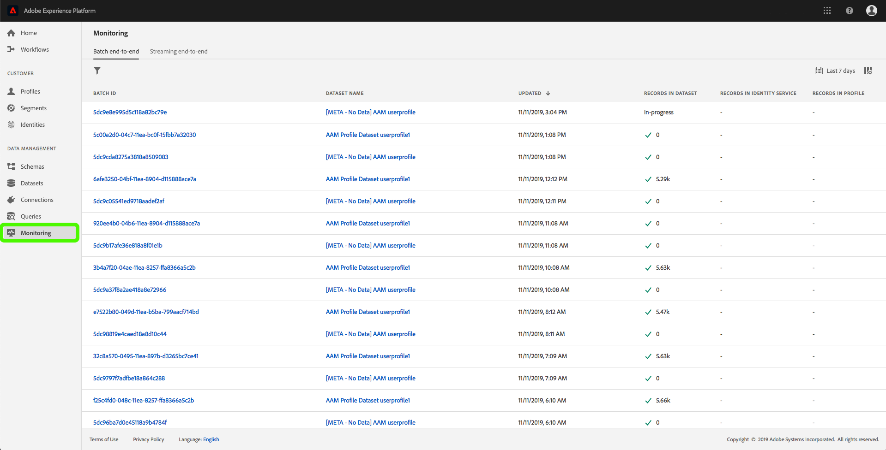

# Überwachen der Datenerfassung

Durch die Datenerfassung können Sie Ihre Daten in Adobe Experience Platform erfassen. Sie können entweder die Stapelverarbeitung verwenden, mit der Sie Ihre Daten mit verschiedenen Dateitypen (z. B. CSVs) einfügen können, oder Streaming, mit dem Sie Ihre Daten mithilfe von Streaming-Endpunkten in Echtzeit an die Platform erfassen können.

In diesem Benutzerhandbuch wird beschrieben, wie Sie Ihre Daten in der Benutzeroberfläche der Adobe Experience Platform überwachen. Für dieses Handbuch benötigen Sie eine Adobe ID und Zugriff auf die Adobe Experience Platform.

## Überwachen der End-to-End-Datenerfassung

Klicken Sie in der Benutzeroberfläche [der](https://platform.adobe.com)Experience Platform im linken Navigationsmenü auf **Überwachung** und dann auf **Streaming von Ende zu Ende**.

Die Seite zur *Streaming-End-to-End* -Überwachung wird angezeigt. Dieser Arbeitsbereich bietet ein Diagramm, das die Rate der Streaming-Ereignis anzeigt, die bei der Platform empfangen werden. Es zeigt die Rate der Streaming-Ereignis an, die erfolgreich vom [Echtzeit-Kundendienst](../../profile/home.md)verarbeitet wurden, sowie eine detaillierte Liste der eingehenden Daten.

Standardmäßig zeigt das obere Diagramm die Rate der Aufnahme in den letzten sieben Tagen an. Dieser Datumsbereich kann angepasst werden, um verschiedene Zeiträume anzuzeigen, indem Sie auf die hervorgehobene Schaltfläche klicken.

Das untere Diagramm zeigt die Rate der erfolgreich verarbeiteten Streaming-Ereignis nach Profil in den letzten sieben Tagen. Dieser Datumsbereich kann angepasst werden, um verschiedene Zeiträume anzuzeigen, indem Sie auf die hervorgehobene Schaltfläche klicken.

>[!NOTE]
>
>Damit Daten in diesem Diagramm angezeigt werden, müssen sie zum Profil **explizit** aktiviert werden. Informationen zum Aktivieren von Streaming-Daten für Profil finden Sie im Benutzerhandbuch zu [Datensätzen](../../catalog/datasets/user-guide.md#enable-a-dataset-for-real-time-customer-profile).

Unter den Diagrammen befindet sich eine Liste aller Streaming-Erfassungsdatensätze, die dem oben angezeigten Datumsbereich entsprechen. Jeder aufgelistete Stapel zeigt die ID, den Namen des Datensatzes, bei der letzten Aktualisierung die Anzahl der Datensätze im Stapel sowie die Anzahl der Fehler (sofern vorhanden) an. Sie können auf einen der Datensätze klicken, um detaillierte Informationen zu diesem Datensatz zu erhalten.

### Anzeigen von Streaming-Aufzeichnungen

Beim Anzeigen der Details eines erfolgreich gestreuten Datensatzes werden Informationen wie die Anzahl der erfassten Datensätze, die Dateigröße sowie der Beginn- und Endzeit der Erfassung angezeigt.

Die Details eines fehlgeschlagenen Streaming-Datensatzes zeigen dieselben Informationen wie ein erfolgreicher Datensatz.

Darüber hinaus geben fehlerhafte Datensätze Details zu den Fehlern an, die während der Verarbeitung des Stapels aufgetreten sind. Im Beispiel unten ist ein Systemfehler beim Überprüfen der datasetId aus dem Katalog aufgetreten.

## Überwachen der Batch-End-Datenerfassung

Klicken Sie in der Benutzeroberfläche [der](https://platform.adobe.com)Experience Platform im linken Navigationsmenü auf **Überwachung** .

Die Seite &quot; **Stapelüberwachung&quot;wird mit einer Liste der zuvor erfassten Stapel angezeigt** . Sie können auf einen der Stapel klicken, um detaillierte Informationen zu diesem Datensatz zu erhalten.

### Stapel anzeigen

Beim Anzeigen der Details eines erfolgreichen Stapels werden Informationen wie die Anzahl der erfassten Datensätze, die Dateigröße sowie der Beginn- und Endzeitpunkt der Erfassung angezeigt.

Die Details eines fehlgeschlagenen Stapels zeigen dieselben Informationen wie ein erfolgreicher Stapel an, wobei die Anzahl der Datensätze fehlgeschlagen ist.

Darüber hinaus werden bei fehlgeschlagenen Stapeln Details zu den Fehlern bereitgestellt, die bei der Verarbeitung des Stapels aufgetreten sind. Im Beispiel unten ist ein Fehler mit dem erfassten Stapel aufgetreten, da er ein unbekanntes Feld von verwendet `_experience`.

