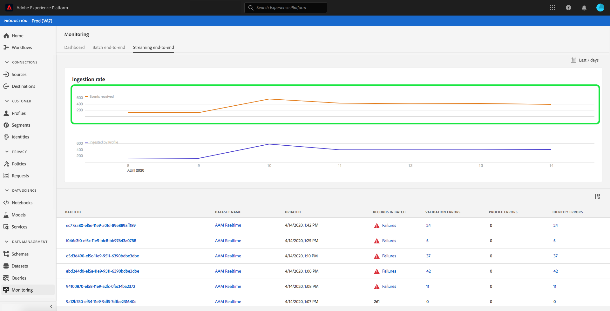

# Überwachen der Datenaufnahme

Mit der Datenaufnahme können Sie Ihre Daten in Adobe Experience Platform aufnehmen. Sie können entweder die Batch-Erfassung verwenden, mit der Sie Ihre Daten mithilfe verschiedener Dateitypen (z. B. CSV-Dateien) einfügen können, oder die Streaming-Erfassung, mit der Sie Ihre Daten erfassen können, um [!DNL Platform] Verwendung von Streaming-Endpunkten in Echtzeit.

Dieses Benutzerhandbuch enthält Schritte zum Überwachen Ihrer Daten in der Benutzeroberfläche von Adobe Experience Platform. Für dieses Handbuch benötigen Sie eine Adobe ID und Zugriff auf Adobe Experience Platform.

## Überwachen der Datenaufnahme bei End-to-End-Streaming {#monitor-streaming-end-to-end-data-ingestion}

>[!CONTEXTUALHELP]
>id="platform_ingestion_streaming_ingestionrate"
>title="Aufnahmegeschwindigkeit"
>abstract="Die Anzahl der erfolgreich verarbeiteten Ereignisse pro Sekunde."
>text="Learn more in the documentation"
>additional-url="https://experienceleague.adobe.com/docs/experience-platform/dataflows/ui/monitor-sources.html" text="Überwachen von Datenflüssen für Quellen in der Benutzeroberfläche"

>[!TIP]
>
>Verwenden Sie zur Berechnung der Gesamtereignisse an einem bestimmten Datum den Ausdruck: `total events / day = ingestion rate * 60 * 60 * 24`.

Im [Experience Platform-Benutzeroberfläche](https://platform.adobe.com)auswählen **[!UICONTROL Überwachung]** im linken Navigationsmenü, gefolgt von **[!UICONTROL End-to-End-Streaming]**.

Die Überwachungsseite **[!UICONTROL End-to-End-Streaming]** wird angezeigt. Dieser Arbeitsbereich bietet ein Diagramm, das die Rate der gestreamten Ereignisse anzeigt, die von [!DNL Platform], ein Diagramm, das die Rate der gestreamten Ereignisse anzeigt, die erfolgreich von [[!DNL Real-Time Customer Profile]](../../profile/home.md)sowie eine detaillierte Liste der eingehenden Daten.

Standardmäßig zeigt das obere Diagramm die Aufnahmerate der letzten sieben Tage an. Dieser Datumsbereich kann angepasst werden, um verschiedene Zeiträume anzuzeigen, indem Sie die hervorgehobene Schaltfläche auswählen.

Das untere Diagramm zeigt die Rate der erfolgreich verarbeiteten Streaming-Ereignisse nach [!DNL Profile] über die letzten sieben Tage. Dieser Datumsbereich kann angepasst werden, um verschiedene Zeiträume anzuzeigen, indem Sie die hervorgehobene Schaltfläche auswählen.

>[!NOTE]
>
>Damit Daten in diesem Diagramm angezeigt werden, müssen die Daten **explizit** aktiviert für [!DNL Profile]. Erfahren Sie, wie Sie Streaming-Daten für [!DNL Profile], lesen Sie die [Benutzerhandbuch zu Datensätzen](../../catalog/datasets/user-guide.md#enable-a-dataset-for-real-time-customer-profile).

Unter den Diagrammen befindet sich eine Liste aller Streaming-Erfassungsdatensätze, die dem oben angezeigten Datumsbereich entsprechen. Jeder aufgelistete Batch zeigt die ID, den Namen des Datensatzes, wann dieser zuletzt aktualisiert wurde, die Anzahl der Datensätze im Batch sowie die Anzahl der Fehler (sofern vorhanden) an. Sie können einen beliebigen Datensatz auswählen, um genauere Informationen zu diesem Datensatz zu erhalten.

### Anzeigen von Streaming-Datensätzen

Beim Anzeigen der Details eines erfolgreich gestreamten Datensatzes werden Informationen wie die Anzahl der aufgenommenen Datensätze, die Dateigröße sowie die Beginn- und Endzeiten der Aufnahme angezeigt.

Die Details eines fehlgeschlagenen Streaming-Datensatzes zeigen dieselben Informationen wie ein erfolgreicher Datensatz.

Darüber hinaus enthalten fehlerhafte Datensätze Details zu den Fehlern, die bei der Verarbeitung des Batches aufgetreten sind. Im folgenden Beispiel trat ein Parsing-Fehler auf, der beim Konvertieren oder Überprüfen der Daten auftrat.

>[!NOTE]
>
>Wenn Fehler in aufgenommenen Zeilen auftreten, werden diese Zeilen **not** werden abgelegt, es sei denn, die resultierende Nachricht führt zu einem ungültigen XDM.

## Überwachen der Batch-End-to-End-Datenaufnahme

Im [[!DNL Experience Platform UI]](https://platform.adobe.com)auswählen **[!UICONTROL Überwachung]** im linken Navigationsmenü.

Die Überwachungsseite **[!UICONTROL Batch End-to-End]** wird angezeigt und listet die zuvor aufgenommenen Batches auf. Sie können einen der Batches auswählen, um detaillierte Informationen zu diesem Datensatz zu erhalten.

### Anzeigen von Batches

Beim Anzeigen der Details eines erfolgreichen Batches werden Informationen wie die Anzahl der aufgenommenen Datensätze, die Dateigröße sowie der Beginn- und Endzeitpunkt der Aufnahme angezeigt.

Die Details eines fehlgeschlagenen Batches zeigen dieselben Informationen wie ein erfolgreicher Batch an, mit dem Zusatz, wie viele Datensätze fehlgeschlagen sind.

Darüber hinaus enthalten fehlgeschlagene Batches Details zu den Fehlern, die bei der Verarbeitung des Batches aufgetreten sind. Im folgenden Beispiel trat ein Fehler mit dem aufgenommenen Batch auf, da er die maximale Anzahl von Identitäten für die Person aufweist.

>[!NOTE]
>
>Wenn Fehler in aufgenommenen Zeilen auftreten, werden diese Zeilen **not** werden abgelegt, es sei denn, die resultierende Nachricht führt zu einem ungültigen XDM.

