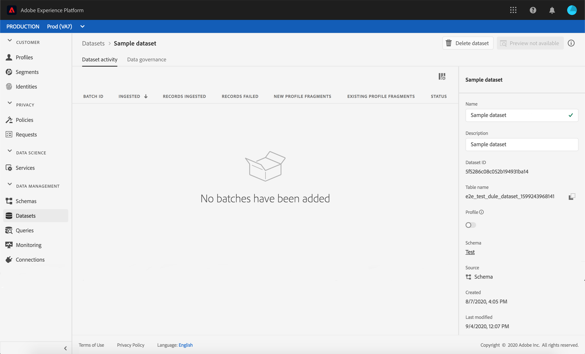

# Daten in Adobe Experience Platform erfassen

Adobe Experience Platform allows you to easily import data into [!DNL Platform] as batch files. Examples of data to be ingested may include profile data from a flat file in a CRM system (such as a parquet file) or data that conforms to a known [!DNL Experience Data Model] (XDM) schema in the Schema Registry.

## Erste Schritte

Um dieses Tutorial abzuschließen, benötigen Sie Zugriff auf [!DNL Experience Platform]. If you do not have access to an IMS Organization in [!DNL Experience Platform], please speak to your system administrator before proceeding.

Wenn Sie Daten lieber mit Data Ingestion-APIs erfassen möchten, lesen Sie zunächst das [Entwicklerhandbuch zur Batch-Erfassung](../batch-ingestion/api-overview.md).

## Arbeitsbereich „Datensätze“

The Datasets workspace within [!DNL Experience Platform] allows you to view and manage all of the datasets that your IMS organization has made, as well as create new ones.

Zeigen Sie den Arbeitsbereich „Datensätze“ an, indem Sie im Navigationsbereich auf der linken Seite auf **[!UICONTROL Datensätze]** klicken. Der Arbeitsbereich „Datensätze“ enthält eine Liste von Datensätzen, einschließlich der Spalten für **[!UICONTROL Name]**, **[!UICONTROL Erstellung]** (Datum und Uhrzeit), **[!UICONTROL Quelle]**, **[!UICONTROL Schema]** und **[!UICONTROL letzten Batch-Status]**, sowie Datum und Uhrzeit der **[!UICONTROL letzten Aktualisierung]** des Datensatzes.

>[!NOTE]
>
>Click on the filter icon next to the Search bar to use filtering capabilities to view only those datasets enabled for [!DNL Profile].

## Erstellen eines Datensatzes

Um einen Datensatz zu erstellen, klicken Sie in der oberen rechten Ecke des Arbeitsbereichs „Datensätze“ auf **[!UICONTROL Datensatz erstellen]**.

On the **[!UICONTROL Create Dataset]** screen, select whether you would like to &quot;[!UICONTROL Create Dataset from Schema]&quot; or &quot;[!UICONTROL Create Dataset from CSV File]&quot;.

In dieser Anleitung verwenden wir zum Erstellen des Datensatzes ein Schema. Klicken Sie auf **[!UICONTROL Datensatz aus Schema erstellen]**, um fortzufahren.

## Datensatzschema auswählen

Wählen Sie im Bildschirm **[!UICONTROL Schema auswählen]** ein Schema aus, indem Sie auf das Optionsfeld neben dem Schema klicken, das Sie nutzen möchten. In dieser Anleitung wird der Datensatz mithilfe des Schemas „Mitglieder des Treueprogramms“ erstellt. Die Verwendung der Suchleiste zum Filtern von Schemas ist eine hilfreich, um genau das Schema zu finden, nach dem Sie suchen.

Nachdem Sie das Optionsfeld neben dem Schema ausgewählt haben, das Sie verwenden möchten, klicken Sie auf **[!UICONTROL Weiter]**.

## Datensatz konfigurieren

Im Bildschirm **[!UICONTROL Datensatz konfigurieren]** müssen Sie dem Datensatz einen **[!UICONTROL Namen]** geben und möglicherweise auch eine **[!UICONTROL Beschreibung]** des Datensatzes hinzufügen.

**Hinweise zu Datensatznamen:**

- Datensatznamen sollten kurz und beschreibend sein, damit sich der Datensatz in der Bibliothek später leicht finden lässt.
- Datensatznamen müssen eindeutig sein, d. h. sie müssen spezifisch genug sein, damit sie in Zukunft nicht wiederverwendet werden.
- Es empfiehlt sich, mithilfe des Beschreibungsfelds zusätzliche Informationen zum Datensatz anzugeben, um anderen Benutzern in Zukunft dabei zu helfen, zwischen Datensätzen zu unterscheiden.

Sobald der Datensatz einen Namen und eine Beschreibung aufweist, klicken Sie auf **[!UICONTROL Fertig stellen]**.

## Datensatzaktivität

Es wurde nun ein leerer Datensatz erstellt und Sie befinden sich wieder auf der Registerkarte **[!UICONTROL Datensatzaktivität]** im Arbeitsbereich „Datensätze“. Sie sollten oben links im Arbeitsbereich den Namen des Datensatzes sowie eine Benachrichtigung sehen, die Ihnen mitteilt, dass keine Batches hinzugefügt wurden. Das ist zu erwarten, da Sie dem Datensatz noch keine Batches hinzugefügt haben.

Auf der rechten Seite des Arbeitsbereichs „Datensätze“ finden Sie die Registerkarte **[!UICONTROL Informationen]** mit Informationen zu Ihrem neuen Datensatz, wie z. B. **[!UICONTROL Datensatz-ID]**, **[!UICONTROL Name]**, **[!UICONTROL Beschreibung]**, **[!UICONTROL Tabellenname]**, **[!UICONTROL Schema]**, **[!UICONTROL Streaming]** und **[!UICONTROL Quelle]**. Die Registerkarte „Informationen“ enthält außerdem Informationen zum Zeitpunkt der **[!UICONTROL Erstellung]** des Datensatzes und zum **[!UICONTROL Datum der letzten Änderung]**.

Also in the Info tab is a  **[!UICONTROL Profile]** toggle that is used for enabling your dataset for use with [!DNL Real-time Customer Profile]. Use of this toggle, and [!DNL Real-time Customer Profile], will be explained in more detail in the section that follows.

## Datensatz aktivieren für [!DNL Real-time Customer Profile]

Datasets are used for ingesting data into [!DNL Experience Platform], and that data is ultimately used to identify individuals and stitch together information coming from multiple sources. Die zusammengeheftete Information wird als [!DNL Real-Time Customer Profile]. In order for [!DNL Platform] to know which information should be included in the [!DNL Real-Time Profile], datasets can be marked for inclusion using the **[!UICONTROL Profile]** toggle.

Standardmäßig ist der Umschalter deaktiviert. If you choose to toggle on [!DNL Profile], all data ingested into the dataset will be used to help identify an individual and stitch together their [!DNL Real-Time Profile].

To learn more about [!DNL Real-time Customer Profile] and working with identities, please review the [Identity Service](../../identity-service/home.md) documentation.

To enable the dataset for [!DNL Real-time Customer Profile], click the **[!UICONTROL Profile]** toggle in the **[!UICONTROL Info]** tab.

A dialog will appear asking you to confirm that you want to enable the dataset for [!DNL Real-time Customer Profile].

Klicken Sie auf **[!UICONTROL Aktivieren]**; daraufhin wird der Umschalter blau und zeigt an, dass das Profil aktiviert ist.

## Daten in Datensatz hinzufügen

Daten können auf verschiedene Weise in einen Datensatz eingefügt werden. You could choose to use [!DNL Data Ingestion] APIs or an ETL partner such as [!DNL Unifi] or [!DNL Informatica]. In dieser Anleitung werden dem Datensatz Daten in der Benutzeroberfläche über die Registerkarte **[!UICONTROL Daten hinzufügen]** hinzugefügt.

Um Daten zum Datensatz hinzuzufügen, klicken Sie auf die Registerkarte **[!UICONTROL Daten hinzufügen]**. Jetzt können Sie Dateien per Drag-and-Drop verschieben oder auf Ihrem Computer nach Dateien suchen, die Sie hinzufügen möchten.

>[!NOTE]
>
> Platform unterstützt zwei Dateitypen zur Datenerfassung: Parquet oder JSON. Sie können bis zu fünf Dateien gleichzeitig hinzufügen, wobei die maximale Dateigröße 10 GB pro Datei beträgt.

## Datei hochladen

Once you drag and drop (or browse and select) a parquet or JSON file that you wish to upload, [!DNL Platform] will immediately begin to process the file and an **[!UICONTROL Uploading]** dialog will appear on the **[!UICONTROL Add Data]** tab showing the progress of your file upload.

## Datensatzmetriken

Nach dem Hochladen der Datei steht auf der Registerkarte **[!UICONTROL Datensatzaktivität]** nicht mehr, dass keine Batches hinzugefügt wurden. Instead, the **[!UICONTROL Dataset Activity]** tab now shows dataset metrics. Bei allen Metriken wird zu diesem Zeitpunkt „0“ angezeigt, da der Batch noch nicht geladen wurde.

Am unteren Rand der Registerkarte befindet sich eine Liste, in der die **[!UICONTROL Batch-Kennung]** der Daten angezeigt wird, die gerade mit dem Prozess [Daten zu Datensatz hinzufügen](#add-data-to-dataset) erfasst wurden. Dazu gehören auch Informationen über den Batch, einschließlich Datum der **[!UICONTROL Erfassung]**, Anzahl der **[!UICONTROL erfassten Datensätze]** und des aktuellen Batch-**[!UICONTROL Status]**.

## Batch-Details

Klicken Sie auf die **[!UICONTROL Batch-Kennung]**, um eine **[!UICONTROL Batch-Übersicht]** mit weiteren Details zum Batch anzuzeigen. Sobald der Batch vollständig geladen wurde, werden die Informationen über den Batch aktualisiert, um die Anzahl der **[!UICONTROL erfassten Datensätze]** und die **[!UICONTROL Dateigröße]** anzuzeigen. Außerdem ändert sich der **[!UICONTROL Status]** in „Erfolg“ oder „Fehlgeschlagen“. Wenn der Batch fehlschlägt, enthält der Abschnitt **[!UICONTROL Fehler-Code]** Details zu Fehlern, die bei der Erfassung aufgetreten sind.

Weiterführende Informationen und häufig gestellte Fragen zur Batch-Erfassung finden Sie im [Handbuch zur Fehlerbehebung bei der Batch-Erfassung](../batch-ingestion/troubleshooting.md).

Um zum Bildschirm **[!UICONTROL Datensatzaktivität]** zurückzukehren, klicken Sie im Breadcrumb auf den Namen des Datensatzes (**[!UICONTROL Details zum Treueprogramm]**).

## Vorschau von Datensatz anzeigen

Sobald der Datensatz bereit ist, wird oben auf der Registerkarte **[!UICONTROL Datensatzaktivität]** eine Option zur **[!UICONTROL Vorschau des Datensatzes]** angezeigt.

Klicken Sie auf **[!UICONTROL Vorschau von Datensatz anzeigen]**, um einen Dialog mit Beispieldaten aus dem Datensatz zu öffnen. Wenn der Datensatz mit einem Schema erstellt wurde, werden auf der linken Seite der Vorschau Details zum Datensatzschema angezeigt. Sie können das Schema mithilfe der Pfeile erweitern, um die Schemastruktur anzuzeigen. Jede Spaltenüberschrift in den Vorschaudaten repräsentiert ein Feld im Datensatz.

## Nächste Schritte und zusätzliche Ressourcen

Now that you have created a dataset and successfully ingested data into [!DNL Experience Platform], you can repeat these steps to create a new dataset or ingest more data into the existing dataset.

Um mehr über die Batch-Erfassung zu erfahren, lesen Sie bitte die Übersicht über die [Batch-Einbindung](../batch-ingestion/overview.md) und ergänzen Sie Ihr Lernen durch das Video unten.

>[!WARNING]
>
>Die im folgenden Video dargestellte [!DNL Platform] Benutzeroberfläche ist veraltet. Die neuesten Screenshots und Funktionen der Benutzeroberfläche finden Sie in der obigen Dokumentation.

>[!VIDEO](https://video.tv.adobe.com/v/27269?quality=12&learn=on)