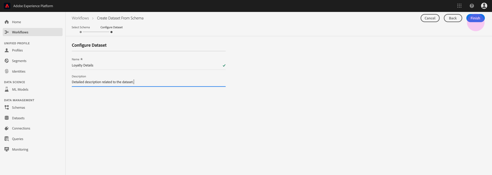
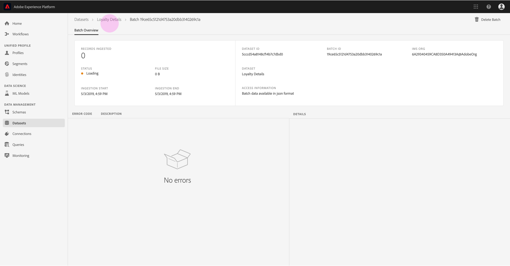

# Daten in Adobe Experience Platform einbeziehen

Mit der Adobe Experience Platform können Sie problemlos Daten als Stapeldateien in die Platform importieren. Zu den zu erfassenden Daten zählen beispielsweise Profil-Daten aus einer reduzierten Datei in einem CRM-System (z. B. eine Parkettdatei) oder Daten, die einem bekannten XDM-Schema (Experience Data Model) in der Schema-Registrierung entsprechen.

## Erste Schritte

Um dieses Lernprogramm abzuschließen, müssen Sie Zugriff auf die Experience Platform haben. Wenn Sie keinen Zugriff auf eine IMS-Organisation in Experience Platform haben, wenden Sie sich an Ihren Systemadministrator, bevor Sie fortfahren.

Wenn Sie Daten lieber mit Data Ingestion APIs erfassen möchten, lesen Sie zunächst das Entwicklerhandbuch für [Batch Ingestion](../batch-ingestion/api-overview.md).

## Datenarbeitsbereich

Im Arbeitsbereich „Datensätze“ von Experience Platform können Sie alle Datensätze, die Ihr IMS-Team erstellt hat, anzeigen und verwalten sowie neue Datensätze erstellen.

Zeigen Sie den Arbeitsbereich „Datensätze“ an, indem Sie im Navigationsbereich auf der linken Seite auf **Datensätze** klicken. The Datasets workspace contains a list of datasets, including columns showing _Name_, _Created_ (date and time), _Source_, _Schema_, and _Last Batch Status_, as well as the date and time the dataset was _Last Updated_.

>[!NOTE]
>
>Klicken Sie auf das Filtersymbol neben der Suchleiste, um Filterfunktionen zu verwenden, um nur die zum Profil aktivierten Datensätze Ansicht.

## Datensatz erstellen

Um einen Datensatz zu erstellen, klicken Sie in der oberen rechten Ecke des Datensatzarbeitsbereichs auf &quot;Datensatz **erstellen&quot;** .

Wählen Sie im Bildschirm &quot;Datensatz **erstellen** &quot;aus, ob Sie &quot;Datensatz aus Schema erstellen&quot;oder &quot;Datensatz aus CSV-Datei erstellen&quot;verwenden möchten.

Für dieses Lernprogramm wird ein Schema zum Erstellen des Datensatzes verwendet. Klicken Sie auf **Datensatz aus Schema** erstellen, um fortzufahren.

## Schema des Datensatzes auswählen

Wählen Sie im Bildschirm &quot;Schema **** auswählen&quot;ein Schema aus, indem Sie auf das Optionsfeld neben dem Schema klicken, das Sie verwenden möchten. Für dieses Lernprogramm wird der Datensatz mithilfe des Schemas &quot;Treuemitglieder&quot;erstellt. Die Verwendung der Suchleiste zum Filtern von Schemas ist eine hilfreiche Methode, um genau das Schema zu finden, nach dem Sie suchen.

Nachdem Sie das Optionsfeld neben dem Schema ausgewählt haben, das Sie verwenden möchten, klicken Sie auf **Weiter**.

## Dataset konfigurieren

Im Bildschirm &quot;Datensatz **konfigurieren** &quot;müssen Sie dem Datensatz einen **Namen** geben und möglicherweise auch eine **Beschreibung** des Datensatzes angeben.

**Hinweise zu Dataset-Namen:**

- Dataset-Namen sollten kurz und beschreibend sein, damit der Datensatz später leicht in der Bibliothek gefunden werden kann.
- Dataset-Namen müssen eindeutig sein, d. h. sie sollten auch so spezifisch sein, dass sie in Zukunft nicht wiederverwendet werden.
- Es empfiehlt sich, zusätzliche Informationen über den Datensatz mithilfe des Beschreibungsfelds bereitzustellen, da dies anderen Benutzern helfen kann, in Zukunft zwischen Datensätzen zu unterscheiden.

Sobald der Datensatz einen Namen und eine Beschreibung enthält, klicken Sie auf **Fertig stellen**.

## Datenbestand-Aktivität

Es wurde jetzt ein leerer Datensatz erstellt und Sie wurden zur Registerkarte &quot; **Datenaset-Aktivität** &quot;im Arbeitsbereich &quot;Datasets&quot;zurückgeleitet. Sie sollten den Namen des Datensatzes in der oberen linken Ecke des Arbeitsbereichs sowie die Benachrichtigung anzeigen, dass keine Stapel hinzugefügt wurden. Dies ist zu erwarten, da Sie diesem Datensatz noch keine Stapel hinzugefügt haben.

Auf der rechten Seite des Datensatzarbeitsbereichs finden Sie die Registerkarte &quot; **Info** &quot;mit Informationen zu Ihrem neuen Datensatz, wie z. B. _DataSet-ID_, _Name_, _Beschreibung_, _Tabellenname_,Schema,Streaming- _Brief, DirektübertragungSource-_ Archiv ____. Die Registerkarte &quot;Info&quot;enthält außerdem Informationen zum Zeitpunkt der _Erstellung_ des Datensatzes und zum _Datum seiner letzten Änderung_ .

Auf der Registerkarte &quot;Info&quot;befindet sich auch ein _Profil_ -Umschalter, mit dem Sie Ihren Datensatz für die Verwendung mit dem Echtzeit-Kundendaten-Profil aktivieren können. Die Verwendung dieses Umschalters und des Echtzeit-Kunden-Profils wird im folgenden Abschnitt ausführlicher erläutert.

## Datensatz für Echtzeit-Kundendaten aktivieren

Datasets werden für die Erfassung von Daten in die Experience Platform verwendet, und diese Daten werden letztendlich verwendet, um Einzelpersonen zu identifizieren und Informationen aus mehreren Quellen zusammenzuführen. Diese zusammengeführten Informationen werden als Echtzeit-Profil des Kunden bezeichnet. Damit die Platform wissen kann, welche Informationen in das Echtzeit-Profil aufgenommen werden sollen, können Datensätze mit dem **Profil** -Umschalter zur Aufnahme markiert werden.

Standardmäßig ist dieser Umschalter deaktiviert. Wenn Sie das Profil aktivieren, werden alle Daten, die in den Datensatz aufgenommen werden, zur Identifizierung einer Person und zum Zusammenfügen ihres Echtzeit-Profils verwendet.

Weitere Informationen zum Echtzeit-Profil von Kunden und zum Arbeiten mit Identitäten finden Sie in der Dokumentation zum [Identitätsdienst](../../identity-service/home.md) .

Um den Datensatz für Echtzeit-Kundendaten zu aktivieren, klicken Sie auf der Registerkarte &quot; **Profil** &quot;auf das Umschalten zwischen **Informationen** .

Daraufhin wird ein Dialogfeld angezeigt, in dem Sie aufgefordert werden, zu bestätigen, dass Sie den Datensatz für das Echtzeit-Profil des Kunden aktivieren möchten.

Klicken Sie auf **Aktivieren** , und der Umschalter wird blau und zeigt an, dass er aktiviert ist.

## Daten in den Datensatz Hinzufügen

Daten können auf verschiedene Weise in einen Datensatz eingefügt werden. Sie können Dateneinschluss-APIs oder einen ETL-Partner wie Unifi oder Informatica verwenden. Für dieses Lernprogramm werden dem Datensatz Daten über die Registerkarte &quot; **Hinzufügen Daten** &quot;in der Benutzeroberfläche hinzugefügt.

Um Daten zum Datensatz hinzuzufügen, klicken Sie auf die Registerkarte **Hinzufügen Daten** . Sie können jetzt Dateien per Drag &amp; Drop verschieben oder auf Ihrem Computer nach den Dateien suchen, die Sie hinzufügen möchten.

>[!NOTE]
>
>Platform unterstützt zwei Dateitypen für die Datenerfassung, Parkett oder JSON. Sie können bis zu fünf Dateien gleichzeitig hinzufügen, wobei die maximale Dateigröße pro Datei 10 GB beträgt.

## Hochladen einer Datei

Wenn Sie eine Datei per Drag &amp; Drop (oder durch Durchsuchen und Auswählen) hochladen, beginnt die Platform sofort mit der Verarbeitung der Datei, und auf der Registerkarte &quot;Daten **&quot;wird ein Dialogfeld zum** Hochladen **angezeigt, in dem der Fortschritt des Datei-Uploads** Hinzufügen angezeigt wird.

## Datensatzmetriken

Nach dem Hochladen der Datei wird auf der Registerkarte &quot; **Datenbestand-Aktivität** &quot;nicht mehr angezeigt, dass keine Stapel hinzugefügt wurden. Stattdessen werden auf der Registerkarte &quot;Aktivität des Datensatzes&quot;jetzt die Metriken des Datensatzes angezeigt. In allen Metriken wird zu diesem Zeitpunkt &quot;0&quot;angezeigt, da der Stapel noch nicht geladen wurde.

Am unteren Rand des Registers befindet sich eine Liste, die die _Stapel-ID_ der Daten anzeigt, die gerade über den [&quot;Hinzufügen data to dataset&quot;](#add-data-to-dataset) -Prozess erfasst wurden. Dazu gehören auch Informationen zum Stapel, einschließlich _Ingested_ -Datum, Anzahl der _Ingested_-Datensätze und der aktuelle Batch- _Status_.

## Stapeldetails

Klicken Sie auf die _Stapel-ID_ , um eine **Stapelübersicht** mit weiteren Details zum Stapel Ansicht. Sobald der Stapel vollständig geladen wurde, werden die Informationen zum Stapel aktualisiert, um die Anzahl der erfassten _Datensätze_ und die _Dateigröße_ anzuzeigen. Der _Status_ ändert sich auch in &quot;Erfolg&quot;oder &quot;Fehlgeschlagen&quot;. Wenn der Stapel fehlschlägt, enthält der Abschnitt _Fehlercode_ Details zu Fehlern während der Erfassung.

Weitere Informationen und häufig gestellte Fragen zur Stapelverarbeitung finden Sie im Handbuch zur Fehlerbehebung bei der [Stapeleinbettung](../batch-ingestion/troubleshooting.md).

Um zum Bildschirm &quot; **Datenbestand-Aktivität** &quot;zurückzukehren, klicken Sie im Breadcrumb auf den Namen des Datensatzes (_Treuedetails_).

## Vorschau DataSet

Sobald der Datensatz fertig ist, wird eine Option zur **Vorschau des Datensatzes** oben auf der Registerkarte &quot;Aktivität **des** Datensatzes&quot;angezeigt.

Klicken Sie auf **Vorschau DataSet** , um ein Dialogfeld mit Beispieldaten aus dem Datensatz zu öffnen. Wenn der Datensatz mit einem Schema erstellt wurde, werden die Details zum DataSet-Schema auf der linken Seite der Vorschau angezeigt. Sie können das Schema mithilfe der Pfeile erweitern, um die Schema-Struktur anzuzeigen. Jede Spaltenüberschrift in den Daten der Vorschau stellt ein Feld im Datensatz dar.

## Nächste Schritte

Nachdem Sie nun einen Datensatz erstellt und Daten erfolgreich in die Experience Platform aufgenommen haben, können Sie diese Schritte wiederholen, um einen neuen Datensatz zu erstellen oder weitere Daten in den vorhandenen Datensatz zu erfassen.

Weitere Informationen zur Stapelverarbeitung finden Sie in der Übersicht über die [Stapeleinbettung](../batch-ingestion/overview.md).
