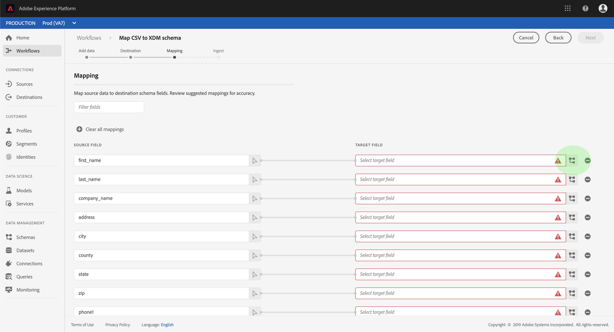
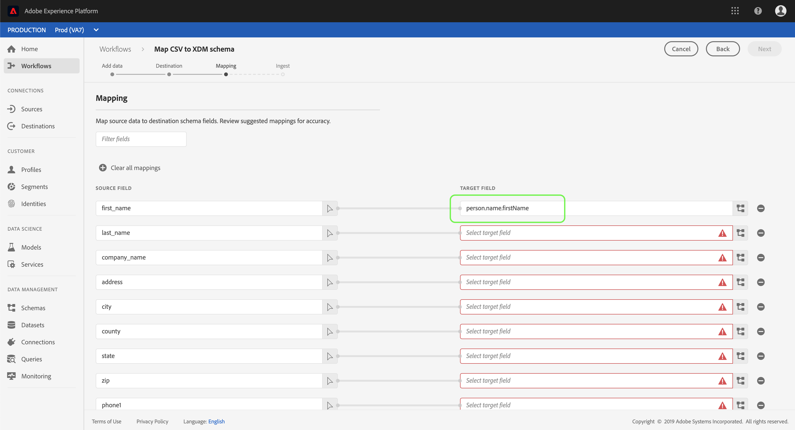

# Zuordnen einer CSV-Datei zu einem XDM-Schema

Um CSV-Daten in Adobe Experience Platform zu erfassen, müssen die Daten einem XDM-Schema (Experience Data Model) zugeordnet werden. In diesem Lernprogramm wird beschrieben, wie Sie eine CSV-Datei mithilfe der Experience Platform-Benutzeroberfläche einem XDM-Schema zuordnen.

Darüber hinaus enthält der Anhang zu diesem Lernprogramm weitere Informationen zur Verwendung von [Zuordnungsfunktionen](#mapping-functions).

## Erste Schritte

Dieses Lernprogramm erfordert ein Verständnis der folgenden Komponenten der Adobe Experience Platform:

- [Erlebnis-Datenmodell (XDM-System)](../../xdm/home.md): Das standardisierte Framework, mit dem Experience Platform Kundenerlebnisdaten organisiert.
- [Stapelverarbeitung](../batch-ingestion/overview.md): Die Methode, mit der Platform Daten aus vom Benutzer bereitgestellten Datendateien erfasst.

Für dieses Lernprogramm müssen Sie außerdem bereits einen Datensatz zum Erfassen Ihrer CSV-Daten erstellt haben. Anweisungen zum Erstellen eines Datensatzes in der Benutzeroberfläche finden Sie im Lernprogramm [zur Datenerfassung](./ingest-batch-data.md).

## Hinzufügen

Klicken Sie in der Experience Platform-Benutzeroberfläche in der linken Navigation auf **Workflows** und dann auf CSV zu XDM-Schema **zuordnen**. Klicken Sie in der rechten Leiste, die angezeigt wird, auf **Starten**.

Der Arbeitsablauf _CSV zu XDM-Schema_ zuordnen wird angezeigt, beginnend mit dem _Hinzufügen_ .

Ziehen Sie die CSV-Datei in den dafür vorgesehenen Bereich oder klicken Sie auf **Durchsuchen** , um eine Datei direkt auszuwählen. Nach dem Hochladen der Datei wird ein Abschnitt mit _Musterdaten_ mit den ersten zehn Datenzeilen angezeigt. Nachdem Sie bestätigt haben, dass die Daten erwartungsgemäß hochgeladen wurden, klicken Sie auf **Weiter**.

## Ziel auswählen

The _Destination_ step appears. Wählen Sie in der bereitgestellten Liste den Datensatz aus, in den die CSV-Daten aufgenommen werden sollen, und klicken Sie dann auf **Weiter**.

## Zuordnen von CSV-Feldern zu XDM-Schema-Feldern

The _Mapping_ step appears. Die Spalten der CSV-Datei werden unter &quot; _Quellfeld_&quot;aufgelistet, wobei die entsprechenden XDM-Schema-Felder unter &quot; _Zielgruppe-Feld_&quot;aufgeführt werden. Die Felder für die nicht ausgewählte Zielgruppe sind rot markiert.

Um eine CSV-Spalte einem XDM-Feld zuzuordnen, klicken Sie auf das Symbol Schema neben dem entsprechenden Spaltenfeld Zielgruppe.

Das Fenster Schema _auswählen_ wird angezeigt. Hier können Sie durch die Struktur des XDM-Schemas navigieren und das Feld suchen, dem Sie die CSV-Spalte zuordnen möchten. Klicken Sie auf ein XDM-Feld, um es auszuwählen, und klicken Sie dann auf **Auswählen**.

Der Bildschirm &quot; _Zuordnung_ &quot;wird erneut angezeigt, wobei das ausgewählte XDM-Feld jetzt unter &quot;Feld für _Zielgruppe&quot;angezeigt wird_.

Wenn Sie keine bestimmte CSV-Spalte zuordnen möchten, können Sie die Zuordnung entfernen, indem Sie auf das **Entfernen-Symbol** neben dem Feld Zielgruppe klicken. Wenn Sie eine neue Zuordnung hinzufügen möchten, klicken Sie unten in der Liste auf **Hinzufügen neue Zuordnung** .

Beim Zuordnen von Feldern können Sie auch Funktionen zur Berechnung von Werten auf der Grundlage von Eingabequellenfeldern einschließen. Weitere Informationen finden Sie im Abschnitt [Zuordnungsfunktionen](#mapping-functions) im Anhang.

Wiederholen Sie die oben genannten Schritte, um mit der Zuordnung von CSV-Spalten zu XDM-Feldern fortzufahren. Nachdem Sie fertig sind, klicken Sie auf **Weiter**.

## Daten erfassen

Der _Erfassungsschritt_ wird angezeigt, mit dem Sie die Details der Quelldatei und des Datensatzes der Zielgruppe überprüfen können. Klicken Sie auf **Erfassen** , um die CSV-Daten zu übernehmen. Je nach Größe der CSV-Datei kann dieser Vorgang einige Minuten dauern. Der Bildschirm wird nach Abschluss der Erfassung aktualisiert und zeigt Erfolg oder Fehler an. Click **Finish** to complete the workflow.

## Nächste Schritte

In diesem Tutorial haben Sie eine einfache CSV-Datei erfolgreich einem XDM-Schema zugeordnet und in Platform integriert. Diese Daten können jetzt von nachgeschalteten Plattformdiensten wie z. B. Echtzeit-Customer-Profil verwendet werden. Weitere Informationen finden Sie in der Übersicht [zum](../../profile/home.md) Echtzeit-Customer-Profil.

## Anhang

Im folgenden Abschnitt finden Sie weitere Informationen zum Zuordnen von CSV-Spalten zu XDM-Feldern.

### Zuordnungsfunktionen

Bestimmte Zuordnungsfunktionen können zum Berechnen und Berechnen von Werten verwendet werden, basierend auf dem, was in die Quellfelder eingegeben wird. Um eine Funktion zu verwenden, geben Sie sie unter &quot; _Quellfeld_ &quot;mit entsprechender Syntax und Eingaben ein.

Um z. B. CSV-Felder für **Stadt** und **Land** zu verknüpfen und sie dem XDM-Feld für **Stadt** zuzuweisen, legen Sie das Quellfeld als `concat(city, ", ", county)`fest.

In der folgenden Tabelle werden alle unterstützten Zuordnungsfunktionen, einschließlich Beispiel-Ausdruck und deren Ausgabeformate, Liste.

| Funktion | Beschreibung | Beispiel-Ausdruck | Beispielausgabe |
| -------- | ----------- | ----------------- | ------------- |
| concat | Verkettet angegebene Zeichenfolgen. | concat(&quot;Hi, &quot;, &quot;there&quot;, &quot;!&quot;) | `"Hi, there!"` |
| explode | Teilt die Zeichenfolge basierend auf einem Regex und gibt ein Array von Teilen zurück. | explode(&quot;Hi, there!&quot;, &quot;&quot;) | `["Hi,", "there"]` |
| instr | Gibt die Position/den Index einer Unterzeichenfolge zurück. | instr(&quot;adobe.com&quot;, &quot;com&quot;) | 6 |
| Ersatz | Ersetzt die Suchzeichenfolge, wenn sie in der ursprünglichen Zeichenfolge vorhanden ist. | replace(&quot;This is a string re test&quot;, &quot;re&quot;, &quot;replace&quot;) | &quot;Dies ist ein String-Ersatz-Test&quot; |
| substr | Gibt eine Teilzeichenfolge einer angegebenen Länge zurück. | substr(&quot;This is a substring test&quot;, 7, 8) | &quot; a subst&quot; |
| lower/ lcase | Konvertiert eine Zeichenfolge in Kleinbuchstaben. | lower(&quot;HeLLo&quot;) lcase(&quot;HeLLo&quot;) | &quot;hello&quot; |
| top/ ucase | Konvertiert eine Zeichenfolge in Großbuchstaben. | upper(&quot;HeLLo&quot;) ucase(&quot;HeLLo&quot;) | &quot;HELLO&quot; |
| split | Teilt eine Eingabezeichenfolge auf einem Trennzeichen. | split(&quot;Hello world&quot;, &quot;&quot;) | `["Hello", "world"]` |
| join | Verbindet eine Liste von Objekten mit der Trennlinie. | `join(" ", ["Hello", "world"]`) | &quot;Hello world&quot; |
| Kohle | Gibt das erste Objekt ohne null in einer bestimmten Liste zurück. | coalesce(null, null, null, &quot;first&quot;, null, &quot;second&quot;) | &quot;first&quot; |
| decode | Bei einem Schlüssel und einer Liste von Schlüsselwertpaaren, die als Array reduziert sind, gibt die Funktion den Wert zurück, wenn der Schlüssel gefunden wird, oder gibt einen Standardwert zurück, wenn er im Array vorhanden ist. | decode(&quot;k2&quot;, &quot;k1&quot;, &quot;v1&quot;, &quot;k2&quot;, &quot;v2&quot;, &quot;default&quot;) | &quot;v2&quot; |
| iif | Wertet einen bestimmten booleschen Ausdruck aus und gibt den angegebenen Wert basierend auf dem Ergebnis zurück. | iif(&quot;s&quot;.equalsIgnoreCase(&quot;S&quot;), &quot;True&quot;, &quot;False&quot;) | &quot;True&quot; |
| min | Gibt das Minimum der angegebenen Argumente zurück. Verwendet die natürliche Reihenfolge. | min(3, 1, 4) | 1 |
| max | Gibt das Maximum der angegebenen Argumente zurück. Verwendet die natürliche Reihenfolge. | max(3, 1, 4) | 4 |
| first | Ruft das erste angegebene Argument ab. | first(&quot;1&quot;, &quot;2&quot;, &quot;3&quot;) | &quot;1&quot; |
| last | Ruft das letzte angegebene Argument ab. | last(&quot;1&quot;, &quot;2&quot;, &quot;3&quot;) | &quot;3&quot; |
| uuid / guid | Erstellt eine pseudo-zufällige ID. | uuid() guid() | {UNIQUE_ID} |
| now | Ruft die aktuelle Zeit ab. | now() | `2019-10-23T10:10:24.556-07:00[America/Los_Angeles]` |
| timestamp | Ruft die aktuelle Unix-Zeit ab. | timestamp() | 1571850624571 |
| format | Formatiert das Eingabedatum nach einem angegebenen Format. | format({DATE}, &quot;yyyy-MM-dd HH:mm:ss&quot;) | &quot;2019-10-23 11:24:35&quot; |
| dformat | Konvertiert einen Zeitstempel in eine Datums-Zeichenfolge in einem angegebenen Format. | dformat(1571829875, &quot;dd-MMM-yyyy hh:mm&quot;) | &quot;23. Oktober 2019 11:24&quot; |
| date | Konvertiert eine Datums-Zeichenfolge in ein ZonedDateTime-Objekt (ISO 8601-Format). | date(&quot;23-Okt-2019 11:24&quot;) | &quot;2019-10-23T11:24:00+00:00&quot; |
| date_part | Ruft die Teile des Datums ab. Die folgenden Komponentenwerte werden unterstützt:   &quot;year&quot; &quot;yyyy&quot; &quot;yy&quot;  &quot;&quot;quar&quot; &quot;qq&quot; &quot;  &quot;month&quot; &quot;mm&quot; &quot;m&quot;  &quot;dayofyear&quot; &quot;&quot;y&quot;heute&quot;dd&quot;d&quot;&quot;week&quot;dann&quot;ww&quot;direkt&quot;an&quot;wochentag&quot;dz&quot;wochentag&quot;w&quot;wochentag&quot;dz&quot;ggi&quot;&quot;h&quot;h&quot;hd&quot;hd&quot;h&quot;h&quot;h&quot;d&quot;h&quot;d&quot;h&quot;d&quot;d&quot;d&quot;d&quot;d&quot;d&quot;d&quot;möglicherweise&quot;unden&quot;oder&quot;möglicherweise&quot;oder&quot;b&quot;pause&quot;pause&quot;b&quot;pause&quot;b&quot;b&quot;bzw&quot;g&quot;mit&quot;b&quot;bzw&quot;bzw&quot;bzw&quot;jz&quot;jh&quot;jz&quot;jz&quot;jh&quot; &quot;jz&quot;jz&quot;jz&quot;jz&quot;jz&quot;jz&quot;jh&quot;jz&quot;jh&quot;jz&quot;jz&quot;                            &quot;jz&quot;jz&quot;jz&quot;jhh&quot;&quot;hh24&quot;&quot;hh12&quot;Minute&quot;&quot;mi&quot;&quot;&quot;&quot;im&quot;&quot;zweiter&quot;&quot;s&quot;&quot;Millisekunden&quot;&quot;ms&quot;ms&quot; | date_part(date(&quot;2019-10-17 11:55:12&quot;), &quot;MM&quot;) | 10 |
| set_date_part | Ersetzt eine Komponente in einem bestimmten Datum. Die folgenden Komponenten werden akzeptiert:   &quot;year&quot; &quot;yyyy&quot; &quot;yy&quot;  &quot;month&quot; &quot;mm&quot; &quot;m&quot;  &quot;day&quot; &quot;dd&quot; &quot;d&quot;  &quot;hour&quot;         &quot;hh&quot;&quot;mi&quot;&quot;&quot;&quot;n&quot;&quot;&quot;&quot;ss&quot;&quot;s&quot;&quot;s&quot;s&quot;s&quot;s&quot;s&quot;) | set_date_part(&quot;m&quot;, 4, date(&quot;2016-11-09T11:44:44.797&quot;) | &quot;2016-04-09T11:44:44.797&quot; |
| make_date_time / make_timestamp | Erstellt ein Datum aus Teilen. | make_date_time(2019, 10, 17, 11, 55, 12, 999, &quot;America/Los_Angeles&quot;) | `2019-10-17T11:55:12.0&#x200B;00000999-07:00[America/Los_Angeles]` |
| current_timestamp | Gibt den aktuellen Zeitstempel zurück. | current_timestamp() | 1571850624571 |
| current_date | Gibt das aktuelle Datum ohne Zeitkomponente zurück. | current_date() | &quot;18-Nov-2019&quot; |