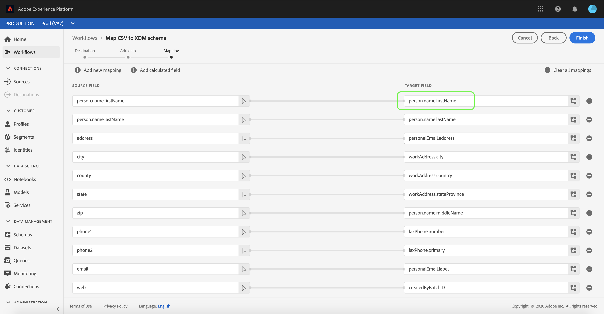

# Zuordnen einer CSV-Datei zu einem XDM-Schema

Um CSV-Daten zu erfassen, müssen [!DNL Adobe Experience Platform]die Daten einem [!DNL Experience Data Model] (XDM-)Schema zugeordnet werden. In diesem Lernprogramm wird beschrieben, wie Sie eine CSV-Datei einem XDM-Schema mithilfe der [!DNL Platform] Benutzeroberfläche zuordnen.

Darüber hinaus enthält der Anhang zu diesem Lernprogramm weitere Informationen zur Verwendung von [Zuordnungsfunktionen](#mapping-functions).

## Erste Schritte

Dieses Lernprogramm erfordert ein Verständnis der folgenden Komponenten [!DNL Platform]:

- [!DNL Experience Data Model (XDM System)](../../xdm/home.md): Das standardisierte Framework, mit dem Kundenerlebnisdaten [!DNL Platform] organisiert werden.
- [!DNL Batch ingestion](../batch-ingestion/overview.md): Die Methode, mit der Daten aus vom Benutzer bereitgestellten Datendateien [!DNL Platform] erfasst werden.

Für dieses Lernprogramm müssen Sie außerdem bereits einen Datensatz zum Erfassen Ihrer CSV-Daten erstellt haben. Anweisungen zum Erstellen eines Datensatzes in der Benutzeroberfläche finden Sie im Lernprogramm [zur Datenerfassung](./ingest-batch-data.md).

## Ziel auswählen

Melden Sie sich an [!DNL Adobe Experience Platform](https://platform.adobe.com) und wählen Sie dann in der linken Navigationsleiste **[!UICONTROL Workflows]** aus, um auf den *[!UICONTROL Workflows]* Arbeitsbereich zuzugreifen.

Wählen Sie im **[!UICONTROL Workflows]** -Bildschirm unter &quot; **[!UICONTROL Datenaufnahme]** &quot;die Option &quot;CSV-Datei XDM-Schema **** zuordnen&quot;und wählen Sie dann &quot; **[!UICONTROL Starten]**&quot;aus.

Der Arbeitsablauf *[!UICONTROL CSV zu XDM-Schema]* zuordnen wird angezeigt, beginnend mit dem *[!UICONTROL Zielschritt]* . Wählen Sie einen Datensatz, in den eingehende Daten aufgenommen werden sollen. Sie können entweder einen vorhandenen Datensatz verwenden oder einen neuen erstellen.

**Vorhandenen Datensatz verwenden**

Um Ihre CSV-Daten in einen vorhandenen Datensatz zu erfassen, wählen Sie &quot;Vorhandenen Datensatz **[!UICONTROL verwenden&quot;]**. Sie können entweder einen vorhandenen Datensatz mit der Suchfunktion abrufen oder durch einen Bildlauf durch die Liste der vorhandenen Datensätze im Bedienfeld blättern.

Um Ihre CSV-Daten in einen neuen Datensatz zu erfassen, wählen Sie &quot;Neuen Datensatz **[!UICONTROL erstellen]** &quot;und geben Sie in die entsprechenden Felder einen Namen und eine Beschreibung für den Datensatz ein. Wählen Sie ein Schema aus, indem Sie entweder die Suchfunktion verwenden oder indem Sie durch die Liste der bereitgestellten Schema blättern. Wählen Sie **[!UICONTROL Weiter]** , um fortzufahren.

## Hinzufügen

Der *[!UICONTROL Hinzufügen Datenschritt]* wird angezeigt. Ziehen Sie die CSV-Datei in den vorgesehenen Bereich oder wählen Sie &quot;Dateien **[!UICONTROL auswählen]** &quot;, um die CSV-Datei manuell einzugeben.

Der Abschnitt *[!UICONTROL Beispieldaten]* wird nach dem Hochladen der Datei mit den ersten zehn Datenzeilen angezeigt. Nachdem Sie bestätigt haben, dass die Daten erwartungsgemäß hochgeladen wurden, wählen Sie &quot; **[!UICONTROL Weiter]**&quot;aus.

## Zuordnen von CSV-Feldern zu XDM-Schema-Feldern

The *[!UICONTROL Mapping]* step appears. Die Spalten der CSV-Datei werden unter &quot; *[!UICONTROL Quellfeld]*&quot;aufgelistet, wobei die entsprechenden XDM-Schema-Felder unter &quot; *[!UICONTROL Target-Feld]*&quot;aufgeführt werden. Die Felder für die nicht ausgewählte Zielgruppe sind rot markiert. Mit der Filterfeldoption können Sie die Liste der verfügbaren Quellfelder einschränken.

Um eine CSV-Spalte einem XDM-Feld zuzuordnen, wählen Sie das Symbol Schema neben dem entsprechenden Spaltenfeld Zielgruppe aus.

Das Fenster Schema *[!UICONTROL auswählen]* wird angezeigt. Hier können Sie durch die Struktur des XDM-Schemas navigieren und das Feld suchen, dem Sie die CSV-Spalte zuordnen möchten. Klicken Sie auf ein XDM-Feld, um es auszuwählen, und klicken Sie dann auf **[!UICONTROL Auswählen]**.

Der Bildschirm &quot; *[!UICONTROL Zuordnung]* &quot;wird erneut angezeigt, wobei das ausgewählte XDM-Feld jetzt unter dem *[!UICONTROL Target]* angezeigt wird.

Wenn Sie keine bestimmte CSV-Spalte zuordnen möchten, können Sie die Zuordnung entfernen, indem Sie auf das **Entfernen-Symbol** neben dem Feld Zielgruppe klicken. Sie können auch alle Zuordnungen entfernen, indem Sie auf die Schaltfläche &quot;Alle Zuordnungen **[!UICONTROL löschen&quot;klicken]**.

Wenn Sie eine neue Zuordnung hinzufügen möchten, wählen Sie **[!UICONTROL Hinzufügen neue Zuordnung]** oben in der Liste &quot; *[!UICONTROL Quellfeld]* &quot;aus.

Beim Zuordnen von Feldern können Sie auch Funktionen zur Berechnung von Werten auf der Grundlage von Eingabequellenfeldern einschließen. Weitere Informationen finden Sie im Abschnitt [Zuordnungsfunktionen](#mapping-functions) im Anhang.

### Hinzufügen berechnetes Feld

Berechnete Felder ermöglichen die Erstellung von Werten basierend auf den Attributen im Eingabe-Schema. Diese Werte können dann Attributen im Schema &quot;Zielgruppe&quot;zugewiesen und mit einem Namen und einer Beschreibung versehen werden, um eine einfachere Referenz zu ermöglichen.

Klicken Sie auf die Schaltfläche **[!UICONTROL HinzufügenFeld]** , um fortzufahren.

Das Bedienfeld &quot;Berechnetes Feld **[!UICONTROL erstellen&quot;]** wird angezeigt. Das linke Dialogfeld enthält die Felder, Funktionen und Operatoren, die in berechneten Feldern unterstützt werden. Wählen Sie eine der Registerkarten aus, um Beginn Funktionen, Felder oder Operatoren zum Ausdruck-Editor hinzuzufügen.

| Tab | Beschreibung |
| --------- | ----------- |
| Felder | Auf der Registerkarte &quot;Felder&quot;werden die im Quell-Schema verfügbaren Felder und Attribute Liste. |
| Funktionen | Auf der Registerkarte &quot;Funktionen&quot;werden die verfügbaren Funktionen zum Transformieren der Daten Liste. |
| Operatoren  | Auf der Registerkarte &quot;Operatoren&quot;werden die Operatoren Liste, die zum Transformieren der Daten verfügbar sind. |

Mit dem Ausdruck-Editor in der Mitte können Sie Felder, Funktionen und Operatoren manuell hinzufügen. Wählen Sie den Editor aus, um einen Ausdruck zu erstellen.

Wählen Sie **[!UICONTROL Speichern]** , um fortzufahren.

Der Anzeigebereich &quot;Zuordnung&quot;wird mit dem neu erstellten Quellfeld erneut angezeigt. Wenden Sie das entsprechende Feld für die Zielgruppe an und wählen Sie &quot; **[!UICONTROL Fertig stellen]** &quot;, um die Zuordnung abzuschließen.

## Überwachen des Datenflusses

Nachdem die CSV-Datei zugeordnet und erstellt wurde, können Sie die Daten überwachen, die über sie aufgenommen werden. Weitere Informationen zur Überwachung von Datenflüssen finden Sie im Lernprogramm zur [Überwachung von Streaming-Datenflüssen](../../ingestion/quality/monitor-data-flows.md).

## Nächste Schritte

In diesem Tutorial haben Sie eine einfache CSV-Datei erfolgreich einem XDM-Schema zugeordnet und in [!DNL Platform]das sie eingefügt wurde. Diese Daten können nun von nachgelagerten [!DNL Platform] Diensten wie [!DNL Real-time Customer Profile]z. B. Weitere Informationen finden Sie in der Übersicht [!DNL Real-time Customer Profile](../../profile/home.md) .

## Anhang

Im folgenden Abschnitt finden Sie weitere Informationen zum Zuordnen von CSV-Spalten zu XDM-Feldern.

### Zuordnungsfunktionen

Bestimmte Zuordnungsfunktionen können zum Berechnen und Berechnen von Werten verwendet werden, basierend auf dem, was in die Quellfelder eingegeben wird. Um eine Funktion zu verwenden, geben Sie sie unter &quot; *[!UICONTROL Quellfeld]* &quot;mit entsprechender Syntax und Eingaben ein.

Um z. B. CSV-Felder für **Stadt** und **Land** zu verknüpfen und sie dem XDM-Feld für **Stadt** zuzuweisen, legen Sie das Quellfeld als `concat(city, ", ", county)`fest.

In der folgenden Tabelle werden alle unterstützten Zuordnungsfunktionen, einschließlich Beispiel-Ausdruck und deren Ausgabeformate, Liste.

| Funktion | Beschreibung | Beispiel-Ausdruck | Beispielausgabe |
| -------- | ----------- | ----------------- | ------------- |
| concat | Verkettet angegebene Zeichenfolgen. | concat(&quot;Hi, &quot;, &quot;there&quot;, &quot;!&quot;) | `"Hi, there!"` |
| explode | Teilt die Zeichenfolge basierend auf einem Regex und gibt ein Array von Teilen zurück. | explode(&quot;Hi, there!&quot;, &quot;&quot;) | `["Hi,", "there"]` |
| instr | Gibt die Position/den Index einer Unterzeichenfolge zurück. | instr(&quot;adobe.com&quot;, &quot;com&quot;) | 6 |
| Ersatz | Ersetzt die Suchzeichenfolge, wenn sie in der ursprünglichen Zeichenfolge vorhanden ist. | replace(&quot;This is a string re test&quot;, &quot;re&quot;, &quot;replace&quot;) | &quot;Dies ist ein String-Ersatz-Test&quot; |
| substr | Gibt eine Teilzeichenfolge einer angegebenen Länge zurück. | substr(&quot;This is a substring test&quot;, 7, 8) | &quot; a subst&quot; |
| lower/ lcase | Konvertiert eine Zeichenfolge in Kleinbuchstaben. | lower(&quot;HeLLo&quot;) lcase(&quot;HeLLo&quot;) | &quot;hello&quot; |
| top/ ucase | Konvertiert eine Zeichenfolge in Großbuchstaben. | upper(&quot;HeLLo&quot;) ucase(&quot;HeLLo&quot;) | &quot;HELLO&quot; |
| split | Teilt eine Eingabezeichenfolge auf einem Trennzeichen. | split(&quot;Hello world&quot;, &quot;&quot;) | `["Hello", "world"]` |
| join | Verbindet eine Liste von Objekten mit der Trennlinie. | `join(" ", ["Hello", "world"]`) | &quot;Hello world&quot; |
| Kohle | Gibt das erste Objekt ohne null in einer bestimmten Liste zurück. | coalesce(null, null, null, &quot;first&quot;, null, &quot;second&quot;) | &quot;first&quot; |
| decode | Bei einem Schlüssel und einer Liste von Schlüsselwertpaaren, die als Array reduziert sind, gibt die Funktion den Wert zurück, wenn der Schlüssel gefunden wird, oder gibt einen Standardwert zurück, wenn er im Array vorhanden ist. | decode(&quot;k2&quot;, &quot;k1&quot;, &quot;v1&quot;, &quot;k2&quot;, &quot;v2&quot;, &quot;default&quot;) | &quot;v2&quot; |
| iif | Wertet einen bestimmten booleschen Ausdruck aus und gibt den angegebenen Wert basierend auf dem Ergebnis zurück. | iif(&quot;s&quot;.equalsIgnoreCase(&quot;S&quot;), &quot;True&quot;, &quot;False&quot;) | &quot;True&quot; |
| min | Gibt das Minimum der angegebenen Argumente zurück. Verwendet die natürliche Reihenfolge. | min(3, 1, 4) | 1 |
| max | Gibt das Maximum der angegebenen Argumente zurück. Verwendet die natürliche Reihenfolge. | max(3, 1, 4) | 4 |
| first | Ruft das erste angegebene Argument ab. | first(&quot;1&quot;, &quot;2&quot;, &quot;3&quot;) | &quot;1&quot; |
| last | Ruft das letzte angegebene Argument ab. | last(&quot;1&quot;, &quot;2&quot;, &quot;3&quot;) | &quot;3&quot; |
| uuid / guid | Erstellt eine pseudo-zufällige ID. | uuid() guid() | {UNIQUE_ID} |
| now | Ruft die aktuelle Zeit ab. | now() | `2019-10-23T10:10:24.556-07:00[America/Los_Angeles]` |
| timestamp | Ruft die aktuelle Unix-Zeit ab. | timestamp() | 1571850624571 |
| format | Formatiert das Eingabedatum nach einem angegebenen Format. | format({DATE}, &quot;yyyy-MM-dd HH:mm:ss&quot;) | &quot;2019-10-23 11:24:35&quot; |
| dformat | Konvertiert einen Zeitstempel in eine Datums-Zeichenfolge in einem angegebenen Format. | dformat(1571829875, &quot;dd-MMM-yyyy hh:mm&quot;) | &quot;23. Oktober 2019 11:24&quot; |
| date | Konvertiert eine Datums-Zeichenfolge in ein ZonedDateTime-Objekt (ISO 8601-Format). | date(&quot;23-Okt-2019 11:24&quot;) | &quot;2019-10-23T11:24:00+00:00&quot; |
| date_part | Ruft die Teile des Datums ab. Die folgenden Komponentenwerte werden unterstützt:   &quot;year&quot; &quot;yyyy&quot; &quot;yy&quot;  &quot;&quot;quar&quot; &quot;qq&quot; &quot;  &quot;month&quot; &quot;mm&quot; &quot;m&quot;  &quot;dayofyear&quot; &quot;&quot;y&quot;heute&quot;dd&quot;d&quot;&quot;week&quot;dann&quot;ww&quot;direkt&quot;an&quot;wochentag&quot;dz&quot;wochentag&quot;w&quot;wochentag&quot;dz&quot;ggi&quot;&quot;h&quot;h&quot;hd&quot;hd&quot;h&quot;h&quot;h&quot;d&quot;h&quot;d&quot;h&quot;d&quot;d&quot;d&quot;d&quot;d&quot;d&quot;d&quot;möglicherweise&quot;unden&quot;oder&quot;möglicherweise&quot;oder&quot;b&quot;pause&quot;pause&quot;b&quot;pause&quot;b&quot;b&quot;bzw&quot;g&quot;mit&quot;b&quot;bzw&quot;bzw&quot;bzw&quot;jz&quot;jh&quot;jz&quot;jz&quot;jh&quot; &quot;jz&quot;jz&quot;jz&quot;jz&quot;jz&quot;jz&quot;jh&quot;jz&quot;jh&quot;jz&quot;jz&quot;                            &quot;jz&quot;jz&quot;jz&quot;jhh&quot;&quot;hh24&quot;&quot;hh12&quot;Minute&quot;&quot;mi&quot;&quot;&quot;&quot;im&quot;&quot;zweiter&quot;&quot;s&quot;&quot;Millisekunden&quot;&quot;ms&quot;ms&quot; | date_part(date(&quot;2019-10-17 11:55:12&quot;), &quot;MM&quot;) | 10 |
| set_date_part | Ersetzt eine Komponente in einem bestimmten Datum. Die folgenden Komponenten werden akzeptiert:   &quot;year&quot; &quot;yyyy&quot; &quot;yy&quot;  &quot;month&quot; &quot;mm&quot; &quot;m&quot;  &quot;day&quot; &quot;dd&quot; &quot;d&quot;  &quot;hour&quot;         &quot;hh&quot;&quot;mi&quot;&quot;&quot;&quot;n&quot;&quot;&quot;&quot;ss&quot;&quot;s&quot;&quot;s&quot;s&quot;s&quot;s&quot;s&quot;) | set_date_part(&quot;m&quot;, 4, date(&quot;2016-11-09T11:44:44.797&quot;) | &quot;2016-04-09T11:44:44.797&quot; |
| make_date_time / make_timestamp | Erstellt ein Datum aus Teilen. | make_date_time(2019, 10, 17, 11, 55, 12, 999, &quot;America/Los_Angeles&quot;) | `2019-10-17T11:55:12.0&#x200B;00000999-07:00[America/Los_Angeles]` |
| current_timestamp | Gibt den aktuellen Zeitstempel zurück. | current_timestamp() | 1571850624571 |
| current_date | Gibt das aktuelle Datum ohne Zeitkomponente zurück. | current_date() | &quot;18-Nov-2019&quot; |