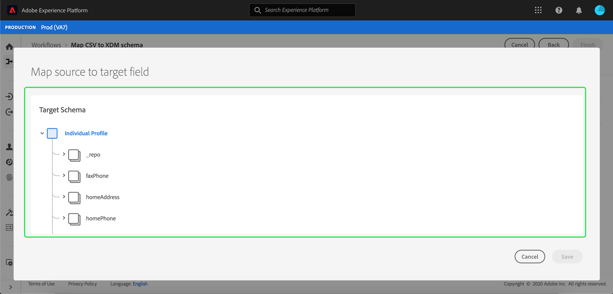

# Zuordnen einer CSV-Datei zu einem XDM-Schema

Um CSV-Daten in [!DNL Adobe Experience Platform] zu erfassen, müssen die Daten einem [!DNL Experience Data Model] (XDM)-Schema zugeordnet werden. In diesem Lernprogramm wird beschrieben, wie Sie eine CSV-Datei mit der [!DNL Platform]-Benutzeroberfläche einem XDM-Schema zuordnen.

Darüber hinaus enthält der Anhang zu diesem Lernprogramm weitere Informationen zur Verwendung der Zuordnungsfunktionen [a1/>.](#mapping-functions)

## Erste Schritte

Dieses Lernprogramm erfordert ein Verständnis der folgenden Komponenten von [!DNL Platform]:

- [[!DNL Experience Data Model (XDM System)]](../../xdm/home.md): Das standardisierte Framework, mit dem [!DNL Platform] Kundenerlebnisdaten organisiert.
- [[!DNL Batch ingestion]](../batch-ingestion/overview.md): Die Methode, mit der Daten aus vom Benutzer bereitgestellten Datendateien  [!DNL Platform] erfasst werden.

Für dieses Lernprogramm müssen Sie außerdem bereits einen Datensatz zum Erfassen Ihrer CSV-Daten erstellt haben. Anweisungen zum Erstellen eines Datensatzes in der Benutzeroberfläche finden Sie im Lernprogramm [Datenerfassung](./ingest-batch-data.md).

## Ziel auswählen

Melden Sie sich bei [[!DNL Adobe Experience Platform]](https://platform.adobe.com) an und wählen Sie dann **[!UICONTROL Workflows]** in der linken Navigationsleiste aus, um auf den Arbeitsbereich **[!UICONTROL Workflows]** zuzugreifen.

Wählen Sie im Bildschirm **[!UICONTROL Workflows]** die Option **[!UICONTROL CSV zu XDM-Schema]** unter **[!UICONTROL Datenaufnahme]** und wählen Sie **[!UICONTROL Starten]**.

Der Arbeitsablauf **[!UICONTROL CSV zu XDM-Schema]** zuordnen wird angezeigt, beginnend mit dem Schritt **[!UICONTROL Ziel]**. Wählen Sie einen Datensatz, in den eingehende Daten aufgenommen werden sollen. Sie können entweder einen vorhandenen Datensatz verwenden oder einen neuen erstellen.

**Vorhandenen Datensatz verwenden**

Um Ihre CSV-Daten in einen vorhandenen Datensatz zu erfassen, wählen Sie **[!UICONTROL Vorhandenen Datensatz verwenden]**. Sie können entweder einen vorhandenen Datensatz mit der Suchfunktion abrufen oder durch einen Bildlauf durch die Liste der vorhandenen Datensätze im Bedienfeld blättern.

Um Ihre CSV-Daten in einen neuen Datensatz zu erfassen, wählen Sie **[!UICONTROL Neuen Datensatz erstellen]** und geben Sie in den angegebenen Feldern einen Namen und eine Beschreibung für den Datensatz ein. Wählen Sie ein Schema aus, indem Sie entweder die Suchfunktion verwenden oder indem Sie durch die Liste der bereitgestellten Schema blättern. Wählen Sie **[!UICONTROL Weiter]**, um fortzufahren.

## hinzufügen

Der Schritt **[!UICONTROL Daten hinzufügen]** wird angezeigt. Ziehen Sie die CSV-Datei in den angegebenen Bereich oder wählen Sie **[!UICONTROL Dateien auswählen]**, um die CSV-Datei manuell einzugeben.

Der Abschnitt **[!UICONTROL Beispieldaten]** wird nach dem Hochladen der Datei angezeigt und zeigt die ersten zehn Datenzeilen an. Nachdem Sie bestätigt haben, dass die Daten erwartungsgemäß hochgeladen wurden, wählen Sie **[!UICONTROL Weiter]**.

## Zuordnen von CSV-Feldern zu XDM-Schema-Feldern

Der Schritt **[!UICONTROL Zuordnung]** wird angezeigt. Die Spalten der CSV-Datei werden unter **[!UICONTROL Quellfeld]** aufgelistet, wobei die entsprechenden XDM-Schema-Felder unter **[!UICONTROL Zielgruppen-Feld]** aufgeführt werden.

[!DNL Platform] stellt automatisch intelligente Empfehlungen für automatisch zugeordnete Zielgruppen bereit, die auf dem von Ihnen ausgewählten Schema oder Datensatz basieren. Sie können Zuordnungsregeln manuell an Ihre Anwendungsfälle anpassen.

Um alle automatisch generierenden Zuordnungswerte zu akzeptieren, aktivieren Sie das Kontrollkästchen &quot;[!UICONTROL Alle Zielgruppen akzeptieren]&quot;.

Manchmal ist mehr als eine Empfehlung für das Quell-Schema verfügbar. In diesem Fall zeigt die Karte die auffälligste Empfehlung an, gefolgt von einem blauen Kreis, der die Anzahl der verfügbaren zusätzlichen Empfehlungen enthält. Wenn Sie das Glühbirnensymbol auswählen, wird eine Liste der zusätzlichen Empfehlungen angezeigt. Sie können eine der alternativen Empfehlungen auswählen, indem Sie das Kontrollkästchen neben der Empfehlung aktivieren, der Sie stattdessen eine Zuordnung zuordnen möchten.

Alternativ können Sie Ihr Quellcode-Schema manuell Ihrem Zielgruppe-Schema zuordnen. Bewegen Sie den Mauszeiger über das Quellelement, das Sie zuordnen möchten, und wählen Sie dann das Pluszeichen aus.

Das Popupfenster **[!UICONTROL Quelle der Zielgruppe zuordnen]** wird angezeigt. Von hier aus können Sie auswählen, welches Feld Sie zuordnen möchten, gefolgt von **[!UICONTROL Speichern]**, um Ihre neue Zuordnung hinzuzufügen.

Wenn Sie eine der Zuordnungen entfernen möchten, halten Sie den Mauszeiger über diese Zuordnung und wählen Sie das Minuszeichen aus.

### hinzufügen berechnetes Feld {#add-calculated-field}

Berechnete Felder ermöglichen die Erstellung von Werten basierend auf den Attributen im Eingabe-Schema. Diese Werte können dann Attributen im Schema &quot;Zielgruppe&quot;zugewiesen und mit einem Namen und einer Beschreibung versehen werden, um eine einfachere Referenz zu ermöglichen.

Klicken Sie auf die Schaltfläche **[!UICONTROL Hinzufügen berechnete Feld]**, um fortzufahren.

Das Bedienfeld **[!UICONTROL Errechnetes Feld erstellen]** wird angezeigt. Das linke Dialogfeld enthält die Felder, Funktionen und Operatoren, die in berechneten Feldern unterstützt werden. Wählen Sie eine der Registerkarten aus, um Beginn Funktionen, Felder oder Operatoren zum Ausdruck-Editor hinzuzufügen.

| Tab | Beschreibung |
| --------- | ----------- |
| Felder | Auf der Registerkarte &quot;Felder&quot;werden die im Quell-Schema verfügbaren Felder und Attribute Liste. |
| Funktionen | Auf der Registerkarte &quot;Funktionen&quot;werden die verfügbaren Funktionen zum Transformieren der Daten Liste. Weitere Informationen zu den Funktionen, die Sie in berechneten Feldern verwenden können, finden Sie im Leitfaden [mithilfe der Datenvorgabefunktionen (Mapper)](../../data-prep/functions.md). |
| Operatoren  | Auf der Registerkarte &quot;Operatoren&quot;werden die Operatoren Liste, die zum Transformieren der Daten verfügbar sind. |

Mit dem Ausdruck-Editor in der Mitte können Sie Felder, Funktionen und Operatoren manuell hinzufügen. Wählen Sie den Editor aus, um einen Ausdruck zu erstellen.

Wählen Sie **[!UICONTROL Speichern]**, um fortzufahren.

Der Anzeigebereich &quot;Zuordnung&quot;wird mit dem neu erstellten Quellfeld erneut angezeigt. Wenden Sie das entsprechende Feld für die Zielgruppe an und wählen Sie **[!UICONTROL Fertigstellen]**, um die Zuordnung abzuschließen.

## Überwachen der Datenerfassung

Nachdem die CSV-Datei zugeordnet und erstellt wurde, können Sie die Daten überwachen, die über sie aufgenommen werden. Weitere Informationen zur Überwachung der Datenerfassung finden Sie im Tutorial zur [Datenerfassung mit Überwachungsdaten](../../ingestion/quality/monitor-data-ingestion.md).

## Nächste Schritte

In diesem Tutorial haben Sie eine einfache CSV-Datei erfolgreich einem XDM-Schema zugeordnet und in [!DNL Platform] eingefügt. Diese Daten können nun von nachgeschalteten [!DNL Platform]-Diensten wie [!DNL Real-time Customer Profile] verwendet werden. Weitere Informationen finden Sie in der Übersicht für [[!DNL Real-time Customer Profile]](../../profile/home.md).
