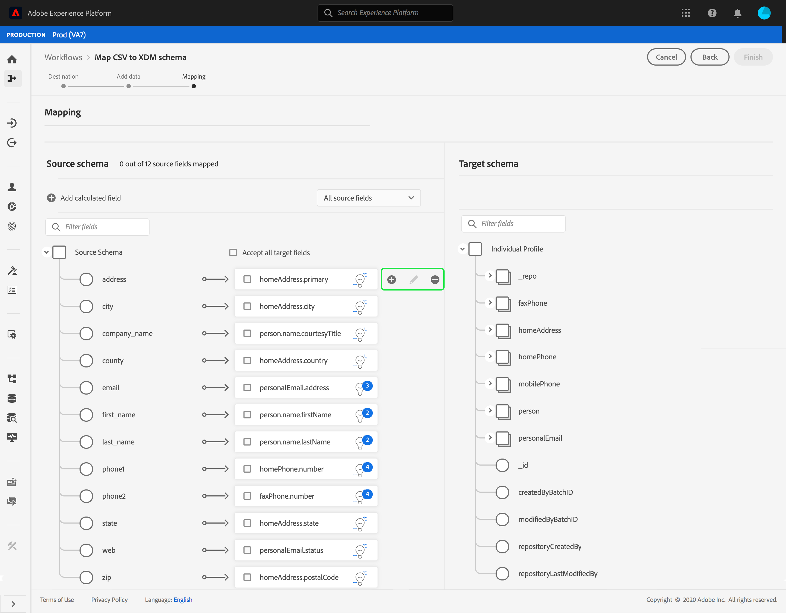

# Zuordnen einer CSV-Datei zu einem vorhandenen XDM-Schema

>[!NOTE]
>
>In diesem Dokument wird beschrieben, wie Sie eine CSV-Datei einem vorhandenen XDM-Schema zuordnen. Informationen zur Verwendung des AI-generierten Schemaempfehlung-Tools (derzeit in der Beta-Phase) finden Sie im Dokument unter [Zuordnen einer CSV-Datei mithilfe von Empfehlungen für maschinelles Lernen](./recommendations.md).

So erfassen Sie CSV-Daten in [!DNL Adobe Experience Platform]müssen die Daten einer [!DNL Experience Data Model] (XDM)-Schema. In diesem Tutorial wird beschrieben, wie Sie eine CSV-Datei mithilfe der [!DNL Platform] -Benutzeroberfläche.

## Erste Schritte

Dieses Tutorial setzt ein Verständnis der folgenden Komponenten von voraus [!DNL Platform]:

- [[!DNL Experience Data Model (XDM System)]](../../../xdm/home.md): Das standardisierte Framework, mit dem Kundenerlebnisdaten von [!DNL Platform] organisiert werden.
- [Batch-Erfassung](../../batch-ingestion/overview.md): Die Methode, mit der [!DNL Platform] erfasst Daten aus vom Benutzer bereitgestellten Datendateien.
- [Adobe Experience Platform-Datenvorbereitung](../../batch-ingestion/overview.md): Eine Suite von Funktionen, mit denen Sie aufgenommene Daten entsprechend XDM-Schemas zuordnen und transformieren können. Die Dokumentation zu [Funktionen zur Datenvorbereitung](../../../data-prep/functions.md) ist besonders für die Schemazuordnung relevant.

Für dieses Tutorial müssen Sie außerdem bereits einen Datensatz erstellt haben, in den Sie Ihre CSV-Daten aufnehmen können. Anweisungen zum Erstellen eines Datensatzes in der Benutzeroberfläche finden Sie in der [Tutorial zur Datenerfassung](../ingest-batch-data.md).

## Ziel auswählen

Anmelden bei [[!DNL Adobe Experience Platform]](https://platform.adobe.com) und wählen Sie **[!UICONTROL Workflows]** über die linke Navigationsleiste, um auf die **[!UICONTROL Workflows]** Arbeitsbereich.

Aus dem **[!UICONTROL Workflows]** Bildschirm, wählen Sie **[!UICONTROL Zuordnen von CSV zu XDM-Schema]** unter **[!UICONTROL Datenerfassung]** und wählen Sie **[!UICONTROL Launch]**.

Die **[!UICONTROL Zuordnen von CSV zu XDM-Schema]** wird der Workflow angezeigt, beginnend mit dem **[!UICONTROL Ziel]** Schritt. Wählen Sie einen Datensatz für eingehende Daten aus, die in aufgenommen werden sollen. Sie können entweder einen vorhandenen Datensatz verwenden oder einen neuen erstellen.

**Verwenden eines vorhandenen Datensatzes**

Um Ihre CSV-Daten in einen vorhandenen Datensatz zu erfassen, wählen Sie **[!UICONTROL Vorhandenen Datensatz verwenden]**. Sie können entweder einen vorhandenen Datensatz mit der Suchfunktion abrufen oder durch Scrollen durch die Liste der vorhandenen Datensätze im Bereich blättern.

Um Ihre CSV-Daten in einen neuen Datensatz zu erfassen, wählen Sie **[!UICONTROL Neuen Datensatz erstellen]** und geben Sie einen Namen und eine Beschreibung für den Datensatz in die entsprechenden Felder ein. Wählen Sie ein Schema entweder mithilfe der Suchfunktion aus oder scrollen Sie durch die Liste der bereitgestellten Schemata. Wählen Sie **[!UICONTROL Weiter]** aus, um fortzufahren.

## Hinzufügen von Daten

Der Schritt **[!UICONTROL Daten hinzufügen]** wird angezeigt. Ziehen Sie Ihre CSV-Datei per Drag-and-Drop in den vorgesehenen Bereich oder wählen Sie **[!UICONTROL Dateien auswählen]** , um Ihre CSV-Datei manuell einzugeben.

Die **[!UICONTROL Beispieldaten]** wird nach dem Hochladen der Datei angezeigt, wobei die ersten zehn Datenzeilen angezeigt werden. Nachdem Sie bestätigt haben, dass die Daten erwartungsgemäß hochgeladen wurden, wählen Sie **[!UICONTROL Nächste]**.

## Zuordnen von CSV-Feldern zu XDM-Schemafeldern

Die **[!UICONTROL Zuordnung]** angezeigt. Die Spalten der CSV-Datei sind unter **[!UICONTROL Quellfeld]** mit den entsprechenden XDM-Schemafeldern, die unter aufgeführt sind **[!UICONTROL Zielfeld]**.

[!DNL Platform] bietet automatisch intelligente Empfehlungen für automatisch zugeordnete Felder, die auf dem von Ihnen ausgewählten Zielschema oder Datensatz basieren. Sie können die Zuordnungsregeln manuell an Ihre Anwendungsfälle anpassen.

Um alle automatisch generierenden Zuordnungswerte zu akzeptieren, aktivieren Sie das Kontrollkästchen mit der Bezeichnung[!UICONTROL Alle Zielfelder akzeptieren]&quot;.

Manchmal ist mehr als eine Empfehlung für das Quellschema verfügbar. In diesem Fall zeigt die Zuordnungskarte die auffälligste Empfehlung an, gefolgt von einem blauen Kreis, der die Anzahl der verfügbaren zusätzlichen Empfehlungen enthält. Durch Auswahl des Glühbirnensymbols wird eine Liste der zusätzlichen Empfehlungen angezeigt. Sie können eine der alternativen Empfehlungen auswählen, indem Sie das Kontrollkästchen neben der Empfehlung aktivieren, die Sie stattdessen zuordnen möchten.

Alternativ können Sie Ihr Quellschema manuell Ihrem Zielschema zuordnen. Bewegen Sie den Mauszeiger über das Quellschema, das Sie zuordnen möchten, und wählen Sie dann das Pluszeichen aus.

Die **[!UICONTROL Quelle dem Zielfeld zuordnen]** Popup angezeigt. Hier können Sie auswählen, welches Feld Sie zuordnen möchten, gefolgt von **[!UICONTROL Speichern]** , um Ihre neue Zuordnung hinzuzufügen.

Wenn Sie eine der Zuordnungen entfernen möchten, halten Sie den Mauszeiger über diese Zuordnung und wählen Sie dann das Minussymbol aus.

### Berechnetes Feld hinzufügen {#add-calculated-field}

Berechnete Felder ermöglichen die Erstellung von Werten anhand der Attribute im Eingabeschema. Diese Werte können dann Attributen im Zielschema zugewiesen und mit einem Namen und einer Beschreibung versehen werden, um eine einfachere Referenz zu ermöglichen.

Wählen Sie die **[!UICONTROL Berechnetes Feld hinzufügen]** zum Fortfahren.

Das Bedienfeld **[!UICONTROL Berechnetes Feld erstellen]** wird angezeigt. Das linke Dialogfeld enthält die Felder, Funktionen und Operatoren, die in berechneten Feldern unterstützt werden. Wählen Sie eine der Registerkarten aus, um Funktionen, Felder oder Operatoren zum Ausdruckseditor hinzuzufügen.

| Tab | Beschreibung |
| --------- | ----------- |
| Felder | Auf der Registerkarte „Felder“ werden die im Quellschema verfügbaren Felder und Attribute aufgelistet. |
| Funktionen | Auf der Registerkarte „Funktionen“ werden die Funktionen aufgelistet, die zur Transformation der Daten verfügbar sind. Weitere Informationen zu den Funktionen, die Sie in berechneten Feldern verwenden können, finden Sie im Handbuch [Verwendung der Funktionen zur Datenvorbereitung (Mapper)](../../../data-prep/functions.md). |
| Operatoren | Auf der Registerkarte „Operatoren“ werden die zur Transformation der Daten verfügbaren Operatoren aufgelistet. |

Mithilfe des Ausdruckseditors in der Mitte können Sie manuell Felder, Funktionen und Operatoren hinzufügen. Wählen Sie den Editor aus, um mit der Erstellung eines Ausdrucks zu beginnen.

Wählen Sie **[!UICONTROL Speichern]** aus, um fortzufahren.

Der Zuordnungsbildschirm wird mit dem neu erstellten Quellfeld erneut angezeigt. Wenden Sie das entsprechende Zielfeld an und wählen Sie **[!UICONTROL Beenden]** aus, um die Zuordnung abzuschließen.

## Überwachen der Datenerfassung

Nachdem Ihre CSV-Datei zugeordnet und erstellt wurde, können Sie die Daten überwachen, die über sie erfasst werden. Weitere Informationen zur Überwachung der Datenerfassung finden Sie im Tutorial zu [Überwachen der Datenerfassung](../../../ingestion/quality/monitor-data-ingestion.md).

## Nächste Schritte

In diesem Tutorial haben Sie erfolgreich eine flache CSV-Datei einem XDM-Schema zugeordnet und in [!DNL Platform]. Diese Daten können jetzt nachgelagert verwendet werden [!DNL Platform] Dienste wie [!DNL Real-time Customer Profile]. Siehe Übersicht für [[!DNL Real-time Customer Profile]](../../../profile/home.md) für weitere Informationen.
