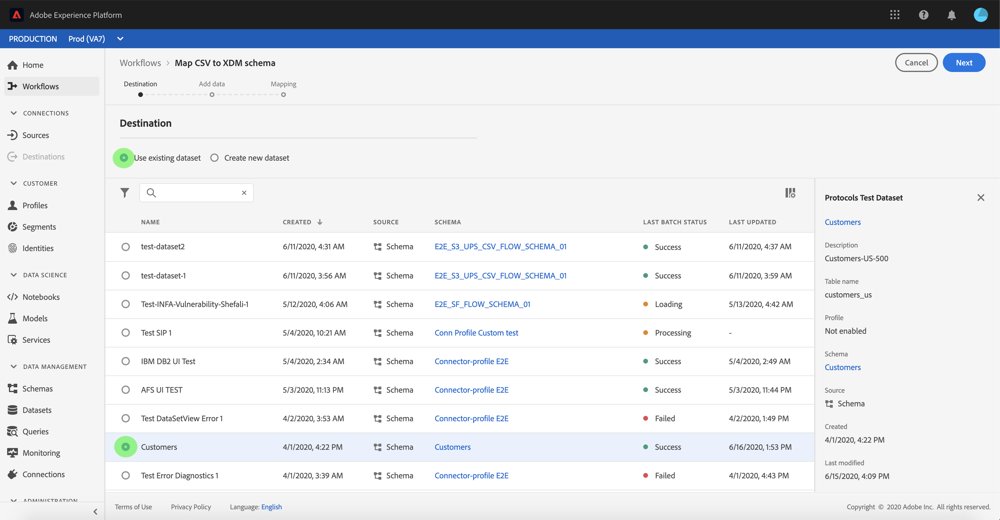

# Zuordnen einer CSV-Datei zu einem vorhandenen XDM-Schema

>[!NOTE]
>
>In diesem Dokument wird beschrieben, wie Sie eine CSV-Datei einem vorhandenen XDM-Schema zuordnen. Informationen zur Verwendung des Tools für KI-generierte Schemaempfehlungen (derzeit in der Beta-Phase) finden Sie im Dokument [Zuordnen einer CSV-Datei mithilfe von Machine-Learning-Empfehlungen](./recommendations.md).

Um CSV-Daten in [!DNL Adobe Experience Platform] aufzunehmen, müssen die Daten einem [!DNL Experience Data Model] (XDM)-Schema zugeordnet sein. In diesem Tutorial wird beschrieben, wie Sie eine CSV-Datei mithilfe der [!DNL Platform]-Benutzeroberfläche einem XDM-Schema zuordnen.

## Erste Schritte

Dieses Tutorial setzt ein Grundverständnis der folgenden Komponenten von [!DNL Platform] voraus.

- [[!DNL Experience Data Model (XDM System)]](../../../xdm/home.md): Das standardisierte Framework, mit dem Kundenerlebnisdaten von [!DNL Platform] organisiert werden.
- [Batch-Aufnahme](../../batch-ingestion/overview.md): Die Methode, mit der [!DNL Platform] Daten aus Datendateien, die vom Benutzer bereitgestellt werden, aufnimmt.
- [Adobe Experience Platform-Datenvorbereitung](../../batch-ingestion/overview.md): Eine Reihe von Funktionen, mit denen Sie aufgenommene Daten entsprechend zu XDM-Schemata zuordnen und transformieren können. Die Dokumentation [Funktionen zur Datenvorbereitung](../../../data-prep/functions.md) ist besonders für die Schemazuordnung relevant.

Für dieses Tutorial müssen Sie außerdem bereits einen Datensatz erstellt haben, in den Sie Ihre CSV-Daten aufnehmen können. Anweisungen zum Erstellen eines Datensatzes in der Benutzeroberfläche finden Sie im [Tutorial zur Datenaufnahme](../ingest-batch-data.md).

## Auswählen eines Ziels

Melden Sie sich bei [[!DNL Adobe Experience Platform]](https://platform.adobe.com) an und wählen Sie **[!UICONTROL Workflows]** über die linke Navigationsleiste aus, um auf den Arbeitsbereich **[!UICONTROL Workflows]** zuzugreifen.

Wählen Sie auf dem **[!UICONTROL Workflows]**-Bildschirm im Abschnitt **[!UICONTROL Datenaufnahme]** die Option **[!UICONTROL CSV zu XDM-Schema zuordnen]** aus und klicken Sie dann auf **[!UICONTROL Starten]**.

Der Workflow **[!UICONTROL CSV zu XDM-Schema zuordnen]** wird angezeigt, beginnend mit dem Schritt **[!UICONTROL Ziel]**. Wählen Sie einen Datensatz aus, in den eingehende Daten aufgenommen werden sollen. Sie können entweder einen vorhandenen Datensatz verwenden oder einen neuen erstellen.

**Verwenden eines vorhandenen Datensatzes**

Um Ihre CSV-Daten in einen vorhandenen Datensatz einzufügen, wählen Sie **[!UICONTROL Vorhandenen Datensatz verwenden]** aus. Sie können einen vorhandenen Datensatz entweder über die Suchfunktion abrufen oder indem Sie durch die Liste der vorhandenen Datensätze im Dropdown-Menü scrollen.

Um Ihre CSV-Daten in einen neuen Datensatz aufzunehmen, wählen Sie **[!UICONTROL Neuen Datensatz erstellen]** und geben Sie einen Namen und eine Beschreibung für den Datensatz in die entsprechenden Felder ein. Wählen Sie ein Schema entweder mithilfe der Suchfunktion aus oder scrollen Sie durch die Liste der bereitgestellten Schemata. Klicken Sie auf **[!UICONTROL Weiter]**, um fortzufahren.

## Daten hinzufügen

Der Schritt **[!UICONTROL Daten hinzufügen]** wird angezeigt. Ziehen Sie Ihre CSV-Datei per Drag-and-Drop in den vorgesehenen Bereich oder klicken Sie auf **[!UICONTROL Dateien auswählen]**, um Ihre CSV-Datei manuell einzugeben.

Nach dem Hochladen der Datei wird der Abschnitt **[!UICONTROL Beispieldaten]** angezeigt, wobei die ersten zehn Datenzeilen angezeigt werden. Nachdem Sie bestätigt haben, dass die Daten erwartungsgemäß hochgeladen wurden, klicken Sie auf **[!UICONTROL Weiter]**.

## Zuordnen von CSV-Feldern zu XDM-Schemafeldern

Der Schritt **[!UICONTROL Zuordnung]** wird angezeigt. Die Spalten der CSV-Datei werden unter **[!UICONTROL Quellfeld]** aufgeführt, mit den entsprechenden XDM-Schemafeldern, die unter **[!UICONTROL Zielfeld]** aufgeführt sind.

[!DNL Platform] bietet automatisch intelligente Empfehlungen für automatisch zugeordnete Felder, die auf dem von Ihnen ausgewählten Zielschema oder Datensatz basieren. Sie können die Zuordnungsregeln manuell an Ihre Anwendungsfälle anpassen.

Um alle automatisch generierten Zuordnungswerte zu akzeptieren, aktivieren Sie das Kontrollkästchen mit der Bezeichnung [!UICONTROL Alle Zielfelder akzeptieren].

Manchmal ist mehr als eine Empfehlung für das Quellschema verfügbar. In diesem Fall zeigt die Zuordnungskarte die beste Empfehlung an, gefolgt von einem blauen Kreis, der die Anzahl der verfügbaren zusätzlichen Empfehlungen enthält. Durch Auswahl des Glühbirnensymbols wird eine Liste der zusätzlichen Empfehlungen angezeigt. Sie können eine der alternativen Empfehlungen auswählen, indem Sie das Kontrollkästchen neben der Empfehlung aktivieren, die Sie stattdessen zuordnen möchten.

Alternativ können Sie Ihr Quellschema manuell Ihrem Zielschema zuordnen. Bewegen Sie dazu den Mauszeiger über das Quellschema, das Sie zuordnen möchten, und wählen Sie dann das Pluszeichen aus.

Das Popup-Fenster **[!UICONTROL Quelle dem Zielfeld zuordnen]** wird angezeigt. Hier können Sie auswählen, welches Feld Sie zuordnen möchten, gefolgt von **[!UICONTROL Speichern]**, um Ihre neue Zuordnung hinzuzufügen.

Wenn Sie eine der Zuordnungen entfernen möchten, halten Sie den Mauszeiger über diese Zuordnung und wählen Sie dann das Minussymbol aus.

### Berechnetes Feld hinzufügen {#add-calculated-field}

Berechnete Felder ermöglichen die Erstellung von Werten anhand der Attribute im Eingabeschema. Diese Werte können dann Attributen im Zielschema zugewiesen und mit einem Namen und einer Beschreibung versehen werden, um eine einfachere Referenz zu ermöglichen.

Klicken Sie auf die Schaltfläche **[!UICONTROL Berechnetes Feld hinzufügen]**, um fortzufahren.

Das Bedienfeld **[!UICONTROL Berechnetes Feld erstellen]** wird angezeigt. Das linke Dialogfeld enthält die Felder, Funktionen und Operatoren, die in berechneten Feldern unterstützt werden. Wählen Sie eine der Registerkarten aus, um Funktionen, Felder oder Operatoren zum Ausdruckseditor hinzuzufügen.

| Tab | Beschreibung |
| --------- | ----------- |
| Felder | Auf der Registerkarte „Felder“ werden die im Quellschema verfügbaren Felder und Attribute aufgelistet. |
| Funktionen | Auf der Registerkarte „Funktionen“ werden die Funktionen aufgelistet, die zur Transformation der Daten verfügbar sind. Weitere Informationen zu den Funktionen, die Sie in berechneten Feldern verwenden können, finden Sie im Handbuch [Verwendung der Funktionen zur Datenvorbereitung (Mapper)](../../../data-prep/functions.md). |
| Operatoren | Auf der Registerkarte „Operatoren“ werden die zur Transformation der Daten verfügbaren Operatoren aufgelistet. |

Mithilfe des Ausdruckseditors in der Mitte können Sie manuell Felder, Funktionen und Operatoren hinzufügen. Wählen Sie den Editor aus, um mit der Erstellung eines Ausdrucks zu beginnen.

Wählen Sie **[!UICONTROL Speichern]** aus, um fortzufahren.

Der Zuordnungsbildschirm wird mit dem neu erstellten Quellfeld erneut angezeigt. Wenden Sie das entsprechende Zielfeld an und wählen Sie **[!UICONTROL Beenden]** aus, um die Zuordnung abzuschließen.

## Überwachen der Datenaufnahme

Nachdem Ihre CSV-Datei erstellt und zugeordnet wurde, können Sie die Daten überwachen, die über sie aufgenommen werden. Weitere Informationen zur Überwachung der Datenaufnahme finden Sie im Tutorial [Überwachen der Datenaufnahme](../../../ingestion/quality/monitor-data-ingestion.md).

## Nächste Schritte

In diesem Tutorial haben Sie erfolgreich eine einfache CSV-Datei einem XDM-Schema zugeordnet und in [!DNL Platform] aufgenommen. Diese Daten können jetzt von nachgelagerten [!DNL Platform]-Services wie [!DNL Real-Time Customer Profile] verwendet werden. Weitere Informationen finden Sie in der Übersicht von [[!DNL Real-Time Customer Profile]](../../../profile/home.md).
