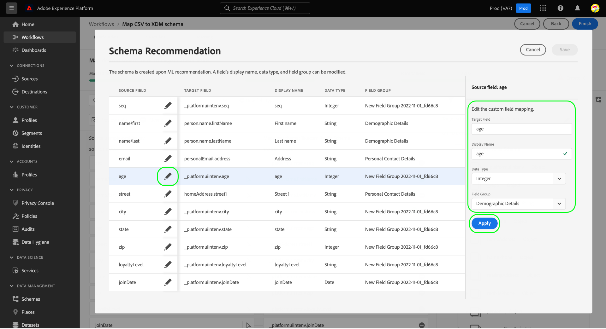

# Weisen Sie mithilfe von AI-generierten Empfehlungen (Beta) eine CSV-Datei einem XDM-Schema zu.

>[!IMPORTANT]
>
>Diese Funktion befindet sich derzeit in der Beta-Phase und Ihr Unternehmen hat möglicherweise noch keinen Zugriff darauf. Dokumentation und Funktionalität können sich ändern.
>
>Informationen zu den allgemein verfügbaren CSV-Zuordnungsfunktionen in Platform finden Sie im Dokument unter [Zuordnen einer CSV-Datei zu einem vorhandenen Schema](./existing-schema.md).

So erfassen Sie CSV-Daten in [!DNL Adobe Experience Platform]müssen die Daten einer [!DNL Experience Data Model] (XDM)-Schema. Sie können die Zuordnung zu [ein vorhandenes Schema](./existing-schema.md)Wenn Sie jedoch nicht genau wissen, welches Schema verwendet werden soll oder wie es strukturiert sein soll, können Sie dynamische Empfehlungen auf der Grundlage von ML-Modellen (Machine Learning) in der Platform-Benutzeroberfläche verwenden.

## Erste Schritte

Dieses Tutorial setzt ein Verständnis der folgenden Komponenten von voraus [!DNL Platform]:

* [[!DNL Experience Data Model (XDM System)]](../../../xdm/home.md): Das standardisierte Framework, mit dem Kundenerlebnisdaten von [!DNL Platform] organisiert werden.
   * Sie müssen mindestens das Konzept der [Verhalten in XDM](../../../xdm/home.md#data-behaviors), sodass Sie entscheiden können, ob Sie Ihre Daten einer [!UICONTROL Profil] -Klasse (Datensatzverhalten) oder [!UICONTROL ExperienceEvent] -Klasse (Zeitreihenverhalten).
* [Batch-Erfassung](../../batch-ingestion/overview.md): Die Methode, mit der [!DNL Platform] erfasst Daten aus vom Benutzer bereitgestellten Datendateien.
* [Adobe Experience Platform-Datenvorbereitung](../../batch-ingestion/overview.md): Eine Suite von Funktionen, mit denen Sie aufgenommene Daten entsprechend XDM-Schemas zuordnen und transformieren können. Die Dokumentation zu [Funktionen zur Datenvorbereitung](../../../data-prep/functions.md) ist speziell für die Schemazuordnung relevant.

## Angeben von Datenflussdetails

Wählen Sie in der Benutzeroberfläche &quot;Experience Platform&quot;die Option **[!UICONTROL Quellen]** in der linken Navigation. Im **[!UICONTROL Katalog]** Ansicht, navigieren Sie zur **[!UICONTROL Lokales System]** Kategorie. under **[!UICONTROL Lokaler Datei-Upload]** auswählen **[!UICONTROL Daten hinzufügen]**.

![Die [!UICONTROL Quellen] Katalog in der Platform-Benutzeroberfläche mit [!UICONTROL Daten hinzufügen] under [!UICONTROL Lokaler Datei-Upload] ausgewählt](../../images/tutorials/map-csv-recommendations/local-file-upload.png)

Die **[!UICONTROL CSV-XDM-Schema zuordnen]** wird der Workflow angezeigt, beginnend mit dem **[!UICONTROL Datenflussdetails]** Schritt.

Auswählen **[!UICONTROL Erstellen eines neuen Schemas mit ML-Empfehlungen]**, wodurch neue Steuerelemente angezeigt werden. Wählen Sie die entsprechende Klasse für die CSV-Daten aus, die Sie zuordnen möchten ([!UICONTROL Profil] oder [!UICONTROL ExperienceEvent]). Sie können optional das Dropdown-Menü verwenden, um die relevante Branche für Ihr Unternehmen auszuwählen, oder Sie lassen es leer, wenn die bereitgestellten Kategorien nicht für Sie zutreffen. Wenn Ihr Unternehmen unter einer [B2B](../../../xdm/tutorials/relationship-b2b.md) -Modell, wählen Sie die **[!UICONTROL B2B-Daten]** aktivieren.

![Die [!UICONTROL Datenflussdetails] Schritt mit der ausgewählten ML-Empfehlungsoption. [!UICONTROL Profil] für die Klasse ausgewählt ist und [!UICONTROL Telekommunikation] für die Industrie ausgewählt](../../images/tutorials/map-csv-recommendations/select-class-and-industry.png)

Geben Sie von hier einen Namen für das Schema an, das aus den CSV-Daten erstellt wird, und einen Namen für den Ausgabedatensatz, der die unter diesem Schema erfassten Daten enthält.

Sie können optional die folgenden zusätzlichen Funktionen für den Datenfluss konfigurieren, bevor Sie fortfahren:

| Name der Eingabe | Beschreibung |
| --- | --- |
| [!UICONTROL Beschreibung] | Eine Beschreibung für den Datenfluss. |
| [!UICONTROL Fehlerdiagnose] | Wenn diese Option aktiviert ist, werden Fehlermeldungen für neu aufgenommene Batches generiert, die beim Abrufen des entsprechenden Batches im [API](../../batch-ingestion/api-overview.md). |
| [!UICONTROL Partielle Erfassung] | Wenn diese Option aktiviert ist, werden gültige Datensätze für neue Batch-Daten innerhalb eines bestimmten Fehlerschwellenwerts erfasst. Mit diesem Schwellenwert können Sie den Prozentsatz der akzeptablen Fehler konfigurieren, bevor der gesamte Batch fehlschlägt. |
| [!UICONTROL Datenflussdetails] | Geben Sie einen Namen und eine optionale Beschreibung für den Datenfluss ein, der die CSV-Daten in Platform bringt. Dem Datenfluss wird beim Starten dieses Workflows automatisch ein Standardname zugewiesen. Das Ändern des Namens ist optional. |
| [!UICONTROL Warnhinweise] | Aus einer Liste von [Warnhinweise innerhalb des Produkts](../../../observability/alerts/overview.md) die Sie bezüglich des Status des Datenflusses erhalten möchten, nachdem er initiiert wurde. |

{style=&quot;table-layout:auto&quot;}

Wenn Sie mit der Konfiguration des Datenflusses fertig sind, wählen Sie **[!UICONTROL Nächste]**.

![Die [!UICONTROL Datenflussdetails] Abschnitt abgeschlossen](../../images/tutorials/map-csv-recommendations/dataflow-detail-complete.png)

## Auswählen von Daten

Im **[!UICONTROL Daten auswählen]** Schritt, verwenden Sie die linke Spalte, um Ihre CSV-Datei hochzuladen. Sie können **[!UICONTROL Dateien auswählen]** , um ein Dateiexplorer-Dialogfeld zur Auswahl der Datei zu öffnen, oder Sie können die Datei direkt in die Spalte ziehen und dort ablegen.

![Die [!UICONTROL Dateien auswählen] Schaltflächen- und Drag-and-Drop-Bereich, der innerhalb der [!UICONTROL Daten auswählen] Schritt](../../images/tutorials/map-csv-recommendations/upload-files.png)

Nach dem Hochladen der Datei wird ein Abschnitt mit Beispieldaten angezeigt, in dem die ersten zehn Zeilen der empfangenen Daten angezeigt werden, sodass Sie überprüfen können, ob die Daten korrekt hochgeladen wurden. Klicken Sie auf **[!UICONTROL Weiter]**, um fortzufahren.

## Konfigurieren von Schemazuordnungen

Die ML-Modelle werden ausgeführt, um basierend auf Ihrer Datenflug-Konfiguration und Ihrer hochgeladenen CSV-Datei ein neues Schema zu generieren. Wenn der Prozess abgeschlossen ist, wird die [!UICONTROL Zuordnung] -Schritt wird gefüllt, um die Zuordnungen für jedes einzelne Feld neben der vollständig navigierbaren Ansicht der generierten Schemastruktur anzuzeigen.

![Die [!UICONTROL Zuordnung] Schritt in der Benutzeroberfläche mit allen zugeordneten CSV-Feldern und der daraus resultierenden Schemastruktur](../../images/tutorials/map-csv-recommendations/schema-generated.png)

Von hier aus können Sie optional [Bearbeiten der Feldzuordnungen](#edit-mappings) oder [Ändern der Feldergruppen, denen sie zugeordnet sind](#edit-schema) nach Ihren Bedürfnissen. Wenn Sie zufrieden sind, wählen Sie **[!UICONTROL Beenden]** , um die Zuordnung abzuschließen und den zuvor konfigurierten Datenfluss zu starten. Die CSV-Daten werden im System erfasst und basierend auf der generierten Schemastruktur in einen Datensatz eingefügt, der für nachgelagerte Platform-Dienste nutzbar ist.

![Die [!UICONTROL Beenden] markierte Schaltfläche zum Abschließen des CSV-Zuordnungsprozesses](../../images/tutorials/map-csv-recommendations/finish-mapping.png)

### Feldzuordnungen bearbeiten {#edit-mappings}

Verwenden Sie die Vorschau für die Feldzuordnung, um vorhandene Zuordnungen zu bearbeiten oder vollständig zu entfernen. Weitere Informationen zum Verwalten eines Zuordnungssatzes in der Benutzeroberfläche finden Sie im Abschnitt [UI-Handbuch für die Datenvorbereitung](../../../data-prep/ui/mapping.md#mapping-interface).

### Bearbeiten von Feldergruppen {#edit-field-groups}

Die CSV-Felder werden mithilfe von ML-Modellen automatisch vorhandenen XDM-Feldergruppen zugeordnet. Wenn Sie die Feldergruppe für ein bestimmtes CSV-Feld ändern möchten, wählen Sie **[!UICONTROL Bearbeiten]** neben der Schemastruktur.

![Die [!UICONTROL Bearbeiten] neben der Schemastruktur ausgewählte Schaltfläche](../../images/tutorials/map-csv-recommendations/edit-schema-structure.png)

Ein Dialogfeld wird angezeigt, in dem Sie den Anzeigenamen, den Datentyp und die Feldergruppe für jedes Feld in der Zuordnung bearbeiten können. Wählen Sie das Bearbeitungssymbol () neben einem Quellfeld klicken, um dessen Details in der rechten Spalte zu bearbeiten, bevor Sie **[!UICONTROL Anwenden]**.

Wenn Sie mit der Anpassung der Schemaempfehlungen für Ihre Quellfelder fertig sind, wählen Sie **[!UICONTROL Speichern]** , um die Änderungen anzuwenden.

## Nächste Schritte

In diesem Handbuch wurde beschrieben, wie Sie eine CSV-Datei mithilfe von AI-generierten Empfehlungen einem XDM-Schema zuordnen, sodass Sie diese Daten durch Batch-Erfassung in Platform importieren können.

Anweisungen zum Zuordnen einer CSV-Datei zu einem vorhandenen Schema finden Sie im Abschnitt [vorhandener Schema-Zuordnungs-Workflow](./existing-schema.md). Informationen zum Echtzeit-Streaming von Daten an Platform über vordefinierte Quellverbindungen finden Sie im Abschnitt [Quellen - Übersicht](../../../sources/home.md).
