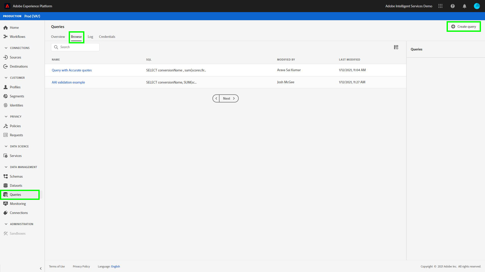

# Analyse von Attributionswerten mithilfe von Query Service

Jede Zeile in den Daten stellt eine Konversion dar, in der Informationen für verwandte Touchpoints als Array von Strukturen unter dem `touchpointsDetail` Spalte.

| Touchpoint-Informationen | Spalte |
| ---------------------- | ------ |
| Touchpoint-Name | `touchpointsDetail. touchpointName` |
| Touchpoint-Kanal | `touchpointsDetail.touchPoint.mediaChannel` |
| Algorithmische Werte für Touchpoint-Attribution AI | <li>`touchpointsDetail.scores.algorithmicSourced`</li> <li> `touchpointsDetail.scores.algorithmicInfluenced` </li> |

## Suchen nach Datenpfaden

Wählen Sie in der Adobe Experience Platform-Benutzeroberfläche die Option **[!UICONTROL Datensätze]** in der linken Navigation. Die **[!UICONTROL Datensätze]** angezeigt. Wählen Sie als Nächstes die **[!UICONTROL Durchsuchen]** und suchen Sie den Ausgabedatensatz für Ihre Attribution AI-Bewertungen.


Wählen Sie Ihren Ausgabedatensatz aus. Die Seite mit der Datensatzaktivität wird angezeigt.


Wählen Sie auf der Seite Datensatzaktivität die Option **[!UICONTROL Vorschau des Datensatzes anzeigen]** in der oberen rechten Ecke, um eine Vorschau Ihrer Daten anzuzeigen und sicherzustellen, dass sie erwartungsgemäß erfasst wurden.


Wählen Sie nach der Vorschau Ihrer Daten das Schema in der rechten Leiste aus. Es wird ein Popover mit dem Schemanamen und der Beschreibung angezeigt. Wählen Sie den Hyperlink für den Schemanamen aus, um zum Scoring-Schema umzuleiten.


Mithilfe des Scoring-Schemas können Sie einen Wert auswählen oder suchen. Nach der Auswahl wird die **[!UICONTROL Feldeigenschaften]** Seitenleiste öffnet sich, sodass Sie den Pfad kopieren können, der zum Erstellen von Abfragen verwendet werden soll.


## Zugriff auf Query Service

Um über die Platform-Benutzeroberfläche auf Query Service zuzugreifen, wählen Sie zunächst **[!UICONTROL Abfragen]** Wählen Sie im linken Navigationsbereich die Option **[!UICONTROL Durchsuchen]** Registerkarte. Eine Liste der zuvor gespeicherten Abfragen wird geladen.



Wählen Sie als Nächstes **[!UICONTROL Abfrage erstellen]** in der oberen rechten Ecke. Der Abfrage-Editor wird geladen. Mithilfe des Abfrage-Editors können Sie mit der Erstellung von Abfragen mit Ihren Scoring-Daten beginnen.


Weitere Informationen zum Abfrage-Editor finden Sie unter [Benutzerhandbuch zum Abfrage-Editor](../../query-service/ui/user-guide.md).

## Abfragevorlagen für die Attributionswertanalyse

Die folgenden Abfragen können als Vorlage für verschiedene Bewertungsanalyseszenarien verwendet werden. Sie müssen die Variable `_tenantId` und `your_score_output_dataset` mit den entsprechenden Werten, die in Ihrem Scoring-Ausgabeschema gefunden wurden.

>[!NOTE]
>
> Je nachdem, wie Ihre Daten erfasst wurden, werden die unten verwendeten Werte wie `timestamp` kann in einem anderen Format vorliegen.

### Validierungsbeispiele

**Gesamtanzahl der Konversionen nach Konversionsereignis (innerhalb eines Konvertierungsfensters)**

```sql
    SELECT conversionName,
           SUM(scores.firstTouch) as total_conversions,
           SUM(scores.algorithmicSourced) as total_attributed_conversions
    FROM
        (SELECT
                _tenantId.your_score_output_dataset.conversionName
                    as conversionName,
                inline(_tenantId.your_score_output_dataset.touchpointsDetail),
                timestamp as conversion_timestamp
         FROM
                your_score_output_dataset
        )
    WHERE
        conversion_timestamp >= '2020-07-16'
      AND
        conversion_timestamp <  '2020-10-14'
    GROUP BY
        conversionName
```

**Gesamtanzahl der reinen Konversionsereignisse (innerhalb eines Konvertierungsfensters)**

```sql
    SELECT
        _tenantId.your_score_output_dataset.conversionName as conversionName,
        COUNT(1) as convOnly_cnt
    FROM
        your_score_output_dataset
    WHERE
        _tenantId.your_score_output_dataset.touchpointsDetail.touchpointName[0] IS NULL AND
        timestamp >= '2020-07-16' AND
        timestamp <  '2020-10-14'
    GROUP BY
        conversionName
```

### Beispiel für Trend-Analyse

**Anzahl der Konversionen pro Tag**

```sql
    SELECT conversionName,
           DATE(conversion_timestamp) as conversion_date,
           SUM(scores.firstTouch) as convertion_cnt
    FROM
        (SELECT
                _tenantId.your_score_output_dataset.conversionName as conversionName,
                inline(_tenantId.your_score_output_dataset.touchpointsDetail),
                timestamp as conversion_timestamp
         FROM
                your_score_output_dataset
        )
    GROUP BY
        conversionName, DATE(conversion_timestamp)
    ORDER BY
        conversionName, DATE(conversion_timestamp)
    LIMIT 20
```

### Beispiel einer Verteilungsanalyse

**Anzahl der Touchpoints auf Konversionspfaden nach definiertem Typ (innerhalb eines Konvertierungsfensters)**

```sql
    SELECT conversionName,
           touchpointName,
           COUNT(1) as tp_count
    FROM
        (SELECT
                _tenantId.your_score_output_dataset.conversionName as conversionName,
                inline(_tenantId.your_score_output_dataset.touchpointsDetail),
                timestamp as conversion_timestamp
         FROM
                your_score_output_dataset
        )
    WHERE
        conversion_timestamp >= '2020-07-16' AND
        conversion_timestamp < '2020-10-14' AND
        touchpointName IS NOT NULL
    GROUP BY
        conversionName, touchpointName
    ORDER BY
        conversionName, tp_count DESC
```

### Beispiele zur Insight-Generierung

**Inkrementelle Aufschlüsselung nach Touchpoint und Konversionsdatum (innerhalb eines Konvertierungsfensters)**

```sql
    SELECT conversionName,
           touchpointName,
           DATE(conversion_timestamp) as conversion_date,
           SUM(scores.algorithmicSourced) as incremental_units
    FROM
        (SELECT
                _tenantId.your_score_output_dataset.conversionName as conversionName,
                inline(_tenantId.your_score_output_dataset.touchpointsDetail),
                timestamp as conversion_timestamp
         FROM
                your_score_output_dataset
        )
    WHERE
        conversion_timestamp >= '2020-07-16' AND
        conversion_timestamp < '2020-10-14'  AND
        touchpointName IS NOT NULL
    GROUP BY
        conversionName, touchpointName, DATE(conversion_timestamp)
    ORDER BY
        conversionName, touchpointName, DATE(conversion_timestamp)
```

**Inkrementelle Aufschlüsselung nach Touchpoint- und Touchpoint-Datum (in einem Konvertierungsfenster)**

```sql
    SELECT conversionName,
           touchpointName,
           DATE(touchpoint.timestamp) as touchpoint_date,
           SUM(scores.algorithmicSourced) as incremental_units
    FROM
        (SELECT
                _tenantId.your_score_output_dataset.conversionName as conversionName,
                inline(_tenantId.your_score_output_dataset.touchpointsDetail),
                timestamp as conversion_timestamp
         FROM
                your_score_output_dataset
        )
    WHERE
        conversion_timestamp >= '2020-07-16' AND
        conversion_timestamp < '2020-10-14'  AND
        touchpointName IS NOT NULL
    GROUP BY
        conversionName, touchpointName, DATE(touchpoint.timestamp)
    ORDER BY
        conversionName, touchpointName, DATE(touchpoint.timestamp)
    LIMIT 20
```

**Aggregierte Werte für einen bestimmten Touchpoint-Typ für alle Scoring-Modelle (innerhalb eines Konvertierungsfensters)**

```sql
    SELECT
           conversionName,
           touchpointName,
           SUM(scores.algorithmicSourced) as total_incremental_units,
           SUM(scores.algorithmicInfluenced) as total_influenced_units,
           SUM(scores.uShape) as total_uShape_units,
           SUM(scores.decayUnits) as total_decay_units,
           SUM(scores.linear) as total_linear_units,
           SUM(scores.lastTouch) as total_lastTouch_units,
           SUM(scores.firstTouch) as total_firstTouch_units
    FROM
        (SELECT
                _tenantId.your_score_output_dataset.conversionName as conversionName,
                inline(_tenantId.your_score_output_dataset.touchpointsDetail),
                timestamp as conversion_timestamp
         FROM
                your_score_output_dataset
        )
    WHERE
        conversion_timestamp >= '2020-07-16' AND
        conversion_timestamp < '2020-10-14'  AND
        touchpointName = 'display'
    GROUP BY
        conversionName, touchpointName
    ORDER BY
        conversionName, touchpointName
```

**Erweitert - Pfadlängenanalyse**

Rufen Sie eine Pfadlängenverteilung für jeden Konversionsereignistyp ab:

```sql
    WITH agg_path AS (
          SELECT
            _tenantId.your_score_output_dataset.conversionName as conversionName,
            sum(size(_tenantId.your_score_output_dataset.touchpointsDetail)) as path_length
          FROM
            your_score_output_dataset
          WHERE
            _tenantId.your_score_output_dataset.touchpointsDetail.touchpointName[0] IS NOT NULL AND
            timestamp >= '2020-07-16' AND
            timestamp <  '2020-10-14'
          GROUP BY
            _tenantId.your_score_output_dataset.conversionName,
            eventMergeId
    )
    SELECT
        conversionName,
        path_length,
        count(1) as conversionPath_count
    FROM
        agg_path
    GROUP BY
        conversionName, path_length
    ORDER BY
        conversionName, path_length
```

**Erweitert - eindeutige Anzahl von Touchpoints bei der Analyse von Konversionspfaden**

Rufen Sie die Verteilung für die Anzahl unterschiedlicher Touchpoints auf einem Konversionspfad für jeden Konversionsereignistyp ab:

```sql
    WITH agg_path AS (
      SELECT
        _tenantId.your_score_output_dataset.conversionName as conversionName,
        size(array_distinct(flatten(collect_list(_tenantId.your_score_output_dataset.touchpointsDetail.touchpointName)))) as num_dist_tp
      FROM
        your_score_output_dataset
      WHERE
        _tenantId.your_score_output_dataset.touchpointsDetail.touchpointName[0] IS NOT NULL AND
        timestamp >= '2020-07-16' AND
        timestamp <  '2020-10-14'
      GROUP BY
        _tenantId.your_score_output_dataset.conversionName,
        eventMergeId
    )
    SELECT
        conversionName,
        num_dist_tp,
        count(1) as conversionPath_count
    FROM
     agg_path
    GROUP BY
        conversionName, num_dist_tp
    ORDER BY
        conversionName, num_dist_tp
```

### Beispiel für Schema-Abflachung und -Explosion

Diese Abfrage reduziert die Strukturspalte in mehrere Einzelspalten und explodiert Arrays in mehrere Zeilen. Dies hilft beim Transformieren von Attributionswerten in ein CSV-Format. Die Ausgabe dieser Abfrage weist in jeder Zeile eine Konversion und einen der Touchpoints auf, die dieser Konversion entsprechen.

>[!TIP]
>
> In diesem Beispiel müssen Sie `{COLUMN_NAME}` zusätzlich zu `_tenantId` und `your_score_output_dataset`. Die `COLUMN_NAME` kann die Werte der optionalen Weiterleitung durch Spaltennamen (Berichtsspalten) annehmen, die beim Konfigurieren Ihrer Attribution AI-Instanz hinzugefügt wurden. Sehen Sie sich Ihr Scoring-Ausgabeschema an, um die `{COLUMN_NAME}` Werte, die zum Abschließen dieser Abfrage erforderlich sind.

```sql
SELECT 
  segmentation,
  conversionName,
  scoreCreatedTime,
  aaid, _id, eventMergeId,
  conversion.eventType as conversion_eventType,
  conversion.quantity as conversion_quantity,
  conversion.eventSource as conversion_eventSource,
  conversion.priceTotal as conversion_priceTotal,
  conversion.timestamp as conversion_timestamp,
  conversion.geo as conversion_geo,
  conversion.receivedTimestamp as conversion_receivedTimestamp,
  conversion.dataSource as conversion_dataSource,
  conversion.productType as conversion_productType,
  conversion.passThrough.{COLUMN_NAME} as conversion_passThru_column,
  conversion.skuId as conversion_skuId,
  conversion.product as conversion_product,
  touchpointName,
  touchPoint.campaignGroup as tp_campaignGroup, 
  touchPoint.mediaType as tp_mediaType,
  touchPoint.campaignTag as tp_campaignTag,
  touchPoint.timestamp as tp_timestamp,
  touchPoint.geo as tp_geo,
  touchPoint.receivedTimestamp as tp_receivedTimestamp,
  touchPoint.passThrough.{COLUMN_NAME} as tp_passThru_column,
  touchPoint.campaignName as tp_campaignName,
  touchPoint.mediaAction as tp_mediaAction,
  touchPoint.mediaChannel as tp_mediaChannel,
  touchPoint.eventid as tp_eventid,
  scores.*
FROM (
  SELECT
        _tenantId.your_score_output_dataset.segmentation,
        _tenantId.your_score_output_dataset.conversionName,
        _tenantId.your_score_output_dataset.scoreCreatedTime,
        _tenantId.your_score_output_dataset.conversion,
        _id,
        eventMergeId,
        map_values(identityMap)[0][0].id as aaid,
        inline(_tenantId.your_score_output_dataset.touchpointsDetail)
  FROM
        your_score_output_dataset
)
```
