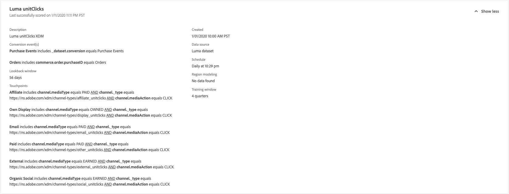

# Einblicke in Attribution AI

Die Instanzen des Attribution AI-Service bieten Einblicke, anhand derer Marketing-Entscheidungen in Bezug auf Marketing-Performance und ROI getroffen und gemessen werden können. Durch die Auswahl einer Dienstinstanz erhalten Sie Visualisierungen und Filter, anhand derer Sie die Auswirkungen jeder Kundeninteraktion in jeder Phase der Customer Journey verstehen können.

Dieses Dokument dient als Handbuch für die Interaktion mit Einblicken der Dienstinstanz in der Benutzeroberfläche von Adobe Intelligent Services.

## Erste Schritte

Um Einblicke für Attribution AI zu verwenden, benötigen Sie eine Dienstinstanz mit einem erfolgreichen Ausführungsstatus. Um eine neue Dienstinstanz zu erstellen, gehen Sie zum [Benutzeroberflächenhandbuch für Attribution AI](./user-guide.md). Wenn Sie kürzlich eine Dienstinstanz erstellt haben und diese sich noch in der Trainings- und Bewertungsphase befindet, warten Sie bitte 24 Stunden, bis sie fertig ist.

## Übersicht über Einblicke von Dienstinstanzen

Im [!DNL Adobe Experience Platform] Benutzeroberfläche, auswählen **[!UICONTROL Dienste]** in der linken Navigation. Der **[!UICONTROL Dienste]**-Browser wird geöffnet und zeigt verfügbare Adobe Intelligent Services an. Wählen Sie im Container für Attribution AI die Option **[!UICONTROL Öffnen]**.

Die Seite des Attribution AI-Service wird angezeigt. Auf dieser Seite werden Dienstinstanzen von Attribution AI aufgelistet und Informationen zu diesen angezeigt, einschließlich des Namens der Instanz, der Konversionsereignisse, der Häufigkeit der Ausführung der Instanz und des Status der letzten Aktualisierung. Wählen Sie einen Dienstinstanznamen aus, der gestartet werden soll.

>[!NOTE]
>
>Es können nur Dienstinstanzen ausgewählt werden, die erfolgreiche Bewertungsläufe abgeschlossen haben.

Als Nächstes wird die Seite mit den Einblicken für diese Dienstinstanz angezeigt. Hier werden Visualisierungen und eine Reihe von Filtern zur Interaktion mit Ihren Daten bereitgestellt. Die Visualisierungen und Filter werden in diesem Handbuch ausführlicher erläutert.

### Details zur Dienstinstanz

Um weitere Details für eine Dienstinstanz anzuzeigen, wählen Sie **[!UICONTROL Mehr anzeigen]** oben rechts.

Es wird eine detaillierte Liste angezeigt. Weitere Informationen zu den aufgelisteten Eigenschaften finden Sie im [Benutzerhandbuch für Attribution AI](./user-guide.md).

### Bearbeiten einer Instanz

Um eine Instanz zu bearbeiten, wählen Sie **[!UICONTROL Bearbeiten]** in der oberen rechten Navigation.

Das Dialogfeld &quot;Bearbeiten&quot;wird angezeigt, in dem Sie den Namen, die Beschreibung und die Scoring-Häufigkeit der Instanz bearbeiten können. Wenn der Instanzstatus deaktiviert ist, kann die Scoring-Häufigkeit nicht bearbeitet werden. Um Ihre Änderungen zu bestätigen und das Dialogfeld zu schließen, wählen Sie **[!UICONTROL Speichern]** unten rechts.

### Mehr Aktionen {#more-actions}

Die Schaltfläche **[!UICONTROL Mehr Aktionen]** befindet sich in der oberen rechten Navigation neben **[!UICONTROL Bearbeiten]**. Auswählen **[!UICONTROL Mehr Aktionen]** öffnet ein Dropdown-Menü, in dem Sie einen der folgenden Vorgänge auswählen können:

- **[!UICONTROL Klonen]**: Klont die Instanz.
- **[!UICONTROL Löschen]**: Löscht die Instanz.
- **[!UICONTROL Zusammenfassungsdaten herunterladen]**: Lädt eine CSV-Datei mit den Zusammenfassungsdaten herunter.
- **[!UICONTROL Auf Bewertungen zugreifen]**: Auswählen **[!UICONTROL Auf Bewertungen zugreifen]** leitet Sie zum [Tutorial zum Zugriff auf Bewertungen für Attribution AI](./download-scores.md).
- **[!UICONTROL Ausführungsverlauf anzeigen]**: Ein Popup-Fenster mit einer Liste aller mit der Dienstinstanz verbundenen Bewertungsläufe wird angezeigt.

## Filtern Ihrer Daten

Mithilfe von Attribution AI-Einblicken können Sie Ihre Daten filtern und die Visualisierungen der Benutzeroberfläche automatisch anhand Ihrer ausgewählten Filter aktualisieren.

### Konversionsereignis

Wenn Sie eine neue Instanz in Attribution AI erstellen, ist eines der erforderlichen Felder „Konversionsereignisse“. Konversionsereignisse sind Unternehmensziele, die die Auswirkungen von Marketing-Aktivitäten wie E-Commerce-Bestellungen, In-Store-Käufen und Website-Besuchen ermitteln.

Innerhalb der Instanz können Sie mit dem Dropdown-Menü **[!UICONTROL Konversionsereignisse]** eines der für Ihre Instanz definierten Ereignisse auswählen, um Ihre Daten zu filtern. Wenn Sie bestimmte Ereignisse auswählen, werden die Visualisierungen der Benutzeroberfläche so geändert, dass nur Konversionen aus diesen Ereignissen gefüllt werden.

### Attributionsmodell

Auswählen **[!UICONTROL Attributionsmodell]** öffnet eine Dropdown-Liste mit allen verfügbaren Attributionsmodellen. Sie können mehrere Modelle zum Vergleich der Ergebnisse auswählen. Weitere Informationen zu den verschiedenen Attributionsmodellen und ihrer Funktionsweise finden Sie in der Übersicht über [Attribution AI](./overview.md), die eine Tabelle mit Informationen zu den einzelnen Modellen enthält.

### Region

>[!NOTE]
>
>Dieser Filter ist nur verfügbar, wenn Sie beim Erstellen Ihrer Dienstinstanz die optionale [regionenbasierte Modellierung](./user-guide.md#region-based-modeling-optional) im Benutzerhandbuch zur Attribution AI-Benutzeroberfläche ausgeführt haben.

Mit diesem Filter können Sie alle Regionen auswählen, die Sie beim Erstellen der Instanz eingerichtet haben.

### Filter hinzufügen

Sie können weitere Filter hinzufügen, indem Sie die **filter** Symbol zum Öffnen **[!UICONTROL Filter hinzufügen]** Popover. Die **[!UICONTROL Filter hinzufügen]** Popover ermöglicht Ihnen das Filtern nach Kanal, Geografie, Medientyp und Produkt. Nur die entsprechenden Filter für eine Dienstinstanz werden vom Popover ausgefüllt. Wenn Sie beispielsweise keine geografischen Daten oder einen Medientyp angegeben haben, sind diese Filterattribute nicht für Ihre Instanz verfügbar.

- **[!UICONTROL Kanal]:** Wenn Sie das Kanalattribut auswählen, können Sie jeden Ihrer verfügbaren Marketing-Kanäle filtern. Sie können mehrere Kanäle zum Vergleich auswählen.
- **[!UICONTROL Geografie]:** Durch Auswahl des geografischen Attributs können Sie Ländercodes nach regionsbasierten Modellen filtern. Je nach Ihren Daten ist dieser Filter möglicherweise nicht vorhanden.  Ländercodes sind zwei Zeichen lang. Siehe vollständige Ländercode-Liste . [here](https://datahub.io/core/country-list).
- **[!UICONTROL Medientyp]:** Durch Auswahl des Medientypattributs können Sie jeden Ihrer definierten Medientypen filtern.
- **[!UICONTROL Produkt]:** Durch Auswahl des Produktattributs können Sie aus allen Produkten filtern, die ursprünglich bei der Erstellung Ihrer Instanz erfasst wurden.

### Datumsbereich

Wählen Sie das Kalendersymbol aus, um das Popup-Fenster für den Datumsbereich zu öffnen. Die Start- und Enddaten für die Konversionsereignisse bestimmen die Datenmenge, die in der Benutzeroberfläche angezeigt wird. Sie können den Datumsbereich einschränken oder erweitern, um die Menge der angezeigten Daten zu fokussieren oder zu vergrößern.

## Übersicht über Ihre Daten

Die Karte **[!UICONTROL Übersicht]** zeigt Ihre Konversionen insgesamt nach Attributionsmodell an. Die Gesamtzahl ändert sich je nach Art der Suche anhand der zuvor in diesem Dokument beschriebenen Filter. Durch die Auswahl weiterer Modelle werden der Übersicht zusätzliche Kreise hinzugefügt, jeder mit einer eigenen Farbe entsprechend der Legende.

## Wöchentliche Trends

Die Karte **[!UICONTROL Wöchentliche Trends]** unterteilt Ihre Konversionen insgesamt nach dem Datumsbereich, den Sie während des Filtervorgangs festgelegt haben.

Auswählen der Auslassungspunkte oben rechts im **Wöchentliche Trends** -Karte zeigt eine Dropdown-Liste an, in der Sie Tages-, Wochen- oder Monatstrends auswählen können.

Wenn Sie den Mauszeiger über die Datenzeile eines bestimmten Attributionsmodells bewegen, wird ein Popup-Fenster angezeigt, das die Gesamtzahl der Konversionen für dieses Datum anzeigt.

## Aufschlüsselung nach Kanal

Die Karte **[!UICONTROL Aufschlüsselung nach Kanal]** wird verwendet, um die Gesamtanzahl der Konversionen im Verhältnis zu den einzelnen Kanälen zu ermitteln. Mit dieser Karte können Entscheidungen über die Effektivität der einzelnen Kanäle und die ROI getroffen werden.

Auswählen der Auslassungspunkte oben rechts im **[!UICONTROL Verteilung nach Kanal]** -Karte öffnet ein Dropdown-Menü, in dem Sie Daten basierend auf Touchpoints füllen können.

## Topkampagnen

Auf der Karte **[!UICONTROL Topkampagnen]** wird ein Überblick über Ihre Kampagnen und die Leistung der Kampagne in den einzelnen Kanälen angezeigt. Diese Karte kann Ihr Team über die Effektivität einer bestimmten Kampagne für einen bestimmten Kanal informieren und Einblicke geben, in welche Kampagnen Sie weiter investieren sollten.

## Aufschlüsselung nach Touchpoint-Position

Auswählen der **[!UICONTROL Pfadanalyse]** -Registerkarte lädt die **[!UICONTROL Aufschlüsselung nach Touchpoint-Position]** und **[!UICONTROL Top-Konversionspfade]** Diagrammen.

Die **[!UICONTROL Aufschlüsselung nach Touchpoint-Position]** graph ist eine Aufschlüsselung der zugeordneten Konversionen nach Position des Touchpoints, verglichen über alle Konversionspfade hinweg. Dieses Diagramm hilft Ihnen zu verstehen, welche Touchpoints in verschiedenen Phasen des Konversionspfads effektiver sind. Die Bühnen sind Starter, Player und näher.

- **Starter:** Gibt an, dass der Touchpoint der erste Kontakt in einem Konversionspfad war.
- **Player:** Gibt an, dass der Touchpoint nicht der erste oder letzte Kontakt war, der zu einer Konversion führte.
- **Closer:** Gibt an, dass der Touchpoint der letzte Kontakt vor einer Konversion war.

>!![NOTE]
Die Summe des prozentualen Beitrags für ein Attributionsmodell über alle Touchpoints und Positionen hinweg sollte 100 betragen.

## Top-Konversionspfade

Die **[!UICONTROL Top-Konversionspfade]** -Diagramm zeigt die beeinflussten und algorithmischen Werte auf den Top-Konversionspfaden in den ausgewählten Regionen an. Mit diesem Diagramm können Sie visualisieren, welche Touchpoints zu Konversionen beitragen und wie das Attributionsergebnis für jeden Touchpoint aussieht. Sie können diese Informationen verwenden, um die häufigsten Pfade in einem bestimmten Bereich anzuzeigen und zu sehen, ob zwischen den verschiedenen Gruppen von Touchpoints Muster auftreten.

## Touchpoint-Effektivität

Auswählen der **[!UICONTROL Touchpoint-Effektivität]** -Registerkarte lädt die **[!UICONTROL Touchpoint-Effektivität]** Karte. Diese Karte verwendet die Datenverteilung von Attribution AI, um Informationen für jeden Touchpoint anzuzeigen. Die Daten für diese Tabelle werden nur für bestimmte Zeiträume generiert, wie durch die Variable **[!UICONTROL Als]** Datum oben rechts auf der Karte.

Sie können die **[!UICONTROL Touchpoint-Effektivität]** Karteninformationen, um zu verstehen, wie ein Touchpoint zu einer Konversion beiträgt. Sie können auch sehen, wie effektiv jeder Touchpoint mit den folgenden Leistungsmetriken ist:

**Angepasste Pfade**: Diese Metrik zeigt einen Prozentsatz der Pfade an, die Konversionen für den Touchpoint erreichen/nicht erreichen. Sie sehen höhere zugeordnete Konversionen, wenn das Verhältnis der Pfade (Prozentsatz), die Konversionen zu Pfaden erzielen, die keine Konversion erzielen, hoch ist.

**Effizienzmaßnahme**: Diese Metrik zeigt Sterne auf einer Skala von ein bis fünf an. Die Skala zeigt die relative Bedeutung eines Touchpoints für eine Konversion an.

>[!NOTE]
Höhere Touchpoint-Volumen garantieren keine höhere Effizienz.

**Gesamtvolumen**: Die aggregierte Häufigkeit, mit der ein Benutzer einen Touchpoint berührt hat. Dies umfasst Touchpoints, die auf einem Pfad angezeigt werden, der eine Konversion erreicht, sowie Pfade, die nicht zu einer Konversion führen.

## Nächste Schritte

Sobald Sie die Daten gefiltert haben und die entsprechenden Informationen anzeigen können, können Sie auf die Bewertungen zuzugreifen. Eine ausführliche Anleitung zum Zugriff auf Ihre Bewertungen finden Sie im [Tutorial für den Zugriff auf Bewertungen in Attribution AI](./download-scores.md). Darüber hinaus können Sie die Zusammenfassungsdaten herunterladen, wie in [Mehr Aktionen](#more-actions) angegeben. Wenn Sie „Zusammenfassungsdaten herunterladen“ auswählen, werden die nach Datumsangaben aggregierten Zusammenfassungsdaten heruntergeladen.

## Weitere Ressourcen

Im folgenden Video erfahren Sie, wie Sie mithilfe der Attribution AI Insights-Seite den ROI von Marketingkanälen und Kampagnen nachvollziehen können.

>[!VIDEO](https://video.tv.adobe.com/v/32669?learn=on&quality=12)
