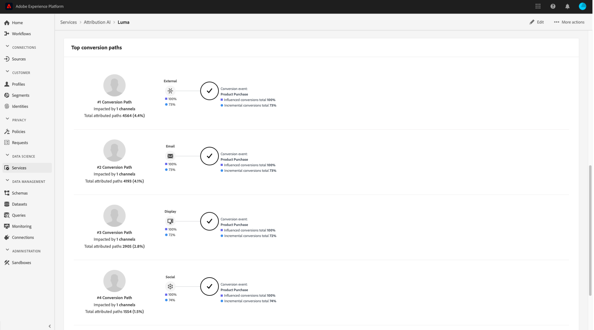

# Einblicke in Attribution AI

Die Instanzen des Attribution AI-Service bieten Einblicke, anhand derer Marketing-Entscheidungen in Bezug auf Marketing-Performance und ROI getroffen und gemessen werden können. Durch die Auswahl einer Dienstinstanz erhalten Sie Visualisierungen und Filter, anhand derer Sie die Auswirkungen jeder Kundeninteraktion in jeder Phase der Customer Journey verstehen können.

Dieses Dokument dient als Handbuch für die Interaktion mit Einblicken der Dienstinstanz in der Benutzeroberfläche von Adobe Intelligent Services.

## Erste Schritte

Um Einblicke für Attribution AI zu verwenden, benötigen Sie eine Dienstinstanz mit einem erfolgreichen Ausführungsstatus. Um eine neue Dienstinstanz zu erstellen, gehen Sie zum [Benutzeroberflächenhandbuch für Attribution AI](./user-guide.md). Wenn Sie kürzlich eine Dienstinstanz erstellt haben und diese sich noch in der Trainings- und Bewertungsphase befindet, warten Sie bitte 24 Stunden, bis sie fertig ist.

## Übersicht über Einblicke von Dienstinstanzen

Wählen Sie in der [!DNL Adobe Experience Platform]-Benutzeroberfläche **[!UICONTROL Dienste]** im linken Navigationsbereich aus. Der **[!UICONTROL Dienste]**-Browser wird geöffnet und zeigt verfügbare Adobe Intelligent Services an. Wählen Sie im Container für Attribution AI die Option **[!UICONTROL Öffnen]**.

Die Seite des Attribution AI-Service wird angezeigt. Auf dieser Seite werden Dienstinstanzen von Attribution AI aufgelistet und Informationen zu diesen angezeigt, einschließlich des Namens der Instanz, der Konversionsereignisse, der Häufigkeit der Ausführung der Instanz und des Status der letzten Aktualisierung. Wählen Sie einen Namen für die Service-Instanz aus, um zu beginnen.

>[!NOTE]
>
>Es können nur Service-Instanzen ausgewählt werden, die erfolgreiche Scoring-Durchgänge abgeschlossen haben.

Als Nächstes wird die Seite mit den Einblicken für diese Dienstinstanz angezeigt. Hier werden Visualisierungen und eine Reihe von Filtern zur Interaktion mit Ihren Daten bereitgestellt. Die Visualisierungen und Filter werden in diesem Handbuch ausführlicher erläutert.

### Details zur Dienstinstanz

Um zusätzliche Details für eine Service-Instanz anzuzeigen, wählen **[!UICONTROL oben]** „Weitere anzeigen“ aus.

Es wird eine detaillierte Liste angezeigt. Weitere Informationen zu den aufgelisteten Eigenschaften finden Sie im [Benutzerhandbuch für Attribution AI](./user-guide.md).

### Bearbeiten einer Instanz

Um eine Instanz zu bearbeiten, wählen **[!UICONTROL Bearbeiten]** in der oberen rechten Navigationsleiste aus.

Das Dialogfeld „Bearbeiten“ wird angezeigt, in dem Sie den Namen, die Beschreibung und die Bewertungsfrequenz der Instanz bearbeiten können. Wenn der Instanzstatus deaktiviert ist, kann die Scoring-Häufigkeit nicht bearbeitet werden. Um Ihre Änderungen zu bestätigen und das Dialogfeld zu schließen, wählen **[!UICONTROL in]** rechten unteren Ecke „Speichern“ aus.

### Mehr Aktionen {#more-actions}

Die Schaltfläche **[!UICONTROL Mehr Aktionen]** befindet sich in der oberen rechten Navigation neben **[!UICONTROL Bearbeiten]**. Wenn Sie **[!UICONTROL Mehr Aktionen]** auswählen, wird ein Dropdown-Menü geöffnet, in dem Sie einen der folgenden Vorgänge auswählen können:

- **[!UICONTROL Klonen]**: Klont die Instanz.
- **[!UICONTROL Löschen]**: Löscht die Instanz.
- **[!UICONTROL Zusammenfassungsdaten herunterladen]**: Lädt eine CSV-Datei mit den Zusammenfassungsdaten herunter.
- **[!UICONTROL Auf Scores zugreifen]**: Wenn Sie **[!UICONTROL Auf Scores zugreifen]** werden Sie zum Tutorial [Auf Scores für Attribution AI zugreifen“ ](./download-scores.md).
- **[!UICONTROL Ausführungsverlauf anzeigen]**: Ein Popup-Fenster mit einer Liste aller mit der Dienstinstanz verbundenen Bewertungsläufe wird angezeigt.

## Filtern Ihrer Daten

Mithilfe von Attribution AI-Einblicken können Sie Ihre Daten filtern und die Visualisierungen der Benutzeroberfläche automatisch anhand Ihrer ausgewählten Filter aktualisieren.

### Konversionsereignis

Wenn Sie eine neue Instanz in Attribution AI erstellen, ist eines der erforderlichen Felder „Konversionsereignisse“. Konversionsereignisse sind Unternehmensziele, die die Auswirkungen von Marketing-Aktivitäten wie E-Commerce-Bestellungen, In-Store-Käufen und Website-Besuchen ermitteln.

Innerhalb der Instanz können Sie mit dem Dropdown-Menü **[!UICONTROL Konversionsereignisse]** eines der für Ihre Instanz definierten Ereignisse auswählen, um Ihre Daten zu filtern. Wenn Sie bestimmte Ereignisse auswählen, werden die Visualisierungen der Benutzeroberfläche so geändert, dass nur Konversionen aus diesen Ereignissen gefüllt werden.

### Attributionsmodell

Wenn Sie **[!UICONTROL Attributionsmodell]** auswählen, wird eine Dropdown-Liste mit allen verfügbaren Attributionsmodellen geöffnet. Sie können mehrere Modelle zum Vergleich der Ergebnisse auswählen. Weitere Informationen zu den verschiedenen Attributionsmodellen und ihrer Funktionsweise finden Sie in der Übersicht über [Attribution AI](./overview.md), die eine Tabelle mit Informationen zu den einzelnen Modellen enthält.

### Region

>[!NOTE]
>
>Dieser Filter ist nur vorhanden, wenn Sie beim Erstellen [ Dienstinstanz den optionalen Schritt Regionsbasierte Modellierung](./user-guide.md#region-based-modeling-optional) im Handbuch zur Attribution AI-Benutzeroberfläche ausgeführt haben.

Mit diesem Filter können Sie alle Regionen auswählen, die Sie beim Erstellen der Instanz eingerichtet haben.

### Filter hinzufügen

Sie können zusätzliche Filter hinzufügen, indem Sie auf das Symbol **Filter** klicken, um das Pop **[!UICONTROL up „Filter hinzufügen]** zu öffnen. Das **[!UICONTROL Filter hinzufügen]** ermöglicht die Filterung nach Kanal, Geografie, Medientyp und Produkt. Nur die entsprechenden Filter für eine Dienstinstanz werden vom Popover ausgefüllt. Wenn Sie beispielsweise keine geografischen Daten oder einen Medientyp angegeben haben, sind diese Filterattribute für Ihre Instanz nicht verfügbar.

- **[!UICONTROL channel]:** Wenn Sie das Kanalattribut auswählen, können Sie jeden Ihrer verfügbaren Marketing-Kanäle filtern. Sie können mehrere Kanäle zum Vergleich auswählen.
- **[!UICONTROL Geography]:** Durch Auswahl des Attributs „geography“ können Sie Länder-Codes anhand von regionsbasierten Modellen filtern. Abhängig von Ihren -Daten kann dieser Filter vorhanden sein oder nicht. Länder-Codes sind zwei Zeichen lang. Die vollständige Länder-Code-Liste [hier](https://datahub.io/core/country-list).
- **[!UICONTROL Medientyp]:** Durch Auswahl des Medientypattributs können Sie einen beliebigen Ihrer definierten Medientypen filtern.
- **[!UICONTROL Produkt]:** Wenn Sie das Produktattribut auswählen, können Sie aus allen Produkten filtern, die ursprünglich bei der Erstellung Ihrer Instanz aufgenommen wurden.

### Datumsbereich

Wählen Sie das Kalendersymbol aus, um das Popover „Datumsbereich“ zu öffnen. Die Start- und Enddaten für die Konversionsereignisse bestimmen die Datenmenge, die in der Benutzeroberfläche angezeigt wird. Sie können den Datumsbereich einschränken oder erweitern, um die Menge der angezeigten Daten zu fokussieren oder zu vergrößern.

## Übersicht über Ihre Daten

Die Karte **[!UICONTROL Übersicht]** zeigt Ihre Konversionen insgesamt nach Attributionsmodell an. Die Gesamtzahl ändert sich je nach Art der Suche anhand der zuvor in diesem Dokument beschriebenen Filter. Durch die Auswahl weiterer Modelle werden der Übersicht zusätzliche Kreise hinzugefügt, jeder mit einer eigenen Farbe entsprechend der Legende.

## Wöchentliche Trends

Die Karte **[!UICONTROL Wöchentliche Trends]** unterteilt Ihre Konversionen insgesamt nach dem Datumsbereich, den Sie während des Filtervorgangs festgelegt haben.

Wenn Sie oben rechts auf der Karte **Wöchentliche Trends** auf die Auslassungszeichen klicken, wird eine Dropdown-Liste angezeigt, in der Sie tägliche, wöchentliche oder monatliche Trends auswählen können.

Wenn Sie den Mauszeiger über die Datenzeile eines bestimmten Attributionsmodells bewegen, wird ein Popup-Fenster angezeigt, das die Gesamtzahl der Konversionen für dieses Datum anzeigt.

## Aufschlüsselung nach Kanal

Die Karte **[!UICONTROL Aufschlüsselung nach Kanal]** wird verwendet, um die Gesamtanzahl der Konversionen im Verhältnis zu den einzelnen Kanälen zu ermitteln. Mit dieser Karte können Entscheidungen über die Effektivität der einzelnen Kanäle und die ROI getroffen werden.

Wenn Sie oben rechts auf der Karte **[!UICONTROL Aufschlüsselung nach Kanal“ auf die Ellipsen klicken]** wird eine Dropdown-Liste geöffnet, in der Sie Daten basierend auf Touchpoints auffüllen können.

## Topkampagnen

Auf der Karte **[!UICONTROL Topkampagnen]** wird ein Überblick über Ihre Kampagnen und die Leistung der Kampagne in den einzelnen Kanälen angezeigt. Diese Karte kann dabei helfen, Ihr Team über die Effektivität einer bestimmten Kampagne für einen bestimmten Kanal zu informieren, und bietet Einblicke, z. B. in welche Kampagnen Sie weiter investieren sollten.

## Aufschlüsselung nach Touchpoint-Position

Wenn Sie die Registerkarte **[!UICONTROL Pfadanalyse]** auswählen, werden die Diagramme **[!UICONTROL Aufschlüsselung nach Touchpoint-Position]** und **[!UICONTROL Top-Konversionspfade]** geladen.

Das Diagramm **[!UICONTROL Aufschlüsselung nach Touchpoint]** ist eine Aufschlüsselung der zugewiesenen Konversionen nach Position des Touchpoints im Vergleich zu allen Konversionspfaden. Dieses Diagramm zeigt Ihnen, welche Touchpoints in verschiedenen Phasen des Konversionspfads effektiver sind. Die Bühnen sind Starter, Spieler und näher.

- **Starter:** Zeigt an, dass der Touchpoint der erste Touch in einem Konversionspfad war.
- **Player:** Zeigt an, dass der Touchpoint nicht der erste oder der letzte Touch war, der zu einer Konversion geführt hat.
- **Closer:** Zeigt an, dass der Touchpoint der letzte Touch vor einer Konversion war.

>
>
> Die Summe des prozentualen Beitrags für ein Attributionsmodell über alle Touchpoints und Positionen hinweg sollte 100 betragen.

## Top-Konversionspfade

Das Diagramm **[!UICONTROL Top-Konversionspfade]** zeigt die beeinflussten und algorithmischen Werte auf den Top-Konversionspfaden in den ausgewählten Regionen an. In diesem Diagramm können Sie visualisieren, welche Touchpoints zu Konversionen beitragen und wie der Attributionswert für jeden Touchpoint aussieht. Mithilfe dieser Informationen können Sie die häufigsten Pfade in einer bestimmten Region anzeigen und sehen, ob Muster zwischen den verschiedenen Sätzen von Touchpoints auftreten.

## Touchpoint-Effektivität

Wenn Sie die Registerkarte **[!UICONTROL Touchpoint]** Effektivität auswählen, wird die Karte **[!UICONTROL Touchpoint]** geladen. Diese Karte verwendet die Datenverteilung von Attribution AI, um Informationen für jeden Touchpoint anzuzeigen. Die Daten für diese Tabelle werden nur für bestimmte Zeiträume generiert, die durch das **[!UICONTROL Ab]**-Datum oben rechts auf der Karte angegeben werden.

Sie können die Karteninformationen **[!UICONTROL Touchpoint-Effektivität]** verwenden, um zu verstehen, wie ein Touchpoint zu einer Konversion beiträgt. Mit den folgenden Leistungsmetriken können Sie auch sehen, wie effektiv jeder Touchpoint ist:

**Pfade mit Touchpoint**: Diese Metrik zeigt einen Prozentsatz der Pfade an, die eine Konversion für den Touchpoint erzielen/nicht erreichen. Höhere zugewiesene Konversionen werden angezeigt, wenn das Verhältnis der Pfade (in Prozent), die eine Konversion erzielen, zu den Pfaden, die keine Konversion erzielen, hoch ist.

**Effizienzmessung**: Diese Metrik zeigt Sterne auf einer Skala von ein bis fünf an. Die Skala zeigt die relative Bedeutung eines Touchpoints für eine Konversion an.

>[!NOTE]
>
>Ein höheres Touchpoint-Volumen garantiert keine höhere Effizienz.

**Gesamtvolumen**: Die Gesamtzahl der Berührungen eines Touchpoints durch eine Benutzerin oder einen Benutzer. Dies schließt Touchpoints ein, die auf einem Pfad erscheinen, der eine Konversion erreicht, sowie Pfade, die keine Konversion ergeben.

## Nächste Schritte

Sobald Sie die Daten gefiltert haben und die entsprechenden Informationen anzeigen können, können Sie auf die Bewertungen zuzugreifen. Eine ausführliche Anleitung zum Zugriff auf Ihre Bewertungen finden Sie im [Tutorial für den Zugriff auf Bewertungen in Attribution AI](./download-scores.md). Darüber hinaus können Sie die Zusammenfassungsdaten herunterladen, wie in [Mehr Aktionen](#more-actions) angegeben. Wenn Sie „Zusammenfassungsdaten herunterladen“ auswählen, werden die nach Datumsangaben aggregierten Zusammenfassungsdaten heruntergeladen.

## Zusätzliche Ressourcen

Das folgende Video soll Ihnen dabei helfen zu lernen, wie Sie die Attribution AI-Insights-Seite verwenden, um den ROI von Marketing-Kanälen und -Kampagnen zu verstehen.

>[!VIDEO](https://video.tv.adobe.com/v/32669?learn=on&quality=12)
