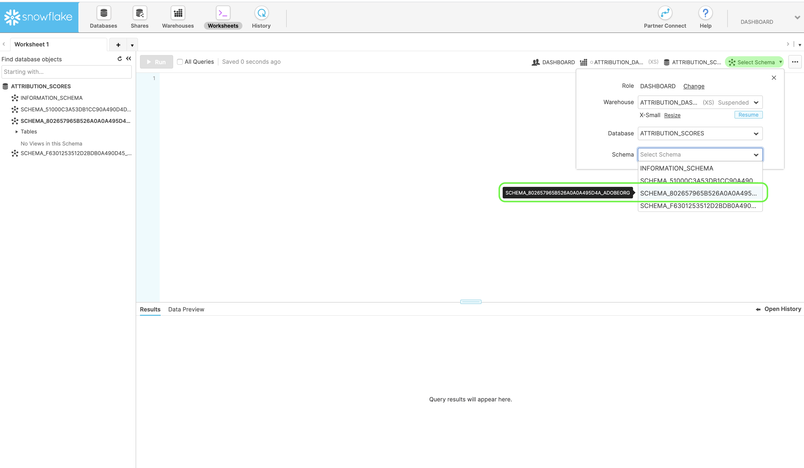

# Herunterladen von Bewertungen in Attribution AI

Dieses Dokument dient als Anleitung zum Herunterladen von Bewertungen für Attribution AI.

## Erste Schritte

Mit Attribution AI können Sie Bewertungen im Parquet-Dateiformat herunterladen. Für dieses Tutorial müssen Sie den Abschnitt zum Herunterladen von Attribution AI-Bewertungen im Abschnitt [Erste Schritte](./getting-started.md) Handbuch.

Um auf Bewertungen für Attribution AI zugreifen zu können, benötigen Sie außerdem eine Dienstinstanz mit einem erfolgreichen Ausführungsstatus. Um eine neue Dienstinstanz zu erstellen, besuchen Sie die [Attribution AI-Benutzerhandbuch](./user-guide.md). Wenn Sie kürzlich eine Dienstinstanz erstellt haben und diese sich noch in der Trainings- und Bewertungsphase befindet, warten Sie bitte 24 Stunden, bis sie fertig ist.

## Ermitteln Ihrer Datensatz-ID {#dataset-id}

Klicken Sie in Ihrer Dienstinstanz für Attribution AI-Einblicke auf die *Mehr Aktionen* Dropdown in der oberen rechten Navigation und wählen Sie **[!UICONTROL Auf Bewertungen zugreifen]**.


Es wird ein neues Dialogfeld mit einem Link zur Dokumentation zum Herunterladen von Bewertungen und der Datensatz-ID Ihrer aktuellen Instanz angezeigt. Kopieren Sie die Datensatz-ID in die Zwischenablage und fahren Sie mit dem nächsten Schritt fort.


## Abrufen Ihrer Batch-Kennung {#retrieve-your-batch-id}

Rufen Sie mit Ihrer Datensatz-ID aus dem vorherigen Schritt die Catalog-API auf, um eine Batch-Kennung abzurufen. Für diesen API-Aufruf werden zusätzliche Abfrageparameter verwendet, um den neuesten erfolgreichen Batch anstelle einer Liste von Batches Ihrer Organisation zurückzugeben. Um weitere Batches zurückzugeben, erhöhen Sie die Zahl für die `limit` den Abfrageparameter auf den gewünschten Betrag, den Sie zurückgeben möchten. Weitere Informationen zu den verfügbaren Parametertypen für die Abfrage finden Sie im Handbuch zum [Filtern von Katalogdaten mithilfe von Abfrageparametern](../../catalog/api/filter-data.md).

**API-Format**

```http
GET /batches?&dataSet={DATASET_ID}&createdClient=acp_foundation_push&status=success&orderBy=desc:created&limit=1
```

| Parameter | Beschreibung |
| --------- | ----------- |
| `{DATASET_ID}` | Die im Dialogfeld „Auf Bewertungen zugreifen“ verfügbare Datensatz-ID. |

**Anfrage**

```shell
curl -X GET 'https://platform.adobe.io/data/foundation/catalog/batches?&dataSet=5e8f81ce7a4ecb18a8d25b22&createdClient=acp_foundation_push&status=success&orderBy=desc:created&limit=1' \
  -H 'Authorization: Bearer {ACCESS_TOKEN}' \
  -H 'x-api-key: {API_KEY}' \
  -H 'x-gw-ims-org-id: {ORG_ID}' \
  -H 'x-sandbox-name: {SANDBOX_NAME}'
```

**Antwort**

Eine erfolgreiche Antwort gibt eine Payload zurück, die ein Batch-ID-Objekt enthält. In diesem Beispiel ist der Schlüsselwert für das zurückgegebene Objekt die Batch-ID `01E5QSWCAASFQ054FNBKYV6TIQ`. Kopieren Sie Ihre Batch-Kennung, um sie beim nächsten API-Aufruf zu verwenden.

>[!NOTE]
>
> Die folgende Antwort enthielt die `tags` zur Lesbarkeit reformiert wurde.

```json
{
    "01E5QSWCAASFQ054FNBKYV6TIQ": {
        "status": "success",
        "tags": {
            "Tags": [ ... ],
        },
        "relatedObjects": [
            {
                "type": "dataSet",
                "id": "5e8f81cf7a4ecb28a8d85b22"
            }
        ],
        "id": "01E5QSWCAASFQ054FNBKYV6TIQ",
        "externalId": "01E5QSWCAASFQ054FNBKYV6TIQ",
        "replay": {
            "predecessors": [
                "01E5N7EDQQP4JHJ93M7C3WM5SP"
            ],
            "reason": "Replacing for 2020-04-09",
            "predecessorListingType": "IMMEDIATE"
        },
        "inputFormat": {
            "format": "parquet"
        },
        "imsOrg": "412657965Y566A4A0A495D4A@AdobeOrg",
        "started": 1586715571808,
        "metrics": {
            "partitionCount": 1,
            "outputByteSize": 2380339,
            "inputFileCount": -1,
            "inputByteSize": 2381007,
            "outputRecordCount": 24340,
            "outputFileCount": 1,
            "inputRecordCount": 24340
        },
        "completed": 1586715582735,
        "created": 1586715571217,
        "createdClient": "acp_foundation_push",
        "createdUser": "sensei_exp_attributionai@AdobeID",
        "updatedUser": "acp_foundation_dataTracker@AdobeID",
        "updated": 1586715583582,
        "version": "1.0.5"
    }
}
```

## Abrufen des nächsten API-Aufrufs mit Ihrer Batch-Kennung {#retrieve-the-next-api-call-with-your-batch-id}

Sobald Sie über eine Batch-Kennung verfügen, können Sie eine neue GET-Anfrage an `/batches` vornehmen. Die Anfrage gibt einen Link zurück, der als die nächste API-Anfrage verwendet wird.

**API-Format**

```http
GET batches/{BATCH_ID}/files
```

| Parameter | Beschreibung |
| --------- | ----------- |
| `{BATCH_ID}` | Die im vorherigen Schritt [Abrufen Ihrer Batch-Kennung](#retrieve-your-batch-id) abgerufene Batch-Kennung. |

**Anfrage**

Stellen Sie mithilfe Ihrer Batch-Kennung die folgende Anfrage.

```shell
curl -X GET 'https://platform.adobe.io/data/foundation/export/batches/01E5QSWCAASFQ054FNBKYV6TIQ/files' \
  -H 'Authorization: Bearer {ACCESS_TOKEN}' \
  -H 'x-api-key: {API_KEY}' \
  -H 'x-gw-ims-org-id: {ORG_ID}' \
  -H 'x-sandbox-name: {SANDBOX_NAME}'
```

**Antwort**

Eine erfolgreiche Antwort gibt eine Payload zurück, die ein `_links`-Objekt enthält. Innerhalb des `_links`-Objekts befindet sich ein `href` mit einem neuen API-Aufruf als Wert. Kopieren Sie diesen Wert, um mit dem nächsten Schritt fortzufahren.

```json
{
    "data": [
        {
            "dataSetFileId": "01E5QSWCAASFQ054FNBKYV6TIQ-1",
            "dataSetViewId": "5e8f81cf7a4ecb28a8d85b22",
            "version": "1.0.0",
            "created": "1586715582571",
            "updated": "1586715582571",
            "isValid": false,
            "_links": {
                "self": {
                    "href": "https://platform.adobe.io:443/data/foundation/export/files/01E5QSWCXXYFQ054FNBKYV2BAQ-1"
                }
            }
        }
    ],
    "_page": {
        "limit": 100,
        "count": 1
    }
}
```

## Abrufen Ihrer Dateien {#retrieving-your-files}

Verwenden Sie den `href`-Wert, den Sie im vorherigen Schritt als API-Aufruf erhalten haben, und stellen Sie eine neue GET-Anfrage, um Ihr Dateiverzeichnis abzurufen.

**API-Format**

```http
GET files/{DATASETFILE_ID}
```

| Parameter | Beschreibung |
| --------- | ----------- |
| `{DATASETFILE_ID}` | Die dataSetFile-ID wird im `href`-Wert des [vorherigen Schritts](#retrieve-the-next-api-call-with-your-batch-id) zurückgegeben. Sie ist auch im `data`-Array unter dem Objekttyp `dataSetFileId` verfügbar. |

**Anfrage**

```shell
curl -X GET 'https://platform.adobe.io/data/foundation/export/files/01E5QSWCAASFQ054FNBKYV6TIQ-1' \
  -H 'Authorization: Bearer {ACCESS_TOKEN}' \
  -H 'x-api-key: {API_KEY}' \
  -H 'x-gw-ims-org-id: {ORG_ID}' \
  -H 'x-sandbox-name: {SANDBOX_NAME}'
```

**Antwort**

Die Antwort enthält ein Daten-Array, das einen einzelnen Eintrag oder eine Liste von Dateien enthalten kann, die zu diesem Verzeichnis gehören. Das folgende Beispiel enthält eine Liste von Dateien und wurde aus Gründen der Lesbarkeit komprimiert. In diesem Szenario müssen Sie der URL jeder Datei folgen, um auf die Datei zugreifen zu können.

```json
{
    "data": [
        {
            "name": "part-00000-tid-5614147572541837832-908bd66a-d856-47fe-b7da-c8e7d22a4097-1370467-1.c000.snappy.parquet",
            "length": "2380211",
            "_links": {
                "self": {
                    "href": "https://platform.adobe.io:443/data/foundation/export/files/01E5QSWCXXYFQ054FNBKYV2BAQ-1?path=part-00000-trd-5714147572541837832-938bd66a-d556-41fe-b7da-c8e7d22a4097-1320467-1.c000.snappy.parquet"
                }
            }
        }
    ],
    "_page": {
        "limit": 100,
        "count": 1
    }
}
```

| Parameter | Beschreibung |
| --------- | ----------- |
| `_links.self.href` | Die URL der GET-Anfrage, mit der eine Datei in Ihr Verzeichnis heruntergeladen wird. |


Kopieren Sie den `href`-Wert für ein beliebiges Dateiobjekt im `data`-Array und fahren Sie dann mit dem nächsten Schritt fort.

## Herunterladen Ihrer Dateidaten

Um Ihre Dateidaten herunterzuladen, stellen Sie eine GET-Anfrage an den `"href"`-Wert, den Sie im vorherigen Schritt [Abrufen Ihrer Dateien](#retrieving-your-files) kopiert haben.

>[!NOTE]
>
> Wenn Sie diese Anfrage direkt in der Befehlszeile ausführen, werden Sie möglicherweise aufgefordert, eine Ausgabe nach den Kopfzeilen Ihrer Anfrage hinzuzufügen. Im folgenden Anfragebeispiel wird `--output {FILENAME.FILETYPE}` verwendet.

**API-Format**

```http
GET files/{DATASETFILE_ID}?path={FILE_NAME}
```

| Parameter | Beschreibung |
| --------- | ----------- |
| `{DATASETFILE_ID}` | Die dataSetFile-ID wird im `href`-Wert eines [vorherigen Schritts](#retrieve-the-next-api-call-with-your-batch-id) zurückgegeben. |
| `{FILE_NAME}` | Der Name der Datei. |

**Anfrage**

```shell
curl -X GET 'https://platform.adobe.io:443/data/foundation/export/files/01E5QSWCXXYFQ054FNBKYV2BAQ-1?path=part-00000-trd-5714147572541837832-938bd66a-d556-41fe-b7da-c8e7d22a4097-1320467-1.c000.snappy.parquet' \
  -H 'Authorization: Bearer {ACCESS_TOKEN}' \
  -H 'x-api-key: {API_KEY}' \
  -H 'x-gw-ims-org-id: {ORG_ID}' \
  -H 'x-sandbox-name: {SANDBOX_NAME}' \
  -O 'file.parquet'
```

>[!TIP]
>
>Vergewissern Sie sich, dass Sie sich im richtigen Verzeichnis oder Ordner befinden, in dem die Datei gespeichert werden soll, bevor Sie die GET-Anfrage stellen.

**Antwort**

Die Antwort lädt die angeforderte Datei in Ihr aktuelles Verzeichnis herunter. In diesem Beispiel lautet der Dateiname &quot;file.parquet&quot;.


Die heruntergeladenen Bewertungen werden im Parquet-Format angezeigt und benötigen entweder eine [!DNL Spark]-Shell- oder Parquet-Leser, um die Bewertungen anzuzeigen. Für die Rohwertanzeige können Sie [Apache Parquet-Tools](https://parquet.apache.org/docs/). Parquet-Tools können die Daten mit [!DNL Spark].

## Nächste Schritte

In diesem Dokument wurden die zum Herunterladen von Attribution AI-Bewertungen erforderlichen Schritte beschrieben. Weitere Informationen zu den Ergebnisausgaben finden Sie unter [Eingabe und Ausgabe von Attribution AI](./input-output.md) Dokumentation.

## Aufrufen von Bewertungen mithilfe von Snowflake

>[!IMPORTANT]
>
>Weitere Informationen zum Zugriff auf Bewertungen mithilfe von Snowflake erhalten Sie unter attributionai-support@adobe.com .

Sie können über Snowflake auf aggregierte Attribution AI-Bewertungen zugreifen. Derzeit müssen Sie sich per E-Mail an den Adobe-Support unter attributionai-support@adobe.com wenden, um die Zugangsdaten zu Ihrem Leserkonto für Snowflake einzurichten und zu erhalten.

Sobald der Adobe-Support Ihre Anfrage bearbeitet hat, erhalten Sie eine URL für das Leserkonto für Snowflake und die entsprechenden Zugangsdaten unten:

- Snowflake-URL
- Benutzername
- Passwort

>[!NOTE]
>
>Das Leserkonto dient zum Abfragen der Daten mithilfe von SQL-Clients, Arbeitsblättern und BI-Lösungen, die den JDBC-Connector unterstützen.

Sobald Sie über Ihre Anmeldedaten und Ihre URL verfügen, können Sie die Modelltabellen abfragen, aggregiert nach Touchpoint-Datum oder Konversionsdatum.

### Auffinden Ihres Schemas in Snowflake

Melden Sie sich mit den angegebenen Anmeldedaten bei Snowflake an. Klicken Sie in der Hauptnavigation oben links auf die Registerkarte **Arbeitsblätter** und navigieren Sie dann im linken Bedienfeld zu Ihrem Datenbankverzeichnis.


Klicken Sie dann oben rechts im Bildschirm auf **Schema auswählen**. Bestätigen Sie im angezeigten Popover-Fenster, dass Sie die richtige Datenbank ausgewählt haben. Klicken Sie anschließend auf das Dropdown-Menü *Schema* und wählen Sie eines der aufgelisteten Schemata aus. Sie können die Bewertungstabellen, die unter dem ausgewählten Schema aufgelistet sind, direkt abfragen.



## Verbinden von PowerBI mit Snowflake (optional)

Mit Ihren Snowflake-Anmeldedaten können Sie eine Verbindung zwischen PowerBI Desktop und Snowflake-Datenbanken herstellen.

Geben Sie zunächst im Feld *Server* Ihre Snowflake-URL ein. Geben Sie als Nächstes im Feld *Warehouse* „XSMALL“ ein. Geben Sie dann Ihren Benutzernamen und Ihr Passwort ein.


Nachdem die Verbindung hergestellt wurde, wählen Sie Ihre Snowflake-Datenbank und anschließend das entsprechende Schema aus. Sie können jetzt alle Tabellen laden.
