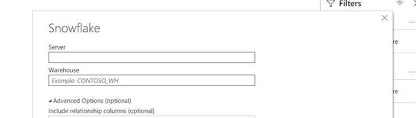

# Herunterladen von Punktzahlen in Attribution AI

Dieses Dokument dient als Anleitung zum Herunterladen von Bewertungen für Attribution AI.

## Erste Schritte

Attribution AI erlaubt Ihnen, Partituren im Parquet-Dateiformat herunterzuladen. Für dieses Lernprogramm müssen Sie den Abschnitt mit den Attributions-AI-Bewertungen für das Herunterladen im Handbuch [Erste Schritte](./getting-started.md) gelesen und abgeschlossen haben.

Um auf die Ergebnisse für Attribution AI zugreifen zu können, benötigen Sie außerdem eine Dienstinstanz mit einem erfolgreichen Ausführungsstatus. Um eine neue Dienstinstanz zu erstellen, besuchen Sie das Benutzerhandbuch zur [Attribution AI](./user-guide.md). Wenn Sie kürzlich eine Dienstinstanz erstellt haben und sie weiterhin trainiert und bewertet wird, erlauben Sie bitte 24 Stunden, damit sie ausgeführt werden kann.

## Find your dataset ID {#dataset-id}

Klicken Sie in Ihrer Dienstinstanz für Zuordnungs-AI-Einblicke auf das Dropdownmenü *Mehr Aktionen* in der oberen rechten Navigation und wählen Sie dann **[!UICONTROL Zugriffswerte]**.


Es wird ein neues Dialogfeld mit einem Link zur Dokumentation zum Herunterladen von Punktzahlen und der DataSet-ID für Ihre aktuelle Instanz angezeigt. Kopieren Sie die DataSet-ID in die Zwischenablage und fahren Sie mit dem nächsten Schritt fort.


## Ihre Stapel-ID abrufen {#retrieve-your-batch-id}

Wenn Sie Ihre DataSet-ID aus dem vorherigen Schritt verwenden, müssen Sie die Katalog-API aufrufen, um eine Stapel-ID abzurufen. Für diesen API-Aufruf werden zusätzliche Parameter für die Abfrage verwendet, um anstelle einer Liste von Stapeln, die zu Ihrem Unternehmen gehören, den letzten erfolgreichen Batch zurückzugeben. Um weitere Stapel zurückzugeben, erhöhen Sie die Anzahl für den Parameter &quot; `limit` Abfrage&quot;auf den gewünschten Wert, der zurückgegeben werden soll. Weitere Informationen zu den verfügbaren Parametertypen für die Abfrage finden Sie im Handbuch zum [Filtern von Katalogdaten mithilfe von Abfragen-Parametern](../../catalog/api/filter-data.md).

**API-Format**

```http
GET /batches?&dataSet={DATASET_ID}&createdClient=acp_foundation_push&status=success&orderBy=desc:created&limit=1
```

| Parameter | Beschreibung |
| --------- | ----------- |
| `{DATASET_ID}` | Die im Dialogfeld &quot;Zugriffszahlen&quot;verfügbare DataSet-ID. |

**Anfrage**

```shell
curl -X GET 'https://platform.adobe.io/data/foundation/catalog/batches?&dataSet=5e8f81ce7a4ecb18a8d25b22&createdClient=acp_foundation_push&status=success&orderBy=desc:created&limit=1' \
  -H 'Authorization: Bearer {ACCESS_TOKEN}' \
  -H 'x-api-key: {API_KEY}' \
  -H 'x-gw-ims-org-id: {IMS_ORG}' \
  -H 'x-sandbox-name: {SANDBOX_NAME}'
```

**Antwort**

Eine erfolgreiche Antwort gibt eine Nutzlast zurück, die ein Batch-ID-Objekt enthält. In diesem Beispiel ist der Schlüsselwert für das zurückgegebene Objekt die Stapel-ID `01E5QSWCAASFQ054FNBKYV6TIQ`. Kopieren Sie Ihre Batch-ID, um sie beim nächsten API-Aufruf zu verwenden.

>[!NOTE]
> In der folgenden Antwort wurde das `tags` Objekt zur Lesbarkeit reformiert.

```json
{
    "01E5QSWCAASFQ054FNBKYV6TIQ": {
        "status": "success",
        "tags": {
            "Tags": [ ... ],
        },
        "relatedObjects": [
            {
                "type": "dataSet",
                "id": "5e8f81cf7a4ecb28a8d85b22"
            }
        ],
        "id": "01E5QSWCAASFQ054FNBKYV6TIQ",
        "externalId": "01E5QSWCAASFQ054FNBKYV6TIQ",
        "replay": {
            "predecessors": [
                "01E5N7EDQQP4JHJ93M7C3WM5SP"
            ],
            "reason": "Replacing for 2020-04-09",
            "predecessorListingType": "IMMEDIATE"
        },
        "inputFormat": {
            "format": "parquet"
        },
        "imsOrg": "412657965Y566A4A0A495D4A@AdobeOrg",
        "started": 1586715571808,
        "metrics": {
            "partitionCount": 1,
            "outputByteSize": 2380339,
            "inputFileCount": -1,
            "inputByteSize": 2381007,
            "outputRecordCount": 24340,
            "outputFileCount": 1,
            "inputRecordCount": 24340
        },
        "completed": 1586715582735,
        "created": 1586715571217,
        "createdClient": "acp_foundation_push",
        "createdUser": "sensei_exp_attributionai@AdobeID",
        "updatedUser": "acp_foundation_dataTracker@AdobeID",
        "updated": 1586715583582,
        "version": "1.0.5"
    }
}
```

## Abrufen des nächsten API-Aufrufs mit Ihrer Stapel-ID {#retrieve-the-next-api-call-with-your-batch-id}

Sobald Sie über eine Stapel-ID verfügen, können Sie eine neue GET-Anforderung an `/batches`vornehmen. Die Anforderung gibt einen Link zurück, der als nächste API-Anforderung verwendet wird.

**API-Format**

```http
GET batches/{BATCH_ID}/files
```

| Parameter | Beschreibung |
| --------- | ----------- |
| `{BATCH_ID}` | Die im vorherigen Schritt abgerufene Stapel-ID [ruft Ihre Stapel-ID](#retrieve-your-batch-id)ab. |

**Anfrage**

Erstellen Sie mithilfe Ihrer eigenen Stapel-ID die folgende Anforderung.

```shell
curl -X GET 'https://platform.adobe.io/data/foundation/export/batches/01E5QSWCAASFQ054FNBKYV6TIQ/files' \
  -H 'Authorization: Bearer {ACCESS_TOKEN}' \
  -H 'x-api-key: {API_KEY}' \
  -H 'x-gw-ims-org-id: {IMS_ORG}' \
  -H 'x-sandbox-name: {SANDBOX_NAME}'
```

**Antwort**

Eine erfolgreiche Antwort gibt eine Nutzlast zurück, die ein `_links` Objekt enthält. Innerhalb des `_links` Objekts befindet sich ein `href` mit einem neuen API-Aufruf als Wert. Kopieren Sie diesen Wert, um mit dem nächsten Schritt fortzufahren.

```json
{
    "data": [
        {
            "dataSetFileId": "01E5QSWCAASFQ054FNBKYV6TIQ-1",
            "dataSetViewId": "5e8f81cf7a4ecb28a8d85b22",
            "version": "1.0.0",
            "created": "1586715582571",
            "updated": "1586715582571",
            "isValid": false,
            "_links": {
                "self": {
                    "href": "https://platform.adobe.io:443/data/foundation/export/files/01E5QSWCXXYFQ054FNBKYV2BAQ-1"
                }
            }
        }
    ],
    "_page": {
        "limit": 100,
        "count": 1
    }
}
```

## Dateien abrufen {#retrieving-your-files}

Erstellen Sie eine neue GET-Anforderung, um den `href` Wert, den Sie im vorherigen Schritt als API-Aufruf erhalten haben, zum Abrufen des Dateiverzeichnisses zu verwenden.

**API-Format**

```http
GET files/{DATASETFILE_ID}
```

| Parameter | Beschreibung |
| --------- | ----------- |
| `{DATASETFILE_ID}` | Die dataSetFile-ID wird im `href` Wert des [vorherigen Schritts](#retrieve-the-next-api-call-with-your-batch-id)zurückgegeben. Es ist auch im `data` Array unter dem Objekttyp verfügbar `dataSetFileId`. |

**Anfrage**

```shell
curl -X GET 'https://platform.adobe.io/data/foundation/export/files/01E5QSWCAASFQ054FNBKYV6TIQ-1' \
  -H 'Authorization: Bearer {ACCESS_TOKEN}' \
  -H 'x-api-key: {API_KEY}' \
  -H 'x-gw-ims-org-id: {IMS_ORG}' \
  -H 'x-sandbox-name: {SANDBOX_NAME}'
```

**Antwort**

Die Antwort enthält ein Datenarray, das einen einzelnen Eintrag oder eine Liste von Dateien enthalten kann, die zu diesem Ordner gehören. Das folgende Beispiel enthält eine Liste von Dateien und wurde zur Lesbarkeit komprimiert. In diesem Szenario müssen Sie die URL jeder Datei befolgen, um auf die Datei zuzugreifen.

```json
{
    "data": [
        {
            "name": "part-00000-tid-5614147572541837832-908bd66a-d856-47fe-b7da-c8e7d22a4097-1370467-1.c000.snappy.parquet",
            "length": "2380211",
            "_links": {
                "self": {
                    "href": "https://platform.adobe.io:443/data/foundation/export/files/01E5QSWCXXYFQ054FNBKYV2BAQ-1?path=part-00000-trd-5714147572541837832-938bd66a-d556-41fe-b7da-c8e7d22a4097-1320467-1.c000.snappy.parquet"
                }
            }
        }
    ],
    "_page": {
        "limit": 100,
        "count": 1
    }
}
```

| Parameter | Beschreibung |
| --------- | ----------- |
| `_links.self.href` | Die URL der GET-Anforderung, mit der eine Datei in Ihr Verzeichnis heruntergeladen wird. |


Kopieren Sie den `href` Wert für ein beliebiges Dateiobjekt im `data` Array und fahren Sie dann mit dem nächsten Schritt fort.

## Herunterladen der Dateidaten

Um Ihre Dateidaten herunterzuladen, stellen Sie eine GET-Anforderung an den `"href"` Wert, den Sie im vorherigen Schritt beim [Abrufen Ihrer Dateien](#retrieving-your-files)kopiert haben.

>[!NOTE] Wenn Sie diese Anforderung direkt in der Befehlszeile ausführen, werden Sie möglicherweise aufgefordert, eine Ausgabe nach den Anforderungsheader hinzuzufügen. Im folgenden Anforderungsbeispiel wird `--output {FILENAME.FILETYPE}`.

**API-Format**

```http
GET files/{DATASETFILE_ID}?path={FILE_NAME}
```

| Parameter | Beschreibung |
| --------- | ----------- |
| `{DATASETFILE_ID}` | Die dataSetFile-ID wird im `href` Wert eines [vorherigen Schritts](#retrieve-the-next-api-call-with-your-batch-id)zurückgegeben. |
| `{FILE_NAME}` | Der Name der Datei. |

**Anfrage**

```shell
curl -X GET 'https://platform.adobe.io:443/data/foundation/export/files/01E5QSWCXXYFQ054FNBKYV2BAQ-1?path=part-00000-trd-5714147572541837832-938bd66a-d556-41fe-b7da-c8e7d22a4097-1320467-1.c000.snappy.parquet' \
  -H 'Authorization: Bearer {ACCESS_TOKEN}' \
  -H 'x-api-key: {API_KEY}' \
  -H 'x-gw-ims-org-id: {IMS_ORG}' \
  -H 'x-sandbox-name: {SANDBOX_NAME}' \
  -O 'file.parquet'
```

>[!TIP] Vergewissern Sie sich, dass Sie sich im richtigen Verzeichnis oder Ordner befinden, in dem die Datei gespeichert werden soll, bevor Sie die GET-Anforderung senden.

**Antwort**

Die Antwort lädt die Datei herunter, die Sie im aktuellen Verzeichnis angefordert haben. In diesem Beispiel lautet der Dateiname &quot;file.parquet&quot;.


## Nächste Schritte

In diesem Dokument werden die zum Herunterladen von Attribution AI-Scores erforderlichen Schritte beschrieben. Sie können jetzt auch weiterhin die anderen angebotenen [Intelligent Services](../home.md) und Handbücher durchsuchen.

## Zugreifen auf Ergebnisse mit Snowflake

>[!IMPORTANT] Weitere Informationen zum Zugriff auf Ergebnisse mit SnowFlake erhalten Sie unter attributionai-support@adobe.com.

Sie können über Snowflake auf aggregierte Attribution AI-Ergebnisse zugreifen. Derzeit müssen Sie den Adobe-Support unter attributionai-support@adobe.com per E-Mail senden, um die Anmeldeinformationen für Ihr Reader-Konto für Snowflake einzurichten und zu erhalten.

Nachdem der Adobe-Support Ihre Anforderung verarbeitet hat, erhalten Sie eine URL für das Reader-Konto für Snowflake und die entsprechenden Anmeldeinformationen unten:

- Schneeflocken-URL
- Benutzername
- Passwort

>[!NOTE] Das Reader-Konto dient zum Abfragen der Daten mit SQL-Clients, Arbeitsblatt- und BI-Lösungen, die JDBC Connector unterstützen.

Sobald Sie über Ihre Anmeldeinformationen und Ihre URL verfügen, können Sie die Modelltabellen nach Touchpoint-Datum oder Konvertierungsdatum aggregieren.

### Schema im Schneeflocken finden

Melden Sie sich mit den angegebenen Anmeldeinformationen bei Snowflake an. Klicken Sie im linken oberen Navigationsbereich auf die Registerkarte **Arbeitsblätter** und navigieren Sie dann im linken Bereich zu Ihrem Datenbankverzeichnis.


Klicken Sie dann in der oberen rechten Ecke des Bildschirms auf Schema **** auswählen. Vergewissern Sie sich, dass im angezeigten Popup die richtige Datenbank ausgewählt ist. Klicken Sie anschließend auf das Dropdownmenü *Schema* und wählen Sie eines der aufgelisteten Schema aus. Sie können direkt aus den unter dem ausgewählten Schema aufgelisteten Ergebnistabellen Abfragen auswählen.


## Verbinden von PowerBI mit Snowflake (optional)

Mit Ihren Snowflake-Anmeldeinformationen können Sie eine Verbindung zwischen PowerBI Desktop- und Snowflake-Datenbanken herstellen.

Geben Sie zunächst unter dem Feld *Server* Ihre Snowflake-URL ein. Geben Sie als Nächstes unter *Warehouse*&quot;XSMALL&quot;ein. Geben Sie dann Ihren Benutzernamen und Ihr Passwort ein.



Nachdem die Verbindung hergestellt wurde, wählen Sie Ihre Snowflake-Datenbank aus und wählen Sie dann das entsprechende Schema aus. Sie können jetzt alle Tabellen laden.
