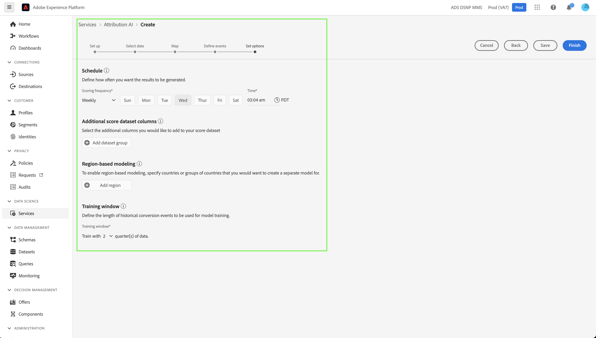

# Handbuch zur Attributions-KI-Benutzeroberfläche

Attribution AI ist Teil von Intelligent Services und bietet einen mehrere Kanäle umfassenden algorithmischen Attributions-Service, der den Einfluss und die inkrementelle Auswirkung von Kundeninteraktionen auf bestimmte Ergebnisse berechnet. Mit Attribution AI können Marketing-Fachleute die Ausgaben für Marketing und Werbung messen und optimieren, indem sie die Auswirkungen einzelner Kundeninteraktionen in jeder Phase der Journey der Kunden verstehen.

Dieses Dokument dient als Anleitung für die Interaktion mit Attribution AI in der Intelligent Services-Benutzeroberfläche.

## Modell erstellen

Wählen Sie in der [!DNL Adobe Experience Platform]-Benutzeroberfläche **[!UICONTROL Dienste]** im linken Navigationsbereich aus. Der **[!UICONTROL Services]**-Browser wird angezeigt und zeigt verfügbare Adobe Intelligent Services an. Wählen Sie im Container für Attributions-KI **[!UICONTROL Öffnen]** aus.

Die Seite des Attribution AI-Service wird angezeigt. Auf dieser Seite werden Service-Modelle der Attributions-KI aufgelistet und Informationen über sie angezeigt, einschließlich des Modellnamens, Konversionsereignissen, der Häufigkeit der Modellausführung und des Status der letzten Aktualisierung.

Die Metrik **[!UICONTROL Insgesamt bewertete Konversionsereignisse]** finden Sie unten rechts im Container **[!UICONTROL Modell erstellen]**. Diese Metrik verfolgt die Gesamtzahl der von Attributions-KI im aktuellen Kalenderjahr erzielten Konversionsereignisse, einschließlich aller Sandbox-Umgebungen und gelöschter Service-Modelle.

Dienstmodelle können mithilfe der Steuerelemente auf der rechten Seite der Benutzeroberfläche bearbeitet, geklont und gelöscht werden. Um diese Steuerelemente anzuzeigen, wählen Sie ein Modell aus Ihren vorhandenen **[!UICONTROL Service-Modellen]** aus. Die Steuerelemente enthalten die folgenden Informationen:

- **[!UICONTROL Bearbeiten]**: Wenn Sie **[!UICONTROL Bearbeiten]** auswählen, können Sie ein vorhandenes Service-Modell ändern. Sie können den Namen, die Beschreibung, den Status, die Bewertungshäufigkeit des Modells und zusätzliche Bewertungs-Datensatzspalten bearbeiten.
- **[!UICONTROL Klonen]**: Wenn Sie **[!UICONTROL Klonen]** auswählen, wird das ausgewählte Service-Modell kopiert. Anschließend können Sie den Workflow ändern, um kleinere Anpassungen vorzunehmen, und ihn in ein neues Modell umbenennen.
- **[!UICONTROL Löschen]**: Sie können ein Service-Modell einschließlich aller historischen Ausführungen löschen. Der entsprechende Ausgabedatensatz wird aus Experience Platform gelöscht. Scores, die mit dem Echtzeit-Kundenprofil synchronisiert wurden, werden jedoch nicht gelöscht.
- **[!UICONTROL Datenquelle]**: Ein Link zum verwendeten Datensatz. Wenn mehr als ein Datensatz von Attributions-KI verwendet wird, wird „Mehrere“ gefolgt von der Anzahl der Datensätze angezeigt. Nach Auswahl des Hyperlinks wird das Popup-Fenster für die Datensatzvorschau angezeigt.
- **[!UICONTROL Details des letzten Durchgangs]**: Wird nur angezeigt, wenn ein Durchgang fehlschlägt. Informationen darüber, warum der Durchlauf fehlgeschlagen ist, wie z. B. Fehler-Codes, werden hier angezeigt.

- **[!UICONTROL Konversionsereignisse]**: Ein kurzer Überblick über die für dieses Modell konfigurierten Konversionsereignisse.
- **[!UICONTROL Lookback-Fenster]**: Der von Ihnen definierte Zeitrahmen, der angibt, wie viele Tage vor dem Touchpoint des Konversionsereignisses enthalten sind.
- **[!UICONTROL Touchpoints]**: Eine Liste aller Touchpoints, die Sie beim Erstellen dieses Modells definiert haben.

Wählen Sie **[!UICONTROL Modell erstellen]**, um zu beginnen.

Als Nächstes wird die Seite Einrichten für Attributions-KI angezeigt, auf der Sie einen Namen und eine optionale Beschreibung für Ihr Service-Modell angeben können.

## Daten auswählen {#select-data}

<!-- https://www.adobe.com/go/aai-select-data -->

Standardmäßig kann Attributions-KI Adobe Analytics-, Erlebnisereignis- und Kundenerlebnisereignisdaten verwenden, um Attributionsbewertungen zu berechnen. Bei der Auswahl eines Datensatzes werden nur Datensätze aufgelistet, die mit Attributions-KI kompatibel sind. Um einen Datensatz auszuwählen, klicken Sie auf das Symbol (**+**) neben dem Datensatznamen oder aktivieren Sie das Kontrollkästchen, um mehrere Datensätze gleichzeitig hinzuzufügen. Sie können auch die Suchoption verwenden, um die Datensätze, die Sie interessieren, schnell zu finden.

Nachdem Sie die gewünschten Datensätze ausgewählt haben, klicken Sie auf die Schaltfläche **[!UICONTROL Hinzufügen]**, um die Datensätze zum Bereich für die Datensatzvorschau hinzuzufügen.

Wenn Sie das Infosymbol  neben einem Datensatz auswählen, wird das Popover für die Datensatzvorschau geöffnet.

Die Datensatzvorschau enthält Daten wie die Zeit der letzten Aktualisierung, das Quellschema und eine Vorschau der ersten zehn Spalten.

Wählen Sie **[!UICONTROL Speichern]**, um Ihre Entwürfe zu speichern, während Sie den Workflow durchlaufen. Sie können auch Modellkonfigurationen von Entwürfen speichern und zum nächsten Schritt im Workflow wechseln. Verwenden Sie **[!UICONTROL Speichern und fortfahren]** um Entwürfe während der Modellkonfigurationen zu erstellen und zu speichern. Mit der Funktion können Sie Entwürfe der Modellkonfiguration erstellen und speichern. Dies ist besonders nützlich, wenn Sie viele Felder im Konfigurations-Workflow definieren müssen.

### Datensatz-Vollständigkeit {#dataset-completeness}

<!-- https://www.adobe.com/go/aai-dataset-completeness -->

In der Datensatzvorschau gibt einen Prozentwert für die Datensatzvollständigkeit an. Dieser Wert bietet einen schnellen Schnappschuss davon, wie viele Spalten in Ihrem Datensatz leer/null sind. Wenn ein Datensatz viele fehlende Werte enthält und diese Werte an anderer Stelle erfasst werden, wird dringend empfohlen, den Datensatz mit den fehlenden Werten einzubeziehen.

>[!NOTE]
>
>Die Vollständigkeit des Datensatzes wird anhand des maximalen Trainings-Fensters für Attributions-KI (ein Jahr) berechnet. Das bedeutet, dass Daten, die älter als ein Jahr sind, beim Anzeigen Ihres Datensatzvollständigkeitswerts nicht berücksichtigt werden.

### Identität auswählen {#identity}

Sie können jetzt mehrere Datensätze anhand der Identitätszuordnung (Feld) miteinander verbinden. Sie müssen einen Identitätstyp (auch als „Identity-Namespace“ bezeichnet) und einen Identitätswert innerhalb dieses Namespace auswählen. Wenn Sie innerhalb Ihres Schemas unter demselben Namespace mehr als ein Feld als Identität zugewiesen haben, werden alle zugewiesenen Identitätswerte in der Dropdown-Liste Identität mit vorangestelltem Namespace angezeigt, z. B. `EMAIL (personalEmail.address)` oder `EMAIL (workEmail.address)`.

>[!IMPORTANT]
>
>Für jeden ausgewählten Datensatz muss derselbe Identitätstyp (Namespace) verwendet werden. Neben dem Identitätstyp wird in der Identitätsspalte ein grünes Häkchen angezeigt, das angibt, dass Datensätze kompatibel sind. Wenn Sie beispielsweise den Namespace Telefon und `mobilePhone.number` als Kennung verwenden, müssen alle Kennungen für die übrigen Datensätze den Namespace Telefon enthalten und verwenden.

Um eine Identität auszuwählen, wählen Sie den unterstrichenen Wert in der Spalte Identität aus. Das Pop-up Identität auswählen wird angezeigt.

Falls in einem Namespace mehr als eine Identität verfügbar ist, stellen Sie sicher, dass Sie das richtige Identitätsfeld für Ihren Anwendungsfall auswählen. Im E-Mail-Namespace sind beispielsweise zwei E-Mail-Identitäten verfügbar: eine geschäftliche und eine persönliche E-Mail. Je nach Anwendungsfall ist eine persönliche E-Mail mit größerer Wahrscheinlichkeit ausgefüllt und kann für individuelle Prognosen nützlicher sein. Dies bedeutet, dass Sie `EMAIL (personalEmail.address)` als Identität auswählen.

>[!NOTE]
>
> Wenn für einen Datensatz kein gültiger Identitätstyp (Namespace) vorhanden ist, müssen Sie eine primäre Identität festlegen und sie mithilfe des [-Editors einem Identity-Namespace &#x200B;](../../xdm/schema/composition.md#identity). Weitere Informationen zu Namespaces und Identitäten finden Sie in der Dokumentation [Identity Service-Namespaces](../../identity-service/features/namespaces.md) .

## Zuordnen von Medien- und Kampagnenfeldern {#aai-mapping}

<!-- https://www.adobe.com/go/aai-mapping -->

Nachdem Sie die Datensätze ausgewählt und hinzugefügt haben, wird **Konfigurationsschritt &quot;**&quot; angezeigt. Attributions-KI erfordert, dass Sie das Medienkanal-Feld für jeden Datensatz zuordnen, den Sie im vorherigen Schritt ausgewählt haben. Dies liegt daran, dass ohne die Medienkanal-Zuordnung zwischen Datensätzen die aus Attributions-KI abgeleiteten Insights möglicherweise nicht richtig angezeigt werden, sodass die Insights-Seite schwer zu interpretieren ist. Obwohl nur der Medienkanal erforderlich ist, wird dringend empfohlen, einige der optionalen Felder wie Medienaktion, Kampagnenname, Kampagnengruppe und Kampagnen-Tag zuzuordnen. Auf diese Weise bietet Attribution AI klarere Einblicke und optimale Ergebnisse.

## Ereignisse definieren {#define-events}

<!-- https://www.adobe.com/go/aai-define-events -->

Es gibt drei verschiedene Arten von Eingabedaten, die zum Definieren von Ereignissen verwendet werden:

- **Konversionsereignisse:** Geschäftsziele, die die Auswirkungen von Marketing-Aktivitäten identifizieren, z. B. E-Commerce-Bestellungen, In-Store-Käufe und Website-Besuche.
- **Lookback-Fenster:** Stellt einen Zeitrahmen bereit, der angibt, wie viele Tage vor dem Konversionsereignis Touchpoints einbezogen werden sollen.
- **Touchpoints:** Marketing-Ereignisse auf Empfänger-, Personen- und/oder Cookie-Ebene, die verwendet werden, um die numerische oder umsatzbasierte Auswirkung von Konversionen zu bewerten.

### Konversionsereignisse definieren {#define-conversion-events}

Um ein Konversionsereignis zu definieren, müssen Sie dem Ereignis einen Namen geben und den Ereignistyp auswählen, indem Sie den Datensatz und das Feld aus dem Dropdown-Menü **Datensatz und Feld auswählen** auswählen.

Nachdem Sie ein Ereignis ausgewählt haben, wird rechts neben dem Ereignis ein neues Dropdown-Menü angezeigt. Die zweite Dropdown-Liste wird verwendet, um mithilfe von Vorgängen weiteren Kontext für Ihr Ereignis bereitzustellen. Für dieses Konversionsereignis wird der Standardvorgang *vorhanden* verwendet.

>[!NOTE]
>
>Eine Zeichenfolge unter Ihrem *Konversionsnamen* wird aktualisiert, während Sie Ihr Ereignis definieren.

Als Nächstes können Sie einen kombinierten Datensatz auswählen, der durch Kombinieren aller Eingabedatensätze im vorherigen Schritt generiert wird. Alternativ können Sie eine auf einzelnen Datensätzen basierende Spalte auch aus dem Dropdown **Menü Datensatz und Feld auswählen** auswählen.

Die **[!UICONTROL Ereignis hinzufügen]** und **[!UICONTROL Gruppe hinzufügen]** werden verwendet, um Ihre Konversion weiter zu definieren. Je nach der von Ihnen definierten Konversion müssen Sie möglicherweise die Schaltflächen **[!UICONTROL Ereignis hinzufügen]** und **[!UICONTROL Gruppe hinzufügen]** verwenden, um weiteren Kontext bereitzustellen.

Wenn Sie **[!UICONTROL Ereignis hinzufügen]** auswählen, werden zusätzliche Felder erstellt, die mit derselben Methode wie oben beschrieben ausgefüllt werden können. Dadurch wird eine AND-Anweisung zur Zeichenfolgendefinition unter dem Konversionsnamen hinzugefügt. Wählen Sie **x** aus, um ein hinzugefügtes Ereignis zu entfernen.

Wenn Sie **[!UICONTROL Gruppe hinzufügen]** auswählen, erhalten Sie die Möglichkeit, zusätzliche Felder getrennt vom Original zu erstellen. Durch Hinzufügen von Gruppen wird eine blaue Schaltfläche *Und* angezeigt. Durch Auswahl von **Und** erhalten Sie eine Option, um den Parameter so zu ändern, dass er „Oder“ enthält. „Oder“ wird verwendet, um mehrere erfolgreiche Konversionspfade zu definieren. „Und“ erweitert den Konvertierungspfad um zusätzliche Bedingungen.

Wenn Sie mehrere Konvertierungen benötigen, wählen Sie **Konversion hinzufügen** aus, um eine neue Konvertierungskarte zu erstellen. Sie können den obigen Vorgang wiederholen, um mehrere Konvertierungen zu definieren.

### Lookback-Fenster definieren {#lookback-window}

Nachdem Sie die Konvertierung definiert haben, müssen Sie Ihr Lookback-Fenster bestätigen. Geben Sie mithilfe der Pfeiltasten oder durch Auswahl des Standardwerts (56) an, wie viele Tage vor dem Konversionsereignis Sie Touchpoints einbeziehen möchten. Touchpoints werden im nächsten Schritt definiert.

### Touchpoints definieren

Die Definition der Touchpoints folgt einem ähnlichen Workflow wie [Konversionen definieren](#define-conversion-events). Zunächst müssen Sie Ihren Touchpoint benennen und einen Touchpoint-Wert aus dem Dropdown-Menü *Feldnamen eingeben* auswählen. Nach der Auswahl wird das Dropdown-Menü „Operator“ mit dem Standardwert „exists“ angezeigt. Wählen Sie das Dropdown-Menü aus, um eine Liste der Benutzer anzuzeigen.

Wählen Sie für die Zwecke dieses Touchpoints &quot;**&quot;**.

Sobald ein Operator für einen Touchpoint ausgewählt ist *wird* Feldwert eingeben) verfügbar gemacht. Die Dropdown-Werte für *Feldwert eingeben* werden basierend auf dem zuvor ausgewählten Operator und Touchpoint-Wert befüllt. Wenn ein Wert nicht in der Dropdown-Liste angezeigt wird, können Sie diesen Wert manuell eingeben. Wählen Sie das Dropdown-Menü aus und klicken **auf**.

>[!NOTE]
>
>Den Operatoren „exists“ und „NOT EXISTS“ sind keine Feldwerte zugeordnet.

Die **Ereignis hinzufügen** und **Gruppe hinzufügen** werden verwendet, um Ihren Touchpoint weiter zu definieren. Aufgrund der komplexen Natur rund um Touchpoints ist es nicht ungewöhnlich, dass für einen einzelnen Touchpoint mehrere Ereignisse und Gruppen vorhanden sind.

Wenn diese Option **Ereignis hinzufügen** ist das Hinzufügen zusätzlicher Felder möglich. Wählen Sie **x** aus, um ein hinzugefügtes Ereignis zu entfernen.

Wenn Sie **Gruppe hinzufügen** auswählen, können Sie zusätzliche Felder erstellen, die vom Original getrennt sind. Durch Hinzufügen von Gruppen wird eine blaue Schaltfläche *Und* angezeigt. Wählen Sie **Und** um den Parameter zu ändern, wird der neue Parameter „Oder“ verwendet, um mehrere erfolgreiche Pfade zu definieren. Dieser bestimmte Touchpoint hat nur einen erfolgreichen Pfad, daher ist „Oder“ nicht erforderlich.

>[!NOTE]
>
>Verwenden Sie die Zeichenfolge unter *Touchpoint-Name* für einen schnellen Überblick über Ihren Touchpoint. Beachten Sie, dass die Zeichenfolge mit dem Namen des Touchpoints übereinstimmt.

Sie können zusätzliche Touchpoints hinzufügen, indem Sie **Touchpoint hinzufügen** auswählen und den obigen Prozess wiederholen.

Nachdem Sie alle erforderlichen Touchpoints definiert haben, scrollen Sie nach oben und wählen **Weiter** in der oberen rechten Ecke, um mit dem letzten Schritt fortzufahren.

## Erweiterte Einrichtung für Training und Scoring

Die letzte Seite in Attributions-KI ist die Seite **[!UICONTROL Erweitert]** die für die Einrichtung von Schulungen und Bewertungen verwendet wird.

### Schulung planen

Mithilfe der *Zeitplan* können Sie einen Tag und eine Uhrzeit für die Woche auswählen, für die die Bewertung stattfinden soll.

Wählen Sie das Dropdown unter *Scoring-Häufigkeit* aus, um zwischen täglicher, wöchentlicher und monatlicher Bewertung zu wählen. Wählen Sie als Nächstes die Wochentage aus, an denen die Bewertung stattfinden soll. Es können mehrere Tage ausgewählt werden. Wenn Sie denselben Tag erneut auswählen, wird die Auswahl aufgehoben.

Um die Tageszeit zu ändern, zu der die Bewertung erfolgen soll, wählen Sie das Uhrensymbol aus. Geben Sie in der neu angezeigten Überlagerung die Tageszeit ein, zu der die Bewertung erfolgen soll. Wählen Sie außerhalb der Überlagerung aus, um sie zu schließen.

>[!NOTE]
>
>Es kann bis zu 24 Stunden dauern, bis jeder Scoring-Prozess abgeschlossen ist.

### Zusätzliche Bewertungs-Datensatzspalten (optional)

Standardmäßig wird ein Score-Datensatz für jedes Service-Modell in einem Standardschema erstellt. Sie können zusätzliche Spalten basierend auf Ihren Konversionsereignis- und Touchpoint-Konfigurationen zur Bewertung der Datensatzausgabe hinzufügen. Wählen Sie zunächst Spalten aus Ihrem Eingabedatensatz aus und ziehen Sie sie dann per Drag-and-Drop, um die Reihenfolge zu ändern, indem Sie die linke Maustaste über dem Hamburger-Symbol gedrückt halten.

### Regionsbasierte Modellierung (optional) {#region-based-modeling-optional}

Das Verhalten Ihrer Kunden kann je nach Land und geografischer Region erheblich voneinander abweichen. Für globale Unternehmen kann die Verwendung von landes- oder regionsbasierten Modellen die Attributionsgenauigkeit erhöhen. Jede hinzugefügte Region erstellt ein neues Modell mit den Daten dieser Region.

Um eine neue Region zu definieren, wählen Sie zunächst **[!UICONTROL Region hinzufügen]** aus. Geben Sie im angezeigten Container einen Namen für die Region ein. Nur ein Wert („placeContext.geo.countryCode„) wird aus dem Dropdown-Menü **[!UICONTROL Feldnamen eingeben“]**. Wählen Sie diesen Wert.

Wählen Sie als Nächstes einen Benutzer aus.

Geben Sie abschließend den Länder-Code in der Dropdown-Liste **[!UICONTROL Feldwert eingeben]** ein.

>[!NOTE]
>
>Länder-Codes sind zwei Zeichen lang. Eine vollständige Liste finden Sie hier: [ISO 3166-1 alpha-2](https://datahub.io/core/country-list).

### Trainings-Fenster {#training-window}

Um sicherzustellen, dass Sie das genaueste Modell erhalten, ist es wichtig, Ihr Modell mit historischen Daten zu trainieren, die Ihr Unternehmen darstellen. Standardmäßig wird das Modell mit den Daten von Konversionsereignissen für 2 Quartale (6 Monate) trainiert. Wählen Sie das Dropdown-Menü aus, um den Standard zu ändern. Sie können mit ein bis vier Quartalen an Daten (3-12 Monate) trainieren.

>[!NOTE]
>
>Ein kürzeres Trainings-Fenster ist anfälliger für aktuelle Trends, während ein längeres Trainings-Fenster ein robusteres Modell erstellt und weniger anfällig für aktuelle Trends ist.

Nachdem Sie Ihr Trainings-Fenster ausgewählt haben, wählen **[!UICONTROL oben]** rechts „Beenden“ aus. Warten Sie etwas, bis die Daten verarbeitet wurden. Nach Abschluss des Vorgangs wird ein Pop-up-Dialogfeld angezeigt, in dem bestätigt wird, dass die Instanzeinrichtung abgeschlossen ist. Wählen Sie **[!UICONTROL OK]** aus, um zur Seite **[!UICONTROL Service-Instanzen]** weitergeleitet zu werden, auf der Ihre Service-Instanz angezeigt wird.

## Nächste Schritte

In diesem Tutorial haben Sie erfolgreich eine Service-Instanz in Attributions-KI erstellt. Sobald die Instanz die Bewertung abgeschlossen hat (erlauben Sie bis zu 24 Stunden), können Sie [Attribution AI-Insights entdecken](./discover-insights.md). Wenn Sie Ihre Scoring-Ergebnisse herunterladen möchten, lesen Sie außerdem die Dokumentation [Scores herunterladen](./download-scores.md).

## Zusätzliche Ressourcen

Im folgenden Video wird ein End-to-End-Workflow zum Erstellen einer neuen Instanz in Attributions-KI beschrieben.

>[!VIDEO](https://video.tv.adobe.com/v/36557?learn=on&quality=12&captions=ger)
