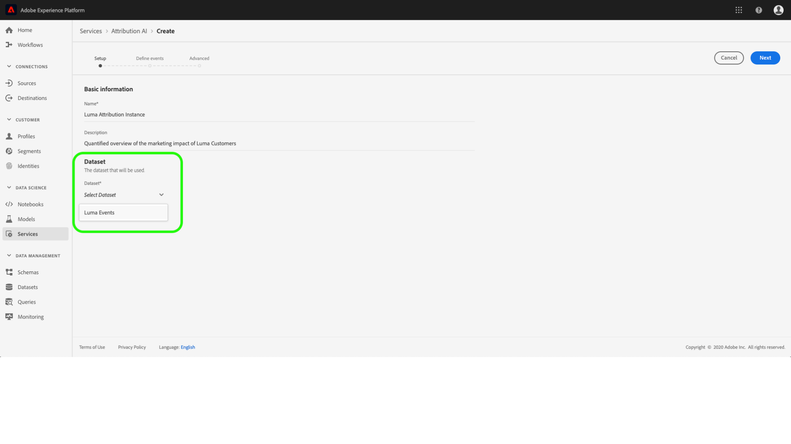

# Benutzerhandbuch zur Zuordnung von AI

Attribution AI als Teil von Intelligent Services ist ein algorithmischer Zuordnungsdienst mit mehreren Kanälen, der den Einfluss und die inkrementelle Auswirkung von Kundeninteraktionen auf bestimmte Ergebnisse berechnet. Mit Attribution AI können Marketingfachleute die Ausgaben für Marketing und Werbung messen und optimieren, indem sie die Auswirkungen jeder einzelnen Kundeninteraktion auf die einzelnen Phasen der Customer Journey verstehen.

Dieses Dokument dient als Leitfaden für die Interaktion mit Attribution AI in der Benutzeroberfläche von Intelligent Services.

## Erstellen einer Instanz

In the [!DNL Adobe Experience Platform] UI, click **Services** in the left navigation. Der *Dienste* -Browser wird angezeigt und zeigt verfügbare intelligente Adobe-Dienste an. In the container for Attribution AI, click **Open**.

Die Seite des Zuordnungs-API-Dienstes wird angezeigt. Auf dieser Seite werden Dienstinstanzen von Attribution AI Liste und Informationen zu diesen Instanzen, einschließlich des Namens der Instanz, der Konvertierungseinstellungen, der Häufigkeit der Ausführung der Instanz und des Status der letzten Aktualisierung, angezeigt. Klicken Sie auf Instanz **erstellen** , um zu beginnen.

Als Nächstes wird die Setup-Seite für Attribution AI angezeigt, auf der Sie grundlegende Informationen bereitstellen und einen Datensatz für die Instanz angeben können.

### Benennen der Instanz

Geben Sie unter *Grundlegende Informationen* einen Namen und eine optionale Beschreibung für Ihre Dienstinstanz ein.

### Datensatz auswählen

Nachdem Sie die grundlegenden Informationen ausgefüllt haben, klicken Sie auf das Dropdown-Menü **Datensatz** auswählen, um Ihren Datensatz auszuwählen. Der Datensatz wird verwendet, um das Modell zu trainieren und die nachfolgenden Daten zu bewerten, die es erzeugt. Wenn Sie einen Datensatz aus der Dropdown-Auswahl auswählen, werden nur die Daten aufgelistet, die mit Attribution AI kompatibel sind und dem Experience Data Model (XDM)-Schema entsprechen. Nachdem Sie einen Datensatz ausgewählt haben, klicken Sie in der rechten oberen Ecke auf **Weiter** , um mit der Seite &quot;Ereignis definieren&quot;fortzufahren.

## Definieren von Ereignissen

Es gibt drei verschiedene Arten von Eingabedaten, die zur Definition von Ereignissen verwendet werden:

- **Ereignis zur Konvertierung:** Geschäftsziele, die die Auswirkungen von Marketing-Aktivitäten wie E-Commerce-Bestellungen, In-Store-Käufe und Website-Besuche identifizieren.
- **Lookback-Fenster:** Stellt einen Zeitraum bereit, der angibt, wie viele Tage vor dem Konversions-Ereignis Touchpoints eingeschlossen werden sollen.
- **Touchpoints:** Marketing-Ereignis auf Empfänger-, Individual- und/oder Cookie-Ebene, die zur Bewertung der numerischen oder umsatzbasierten Auswirkungen von Konversionen verwendet werden.

### Definieren von Konversions-Ereignissen {#define-conversion-events}

Um ein Konversions-Ereignis zu definieren, müssen Sie dem Ereignis einen Namen geben und den Ereignistyp auswählen, indem Sie auf das Dropdown-Menü &quot;Feldname **eingeben&quot;klicken** .

Nach Auswahl eines Ereignisses wird rechts ein neues Dropdown-Feld angezeigt. Die zweite Dropdownliste dient dazu, durch die Verwendung von Vorgängen weiteren Kontext für Ihr Ereignis zu schaffen. Für dieses Konvertierungs-Ereignis wird der Standardvorgang *existiert* .

>[!NOTE]
>
>Eine Zeichenfolge unter Ihrem *Konvertierungsnamen* wird aktualisiert, wenn Sie Ihr Ereignis definieren.

Die *Hinzufügen Ereignis* - und *HinzufügenGruppe* -Schaltflächen dienen zur weiteren Definition der Konvertierung. Je nach der von Ihnen definierten Konversion müssen Sie eventuell die Schaltflächen *Hinzufügen Ereignis* und *Hinzufügen Gruppe* verwenden, um weitere Kontexte bereitzustellen.

Durch Klicken auf **Hinzufügen Ereignis** werden weitere Felder erstellt, die nach der oben beschriebenen Methode ausgefüllt werden können. Hierdurch wird der Zeichenfolgendefinition unter dem *Konvertierungsnamen eine* AND *-Anweisung hinzugefügt*. Klicken Sie auf das **x** , um ein hinzugefügtes Ereignis zu entfernen.

Wenn Sie auf **Hinzufügen Gruppe** klicken, können Sie weitere Felder getrennt vom Original erstellen. Nach dem Hinzufügen von Gruppen wird eine blaue *Und* -Schaltfläche angezeigt. Durch Klicken auf **Und** können Sie den Parameter so ändern, dass er &quot;Oder&quot;enthält. &quot;Oder&quot;wird verwendet, um mehrere erfolgreiche Konvertierungspfade zu definieren. &quot;Und&quot;erweitert den Konvertierungspfad um zusätzliche Bedingungen.

Wenn Sie mehr als eine Konvertierung benötigen, klicken Sie auf **Hinzufügen Konvertierung** , um eine neue Konvertierungskarte zu erstellen. Sie können den obigen Prozess wiederholen, um mehrere Konvertierungen zu definieren.

### Lookback-Fenster definieren

Nachdem Sie Ihre Konvertierung definiert haben, müssen Sie Ihr Lookback-Fenster bestätigen. Geben Sie mithilfe der Pfeiltasten oder durch Klicken auf den Standardwert (56) an, wie viele Tage vor dem Konversions-Ereignis Touchpoints eingefügt werden sollen. Touchpoints werden im nächsten Schritt definiert.

### Definieren von Touchpoints

Das Definieren von Touchpoints erfolgt nach einem ähnlichen Arbeitsablauf wie das [Definieren von Konvertierungen](#define-conversion-events). Zunächst müssen Sie Ihren Touchpoint benennen und einen Touchpoint-Wert aus dem Dropdown-Menü &quot;Feldname *eingeben* &quot;auswählen. Nach der Auswahl wird das Dropdown-Feld &quot;Operator&quot;mit dem Standardwert &quot;exists&quot;angezeigt. Klicken Sie auf das Dropdownmenü, um eine Liste der Operatoren anzuzeigen.

Für den Zweck dieses Touchpoints wählen Sie &quot; **Gleich&quot;**.

Wenn ein Operator für einen Touchpoint ausgewählt ist, wird der Wert &quot; *Feldeingabe&quot;verfügbar gemacht* . Die Dropdown-Werte für &quot;Feldwert *eingeben&quot;* basieren auf dem zuvor ausgewählten Operator- und Touchpoint-Wert. Wenn ein Wert nicht in der Dropdown-Liste enthalten ist, können Sie diesen Wert manuell eingeben. Klicken Sie auf das Dropdownmenü und wählen Sie **KLICKEN**.

>[!NOTE]
>
>Den Operatoren &quot;exists&quot;und &quot;not exists&quot;sind keine Feldwerte zugeordnet.

Mit den *Hinzufügen Ereignis* - und *Hinzufügen Gruppenschaltflächen* können Sie Ihren Touchpoint weiter definieren. Aufgrund der komplexen Natur rund um Touchpoints ist es nicht ungewöhnlich, mehrere Ereignis und Gruppen für einen einzigen Touchpoint zu haben.

Durch Klicken auf **Hinzufügen Ereignis** können zusätzliche Felder hinzugefügt werden. Klicken Sie auf das **x** , um ein hinzugefügtes Ereignis zu entfernen.

Wenn Sie auf **Hinzufügen Gruppe** klicken, können Sie weitere Felder getrennt vom Original erstellen. Nach dem Hinzufügen von Gruppen wird eine blaue *Und* -Schaltfläche angezeigt. Klicken Sie auf **Und** um den Parameter zu ändern, wird der neue Parameter &quot;Oder&quot;verwendet, um mehrere erfolgreiche Pfade zu definieren. Dieser Touchpoint hat nur einen erfolgreichen Pfad, daher ist &quot;Oder&quot;nicht erforderlich.

>[!NOTE]
>
>Verwenden Sie die Zeichenfolge unter dem *Touchpoint-Namen* , um einen schnellen Überblick über Ihren Touchpoint zu erhalten. Beachten Sie, dass die Zeichenfolge mit dem Namen des Touchpoints übereinstimmt.

Sie können weitere Touchpoints hinzufügen, indem Sie auf **Hinzufügen Touchpoint** klicken und den obigen Vorgang wiederholen.

Nachdem Sie alle erforderlichen Touchpoints definiert haben, scrollen Sie nach oben und klicken Sie in der oberen rechten Ecke auf **Weiter** , um mit dem letzten Schritt fortzufahren.

## Erweiterte Schulungs- und Bewertungseinstellungen

Die letzte Seite in Attribution AI ist die *Advanced* Seite, die zum Einrichten von Training und Scoring verwendet wird.

### Schulung planen

Mithilfe des *Zeitplans* können Sie einen Wochentag und eine Uhrzeit für die Bewertung auswählen.

Klicken Sie auf das Dropdownmenü unter *Bewertungshäufigkeit* , um zwischen täglicher, wöchentlicher und monatlicher Bewertung auszuwählen. Wählen Sie anschließend die Wochentage aus, an denen die Bewertung erfolgen soll. Es können mehrere Tage ausgewählt werden. Klicken Sie ein zweites Mal auf einen Tag, um die Auswahl aufzuheben.

Klicken Sie auf das Uhrensymbol, um die Uhrzeit zu ändern, zu der die Bewertung erfolgen soll. Geben Sie in der neuen Überlagerung, die angezeigt wird, die Uhrzeit ein, zu der die Bewertung erfolgen soll. Klicken Sie auf eine Stelle außerhalb der Überlagerung, um sie zu schließen.

>[!NOTE]
>
>Es kann bis zu 24 Stunden dauern, bis jeder Bewertungsvorgang abgeschlossen ist.

### Regionale Modellierung (optional) {#region-based-modeling-optional}

Das Verhalten Ihrer Kunden kann sich je nach Land und Region erheblich unterscheiden. Für globale Unternehmen kann die Verwendung von länderbasierten oder regionsbasierten Modellen die Genauigkeit der Zuordnung erhöhen. Jede hinzugefügte Region erstellt ein neues Modell mit den Daten dieser Region.

Um einen neuen Bereich zu definieren, klicken Sie auf **Hinzufügen Bereich**. Geben Sie in dem angezeigten Container einen Namen für die Region ein. Nur ein Wert (&quot;placeContext.geo.countryCode&quot;) wird aus der Dropdownliste Feldname *eingeben* ausgefüllt. Wählen Sie diesen Wert aus.

Wählen Sie als Nächstes einen Operator aus.

Geben Sie abschließend den Ländercode in der Dropdown-Liste *Feldwert* eingeben ein.

>[!NOTE]
>
>Ländercodes sind zwei Zeichen lang. Eine vollständige Liste finden Sie hier: [ISO 3166-1 alpha-2](https://datahub.io/core/country-list).

### Schulungsfenster

Um sicherzustellen, dass Sie das bestmögliche Modell erhalten, ist es wichtig, Ihr Modell mit historischen Daten auszubilden, die Ihr Geschäft repräsentieren. Standardmäßig wird das Modell mit 2 Quartalen (6 Monate) an Daten trainiert. Wählen Sie das Dropdown-Menü aus, um die Standardeinstellung zu ändern. Sie können zwischen einem und vier Quartalen der Daten (3-12 Monate) trainieren.

>[!NOTE]
>
>Ein kürzeres Schulungsfenster ist anfälliger für aktuelle Trends, während ein längeres Schulungsfenster ein robusteres Modell schafft und weniger anfällig für aktuelle Trends ist.

Klicken Sie nach Auswahl des Schulungsfensters in der oberen rechten Ecke auf **Fertig stellen** . Warten Sie einige Zeit, bis die Daten verarbeitet werden. Nach Abschluss des Vorgangs wird ein Popup-Dialogfeld angezeigt, in dem bestätigt wird, dass die Instanzeinrichtung abgeschlossen ist. Klicken Sie auf **OK** , um zur Seite &quot; *Dienstinstanzen* &quot;umgeleitet zu werden, auf der Sie Ihre Dienstinstanz sehen können.

## Nächste Schritte

Indem Sie diesem Tutorial folgen, haben Sie erfolgreich eine Dienstinstanz in Attribution AI erstellt. Sobald die Instanz ihre Bewertung abgeschlossen hat (bis zu 24 Stunden), können Sie [Zuordnungs-AI-Einblicke](./discover-insights.md)entdecken. Wenn Sie außerdem Ihre Ergebnisse herunterladen möchten, lesen Sie die Dokumentation zu den [Downloads von Rohwerten](./download-scores.md) .

## Zusätzliche Ressourcen

Im folgenden Video wird ein durchgängiger Arbeitsablauf zum Erstellen einer neuen Instanz in Attribution AI beschrieben.

>[!VIDEO](https://video.tv.adobe.com/v/32668?learn=on&quality=12)