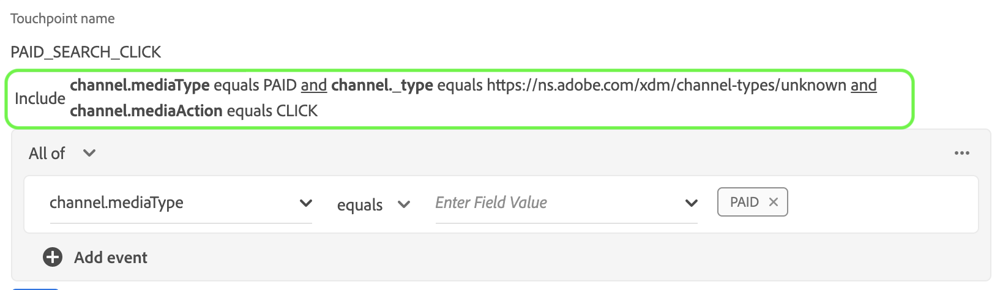
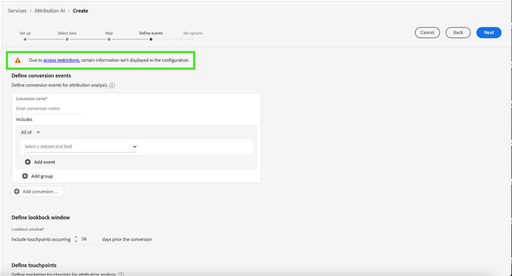

# Handbuch zur Benutzeroberfläche von Attribution AI

Attribution AI als Teil von Intelligent Services ist ein algorithmischer Attributionsdienst mit mehreren Kanälen, der den Einfluss und die inkrementelle Auswirkung von Kundeninteraktionen auf bestimmte Ergebnisse berechnet. Mit Attribution AI können Marketing-Experten die Ausgaben für Marketing und Werbung messen und optimieren, indem sie die Auswirkungen einzelner Kundeninteraktionen in einzelnen Phasen der Customer Journey untersuchen.

Dieses Dokument dient als Leitfaden für die Interaktion mit Attribution AI in der Benutzeroberfläche von Intelligent Services.

## Erstellen einer Instanz

Im [!DNL Adobe Experience Platform] Benutzeroberfläche, auswählen **[!UICONTROL Dienste]** in der linken Navigation. Die **[!UICONTROL Dienste]** angezeigt und zeigt verfügbare Adobe Intelligence Services an. Wählen Sie im Container für Attribution AI die Option **[!UICONTROL Öffnen]**.

Die Seite des Attribution AI-Service wird angezeigt. Auf dieser Seite werden Dienstinstanzen von Attribution AI aufgelistet und Informationen zu diesen angezeigt, einschließlich des Namens der Instanz, der Konversionsereignisse, der Häufigkeit der Ausführung der Instanz und des Status der letzten Aktualisierung.

Sie finden die **[!UICONTROL Gesamtzahl der bewerteten Konversionsereignisse]** Metrik unten rechts im **[!UICONTROL Instanz erstellen]** Container. Diese Metrik verfolgt die Gesamtzahl der Konversionsereignisse, die von Attribution AI für das aktuelle Kalenderjahr bewertet wurden, einschließlich aller Sandbox-Umgebungen und aller gelöschten Dienstinstanzen.

Dienstinstanzen können mithilfe der Steuerelemente auf der rechten Seite der Benutzeroberfläche bearbeitet, geklont und gelöscht werden. Um diese Steuerelemente anzuzeigen, wählen Sie eine Instanz aus Ihrer vorhandenen **[!UICONTROL Dienstinstanzen]**. Die Steuerelemente enthalten die folgenden Informationen:

- **[!UICONTROL Bearbeiten]**: Auswählen **[!UICONTROL Bearbeiten]** können Sie eine vorhandene Dienstinstanz ändern. Sie können den Namen, die Beschreibung, den Status und die Scoring-Häufigkeit der Instanz bearbeiten.
- **[!UICONTROL Klonen]**: Auswählen **[!UICONTROL Klonen]** kopiert die ausgewählte Dienstinstanz. Anschließend können Sie den Workflow ändern, um kleinere Änderungen vorzunehmen, und ihn in eine neue Instanz umbenennen.
- **[!UICONTROL Löschen]**: Sie können eine Dienstinstanz einschließlich aller historischen Ausführungen löschen. Der entsprechende Ausgabedatensatz wird aus Platform gelöscht. Bewertungen, die mit dem Echtzeit-Kundenprofil synchronisiert wurden, werden jedoch nicht gelöscht.
- **[!UICONTROL Datenquelle]**: Ein Link zum verwendeten Datensatz. Wenn mehr als ein Datensatz von Attribution AI verwendet wird, wird &quot;Mehrere&quot;gefolgt von der Anzahl der Datensätze angezeigt. Bei Auswahl des Hyperlinks wird das Popup-Fenster für die Datensatzvorschau angezeigt.
- **[!UICONTROL Letzte Ausführungsdetails]**: Dies wird nur angezeigt, wenn eine Ausführung fehlschlägt. Informationen dazu, warum die Ausführung fehlgeschlagen ist, wie Fehlercodes, werden hier angezeigt.

- **[!UICONTROL Konversionsereignisse]**: Ein kurzer Überblick über die für diese Instanz konfigurierten Konversionsereignisse.
- **[!UICONTROL Lookback-Fenster]**: Der von Ihnen definierte Zeitrahmen, der angibt, wie viele Tage vor den Touchpoints des Konversionsereignisses vergangen sind.
- **[!UICONTROL Touchpoints]**: Eine Liste aller Touchpoints, die Sie beim Erstellen dieser Instanz definiert haben.

Auswählen **[!UICONTROL Instanz erstellen]** um zu beginnen.

Als Nächstes wird die Seite zum Einrichten von Attribution AI angezeigt, auf der Sie einen Namen und eine optionale Beschreibung für Ihre Dienstinstanz angeben können.

## Auswählen von Daten {#select-data}

<!-- https://www.adobe.com/go/aai-select-data -->

Standardmäßig kann Attribution AI die Attributionsergebnisse anhand von Adobe Analytics-, Erlebnisereignis- und Kundenerlebnisereignisdaten berechnen. Bei der Auswahl eines Datensatzes werden nur Datensätze aufgelistet, die mit Attribution AI kompatibel sind. Um einen Datensatz auszuwählen, wählen Sie die **+**) neben dem Datensatznamen oder aktivieren Sie das Kontrollkästchen, um mehrere Datensätze gleichzeitig hinzuzufügen. Sie können auch die Suchoption verwenden, um schnell die Datensätze zu finden, an denen Sie interessiert sind.

Wählen Sie nach Auswahl der Datensätze, die Sie verwenden möchten, die **[!UICONTROL Hinzufügen]** -Schaltfläche, um die Datensätze zum Vorschaufenster für den Datensatz hinzuzufügen.

Infosymbol auswählen  neben einem Datensatz öffnet das Popup-Fenster für die Datensatzvorschau.

Die Datensatzvorschau enthält Daten wie die letzte Aktualisierungszeit, das Quellschema und eine Vorschau der ersten zehn Spalten.

### Datensatzvollständigkeit {#dataset-completeness}

<!-- https://www.adobe.com/go/aai-dataset-completeness -->

In der Datensatzvorschau ist ein Prozentsatz für die Vollständigkeit eines Datensatzes. Dieser Wert liefert einen schnellen Überblick darüber, wie viele Spalten in Ihrem Datensatz leer/null sind. Wenn ein Datensatz viele fehlende Werte enthält und diese Werte an anderer Stelle erfasst werden, wird dringend empfohlen, den Datensatz mit den fehlenden Werten einzubeziehen.

>[!NOTE]
>
>Die Vollständigkeit des Datensatzes wird unter Verwendung des maximalen Schulungsfensters für Attribution AIS (ein Jahr) berechnet. Das bedeutet, dass Daten, die älter als ein Jahr sind, bei der Anzeige Ihres Datensatzvollständigkeitswerts nicht berücksichtigt werden.

### Identität auswählen {#identity}

Sie können jetzt mehrere Datensätze auf Grundlage der Identitätszuordnung (Feld) miteinander verknüpfen. Sie müssen einen Identitätstyp (auch als &quot;Identitäts-Namespace&quot;bezeichnet) und einen Identitätswert in diesem Namespace auswählen. Wenn Sie innerhalb Ihres Schemas unter demselben Namespace mehr als ein Feld als Identität zugewiesen haben, werden alle zugewiesenen Identitätswerte im Dropdown-Menü &quot;Identität&quot;angezeigt, dem der Namespace vorangestellt wird, z. B. `EMAIL (personalEmail.address)` oder `EMAIL (workEmail.address)`.

>[!IMPORTANT]
>
>Für jeden ausgewählten Datensatz muss derselbe Identitätstyp (Namespace) verwendet werden. Neben dem Identitätstyp wird in der Identitätsspalte ein grünes Häkchen angezeigt, das angibt, dass Datensätze kompatibel sind. Bei Verwendung des Namespace Telefon und `mobilePhone.number` als Kennung angeben, müssen alle Kennungen für die verbleibenden Datensätze den Namespace Phone enthalten und verwenden.

Um eine Identität auszuwählen, wählen Sie den unterstrichenen Wert in der Identitätsspalte aus. Das Popover zur Identitätsauswahl wird angezeigt.

Wenn innerhalb eines Namespace mehr als eine Identität verfügbar ist, wählen Sie das richtige Identitätsfeld für Ihren Anwendungsfall aus. Beispielsweise sind im E-Mail-Namespace zwei E-Mail-Identitäten verfügbar: eine Arbeit und eine persönliche E-Mail. Je nach Anwendungsfall ist es wahrscheinlicher, dass eine persönliche E-Mail ausgefüllt wird, und nützlicher bei individuellen Prognosen. Sie können also `EMAIL (personalEmail.address)` als Ihre Identität.

>[!NOTE]
>
> Wenn für einen Datensatz kein gültiger Identitätstyp (Namespace) vorhanden ist, müssen Sie eine primäre Identität festlegen und ihn mithilfe der [Schemaeditor](../../xdm/schema/composition.md#identity). Weitere Informationen zu Namespaces und Identitäten finden Sie unter [Identity Service-Namespaces](../../identity-service/namespaces.md) Dokumentation.

## Zuordnen von Medien- und Kampagnenfeldern {#aai-mapping}

<!-- https://www.adobe.com/go/aai-mapping -->

Nachdem Sie die Auswahl und das Hinzufügen von Datensätzen abgeschlossen haben, wird die **Zuordnung** Konfigurationsschritt angezeigt. Attribution AI erfordert, dass Sie das Feld Medienkanal für jeden Datensatz zuordnen, den Sie im vorherigen Schritt ausgewählt haben. Dies liegt daran, dass ohne die Medienkanal-Zuordnung zwischen Datensätzen von aus Attribution AI abgeleiteten Einblicken möglicherweise nicht richtig angezeigt wird, was die Interpretationsseite der Einblicke erschwert. Obwohl nur der Medienkanal erforderlich ist, wird dringend empfohlen, einige der optionalen Felder wie Medienaktion, Kampagnenname, Kampagnengruppe und Kampagnen-Tag zuzuordnen. Dadurch kann Attribution AI bessere Einblicke und optimale Ergebnisse erzielen.

## Ereignisse definieren {#define-events}

<!-- https://www.adobe.com/go/aai-define-events -->

Es gibt drei verschiedene Arten von Eingabedaten, die zur Definition von Ereignissen verwendet werden:

- **Konversionsereignisse:** Geschäftsziele, die die Auswirkungen von Marketingaktivitäten identifizieren, wie z. B. E-Commerce-Bestellungen, In-Store-Käufen und Website-Besuchen.
- **Lookback-Fenster:** Stellt einen Zeitraum bereit, der angibt, wie viele Tage vor den Touchpoints des Konversionsereignisses eingeschlossen werden sollen.
- **Touchpoints:** Marketing-Ereignisse auf Empfänger-, Einzel- oder Cookie-Ebene, die zur Bewertung der numerischen oder umsatzbasierten Auswirkungen von Konversionen verwendet werden.

### Konversionsereignisse definieren {#define-conversion-events}

Um ein Konversionsereignis zu definieren, müssen Sie dem Ereignis einen Namen geben und den Ereignistyp auswählen, indem Sie den Datensatz und das Feld aus dem **Datensatz und Feld auswählen** Dropdown-Menü.

Sobald ein Ereignis ausgewählt ist, wird rechts ein neues Dropdown-Menü angezeigt. Das zweite Dropdown-Menü wird verwendet, um durch die Verwendung von Vorgängen weiteren Kontext für Ihr Ereignis bereitzustellen. Für dieses Konversionsereignis ist der Standardvorgang *exists* verwendet.

>[!NOTE]
>
>Eine Zeichenfolge unter *Konversionsname* aktualisiert wird, während Sie Ihr Ereignis definieren.

Als Nächstes können Sie einen kombinierten Datensatz auswählen, der durch die Kombination aller Eingabedatensätze im vorherigen Schritt generiert wird. Alternativ können Sie eine Spalte anhand einzelner Datensätze aus der **Datensatz und Feld auswählen** Dropdown-Menü.

Die **[!UICONTROL Ereignis hinzufügen]** und **[!UICONTROL Gruppe hinzufügen]** -Schaltflächen dienen zur weiteren Definition Ihrer Konvertierung. Je nach der von Ihnen definierten Konversion müssen Sie möglicherweise die **[!UICONTROL Ereignis hinzufügen]** und **[!UICONTROL Gruppe hinzufügen]** -Schaltflächen, um weiteren Kontext bereitzustellen.

Auswählen **[!UICONTROL Ereignis hinzufügen]** erstellt zusätzliche Felder, die nach der oben beschriebenen Methode ausgefüllt werden können. Hierdurch wird der Zeichenfolgendefinition unter dem Konversionsnamen eine AND-Anweisung hinzugefügt. Wählen Sie die **x** , um ein hinzugefügtes Ereignis zu entfernen.

Auswählen **[!UICONTROL Gruppe hinzufügen]** bietet die Möglichkeit, zusätzliche Felder separat vom Original zu erstellen. Mit dem Zusatz von Gruppen ist ein blaues *und* angezeigt. Auswählen **und** gibt eine Option, um den Parameter so zu ändern, dass er &quot;Oder&quot;enthält. &quot;Oder&quot;wird verwendet, um mehrere erfolgreiche Konversionspfade zu definieren. &quot;Und&quot;erweitert den Konversionspfad um zusätzliche Bedingungen.

Wenn Sie mehr als eine Konversion benötigen, wählen Sie **Konvertierung hinzufügen** , um eine neue Konversionskarte zu erstellen. Sie können den obigen Prozess wiederholen, um mehrere Konversionen zu definieren.

### Lookback-Fenster definieren {#lookback-window}

Nachdem Sie die Definition Ihrer Konvertierung abgeschlossen haben, müssen Sie Ihr Lookback-Fenster bestätigen. Geben Sie mithilfe der Pfeiltasten oder durch Auswahl des Standardwert (56) an, wie viele Tage vor dem Konversionsereignis Sie Touchpoints einbeziehen möchten. Touchpoints werden im nächsten Schritt definiert.

### Definieren von Touchpoints

Das Definieren von Touchpoints folgt einem ähnlichen Workflow wie [Konversionen definieren](#define-conversion-events). Zunächst müssen Sie Ihren Touchpoint benennen und einen Touchpoint-Wert aus dem *Feldname eingeben* Dropdown-Menü. Nach der Auswahl wird das Dropdown-Menü für den Operator mit dem Standardwert &quot;vorhanden&quot;angezeigt. Wählen Sie das Dropdown-Menü aus, um eine Benutzerliste anzuzeigen.

Wählen Sie für diesen Touchpoint die Option **gleich**.

Sobald ein Operator für einen Touchpoint ausgewählt wurde, *Feldwert eingeben* bereitgestellt werden. Die Dropdown-Werte für *Feldwert eingeben* Füllen Sie basierend auf dem zuvor ausgewählten Operator- und Touchpoint-Wert. Wenn ein Wert nicht in der Dropdown-Liste ausgefüllt wird, können Sie diesen Wert manuell eingeben. Wählen Sie das Dropdown-Menü aus und wählen Sie **KLICKEN**.

>[!NOTE]
>
>Den Operatoren &quot;vorhanden&quot;und &quot;nicht vorhanden&quot;sind keine Feldwerte zugeordnet.

Die **Ereignis hinzufügen** und **Gruppe hinzufügen** -Schaltflächen werden verwendet, um Ihren Touchpoint weiter zu definieren. Aufgrund der komplexen Natur rund um Touchpoints ist es nicht ungewöhnlich, mehrere Ereignisse und Gruppen für einen einzelnen Touchpoint zu haben.

Wenn ausgewählt, **Ereignis hinzufügen** ermöglicht das Hinzufügen zusätzlicher Felder. wählen Sie die **x** , um ein hinzugefügtes Ereignis zu entfernen.

Auswählen **Gruppe hinzufügen** gibt Ihnen die Möglichkeit, zusätzliche Felder zu erstellen, die vom Original getrennt sind. Mit dem Zusatz von Gruppen ist ein blaues *und* angezeigt. Auswählen **und** Um den Parameter zu ändern, wird der neue Parameter &quot;Oder&quot;verwendet, um mehrere erfolgreiche Pfade zu definieren. Dieser bestimmte Touchpoint hat nur einen erfolgreichen Pfad, daher ist &quot;Oder&quot;nicht erforderlich.

>[!NOTE]
>
>Verwenden Sie die Zeichenfolge unter *Touchpoint-Name* für einen schnellen Überblick über Ihren Touchpoint. Beachten Sie, dass die Zeichenfolge mit dem Namen des Touchpoints übereinstimmt.

Sie können zusätzliche Touchpoints hinzufügen, indem Sie **Touchpoint hinzufügen** und wiederholen Sie den obigen Prozess.

Wenn Sie alle erforderlichen Touchpoints definiert haben, scrollen Sie nach oben und wählen Sie **Nächste** in der oberen rechten Ecke, um mit dem letzten Schritt fortzufahren.

## Erweiterte Trainings- und Scoring-Einrichtung

Die letzte Seite in Attribution AI ist die **[!UICONTROL Erweitert]** Seite, die zum Einrichten von Training und Scoring verwendet wird.

### Planen von Schulungen

Verwenden der *Zeitplan* können Sie einen Tag und eine Uhrzeit für die Woche auswählen, an der die Auswertung erfolgen soll.

Wählen Sie das Dropdown-Menü unter *Scoring-Häufigkeit* zur Auswahl zwischen täglicher, wöchentlicher und monatlicher Auswertung. Wählen Sie als Nächstes die Wochentage aus, an denen die Auswertung erfolgen soll. Es können mehrere Tage ausgewählt werden. Wenn Sie den gleichen Tag erneut auswählen, wird die Auswahl aufgehoben.

Um die Tageszeit zu ändern, zu der die Auswertung erfolgen soll, wählen Sie das Uhrensymbol aus. Geben Sie in der neuen Überlagerung, die angezeigt wird, die Tageszeit ein, zu der die Auswertung erfolgen soll. Wählen Sie außerhalb der Überlagerung aus, um sie zu schließen.

>[!NOTE]
>
>Es kann bis zu 24 Stunden dauern, bis jeder Scoring-Prozess abgeschlossen ist.

### Zusätzliche Ergebnisdatensatzspalten (optional)

Standardmäßig wird für jede Dienstinstanz in einem Standardschema ein Bewertungsdatensatz erstellt. Sie können der Scoring-Datensatzausgabe zusätzliche Spalten hinzufügen, die auf Ihren Konversionsereignis- und Touchpoint-Konfigurationen basieren. Wählen Sie zunächst Spalten aus Ihrem Eingabedatensatz aus und ziehen Sie sie per Drag-and-Drop, um die Reihenfolge zu ändern. Halten Sie dazu die linke Maustaste über dem Hamburger-Symbol gedrückt.

### Regionale Modellierung (optional) {#region-based-modeling-optional}

Das Verhalten Ihrer Kunden kann sich je nach Land und Region erheblich unterscheiden. Für globale Unternehmen kann die Verwendung länderbasierter oder regionenbasierter Modelle die Attributionsgenauigkeit erhöhen. Jede hinzugefügte Region erstellt ein neues Modell mit den Daten dieser Region.

Um einen neuen Bereich zu definieren, wählen Sie zunächst **[!UICONTROL Region hinzufügen]**. Geben Sie im angezeigten Container einen Namen für die Region ein. Nur ein Wert (&quot;placeContext.geo.countryCode&quot;) wird aus dem **[!UICONTROL Feldname eingeben]** Dropdown-Liste. Wählen Sie diesen Wert aus.

Wählen Sie anschließend einen Operator aus.

Geben Sie abschließend den Ländercode in das Feld **[!UICONTROL Feldwert eingeben]** Dropdown-Liste.

>[!NOTE]
>
> Ländercodes sind zwei Zeichen lang. Eine vollständige Liste finden Sie hier: [ISO 3166-1 alpha-2](https://datahub.io/core/country-list).

### Schulungsfenster {#training-window}

Um sicherzustellen, dass Sie ein möglichst präzises Modell erhalten, müssen Sie Ihr Modell mit historischen Daten trainieren, die Ihr Unternehmen repräsentieren. Standardmäßig wird das Modell mit 2 Quartalen (6 Monate) der Konversionsereignisdaten trainiert. Wählen Sie das Dropdown-Menü aus, um die Standardeinstellung zu ändern. Sie können eine Schulung mit einem bis vier Quartalen der Daten (3-12 Monate) durchführen.

>[!NOTE]
>
>Ein kürzeres Trainings-Fenster reagiert empfindlicher auf aktuelle Trends, während ein längeres Trainings-Fenster ein robusteres Modell schafft und weniger empfindlich gegenüber aktuellen Trends ist.

Nachdem Sie Ihr Schulungsfenster ausgewählt haben, wählen Sie **[!UICONTROL Beenden]** in der oberen rechten Ecke. Warten Sie etwas, bis die Daten verarbeitet werden. Nach Abschluss des Vorgangs wird ein Popup-Dialogfeld angezeigt, in dem bestätigt wird, dass die Instanzeinrichtung abgeschlossen ist. Auswählen **[!UICONTROL Ok]** , die an die **[!UICONTROL Dienstinstanzen]** Seite, auf der Sie Ihre Dienstinstanz sehen können.

## Governance-Strategien

Sobald Sie den Workflow durchlaufen haben, um eine Instanz zu erstellen und die Konfiguration des Modells zu übermitteln, wird die [Richtliniendurchsetzung](/help/data-governance/enforcement/auto-enforcement.md) überprüft, ob Verstöße vorliegen. Wenn ein Richtlinienverstoß auftritt, wird ein Popup angezeigt, das angibt, dass eine oder mehrere Richtlinien verletzt wurden. Dadurch soll sichergestellt werden, dass Ihre Datenvorgänge und Marketing-Aktionen in Platform mit Datennutzungsrichtlinien konform sind.

Das Popup-Fenster enthält spezifische Informationen zum Verstoß. Sie können diese Verstöße durch Richtlinieneinstellungen und andere Maßnahmen beheben, die nicht direkt mit dem Konfigurations-Workflow zusammenhängen. Sie können beispielsweise die Beschriftungen so ändern, dass bestimmte Felder für datenwissenschaftliche Zwecke verwendet werden dürfen. Alternativ können Sie auch die Modellkonfiguration selbst so ändern, dass sie nichts mit einer Bezeichnung verwendet. Weitere Informationen zum Einrichten finden Sie in der Dokumentation . [policies](/help/data-governance/policies/overview.md).

## Attributbasierte Zugriffssteuerung

>[!IMPORTANT]
>
>Die attributbasierte Zugriffskontrolle ist derzeit nur in einer eingeschränkten Version verfügbar.

[Die attributbasierte Zugriffssteuerung ist eine Funktion von Adobe Experience Platform, mit der Administrierende den Zugriff auf bestimmte Objekte und/oder Funktionen anhand von Attributen steuern können.](../../../help/access-control/abac/overview.md) Attribute können Metadaten sein, die einem Objekt hinzugefügt werden, z. B. eine Bezeichnung, die einem Schemafeld oder Segment hinzugefügt wird. Administrierende definieren Zugriffsrichtlinien, die Attribute zur Verwaltung von Benutzerzugriffsberechtigungen enthalten.

Mit dieser Funktion können Sie Experience-Datenmodell (XDM)-Schemafelder mit Bezeichnungen beschriften, die Organisations- oder Datennutzungsbereiche definieren. Parallel dazu können Administratoren die Benutzeroberfläche zur Verwaltung von Benutzern und Rollen verwenden, um Zugriffsrichtlinien für XDM-Schemafelder zu definieren und den Zugriff, der Benutzern oder Benutzergruppen (internen, externen oder Drittanbieterbenutzern) gewährt wird, besser zu verwalten. Darüber hinaus ermöglicht die attributbasierte Zugriffskontrolle Administrierenden die Verwaltung des Zugriffs auf bestimmte Segmente.

Mithilfe der attributbasierten Zugriffskontrolle können Administratoren den Zugriff der Benutzer auf sowohl sensible personenbezogene Daten (EPPD) als auch auf persönlich identifizierbare Informationen (PII) in allen Platform-Workflows und -Ressourcen steuern. Administratoren können Benutzerrollen definieren, die nur Zugriff auf bestimmte Felder und Daten haben, die diesen Feldern entsprechen.

Aufgrund der attributbasierten Zugriffskontrolle sind einige Felder und Funktionen möglicherweise eingeschränkt und stehen für bestimmte Attribution AI-Dienstinstanzen nicht zur Verfügung. Beispiele sind &quot;Identität&quot;, &quot;Score-Definition&quot;und &quot;Klon&quot;.

Oben im Arbeitsbereich &quot;Attribution AI&quot; **Insight-Seite**, haben die Details, die in der Seitenleiste angezeigt werden, eingeschränkten Zugriff.

Wenn Sie Datensätze mit eingeschränkten Schemas im **[!UICONTROL Workflow &quot;Instanz erstellen&quot;]** -Seite wird neben dem Datensatznamen ein Warnzeichen mit der Meldung angezeigt: [!UICONTROL Eingeschränkte Informationen sind ausgeschlossen].

Bei der Vorschau von Datensätzen mit eingeschränktem Schema auf der **[!UICONTROL Workflow &quot;Instanz erstellen&quot;]** angezeigt wird, erscheint ein Warnhinweis, der Ihnen mitteilt, dass [!UICONTROL Aufgrund von Zugriffsbeschränkungen werden bestimmte Informationen nicht in der Datensatzvorschau angezeigt.]

Nachdem Sie eine Instanz mit eingeschränkten Informationen erstellt haben, fahren Sie mit dem **[!UICONTROL Ziel definieren]** Schritt, wird oben eine Warnung angezeigt: [!UICONTROL Aufgrund von Zugriffsbeschränkungen werden bestimmte Informationen nicht in der Konfiguration angezeigt.]

## Nächste Schritte

In diesem Tutorial haben Sie erfolgreich eine Dienstinstanz in Attribution AI erstellt. Sobald die Instanz die Auswertung abgeschlossen hat (bis zu 24 Stunden erlauben), können Sie [Attribution AI Einblicke entdecken](./discover-insights.md). Wenn Sie Ihre Scoring-Ergebnisse herunterladen möchten, besuchen Sie außerdem das [Herunterladen von Bewertungen](./download-scores.md) Dokumentation.

## Weitere Ressourcen

Im folgenden Video wird ein durchgängiger Workflow zum Erstellen einer neuen Instanz in Attribution AI beschrieben.

>[!VIDEO](https://video.tv.adobe.com/v/32668?learn=on&quality=12)
