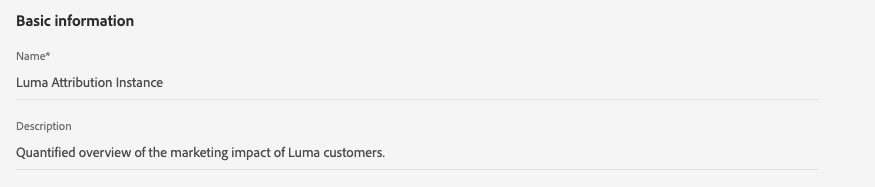

# Handbuch zur Benutzeroberfläche von Attribution AI

Attribution AI als Teil von Intelligent Services ist ein algorithmischer Attributionsdienst mit mehreren Kanälen, der den Einfluss und die inkrementelle Auswirkung von Kundeninteraktionen auf bestimmte Ergebnisse berechnet. Mit Attribution AI können Marketing-Experten die Ausgaben für Marketing und Werbung messen und optimieren, indem sie die Auswirkungen jeder einzelnen Kundeninteraktion in jeder Phase der Journey verstehen.

Dieses Dokument dient als Leitfaden für die Interaktion mit Attribution AI in der Benutzeroberfläche von Intelligent Services.

## Modell erstellen

Wählen Sie in der Benutzeroberfläche von [!DNL Adobe Experience Platform] im linken Navigationsbereich die Option **[!UICONTROL Dienste]** aus. Der Browser **[!UICONTROL Dienste]** wird angezeigt und zeigt verfügbare Adobe Intelligent Services an. Wählen Sie im Container für Attribution AI **[!UICONTROL Öffnen]** aus.

Die Seite des Attribution AI-Service wird angezeigt. Auf dieser Seite werden Dienstmodelle von Attribution AI aufgelistet und Informationen zu ihnen angezeigt, einschließlich Modellname, Konversionsereignisse, Häufigkeit der Modellausführung und Status der letzten Aktualisierung.

Sie finden die Metrik **[!UICONTROL Gesamte Konversionsereignisse mit Bewertungen]** unten rechts im Container **[!UICONTROL Modell erstellen]** . Diese Metrik verfolgt die Gesamtzahl der Konversionsereignisse, die von Attribution AI für das aktuelle Kalenderjahr bewertet wurden, einschließlich aller Sandbox-Umgebungen und aller gelöschten Dienstmodelle.

Dienstmodelle können mithilfe der Steuerelemente auf der rechten Seite der Benutzeroberfläche bearbeitet, geklont und gelöscht werden. Um diese Steuerelemente anzuzeigen, wählen Sie ein Modell aus Ihren vorhandenen **[!UICONTROL Dienstmodellen]** aus. Die Steuerelemente enthalten die folgenden Informationen:

- **[!UICONTROL Bearbeiten]**: Durch Auswahl von **[!UICONTROL Bearbeiten]** können Sie ein vorhandenes Dienstmodell ändern. Sie können den Namen, die Beschreibung, den Status, die Scoring-Häufigkeit des Modells und zusätzliche Score-Datensatzspalten bearbeiten.
- **[!UICONTROL Klonen]**: Durch Auswahl von **[!UICONTROL Klonen]** wird das ausgewählte Dienstmodell kopiert. Anschließend können Sie den Workflow ändern, um kleinere Änderungen vorzunehmen, und ihn als neues Modell umbenennen.
- **[!UICONTROL Löschen]**: Sie können ein Dienstmodell einschließlich aller historischen Ausführungen löschen. Der entsprechende Ausgabedatensatz wird aus Platform gelöscht. Bewertungen, die mit dem Echtzeit-Kundenprofil synchronisiert wurden, werden jedoch nicht gelöscht.
- **[!UICONTROL Datenquelle]**: Ein Link zum verwendeten Datensatz. Wenn mehr als ein Datensatz von Attribution AI verwendet wird, wird &quot;Mehrere&quot;gefolgt von der Anzahl der Datensätze angezeigt. Bei Auswahl des Hyperlinks wird das Popup-Fenster für die Datensatzvorschau angezeigt.
- **[!UICONTROL Letzte Ausführungsdetails]**: Dies wird nur angezeigt, wenn eine Ausführung fehlschlägt. Informationen dazu, warum die Ausführung fehlgeschlagen ist, wie Fehlercodes, werden hier angezeigt.

- **[!UICONTROL Konversionsereignisse]**: Ein kurzer Überblick über die für dieses Modell konfigurierten Konversionsereignisse.
- **[!UICONTROL Lookback-Fenster]**: Der von Ihnen definierte Zeitrahmen, der angibt, wie viele Tage vor den Touchpoints des Konversionsereignisses eingeschlossen sind.
- **[!UICONTROL Touchpoints]**: Eine Liste aller Touchpoints, die Sie beim Erstellen dieses Modells definiert haben.

Wählen Sie **[!UICONTROL Modell erstellen]** aus, um zu beginnen.

Als Nächstes wird die Seite zum Einrichten von Attribution AI angezeigt, auf der Sie einen Namen und eine optionale Beschreibung für Ihr Dienstmodell angeben können.

## Daten auswählen {#select-data}

<!-- https://www.adobe.com/go/aai-select-data -->

Standardmäßig kann Attribution AI die Attributionsergebnisse anhand von Adobe Analytics-, Erlebnisereignis- und Kundenerlebnisereignisdaten berechnen. Bei der Auswahl eines Datensatzes werden nur Datensätze aufgelistet, die mit Attribution AI kompatibel sind. Um einen Datensatz auszuwählen, wählen Sie das Symbol (**+**) neben dem Datensatznamen aus oder aktivieren Sie das Kontrollkästchen, um mehrere Datensätze gleichzeitig hinzuzufügen. Sie können auch die Suchoption verwenden, um schnell die Datensätze zu finden, an denen Sie interessiert sind.

Wählen Sie nach Auswahl der Datensätze, die Sie verwenden möchten, die Schaltfläche **[!UICONTROL Hinzufügen]** aus, um die Datensätze zum Vorschaufenster für den Datensatz hinzuzufügen.

Wenn Sie das Infosymbol  neben einem Datensatz auswählen, wird das Popup-Fenster für die Datensatzvorschau geöffnet.

Die Datensatzvorschau enthält Daten wie die letzte Aktualisierungszeit, das Quellschema und eine Vorschau der ersten zehn Spalten.

Wählen Sie **[!UICONTROL Speichern]** aus, um Ihre Entwürfe zu speichern, während Sie den Workflow fortsetzen. Sie können auch Entwurfsmodellkonfigurationen speichern und mit dem nächsten Schritt im Workflow fortfahren. Verwenden Sie **[!UICONTROL Speichern und fortfahren]** , um Entwürfe während der Modellkonfigurationen zu erstellen und zu speichern. Die Funktion ermöglicht die Erstellung und Speicherung von Entwürfen der Modellkonfiguration und ist insbesondere dann nützlich, wenn Sie im Konfigurations-Workflow viele Felder definieren müssen.

### Datensatzvollständigkeit {#dataset-completeness}

<!-- https://www.adobe.com/go/aai-dataset-completeness -->

In der Datensatzvorschau ist ein Prozentsatz für die Vollständigkeit eines Datensatzes. Dieser Wert liefert einen schnellen Überblick darüber, wie viele Spalten in Ihrem Datensatz leer/null sind. Wenn ein Datensatz viele fehlende Werte enthält und diese Werte an anderer Stelle erfasst werden, wird dringend empfohlen, den Datensatz mit den fehlenden Werten einzubeziehen.

>[!NOTE]
>
>Die Vollständigkeit des Datensatzes wird unter Verwendung des maximalen Schulungsfensters für Attribution AIS (ein Jahr) berechnet. Das bedeutet, dass Daten, die älter als ein Jahr sind, bei der Anzeige Ihres Datensatzvollständigkeitswerts nicht berücksichtigt werden.

### Identität auswählen {#identity}

Sie können jetzt mehrere Datensätze auf Grundlage der Identitätszuordnung (Feld) miteinander verknüpfen. Sie müssen einen Identitätstyp (auch als &quot;Identitäts-Namespace&quot;bezeichnet) und einen Identitätswert in diesem Namespace auswählen. Wenn Sie innerhalb Ihres Schemas unter demselben Namespace mehr als ein Feld als Identität zugewiesen haben, werden alle zugewiesenen Identitätswerte im Dropdown-Menü &quot;Identität&quot;angezeigt, dem der Namespace vorangestellt wird, z. B. `EMAIL (personalEmail.address)` oder `EMAIL (workEmail.address)`.

>[!IMPORTANT]
>
>Für jeden ausgewählten Datensatz muss derselbe Identitätstyp (Namespace) verwendet werden. Neben dem Identitätstyp wird in der Identitätsspalte ein grünes Häkchen angezeigt, das angibt, dass Datensätze kompatibel sind. Wenn Sie beispielsweise den Namespace Phone und `mobilePhone.number` als Kennung verwenden, müssen alle Kennungen für die verbleibenden Datensätze den Namespace Phone enthalten und verwenden.

Um eine Identität auszuwählen, wählen Sie den unterstrichenen Wert in der Identitätsspalte aus. Das Popover zur Identitätsauswahl wird angezeigt.

Wenn innerhalb eines Namespace mehr als eine Identität verfügbar ist, wählen Sie das richtige Identitätsfeld für Ihren Anwendungsfall aus. Beispielsweise sind im E-Mail-Namespace zwei E-Mail-Identitäten verfügbar: eine Arbeit und eine persönliche E-Mail. Je nach Anwendungsfall ist es wahrscheinlicher, dass eine persönliche E-Mail ausgefüllt wird, und nützlicher bei individuellen Prognosen. Das bedeutet, dass Sie `EMAIL (personalEmail.address)` als Ihre Identität auswählen.

>[!NOTE]
>
> Wenn für einen Datensatz kein gültiger Identitätstyp (Namespace) vorhanden ist, müssen Sie eine primäre Identität festlegen und ihn mithilfe des Schemaeditors [1} einem Identitäts-Namespace zuweisen. ](../../xdm/schema/composition.md#identity) Weitere Informationen zu Namespaces und Identitäten finden Sie in der Dokumentation zu [Identity Service-Namespaces](../../identity-service/features/namespaces.md) .

## Zuordnen von Medien- und Kampagnenfeldern {#aai-mapping}

<!-- https://www.adobe.com/go/aai-mapping -->

Nachdem Sie die Auswahl und das Hinzufügen von Datensätzen abgeschlossen haben, wird der Konfigurationsschritt **Zuordnung** angezeigt. Attribution AI erfordert, dass Sie das Feld Medienkanal für jeden Datensatz zuordnen, den Sie im vorherigen Schritt ausgewählt haben. Dies liegt daran, dass ohne die Medienkanal-Zuordnung zwischen Datensätzen von aus Attribution AI abgeleiteten Einblicken möglicherweise nicht richtig angezeigt wird, was die Interpretationsseite der Einblicke erschwert. Obwohl nur der Medienkanal erforderlich ist, wird dringend empfohlen, einige der optionalen Felder wie Medienaktion, Kampagnenname, Kampagnengruppe und Kampagnen-Tag zuzuordnen. Dadurch kann Attribution AI bessere Einblicke und optimale Ergebnisse erzielen.

## Ereignisse definieren {#define-events}

<!-- https://www.adobe.com/go/aai-define-events -->

Es gibt drei verschiedene Arten von Eingabedaten, die zur Definition von Ereignissen verwendet werden:

- **Konversionsereignisse:** Geschäftsziele, die die Auswirkungen von Marketing-Aktivitäten wie E-Commerce-Bestellungen, In-Store-Käufen und Website-Besuchen identifizieren.
- **Lookback-Fenster:** Bietet einen Zeitrahmen, der angibt, wie viele Tage vor den Touchpoints des Konversionsereignisses eingeschlossen werden sollen.
- **Touchpoints:** Marketing-Ereignisse auf Empfänger-, Einzel- und Cookie-Ebene, die zur Bewertung der numerischen oder umsatzbasierten Auswirkungen von Konversionen verwendet werden.

### Konversionsereignisse definieren {#define-conversion-events}

Um ein Konversionsereignis zu definieren, müssen Sie dem Ereignis einen Namen geben und den Ereignistyp auswählen, indem Sie den Datensatz und das Feld aus dem Dropdown-Menü **Datensatz und Feld auswählen** auswählen.

Sobald ein Ereignis ausgewählt ist, wird rechts ein neues Dropdown-Menü angezeigt. Das zweite Dropdown-Menü wird verwendet, um durch die Verwendung von Vorgängen weiteren Kontext für Ihr Ereignis bereitzustellen. Für dieses Konversionsereignis wird der Standardvorgang *exists* verwendet.

>[!NOTE]
>
>Eine Zeichenfolge unter Ihrem *Konversionsnamen* wird aktualisiert, wenn Sie Ihr Ereignis definieren.

Als Nächstes können Sie einen kombinierten Datensatz auswählen, der durch die Kombination aller Eingabedatensätze im vorherigen Schritt generiert wird. Alternativ können Sie eine Spalte anhand einzelner Datensätze aus dem Dropdown-Menü **Datensatz und Feld auswählen** auswählen.

Mit den Schaltflächen **[!UICONTROL Ereignis hinzufügen]** und **[!UICONTROL Gruppe hinzufügen]** können Sie Ihre Konvertierung weiter definieren. Je nach der von Ihnen definierten Konversion müssen Sie möglicherweise die Schaltflächen **[!UICONTROL Ereignis hinzufügen]** und **[!UICONTROL Gruppe hinzufügen]** verwenden, um weiteren Kontext bereitzustellen.

Wenn Sie **[!UICONTROL Ereignis hinzufügen]** auswählen, werden zusätzliche Felder erstellt, die mit der oben beschriebenen Methode ausgefüllt werden können. Hierdurch wird der Zeichenfolgendefinition unter dem Konversionsnamen eine AND-Anweisung hinzugefügt. Wählen Sie **x** aus, um ein hinzugefügtes Ereignis zu entfernen.

Wenn Sie **[!UICONTROL Gruppe hinzufügen]** auswählen, haben Sie die Möglichkeit, zusätzliche Felder separat vom Original zu erstellen. Wenn Gruppen hinzugefügt werden, wird eine blaue Schaltfläche *und* angezeigt. Durch Auswahl von **und** erhalten Sie die Möglichkeit, den Parameter so zu ändern, dass er &quot;Oder&quot;enthält. &quot;Oder&quot;wird verwendet, um mehrere erfolgreiche Konversionspfade zu definieren. &quot;Und&quot;erweitert den Konversionspfad um zusätzliche Bedingungen.

Wenn Sie mehr als eine Konversion benötigen, wählen Sie **Konversion hinzufügen** , um eine neue Konversionskarte zu erstellen. Sie können den obigen Prozess wiederholen, um mehrere Konversionen zu definieren.

### Lookback-Fenster definieren {#lookback-window}

Nachdem Sie die Definition Ihrer Konvertierung abgeschlossen haben, müssen Sie Ihr Lookback-Fenster bestätigen. Geben Sie mithilfe der Pfeiltasten oder durch Auswahl des Standardwert (56) an, wie viele Tage vor dem Konversionsereignis Sie Touchpoints einbeziehen möchten. Touchpoints werden im nächsten Schritt definiert.

### Definieren von Touchpoints

Das Definieren von Touchpoints folgt einem ähnlichen Workflow wie das Definieren von Konversionen ](#define-conversion-events). [ Zunächst müssen Sie Ihren Touchpoint benennen und einen Touchpoint-Wert aus dem Dropdown-Menü *Feldnamen eingeben* auswählen. Nach der Auswahl wird das Dropdown-Menü für den Operator mit dem Standardwert &quot;vorhanden&quot;angezeigt. Wählen Sie das Dropdown-Menü aus, um eine Benutzerliste anzuzeigen.

Wählen Sie für diesen Touchpoint **gleich** aus.

Sobald ein Operator für einen Touchpoint ausgewählt ist, wird *Feldwert eingeben* verfügbar gemacht. Die Dropdown-Werte für *Feldwert eingeben* werden basierend auf dem zuvor ausgewählten Operator- und Touchpoint-Wert gefüllt. Wenn ein Wert nicht in der Dropdown-Liste ausgefüllt wird, können Sie diesen Wert manuell eingeben. Wählen Sie das Dropdown-Menü aus und klicken Sie auf **KLICKEN**.

>[!NOTE]
>
>Den Operatoren &quot;vorhanden&quot;und &quot;nicht vorhanden&quot;sind keine Feldwerte zugeordnet.

Mit den Schaltflächen **Ereignis hinzufügen** und **Gruppe hinzufügen** können Sie Ihren Touchpoint weiter definieren. Aufgrund der komplexen Natur rund um Touchpoints ist es nicht ungewöhnlich, mehrere Ereignisse und Gruppen für einen einzelnen Touchpoint zu haben.

Wenn diese Option aktiviert ist, ermöglicht **Ereignis hinzufügen** das Hinzufügen zusätzlicher Felder. Wählen Sie **x** aus, um ein hinzugefügtes Ereignis zu entfernen.

Wenn Sie **Gruppe hinzufügen** auswählen, haben Sie die Möglichkeit, zusätzliche Felder separat vom Original zu erstellen. Wenn Gruppen hinzugefügt werden, wird eine blaue Schaltfläche *und* angezeigt. Wählen Sie **And** aus, um den Parameter zu ändern. Der neue Parameter &quot;Oder&quot;wird verwendet, um mehrere erfolgreiche Pfade zu definieren. Dieser bestimmte Touchpoint hat nur einen erfolgreichen Pfad, daher ist &quot;Oder&quot;nicht erforderlich.

>[!NOTE]
>
>Verwenden Sie die Zeichenfolge unter *Touchpoint-Name* , um einen schnellen Überblick über Ihren Touchpoint zu erhalten. Beachten Sie, dass die Zeichenfolge mit dem Namen des Touchpoints übereinstimmt.

Sie können zusätzliche Touchpoints hinzufügen, indem Sie **Touchpoint hinzufügen** auswählen und den oben beschriebenen Prozess wiederholen.

Nachdem Sie alle erforderlichen Touchpoints definiert haben, scrollen Sie nach oben und wählen Sie oben rechts **Weiter** aus, um mit dem letzten Schritt fortzufahren.

## Erweiterte Trainings- und Scoring-Einrichtung

Die letzte Seite in Attribution AI ist die **[!UICONTROL Erweiterte]** -Seite, die zum Einrichten von Trainings- und Scoring-Tests verwendet wird.

### Planen von Schulungen

Mit dem *Zeitplan* können Sie einen Tag und eine Uhrzeit der Woche auswählen, zu der die Auswertung erfolgen soll.

Wählen Sie das Dropdown-Menü unter *Scoring-Häufigkeit* aus, um zwischen täglicher, wöchentlicher und monatlicher Auswertung auszuwählen. Wählen Sie als Nächstes die Wochentage aus, an denen die Auswertung erfolgen soll. Es können mehrere Tage ausgewählt werden. Wenn Sie den gleichen Tag erneut auswählen, wird die Auswahl aufgehoben.

Um die Tageszeit zu ändern, zu der die Auswertung erfolgen soll, wählen Sie das Uhrensymbol aus. Geben Sie in der neuen Überlagerung, die angezeigt wird, die Tageszeit ein, zu der die Auswertung erfolgen soll. Wählen Sie außerhalb der Überlagerung aus, um sie zu schließen.

>[!NOTE]
>
>Es kann bis zu 24 Stunden dauern, bis jeder Scoring-Prozess abgeschlossen ist.

### Zusätzliche Ergebnisdatensatzspalten (optional)

Standardmäßig wird für jedes Dienstmodell in einem Standardschema ein Bewertungsdatensatz erstellt. Sie können der Scoring-Datensatzausgabe zusätzliche Spalten hinzufügen, die auf Ihren Konversionsereignis- und Touchpoint-Konfigurationen basieren. Wählen Sie zunächst Spalten aus Ihrem Eingabedatensatz aus und ziehen Sie sie per Drag-and-Drop, um die Reihenfolge zu ändern. Halten Sie dazu die linke Maustaste über dem Hamburger-Symbol gedrückt.

### Regionale Modellierung (optional) {#region-based-modeling-optional}

Das Verhalten Ihrer Kunden kann sich je nach Land und Region erheblich unterscheiden. Für globale Unternehmen kann die Verwendung länderbasierter oder regionenbasierter Modelle die Attributionsgenauigkeit erhöhen. Jede hinzugefügte Region erstellt ein neues Modell mit den Daten dieser Region.

Um einen neuen Bereich zu definieren, wählen Sie zunächst **[!UICONTROL Bereich hinzufügen]** aus. Geben Sie im angezeigten Container einen Namen für die Region ein. Nur ein Wert (&quot;placeContext.geo.countryCode&quot;) wird aus der Dropdown-Liste **[!UICONTROL Feldname eingeben]** ausgefüllt. Wählen Sie diesen Wert aus.

Wählen Sie anschließend einen Operator aus.

Geben Sie abschließend den Ländercode in das Dropdown-Menü **[!UICONTROL Feldwert eingeben]** ein.

>[!NOTE]
>
>Ländercodes sind zwei Zeichen lang. Eine vollständige Liste finden Sie hier: [ISO 3166-1 alpha-2](https://datahub.io/core/country-list).

### Schulungsfenster {#training-window}

Um sicherzustellen, dass Sie ein möglichst präzises Modell erhalten, müssen Sie Ihr Modell mit historischen Daten trainieren, die Ihr Unternehmen repräsentieren. Standardmäßig wird das Modell mit 2 Quartalen (6 Monate) der Konversionsereignisdaten trainiert. Wählen Sie das Dropdown-Menü aus, um die Standardeinstellung zu ändern. Sie können eine Schulung mit einem bis vier Quartalen der Daten (3-12 Monate) durchführen.

>[!NOTE]
>
>Ein kürzeres Trainings-Fenster reagiert empfindlicher auf aktuelle Trends, während ein längeres Trainings-Fenster ein robusteres Modell schafft und weniger empfindlich gegenüber aktuellen Trends ist.

Nachdem Sie Ihr Schulungsfenster ausgewählt haben, wählen Sie oben rechts **[!UICONTROL Beenden]** aus. Warten Sie etwas, bis die Daten verarbeitet werden. Nach Abschluss des Vorgangs wird ein Popup-Dialogfeld angezeigt, in dem bestätigt wird, dass die Instanzeinrichtung abgeschlossen ist. Wählen Sie **[!UICONTROL OK]** aus, um zur Seite **[!UICONTROL Dienstinstanzen]** umgeleitet zu werden, auf der Sie Ihre Dienstinstanz sehen können.

## Nächste Schritte

In diesem Tutorial haben Sie erfolgreich eine Dienstinstanz in Attribution AI erstellt. Sobald die Instanz die Auswertung abgeschlossen hat (bis zu 24 Stunden erlaubt), können Sie [Einblicke in Attribution AI entdecken](./discover-insights.md). Wenn Sie Ihre Scoring-Ergebnisse herunterladen möchten, lesen Sie außerdem die Dokumentation zum [Herunterladen von Bewertungen](./download-scores.md) .

## Zusätzliche Ressourcen

Im folgenden Video wird ein durchgängiger Workflow zum Erstellen einer neuen Instanz in Attribution AI beschrieben.

>[!VIDEO](https://video.tv.adobe.com/v/32668?learn=on&quality=12)
