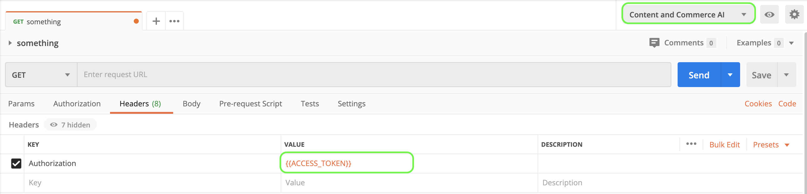

# Erste Schritte mit Content and Commerce AI

>[!NOTE]
>
>Die KI für Inhalte und Commerce befindet sich in der Beta-Phase. Die Dokumentation kann sich ändern.

[!DNL Content and Commerce AI] verwendet Adobe I/O-APIs. Um Adobe I/O-APIs und die I/O-Konsolenintegration aufzurufen, müssen Sie zunächst das [Authentifizierungs-Tutorial](https://experienceleague.adobe.com/docs/experience-platform/landing/platform-apis/api-authentication.html?lang=de#platform-apis) abschließen.

Wenn Sie jedoch zum Schritt **API** hinzufügen gelangen, befindet sich die API unter Experience Cloud anstelle von Adobe Experience Platform, wie im folgenden Screenshot gezeigt:

Durch Abschluss des Authentifizierungs-Tutorials werden die Werte für die einzelnen erforderlichen Kopfzeilen in allen Adobe I/O API-Aufrufen bereitgestellt, wie unten dargestellt:

- `Authorization: Bearer {ACCESS_TOKEN}`
- `x-api-key: {API_KEY}`
- `x-gw-ims-org-id: {IMS_ORG}`

## Erstellen einer Postman-Umgebung (optional)

Nachdem Sie Ihr Projekt und Ihre API in der Adobe Developer Console eingerichtet haben, können Sie eine Umgebungsdatei für Postman herunterladen. Wählen Sie unter **[!UICONTROL APIs]** in der linken Leiste Ihres Projekts **[!UICONTROL Content and Commerce AI]** aus. Es wird eine neue Registerkarte mit einer Karte mit der Bezeichnung &quot;[!DNL Try it out]&quot;geöffnet. Wählen Sie **Für Postman herunterladen** aus, um eine JSON-Datei herunterzuladen, die zur Konfiguration Ihrer Postman-Umgebung verwendet wird.

Nachdem Sie die Datei heruntergeladen haben, öffnen Sie Postman und wählen Sie das Zahnradsymbol **a1/> oben rechts aus, um das Dialogfeld** Umgebungen verwalten **zu öffnen.**

Wählen Sie anschließend **Import** aus dem Dialogfeld **Umgebungen verwalten** aus.

Sie werden umgeleitet und aufgefordert, eine Umgebungsdatei von Ihrem Computer auszuwählen. Wählen Sie die zuvor heruntergeladene JSON-Datei aus und klicken Sie auf **Öffnen** , um die Umgebung zu laden.

Sie werden zurück zur Registerkarte *Umgebungen verwalten* mit einem neuen Umgebungsnamen geleitet. Wählen Sie den Umgebungsnamen aus, um die in Postman verfügbaren Variablen anzuzeigen und zu bearbeiten. Sie müssen die `JWT_TOKEN` und `ACCESS_TOKEN` weiterhin manuell füllen. Diese Werte sollten beim Abschluss des [Authentifizierungs-Tutorials](https://www.adobe.com/go/platform-api-authentication-en) abgerufen worden sein.

Nach dem Abschluss sollten Ihre Variablen ungefähr wie im Screenshot unten dargestellt aussehen. Wählen Sie **Update** aus, um die Einrichtung Ihrer Umgebung abzuschließen.

Jetzt können Sie Ihre Umgebung aus dem Dropdown-Menü oben rechts auswählen und alle gespeicherten Werte automatisch ausfüllen. Bearbeiten Sie die Werte einfach jederzeit neu, um alle Ihre API-Aufrufe zu aktualisieren.

Weitere Informationen zum Arbeiten mit Adobe I/O-APIs unter Verwendung von Postman finden Sie im Beitrag Medium unter [Verwendung von Postman für die JWT-Authentifizierung unter Adobe I/O](https://medium.com/adobetech/using-postman-for-jwt-authentication-on-adobe-i-o-7573428ffe7f).

## Lesen von Beispiel-API-Aufrufen

In diesem Handbuch wird anhand von Beispielen für API-Aufrufe die korrekte Formatierung von Anfragen aufgezeigt. Dazu gehören Pfade, erforderliche Kopfzeilen und ordnungsgemäß formatierte Anfrage-Payloads. Außerdem wird ein Beispiel für eine von der API im JSON-Format zurückgegebene Antwort bereitgestellt. Informationen zu den Konventionen, die in der Dokumentation für Beispiel-API-Aufrufe verwendet werden, finden Sie im Abschnitt zum [Lesen von Beispiel-API-Aufrufen](../../landing/troubleshooting.md) im Handbuch zur Fehlerbehebung für Experience Platform.

## Nächste Schritte {#next-steps}

Sobald Sie alle Ihre Anmeldedaten haben, können Sie einen benutzerdefinierten Worker für [!DNL Content and Commerce AI] einrichten. Die folgenden Dokumente veranschaulichen die Einrichtung des Erweiterungs-Frameworks und der Umgebung.

Um mehr über das Erweiterbarkeits-Framework zu erfahren, lesen Sie zunächst das Dokument [Einführung in die Erweiterbarkeit](https://experienceleague.adobe.com/docs/asset-compute/using/extend/understand-extensibility.html?lang=de) . In diesem Dokument werden die Voraussetzungen und Bereitstellungsanforderungen beschrieben.

Um mehr über das Einrichten einer Umgebung für [!DNL Content and Commerce AI] zu erfahren, lesen Sie zunächst das Handbuch für [Einrichten einer Entwicklungsumgebung](https://experienceleague.adobe.com/docs/asset-compute/using/extend/setup-environment.html). Dieses Dokument enthält Einrichtungsanweisungen, die die Entwicklung für den Asset compute-Service ermöglichen.
