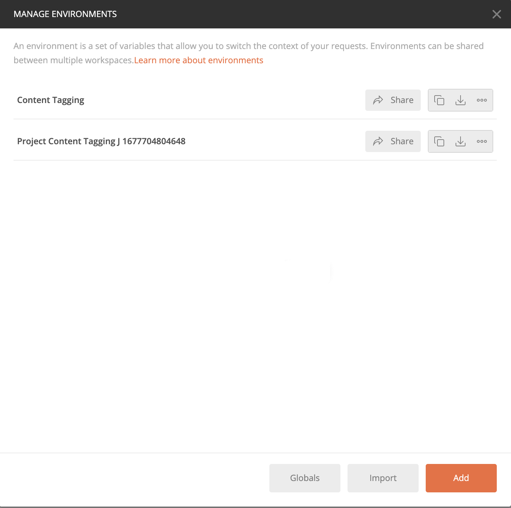
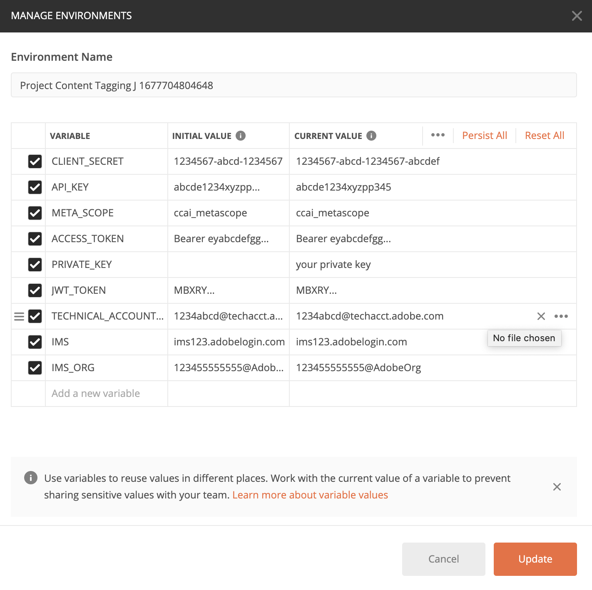

# Erste Schritte mit Inhalts-Tagging

[!DNL Content tagging] verwendet Adobe I/O-APIs. Um Adobe I/O-APIs und die I/O-Konsolenintegration aufzurufen, müssen Sie zunächst das (Authentifizierungs[Tutorial) ](https://experienceleague.adobe.com/docs/experience-platform/landing/platform-apis/api-authentication.html?lang=de).

Wenn Sie jedoch zum Schritt **API hinzufügen** gelangen, befindet sich die API unter Creative Cloud statt unter Adobe Experience Platform, wie im folgenden Screenshot gezeigt:

Durch Abschluss des Authentifizierungs-Tutorials werden die Werte für die einzelnen erforderlichen Kopfzeilen in allen Adobe I/O-API-Aufrufen bereitgestellt, wie unten dargestellt:

- `Authorization: Bearer {ACCESS_TOKEN}`
- `x-api-key: {API_KEY}`
- `x-gw-ims-org-id: {ORG_ID}`

## Erstellen einer Postman-Umgebung (optional)

Nachdem Sie Ihr Projekt und Ihre API in Adobe Developer Console eingerichtet haben, können Sie eine Umgebungsdatei für Postman herunterladen. Wählen **[!UICONTROL in]** linken Leiste Ihres Projekts die Option **[!UICONTROL Inhalts-Tagging]**. Eine neue Registerkarte mit einer Karte mit der Bezeichnung &quot;[!DNL Try it out]&quot; wird geöffnet. Wählen Sie **Für Postman herunterladen** aus, um eine JSON-Datei herunterzuladen, die zum Konfigurieren Ihrer Postman-Umgebung verwendet wird.

Öffnen Sie nach dem Herunterladen der Datei Postman und wählen Sie oben rechts **Zahnradsymbol** aus, um das Dialogfeld **Umgebungen verwalten** zu öffnen.

Wählen Sie anschließend **Importieren** im Dialogfeld **Umgebungen verwalten** aus.

Sie werden umgeleitet und aufgefordert, eine Umgebungsdatei von Ihrem Computer auszuwählen. Wählen Sie die zuvor heruntergeladene JSON-Datei und dann **Öffnen** aus, um die Umgebung zu laden.

Sie werden zurück zur Registerkarte *Umgebungen verwalten* mit einem neuen Umgebungsnamen weitergeleitet. Wählen Sie den Umgebungsnamen aus, um die in Postman verfügbaren Variablen anzuzeigen und zu bearbeiten. Sie müssen die `JWT_TOKEN` und `ACCESS_TOKEN` weiterhin manuell ausfüllen. Diese Werte sollten beim Abschließen des (Authentifizierungs[Tutorials) abgerufen ](https://experienceleague.adobe.com/docs/experience-platform/landing/platform-apis/api-authentication.html?lang=de).

Nach Abschluss des Vorgangs sollten Ihre Variablen in etwa wie im folgenden Screenshot aussehen. Wählen Sie **Aktualisieren** aus, um die Einrichtung Ihrer Umgebung abzuschließen.

Sie können jetzt Ihre Umgebung aus dem Dropdown-Menü oben rechts auswählen und alle gespeicherten Werte automatisch ausfüllen. Bearbeiten Sie die Werte einfach jederzeit neu, um alle Ihre API-Aufrufe zu aktualisieren.

Weitere Informationen zum Arbeiten mit Adobe I/O-APIs unter Verwendung von Postman finden Sie im Medium-Beitrag auf [Verwenden von Postman für JWT-Authentifizierung auf Adobe I/O](https://medium.com/adobetech/using-postman-for-jwt-authentication-on-adobe-i-o-7573428ffe7f).

## Lesen von Beispiel-API-Aufrufen

In diesem Handbuch wird anhand von Beispielen für API-Aufrufe die korrekte Formatierung von Anfragen aufgezeigt. Dazu gehören Pfade, erforderliche Kopfzeilen und ordnungsgemäß formatierte Anfrage-Payloads. Außerdem wird ein Beispiel für eine von der API im JSON-Format zurückgegebene Antwort bereitgestellt. Informationen zu den Konventionen, die in der Dokumentation für Beispiel-API-Aufrufe verwendet werden, finden Sie im Abschnitt zum [Lesen von Beispiel-API-Aufrufen](../../landing/troubleshooting.md) im Handbuch zur Fehlerbehebung für Experience Platform.

## Nächste Schritte {#next-steps}

Sobald Sie über alle Ihre Anmeldeinformationen verfügen, können Sie einen benutzerdefinierten Worker für [!DNL Content tagging] einrichten. Die folgenden Dokumente helfen beim Verständnis des Erweiterbarkeits-Frameworks und der Einrichtung der Umgebung.

Um mehr über das Erweiterbarkeits-Framework zu erfahren, lesen Sie zunächst das Dokument [Einführung in die Erweiterbarkeit](https://experienceleague.adobe.com/docs/asset-compute/using/extend/understand-extensibility.html?lang=de). In diesem Dokument werden die Voraussetzungen und Bereitstellungsanforderungen beschrieben.

Um mehr über das Einrichten einer Umgebung für [!DNL Content tagging] zu erfahren, lesen Sie zunächst das Handbuch [Einrichten einer Entwicklungsumgebung](https://experienceleague.adobe.com/docs/asset-compute/using/extend/setup-environment.html?lang=de). Dieses Dokument enthält Einrichtungsanweisungen, die Ihnen die Entwicklung für den Asset compute-Service ermöglichen.
