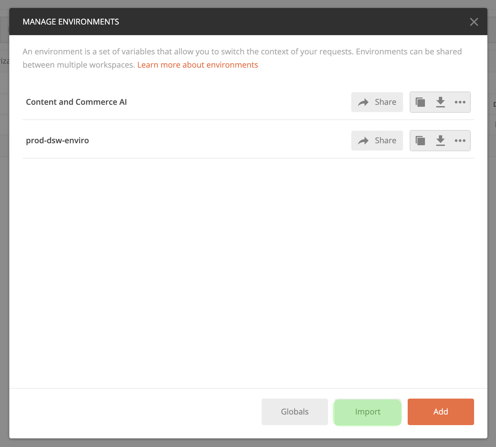

# Erste Schritte mit Content- und Commerce-API

>[!NOTE]
>
>Die AI für Inhalte und Commerce befindet sich in der Betaphase. Die Dokumentation kann geändert werden.

[!DNL Content and Commerce AI] verwendet Adobe I/O-APIs. Um Adoben I/O-APIs und die E/A-Konsolenintegration aufzurufen, müssen Sie zunächst das [Authentifizierungstutorial](https://www.adobe.com/go/platform-api-authentication-en) abschließen.

Wenn Sie jedoch zum Schritt **Hinzufügen API** gelangen, befindet sich die API unter Experience Cloud anstelle von Adobe Experience Platform, wie im folgenden Screenshot gezeigt:

Das Abschließen des Authentifizierungtutorials stellt die Werte für die einzelnen erforderlichen Kopfzeilen in allen Adobe I/O API-Aufrufen bereit, wie unten dargestellt:

- `Authorization: Bearer {ACCESS_TOKEN}`
- `x-api-key: {API_KEY}`
- `x-gw-ims-org-id: {IMS_ORG}`

## Erstellen einer Postman-Umgebung (optional)

Nachdem Sie Ihr Projekt und Ihre API in der Adobe Developer Console eingerichtet haben, können Sie eine Umgebung für Postman herunterladen. Wählen Sie unter **[!UICONTROL APIs]** in der linken Leiste Ihres Projekts **[!UICONTROL Content and Commerce AI]**. Eine neue Registerkarte mit einer Karte mit der Bezeichnung &quot;[!DNL Try it out]&quot;wird geöffnet. Wählen Sie **Für Postman herunterladen**, um eine JSON-Datei herunterzuladen, die zur Konfiguration Ihrer Postman-Umgebung verwendet wird.

Nachdem Sie die Datei heruntergeladen haben, öffnen Sie Postman und wählen Sie oben rechts das Zahnradsymbol **aus, um das Dialogfeld** Umgebung verwalten **zu öffnen.**

Wählen Sie anschließend im Dialogfeld **Umgebung verwalten** aus.****

Sie werden umgeleitet und aufgefordert, eine Umgebung auf Ihrem Computer auszuwählen. Wählen Sie die JSON-Datei, die Sie zuvor heruntergeladen haben, und klicken Sie dann auf **Öffnen**, um die Umgebung zu laden.

Sie werden zurück zum Register *Umgebung verwalten* mit einem neuen Umgebung-Namen geleitet. Wählen Sie den Namen der zu Ansicht Umgebung aus und bearbeiten Sie die in Postman verfügbaren Variablen. Sie müssen die Felder `JWT_TOKEN` und `ACCESS_TOKEN` weiterhin manuell füllen. Diese Werte sollten beim Abschluss des [Authentifizierungslehrgangs](https://www.adobe.com/go/platform-api-authentication-en) abgerufen werden.

Nach Abschluss sollten Ihre Variablen etwa wie im folgenden Screenshot aussehen. Wählen Sie **Aktualisieren**, um die Einrichtung Ihrer Umgebung abzuschließen.

Sie können Ihre Umgebung jetzt im Dropdown-Menü oben rechts auswählen und alle gespeicherten Werte automatisch ausfüllen. Bearbeiten Sie die Werte einfach jederzeit neu, um alle Ihre API-Aufrufe zu aktualisieren.

Weitere Informationen zum Arbeiten mit Adobe I/O-APIs mit Postman finden Sie im Beitrag Medium unter [Verwenden von Postman für die JWT-Authentifizierung auf Adobe I/O](https://medium.com/adobetech/using-postman-for-jwt-authentication-on-adobe-i-o-7573428ffe7f).

## Lesen von Beispiel-API-Aufrufen

In diesem Handbuch wird anhand von Beispielen für API-Aufrufe die korrekte Formatierung von Anfragen aufgezeigt. Dazu gehören Pfade, erforderliche Kopfzeilen und ordnungsgemäß formatierte Anfrage-Payloads. Außerdem wird ein Beispiel für eine von der API im JSON-Format zurückgegebene Antwort bereitgestellt. Informationen zu den Konventionen, die in der Dokumentation für Beispiel-API-Aufrufe verwendet werden, finden Sie im Abschnitt zum [Lesen von Beispiel-API-Aufrufen](../../landing/troubleshooting.md) im Handbuch zur Fehlerbehebung für Experience Platform.

## Nächste Schritte {#next-steps}

Sobald Sie alle Ihre Anmeldedaten haben, können Sie einen benutzerdefinierten Worker für [!DNL Content and Commerce AI] einrichten. Die folgenden Dokumente helfen Ihnen beim Verständnis des Erweiterungs-Frameworks und der Umgebung-Einrichtung.

Um mehr über das Erweiterungs-Framework zu erfahren, lesen Sie das Dokument [Einführung in die Erweiterbarkeit](https://docs.adobe.com/content/help/de/asset-compute/using/extend/understand-extensibility.html) durch. In diesem Dokument werden die Voraussetzungen und Bereitstellungsanforderungen erläutert.

Weitere Informationen zum Einrichten einer Umgebung für [!DNL Content and Commerce AI] erhalten Sie im Beginn im Handbuch für [Einrichten einer Developer-Umgebung](https://docs.adobe.com/content/help/en/asset-compute/using/extend/setup-environment.html). Dieses Dokument enthält Setupanweisungen, die Ihnen die Entwicklung für den Asset compute-Dienst ermöglichen.
