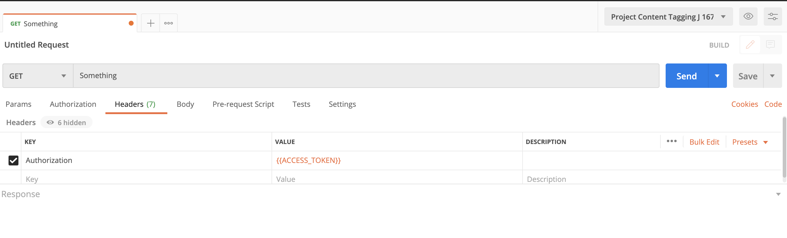

# Erste Schritte mit Content-Tagging

[!DNL Content tagging] verwendet Adobe I/O-APIs. Um Adobe I/O-APIs und die I/O-Konsolenintegration aufzurufen, müssen Sie zunächst das [Authentifizierungs-Tutorial](https://experienceleague.adobe.com/docs/experience-platform/landing/platform-apis/api-authentication.html?lang=de) abschließen.

Wenn Sie jedoch zum Schritt **API hinzufügen** gelangen, befindet sich die API unter Creative Cloud anstelle von Adobe Experience Platform, wie im folgenden Screenshot gezeigt:

Durch Abschluss des Authentifizierungs-Tutorials werden die Werte für die einzelnen erforderlichen Kopfzeilen in allen Adobe I/O-API-Aufrufen bereitgestellt, wie unten dargestellt:

- `Authorization: Bearer {ACCESS_TOKEN}`
- `x-api-key: {API_KEY}`
- `x-gw-ims-org-id: {ORG_ID}`

## Erstellen einer Postman-Umgebung (optional)

Nachdem Sie Ihr Projekt und Ihre API in Adobe Developer Console eingerichtet haben, können Sie eine Umgebungsdatei für Postman herunterladen. Wählen Sie in der linken Leiste Ihres Projekts unter **[!UICONTROL APIs]** die Option **[!UICONTROL Inhalts-Tagging]** aus. Es wird eine neue Registerkarte mit einer Karte mit der Bezeichnung &quot;[!DNL Try it out]&quot; geöffnet. Wählen Sie **Für Postman herunterladen** aus, um eine JSON-Datei herunterzuladen, die zur Konfiguration Ihrer Postman-Umgebung verwendet wird.

Nachdem Sie die Datei heruntergeladen haben, öffnen Sie Postman und wählen Sie oben rechts das Zahnradsymbol **1} aus, um das Dialogfeld** Umgebungen verwalten **zu öffnen.**

Wählen Sie anschließend **Import** aus dem Dialogfeld **Umgebungen verwalten** aus.

Sie werden umgeleitet und aufgefordert, eine Umgebungsdatei von Ihrem Computer auszuwählen. Wählen Sie die zuvor heruntergeladene JSON-Datei und dann **Öffnen** aus, um die Umgebung zu laden.

Sie werden zurück zur Registerkarte *Umgebungen verwalten* mit einem neuen Umgebungsnamen geleitet. Wählen Sie den Umgebungsnamen aus, um die in Postman verfügbaren Variablen anzuzeigen und zu bearbeiten. Sie müssen die `JWT_TOKEN` und `ACCESS_TOKEN` weiterhin manuell eingeben. Diese Werte sollten beim Abschluss des [Authentifizierungs-Tutorials](https://experienceleague.adobe.com/docs/experience-platform/landing/platform-apis/api-authentication.html?lang=de) abgerufen worden sein.

Nach dem Abschluss sollten Ihre Variablen ungefähr wie im Screenshot unten dargestellt aussehen. Wählen Sie **Aktualisieren** aus, um die Einrichtung der Umgebung abzuschließen.

Jetzt können Sie Ihre Umgebung aus dem Dropdown-Menü oben rechts auswählen und alle gespeicherten Werte automatisch ausfüllen. Bearbeiten Sie die Werte einfach jederzeit neu, um alle Ihre API-Aufrufe zu aktualisieren.

Weitere Informationen zum Arbeiten mit Adobe I/O-APIs unter Verwendung von Postman finden Sie im Medium-Beitrag unter [Verwendung von Postman für die JWT-Authentifizierung unter Adobe I/O](https://medium.com/adobetech/using-postman-for-jwt-authentication-on-adobe-i-o-7573428ffe7f).

## Lesen von Beispiel-API-Aufrufen

In diesem Handbuch wird anhand von Beispielen für API-Aufrufe die korrekte Formatierung von Anfragen aufgezeigt. Dazu gehören Pfade, erforderliche Kopfzeilen und ordnungsgemäß formatierte Anfrage-Payloads. Außerdem wird ein Beispiel für eine von der API im JSON-Format zurückgegebene Antwort bereitgestellt. Informationen zu den Konventionen, die in der Dokumentation für Beispiel-API-Aufrufe verwendet werden, finden Sie im Abschnitt zum [Lesen von Beispiel-API-Aufrufen](../../landing/troubleshooting.md) im Handbuch zur Fehlerbehebung für Experience Platform.

## Nächste Schritte {#next-steps}

Sobald Sie alle Ihre Anmeldedaten haben, können Sie einen benutzerdefinierten Worker für [!DNL Content tagging] einrichten. Die folgenden Dokumente helfen Ihnen beim Verständnis des Erweiterungs-Frameworks und der Umgebungseinrichtung.

Um mehr über das Erweiterbarkeits-Framework zu erfahren, lesen Sie zunächst das Dokument [Einführung in die Erweiterbarkeit](https://experienceleague.adobe.com/docs/asset-compute/using/extend/understand-extensibility.html) . In diesem Dokument werden die Voraussetzungen und Bereitstellungsanforderungen beschrieben.

Um mehr über das Einrichten einer Umgebung für [!DNL Content tagging] zu erfahren, lesen Sie zunächst das Handbuch für [Einrichten einer Entwicklungsumgebung](https://experienceleague.adobe.com/docs/asset-compute/using/extend/setup-environment.html). Dieses Dokument enthält Einrichtungsanweisungen, die die Entwicklung für den Asset compute-Service ermöglichen.
