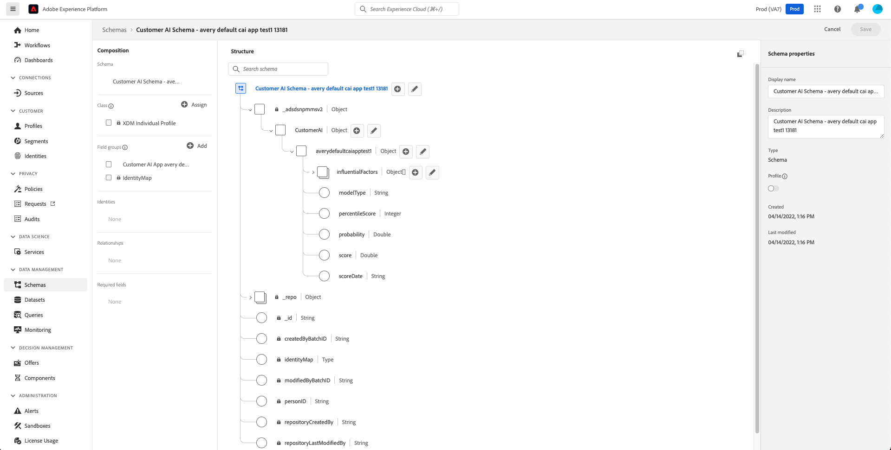

# Eingabe und Ausgabe in Customer AI

Im folgenden Dokument werden die verschiedenen erforderlichen Ereignisse, Eingaben und Ausgaben beschrieben, die in Customer AI verwendet werden.

## Erste Schritte

Customer AI analysiert einen der folgenden Datensätze, um Abwanderungs- oder Konversionsneigungswerte vorherzusagen:

- Adobe Analytics-Daten mit [Analytics-Quell-Connector](../../sources/tutorials/ui/create/adobe-applications/analytics.md)
- Adobe Audience Manager-Daten mit [Quell-Connector für Audience Manager](../../sources/tutorials/ui/create/adobe-applications/audience-manager.md)
- Datensatz für Erlebnisereignisse (EE)
- Datensatz für Kundenerlebnis-Ereignisse (CEE)

Sie können mehrere Datensätze aus verschiedenen Quellen hinzufügen, wenn jeder Datensatz denselben Identitätstyp (Namespace) wie eine ECID aufweist. Weitere Informationen zum Hinzufügen mehrerer Datensätze finden Sie unter [Benutzerhandbuch für Customer AI](./user-guide/configure.md#select-data)

>[!IMPORTANT]
>
>Die Aufstockung von Daten durch Quell-Connectoren dauert bis zu vier Wochen. Wenn Sie kürzlich einen Connector eingerichtet haben, sollten Sie sicherstellen, dass der Datensatz die für Customer AI erforderliche Mindestlänge von Daten aufweist. Lesen Sie die [historische Daten](#data-requirements) -Abschnitt, um sicherzustellen, dass Sie über genügend Daten für Ihr Prognoseziel verfügen.

Dieses Dokument erfordert ein grundlegendes Verständnis des CEE-Schemas. Lesen Sie die [Datenvorbereitung für Intelligent Services](../data-preparation.md) Dokumentation erstellen, bevor Sie fortfahren.

In der folgenden Tabelle sind einige häufig verwendete Begriffe in diesem Dokument aufgeführt:

| Begriff | Definition |
| --- | --- |
| [Experience-Datenmodell (XDM)](../../xdm/home.md) | XDM ist das grundlegende Framework, mit dem Adobe Experience Cloud mit Adobe Experience Platform genau zum richtigen Zeitpunkt die richtige Botschaft an die richtige Person auf dem richtigen Kanal senden kann. Das XDM-System ist die Methode, auf der Experience Platform basiert. Es stellt Experience-Datenmodell-Schemata zur Verwendung durch Platform-Dienste bereit. |
| XDM-Schema | Schemas dienen in Experience Platform zur konsistenten und wiederverwendbaren Beschreibung der Struktur von Daten. Durch die systemübergreifende einheitliche Definition von Daten wird es einfacher, deren Bedeutung beizubehalten und somit Wert aus Daten zu ziehen. Bevor Daten in Platform erfasst werden können, muss ein Schema erstellt werden, das die Datenstruktur beschreibt und Einschränkungen für den Datentyp enthält, der in jedem Feld enthalten sein kann. Schemas bestehen aus einer zugrunde liegenden XDM-Klasse und keiner oder mehr Schemafeldgruppen. |
| XDM-Klasse | Alle XDM-Schemas beschreiben Daten, die als Datensatz oder Zeitreihe kategorisiert werden können. Das Datenverhalten eines Schemas wird durch die Klasse des Schemas definiert, die einem Schema beim ersten Erstellen zugewiesen wird. XDM-Klassen beschreiben die Mindestanzahl von Eigenschaften, die ein Schema enthalten muss, um ein bestimmtes Datenverhalten zu haben. |
| [Feldergruppen](../../xdm/schema/composition.md) | Eine Komponente, die ein oder mehrere Felder in einem Schema definiert. Feldergruppen erzwingen, wie ihre Felder in der Hierarchie des Schemas angezeigt werden, und weisen daher in jedem Schema, in dem sie enthalten sind, dieselbe Struktur auf. Feldergruppen sind nur mit bestimmten Klassen kompatibel, die durch ihre `meta:intendedToExtend` -Attribut. |
| [Datentyp](../../xdm/schema/composition.md) | Eine Komponente, die auch ein oder mehrere Felder für ein Schema bereitstellen kann. Im Gegensatz zu Feldergruppen sind Datentypen jedoch nicht auf eine bestimmte Klasse beschränkt. Dadurch sind Datentypen flexibler, um allgemeine Datenstrukturen zu beschreiben, die über mehrere Schemas mit potenziell unterschiedlichen Klassen hinweg wiederverwendet werden können. Die in diesem Dokument beschriebenen Datentypen werden sowohl von den CEE- als auch von Adobe Analytics-Schemata unterstützt. |
| Abwanderung | Eine Messung des Prozentsatzes der Konten, die ihre Abonnements stornieren oder nicht verlängern. Eine hohe Abwanderungsrate kann sich negativ auf den monatlichen wiederkehrenden Umsatz (MRR) auswirken und auch auf Unzufriedenheit mit einem Produkt oder einer Dienstleistung hinweisen. |
| [Echtzeit-Kundenprofil](../../profile/home.md) | Das Echtzeit-Kundenprofil bietet ein zentralisiertes Kundenprofil für zielgerichtetes und personalisiertes Erlebnis-Management. Jedes Profil enthält Daten, die systemübergreifend aggregiert werden, sowie relevante, mit einem Zeitstempel versehene Ereignisse, an denen die entsprechende Person beteiligt ist und die in einem der Systeme stattfanden, die Sie in Verbindung mit Experience Platform verwenden. |

## Input-Daten von Customer AI

>[!TIP]
>
> Customer AI ermittelt automatisch, welche Ereignisse für Prognosen nützlich sind, und gibt eine Warnung aus, wenn die verfügbaren Daten nicht ausreichen, um Qualitätsprognosen zu generieren.

Customer AI unterstützt die Datensätze Adobe Analytics, Adobe Audience Manager, Experience Event (EE) und Consumer Experience Event (CEE). Für das CEE-Schema müssen Sie während der Erstellung des Schemas Feldergruppen hinzufügen. Wenn Sie Adobe Analytics- oder Adobe Audience Manager-Datensätze verwenden, ordnet der Quell-Connector während des Verbindungsprozesses direkt die Standardereignisse (Commerce, Webseitendetails, Anwendung und Suche) zu. Sie können mehrere Datensätze aus verschiedenen Quellen hinzufügen, wenn jeder Datensatz denselben Identitätstyp (Namespace) wie eine ECID aufweist.

Weitere Informationen zum Zuordnen von Adobe Analytics-Daten oder Audience Manager-Daten finden Sie im [Analytics-Feldzuordnungen](../../sources/connectors/adobe-applications/analytics.md) oder [Audience Manager-Feldzuordnungen](../../sources/connectors/adobe-applications/mapping/audience-manager.md) Handbuch.

### Standardereignisse, die von Customer AI verwendet werden {#standard-events}

XDM-Erlebnisereignisse werden zur Bestimmung verschiedener Kundenverhaltensweisen verwendet. Je nachdem, wie Ihre Daten strukturiert sind, umfassen die unten aufgeführten Ereignistypen möglicherweise nicht alle Verhaltensweisen Ihres Kunden. Es liegt an Ihnen zu bestimmen, welche Felder über die erforderlichen Daten verfügen, um die Webbenutzeraktivität eindeutig und eindeutig zu identifizieren. Je nach Prognoseziel können sich die erforderlichen Felder ändern.

Customer AI nutzt verschiedene Ereignistypen zum Erstellen von Modellfunktionen. Diese Ereignistypen werden Ihrem Schema mithilfe mehrerer XDM-Feldergruppen automatisch hinzugefügt.

>[!NOTE]
>
>Wenn Sie Adobe Analytics- oder Adobe Audience Manager-Daten verwenden, wird das Schema automatisch mit den erforderlichen Standardereignissen erstellt, die zum Erfassen Ihrer Daten erforderlich sind. Wenn Sie Ihr eigenes benutzerdefiniertes CEE-Schema zum Erfassen von Daten erstellen, müssen Sie überlegen, welche Feldergruppen zum Erfassen Ihrer Daten erforderlich sind.

Es ist nicht erforderlich, Daten für jedes der unten aufgeführten Standardereignisse zu haben. Für bestimmte Szenarien sind jedoch bestimmte Ereignisse erforderlich. Wenn eine der standardmäßigen Ereignisdaten verfügbar ist, wird empfohlen, diese in Ihr Schema einzuschließen. Wenn Sie beispielsweise eine Customer AI-Anwendung für die Vorhersage von Kaufereignissen erstellen möchten, wäre es nützlich, Daten aus dem `Commerce` und `Web page details` Datentypen.

Um eine Feldergruppe in der Platform-Benutzeroberfläche anzuzeigen, wählen Sie die **[!UICONTROL Schemas]** in der linken Leiste, gefolgt von der Auswahl der **[!UICONTROL Feldergruppen]** Registerkarte.

| Feldergruppe | Ereignistyp | XDM-Feldpfad |
| --- | --- | --- |
| [!UICONTROL Handelsdetails] | Reihenfolge | <li> commerce.order.purchaseID </li> <li> productListItems.SKU </li> |
|  | productListViews | <li> commerce.productListViews.value </li> <li> productListItems.SKU </li> |
|  | checkouts | <li> commerce.checkouts.value </li> <li> productListItems.SKU </li> |
|  | purchases | <li> commerce.purchases.value </li> <li> productListItems.SKU </li> |
|  | productListRemovals | <li> commerce.productListRemovals.value </li> <li> productListItems.SKU </li> |
|  | productListOpens | <li> commerce.productListOpens.value </li> <li> productListItems.SKU </li> |
|  | productViews | <li> commerce.productViews.value </li> <li> productListItems.SKU </li> |
| [!UICONTROL Web-Details] | webVisit | web.webPageDetails.name |
|  | webInteraction | web.webInteraction.linkClicks.value |
| [!UICONTROL Anwendungsdetails] | applicationCloses | <li> application.applicationCloses.value </li> <li> application.name </li> |
|  | applicationCrashes | <li> application.crashes.value </li> <li> application.name </li> |
|  | applicationFeatureUsages | <li> application.featureUsages.value </li> <li> application.name </li> |
|  | applicationFirstLaunches | <li> application.firstLaunches.value </li> <li> application.name </li> |
|  | applicationInstalls | <li> application.installs.value </li> <li> application.name </li> |
|  | applicationLaunches | <li> application.launches.value </li> <li> application.name </li> |
|  | applicationUpgrades | <li> application.upgrades.value </li> <li> application.name </li> |
| [!UICONTROL Suchdetails] | Suchen | search.keywords |

Darüber hinaus kann Customer AI Abonnementdaten verwenden, um bessere Abwanderungsmodelle zu erstellen. Abonnementdaten werden für jedes Profil benötigt, das die [[!UICONTROL Abonnement]](../../xdm/data-types/subscription.md) Datentypformat. Die meisten Felder sind optional. Für ein optimales Abwanderungsmodell wird jedoch dringend empfohlen, Daten für so viele Felder wie möglich bereitzustellen, z. B.: `startDate`, `endDate`und alle anderen relevanten Details.

### Hinzufügen benutzerdefinierter Ereignisse und Profilattribute

Wenn Sie über Informationen verfügen, die Sie zusätzlich zum [Standardereignisfelder](#standard-events) wird von Customer AI verwendet und es wird eine benutzerdefinierte Ereignis- und benutzerdefinierte Profilattributoption während Ihrer [Instanzenkonfiguration](./user-guide/configure.md#custom-events).

Wenn der ausgewählte Datensatz benutzerdefinierte Ereignisse oder Profilattribute wie eine &quot;Hotelreservierung&quot;oder &quot;Mitarbeiter von X Unternehmen&quot;enthält, die in Ihrem Schema definiert sind, können Sie sie zu Ihrer Instanz hinzufügen. Diese zusätzlichen benutzerspezifischen Ereignisse und Profilattribute werden von Customer AI verwendet, um die Qualität Ihres Modells zu verbessern und genauere Ergebnisse zu liefern.

### Historische Daten {#data-requirements}

Customer AI erfordert historische Daten für die Modellschulung, aber die erforderliche Datenmenge basiert auf zwei Schlüsselelementen: Ergebnisfenster und förderfähige Population.

Standardmäßig sucht Customer AI nach einem Benutzer, der in den letzten 120 Tagen aktiv war, wenn während der Anwendungskonfiguration keine Definition der förderfähigen Population angegeben wurde. Darüber hinaus erfordert Customer AI mindestens 500 qualifizierte und 500 nicht qualifizierende Ereignisse (insgesamt 1000) historischer Daten, die auf einer prognostizierten Zieldefinition basieren.

In den folgenden Beispielen wird eine einfache Formel verwendet, mit der Sie die erforderliche Mindestmenge an Daten ermitteln können. Wenn Sie mehr als die Mindestanforderung haben, liefert Ihr Modell wahrscheinlich genauere Ergebnisse. Wenn Sie weniger als den erforderlichen Mindestwert haben, schlägt das Modell fehl, da für die Modellschulung nicht genügend Daten vorhanden sind.

**Formel**:

Erforderliche Mindestlänge der Daten = berechtigte Population + Ergebnisfenster

>[!NOTE]
>
> 30 ist die Mindestanzahl von Tagen, die für die förderfähige Bevölkerung erforderlich ist. Wenn dies nicht angegeben wird, beträgt der Standardwert 120 Tage.

Beispiele:

- Sie möchten vorhersagen, ob ein Kunde in den nächsten 30 Tagen wahrscheinlich eine Uhr kaufen wird. Sie möchten auch Benutzer bewerten, die in den letzten 60 Tagen eine gewisse Web-Aktivität haben. In diesem Fall ist die erforderliche Mindestlänge der Daten = 60 Tage + 30 Tage. Die förderfähige Bevölkerung beträgt 60 Tage und das Ergebnisfenster beträgt 30 Tage und insgesamt 90 Tage.

- Sie möchten vorhersagen, ob der Benutzer in den nächsten sieben Tagen wahrscheinlich eine Uhr kaufen wird. In diesem Fall ist die erforderliche Mindestlänge der Daten = 120 Tage + 7 Tage. Die förderfähige Bevölkerung hat den Standardwert von 120 Tagen und das Ergebnisfenster beträgt 7 Tage und beläuft sich auf insgesamt 127 Tage.

- Sie möchten vorhersagen, ob der Kunde in den nächsten sieben Tagen wahrscheinlich eine Uhr kaufen wird. Sie möchten auch Benutzer bewerten, die in den letzten sieben Tagen eine gewisse Web-Aktivität haben. In diesem Fall ist die erforderliche Mindestlänge der Daten 30 Tage + 7 Tage. Die förderfähige Bevölkerung benötigt mindestens 30 Tage und das Ergebnisfenster beträgt 7 Tage und insgesamt 37 Tage.

Zusätzlich zu den erforderlichen Mindestdaten funktioniert Customer AI auch am besten mit aktuellen Daten. In diesem Anwendungsfall erstellt Customer AI basierend auf den neuesten Verhaltensdaten eines Benutzers eine Prognose für die Zukunft. Anders ausgedrückt: Neuere Daten dürften zu einer präziseren Vorhersage führen.

### Beispielszenarien

In diesem Abschnitt werden verschiedene Szenarien für Customer AI-Instanzen sowie die erforderlichen und empfohlenen Ereignistypen beschrieben. Siehe Abschnitt [Standardereignistabelle](#standard-events) weiter oben finden Sie weitere Informationen zur Feldergruppe und zum Feldpfad.

>[!NOTE]
>
> Erforderliche Ereignistypen werden verwendet, um die Webbenutzeraktivität eindeutig und eindeutig zu identifizieren. Die Anzahl der erforderlichen Ereignistypen ändert sich basierend auf dem Prognoseziel und der Struktur Ihres Schemas. Wenn Sie sich nicht sicher sind, ob ein bestimmter Ereignistyp erforderlich ist, sollten Sie diesen Ereignistyp beim Erstellen Ihres CEE-Schemas einbeziehen. Wenn Sie Adobe Analytics- oder Adobe Audience Manager-Daten verwenden, sollten die erforderlichen Standardereignisse je nach Streaming-Daten verfügbar sein.

### Szenario 1: Kaufkonversion auf einer E-Commerce-Einzelhandelswebsite

**Prognoseziel:** Prognostizieren Sie die Konversionsneigung für die Profile, die zum Kauf eines bestimmten Kleidungsartikels auf einer Website berechtigt sind.

**Erforderliche standardmäßige Ereignistypen:**

Die folgenden Ereignistypen sind für eine optimale Customer AI-Ausgabe mit diesem bestimmten Prognoseziel erforderlich. Es ist möglich, ein erforderliches Ereignis abhängig von Ihrem Prognoseziel auszuschließen. Das Ausschließen mehrerer Ereignisse kann jedoch zu schlechten Ergebnissen führen.

- Reihenfolge
- Checkouts
- purchases
- webVisit
- Suchen

**Zusätzliche empfohlene standardmäßige Ereignistypen:**

Beliebige der übrigen [Ereignistypen](#standard-events) kann abhängig von der Komplexität Ihres Ziels und der infrage kommenden Population beim Konfigurieren Ihrer Customer AI-Instanz erforderlich sein. Wenn die Daten für einen bestimmten Datentyp verfügbar sind, wird empfohlen, diese Daten in Ihr Schema aufzunehmen.

### Szenario 2: Abonnementkonversion auf einer Medien-Streaming-Dienst-Website

**Prognoseziel:** Prognostizieren Sie die Neigung zur Abonnementkonvertierung für die förderfähigen Profile, sich auf eine bestimmte Abonnementebene zu verpflichten, z. B. einen Standard- oder Premium-Plan.

**Erforderliche standardmäßige Ereignistypen:**

Die folgenden Ereignistypen sind für eine optimale Customer AI-Ausgabe mit diesem bestimmten Prognoseziel erforderlich. Es ist möglich, ein erforderliches Ereignis abhängig von Ihrem Prognoseziel auszuschließen. Das Ausschließen mehrerer Ereignisse kann jedoch zu schlechten Ergebnissen führen.

- Reihenfolge
- Checkouts
- purchases
- webVisit
- Suchen

In diesem Beispiel `order`, `checkouts`und `purchases` werden verwendet, um anzugeben, dass ein Abonnement erworben wurde und dessen Typ ist.

Außerdem wird für ein akkurates Modell empfohlen, einige der verfügbaren Eigenschaften in der [Abonnementdatentyp](../../xdm/data-types/subscription.md).

**Zusätzliche empfohlene standardmäßige Ereignistypen:**

Beliebige der übrigen [Ereignistypen](#standard-events) kann abhängig von der Komplexität Ihres Ziels und der infrage kommenden Population beim Konfigurieren Ihrer Customer AI-Instanz erforderlich sein. Wenn die Daten für einen bestimmten Datentyp verfügbar sind, wird empfohlen, diese Daten in Ihr Schema aufzunehmen.

### Szenario 3: Abwanderung auf einer E-Commerce-Einzelhandelswebsite

**Prognoseziel:** Prognostizieren Sie die Wahrscheinlichkeit, dass ein Kaufereignis nicht eintritt.

**Erforderliche standardmäßige Ereignistypen:**

Die folgenden Ereignistypen sind für eine optimale Customer AI-Ausgabe mit diesem bestimmten Prognoseziel erforderlich. Es ist möglich, ein erforderliches Ereignis abhängig von Ihrem Prognoseziel auszuschließen. Das Ausschließen mehrerer Ereignisse kann jedoch zu schlechten Ergebnissen führen.

- Reihenfolge
- Checkouts
- purchases
- webVisit
- Suchen

**Zusätzliche empfohlene standardmäßige Ereignistypen:**

Beliebige der übrigen [Ereignistypen](#standard-events) kann abhängig von der Komplexität Ihres Ziels und der infrage kommenden Population beim Konfigurieren Ihrer Customer AI-Instanz erforderlich sein. Wenn die Daten für einen bestimmten Datentyp verfügbar sind, wird empfohlen, diese Daten in Ihr Schema aufzunehmen.

### Szenario 4: Upsell von Konversionen auf einer E-Commerce-Einzelhandelswebsite

**Prognoseziel:** Prognostizieren Sie die Kaufneigung der Population, die ein bestimmtes Produkt gekauft hat, um ein neues verwandtes Produkt zu kaufen.

**Erforderliche standardmäßige Ereignistypen:**

Die folgenden Ereignistypen sind für eine optimale Customer AI-Ausgabe mit diesem bestimmten Prognoseziel erforderlich. Es ist möglich, ein erforderliches Ereignis abhängig von Ihrem Prognoseziel auszuschließen. Das Ausschließen mehrerer Ereignisse kann jedoch zu schlechten Ergebnissen führen.

- Reihenfolge
- Checkouts
- purchases
- webVisit
- Suchen

**Zusätzliche empfohlene standardmäßige Ereignistypen:**

Beliebige der übrigen [Ereignistypen](#standard-events) kann abhängig von der Komplexität Ihres Ziels und der infrage kommenden Population beim Konfigurieren Ihrer Customer AI-Instanz erforderlich sein. Wenn die Daten für einen bestimmten Datentyp verfügbar sind, wird empfohlen, diese Daten in Ihr Schema aufzunehmen.

### Szenario 5: Abmeldung (Abwanderung) über einen Online-Nachrichtenversand

**Prognoseziel:** Prognostizieren Sie die Neigung der förderfähigen Bevölkerung, sich im nächsten Monat von einem Dienst abzumelden.

**Erforderliche standardmäßige Ereignistypen:**

Die folgenden Ereignistypen sind für eine optimale Customer AI-Ausgabe mit diesem bestimmten Prognoseziel erforderlich. Es ist möglich, ein erforderliches Ereignis abhängig von Ihrem Prognoseziel auszuschließen. Das Ausschließen mehrerer Ereignisse kann jedoch zu schlechten Ergebnissen führen.

- webVisit
- Suchen

Außerdem wird für ein akkurates Modell empfohlen, einige der verfügbaren Eigenschaften in der [Abonnementdatentyp](../../xdm/data-types/subscription.md).

**Zusätzliche empfohlene standardmäßige Ereignistypen:**

Beliebige der übrigen [Ereignistypen](#standard-events) kann abhängig von der Komplexität Ihres Ziels und der infrage kommenden Population beim Konfigurieren Ihrer Customer AI-Instanz erforderlich sein. Wenn die Daten für einen bestimmten Datentyp verfügbar sind, wird empfohlen, diese Daten in Ihr Schema aufzunehmen.

### Szenario 6: Mobile App starten

**Prognoseziel:** Prognostizieren Sie die Neigung der in Frage kommenden Profile, in den nächsten X Tagen eine gebührenpflichtige Mobile App zu starten. Dies ähnelt der Vorhersage des KPI-Indikators (Key Performance Indicator) für &quot;Monatlich aktive Benutzer&quot;.

**Erforderliche standardmäßige Ereignistypen:**

Die folgenden Ereignistypen sind für eine optimale Customer AI-Ausgabe mit diesem bestimmten Prognoseziel erforderlich. Es ist möglich, ein erforderliches Ereignis abhängig von Ihrem Prognoseziel auszuschließen. Das Ausschließen mehrerer Ereignisse kann jedoch zu schlechten Ergebnissen führen.

- Reihenfolge
- Checkouts
- purchases
- webVisit
- applicationCloses
- applicationCrashes
- applicationFeatureUsages
- applicationFirstLaunches
- applicationInstalls
- applicationLaunches
- applicationUpgrades

In diesem Beispiel `order`, `checkouts`und `purchases` werden verwendet, wenn eine Mobile App gekauft werden muss.

**Zusätzliche empfohlene standardmäßige Ereignistypen:**

Beliebige der übrigen [Ereignistypen](#standard-events) kann abhängig von der Komplexität Ihres Ziels und der infrage kommenden Population beim Konfigurieren Ihrer Customer AI-Instanz erforderlich sein. Wenn die Daten für einen bestimmten Datentyp verfügbar sind, wird empfohlen, diese Daten in Ihr Schema aufzunehmen.

### Szenario 7: Realisierte Eigenschaften (Adobe Audience Manager)

**Prognoseziel:** Prognostizieren Sie die Neigung, einige Eigenschaften zu realisieren.

**Erforderliche standardmäßige Ereignistypen:**

Um Eigenschaften aus Adobe Audience Manager verwenden zu können, müssen Sie eine Quellverbindung mit dem [Quell-Connector für Audience Manager](../../sources/tutorials/ui/create/adobe-applications/audience-manager.md). Der Quell-Connector erstellt das Schema automatisch mit den entsprechenden Feldergruppen. Sie müssen keine zusätzlichen Ereignistypen manuell hinzufügen, damit das Schema mit Customer AI verwendet werden kann.

Wenn Sie eine neue Kunden-KI-Instanz konfigurieren, `audienceName` und `audienceID` kann verwendet werden, um eine bestimmte Eigenschaft für die Auswertung beim Definieren Ihres Ziels auszuwählen.

## Ausgabedaten von Customer AI

Customer AI generiert mehrere Attribute für einzelne Profile, die als geeignet gelten. Es gibt zwei Möglichkeiten, die Punktzahl (Ausgabe) basierend auf dem, was Sie bereitgestellt haben, zu nutzen. Wenn Sie über einen Datensatz mit aktiviertem Echtzeit-Kundenprofil verfügen, können Sie Einblicke aus dem Echtzeit-Kundenprofil im [Segment Builder](../../segmentation/ui/segment-builder.md). Wenn Sie keinen Datensatz mit aktiviertem Profil haben, können Sie [Customer AI-Ausgabe herunterladen](./user-guide/download-scores.md) Datensatz, der im Data Lake verfügbar ist.

Sie finden den Ausgabedatensatz unter **Datensätze** in Platform. Alle Ausgabedatensätze von Customer AI beginnen mit dem Namen **Customer AI-Werte - Name_der_App** während alle Ausgabeschemata der Customer AI mit dem Namen beginnen **Customer AI-Schema - Name_of_app**.

>[!NOTE]
>
> Ausgabewerte werden vom Echtzeit-Kundenprofil genutzt, das zum Erstellen und Definieren von Segmenten verwendet werden kann.

Die folgende Tabelle beschreibt die verschiedenen Attribute, die in der Ausgabe der Customer AI gefunden wurden:

| Attribut | Beschreibung |
| ----- | ----------- |
| Ergebnis | Die relative Wahrscheinlichkeit, mit der ein Kunde das prognostizierte Ziel innerhalb des definierten Zeitraums erreicht. Dieser Wert ist nicht als Prozentsatz der Wahrscheinlichkeit zu behandeln, sondern vielmehr als die Wahrscheinlichkeit eines Individuums im Vergleich zur Gesamtbevölkerung. Dieser Wert liegt im Bereich von 0 bis 100. |
| Wahrscheinlichkeit | Dieses Attribut ist die wahre Wahrscheinlichkeit eines Profils, dass es das das prognostizierte Ziel innerhalb des definierten Zeitraums erreicht. Beim Vergleich der Ausgaben über verschiedene Ziele hinweg wird empfohlen, dass Sie die Wahrscheinlichkeit über das Perzentil oder das Ergebnis in Betracht ziehen. Die Wahrscheinlichkeit sollte immer bei der Bestimmung der durchschnittlichen Wahrscheinlichkeit für die gesamte geeignete Bevölkerung verwendet werden, da die Wahrscheinlichkeit für Ereignisse, die nicht häufig auftreten, tendenziell niedriger liegt. Werte für den Wahrscheinlichkeitsbereich zwischen 0 und 1. |
| Perzentil | Dieser Wert enthält Informationen zur Leistung eines Profils im Vergleich zu anderen Profilen mit ähnlichen Werten. Ein Profil mit einem Perzentil-Rang von 99 für Kundenabwanderung weist beispielsweise darauf hin, dass es ein höheres Risiko für Abwanderungen aufweist als 99 % aller anderen Profile, die bewertet wurden. Die Perzentile liegen zwischen 1 und 100. |
| Tendenztyp | Der ausgewählte Tendenztyp. |
| Datum der Auswertung | Das Datum, an dem die Auswertung erfolgte. |
| Einflussfaktoren | Prognostizierte Gründe, warum ein Profil wahrscheinlich konvertiert oder abwandert. Die Faktoren bestehen aus den folgenden Attributen:<ul><li>Code: Das Profil- oder Verhaltensattribut, das das prognostizierte Ergebnis eines Profils positiv beeinflusst. </li><li>Wert: Der Wert des Profil- oder Verhaltensattributs.</li><li>Wichtigkeit: Gibt an, welche Gewichtung das Profil- oder Verhaltensattribut auf das prognostizierte Ergebnis hat (niedrig, mittel, hoch)</li></ul> |

## Nächste Schritte {#next-steps}

Nachdem Sie Ihre Daten vorbereitet und alle Ihre Anmeldedaten und Schemata eingerichtet haben, führen Sie die folgenden Schritte aus: [Konfigurieren einer Customer AI-Instanz](./user-guide/configure.md) Handbuch. Dieses Handbuch führt Sie durch die Erstellung einer Instanz für Customer AI.
