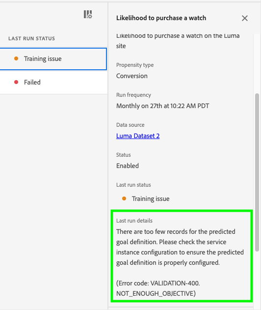

# Fehlerbehebung bei Kunden-AI

Die Kunden-AI zeigt Fehler an, wenn Modellschulung, -bewertung und -konfiguration fehlschlagen. Im Abschnitt **[!UICONTROL Dienstinstanzen]** zeigt eine Spalte für **[!UICONTROL LAST-AUSFÜHRUNGSSTATUS]** eine der folgenden Meldungen an: **[!UICONTROL Erfolg]**, **[!UICONTROL Schulungsproblem]** und **[!UICONTROL Fehlgeschlagen]**.

In dem Ereignis, dass **[!UICONTROL Fehlgeschlagen]** oder **[!UICONTROL Schulungsproblem]** angezeigt wird, können Sie den Ausführungsstatus auswählen, um ein Seitenbedienfeld zu öffnen. Das Seitenbedienfeld enthält Ihre **[!UICONTROL Status der letzten Ausführung]** und **[!UICONTROL Details der letzten Ausführung]**. **[!UICONTROL Die]** Details zur letzten Ausführung enthalten Informationen darüber, warum die Ausführung fehlgeschlagen ist. Wenden Sie sich in dem Ereignis, dass die Kundenunterstützung keine Details zu Ihrem Fehler angeben kann, an den Support mit dem angegebenen Fehlercode.

 

## Modellqualität ist schlecht

Wenn Sie den Fehler &quot;[!UICONTROL Modellqualität ist schlecht. Es wird empfohlen, eine neue App mit der geänderten Konfiguration zu erstellen. ] Gehen Sie wie folgt vor, um die Fehlerbehebung zu unterstützen.

 

### Empfohlene Fehlerbehebung

&quot;Modellqualität ist schlecht&quot; bedeutet, dass die Modellgenauigkeit nicht in einem akzeptablen Bereich liegt. Die Kundentraining-API konnte nach dem Training kein zuverlässiges Modell und keine AUC (Fläche unter der ROC-Kurve) &lt; 0,65 erstellen. Um den Fehler zu beheben, sollten Sie einen der Konfigurationsparameter ändern und die Schulung erneut ausführen.

Beginn durch Überprüfung der Genauigkeit Ihrer Daten. Es ist wichtig, dass Ihre Daten die erforderlichen Felder enthalten, um ein vorhersagbares Ergebnis zu erzielen.

- Überprüfen Sie, ob Ihr Datensatz die neuesten Daten enthält. Die Kunden-API geht immer davon aus, dass die Daten beim Auslösen des Modells auf dem neuesten Stand sind.
- Überprüfen Sie, ob in Ihrem Fenster für die definierte Prognose und die Berechtigung Daten fehlen. Ihre Daten müssen lückenlos sein. Vergewissern Sie sich auch, dass Ihr Datensatz die Anforderungen für historische Daten von [Kunden-API](./input-output.md#data-requirements) erfüllt.
- Suchen Sie in den Feldeigenschaften Ihres Schemas nach fehlenden Daten in Commerce, Anwendung, Web und Suche.

Wenn Ihre Daten anscheinend nicht problematisch sind, versuchen Sie, die Populationsbedingung für die Berechtigung zu ändern, um das Modell auf bestimmte Profil zu beschränken (z. B. `_experience.analytics.customDimensions.eVars.eVar142` existiert in den letzten 56 Tagen). Dadurch werden die Population und Größe der im Schulungsfenster verwendeten Daten eingeschränkt.

Wenn die Einschränkung der Berechtigungspopulation nicht funktioniert hat oder nicht möglich ist, ändern Sie Ihr Prognosefenster.

- Versuchen Sie, Ihr Prognosefenster auf 7 Tage zu ändern, und prüfen Sie, ob der Fehler weiterhin auftritt. Wenn der Fehler nicht mehr auftritt, deutet dies darauf hin, dass Sie möglicherweise nicht über genügend Daten für das definierte Prognosefenster verfügen.

