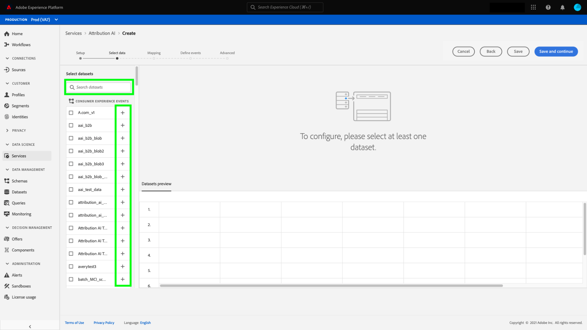
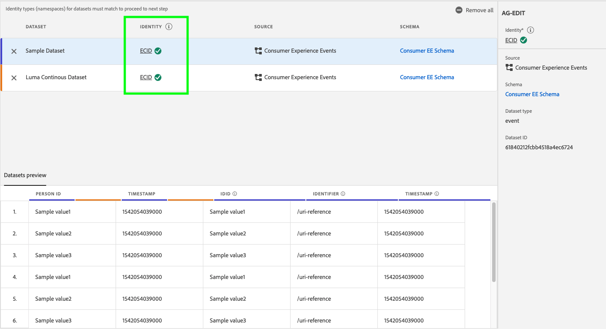

# Konfigurieren einer Customer AI-Instanz

Mit Customer AI als Teil von AI/ML Services können Sie benutzerdefinierte Tendenzwerte generieren, ohne sich um maschinelles Lernen kümmern zu müssen.

AI-/ML-Dienste bieten Customer AI als einfach zu verwendenden Adobe Sensei-Dienst, der für verschiedene Anwendungsfälle konfiguriert werden kann. Die folgenden Abschnitte enthalten Schritte zum Konfigurieren einer Instanz von Customer AI.

## Erstellen einer Instanz {#set-up-your-instance}

Wählen Sie in der Platform-Benutzeroberfläche die Option **[!UICONTROL Dienste]** in der linken Navigation. Der Browser für **[!UICONTROL Dienste]** erscheint und zeigt alle Dienste an, die Ihnen zur Verfügung stehen. Wählen Sie im Container für Customer AI die Option **[!UICONTROL Öffnen]**.

Die **Customer AI** Die Benutzeroberfläche wird angezeigt und zeigt alle Dienstinstanzen an.

- Sie finden die **[!UICONTROL Gesamtzahl der bewerteten Profile]** Metrik unten rechts im **[!UICONTROL Instanz erstellen]** Container. Diese Metrik verfolgt die Gesamtzahl der Profile, die von Customer AI für das aktuelle Kalenderjahr bewertet wurden, einschließlich aller Sandbox-Umgebungen und aller gelöschten Dienstinstanzen.

Dienstinstanzen können mithilfe der Steuerelemente auf der rechten Seite der Benutzeroberfläche bearbeitet, geklont und gelöscht werden. Um diese Steuerelemente anzuzeigen, wählen Sie eine Instanz aus Ihrer vorhandenen **[!UICONTROL Dienstinstanzen]**. Die Steuerelemente enthalten Folgendes:

- **[!UICONTROL Bearbeiten]**: Auswählen **[!UICONTROL Bearbeiten]** können Sie eine vorhandene Dienstinstanz ändern. Sie können den Namen, die Beschreibung und die Scoring-Häufigkeit der Instanz bearbeiten.
- **[!UICONTROL Klonen]**: Auswählen **[!UICONTROL Klonen]** kopiert die derzeit ausgewählte Dienstinstanz-Einrichtung. Anschließend können Sie den Workflow ändern, um kleinere Änderungen vorzunehmen, und ihn in eine neue Instanz umbenennen.
- **[!UICONTROL Löschen]**: Sie können eine Dienstinstanz einschließlich aller historischen Ausführungen löschen. Der entsprechende Ausgabedatensatz wird aus Platform gelöscht. Bewertungen, die mit dem Echtzeit-Kundenprofil synchronisiert wurden, werden jedoch nicht gelöscht.
- **[!UICONTROL Datenquelle]**: Ein Link zum Datensatz, der von dieser Instanz verwendet wird. Wenn mehrere Datensätze verwendet werden, wird durch Auswahl des Hyperlink-Texts das Popup-Fenster für die Datensatzvorschau geöffnet.
- **[!UICONTROL Letzte Ausführungsdetails]**: Dies wird nur angezeigt, wenn ein Lauf fehlschlägt. Informationen dazu, warum die Ausführung fehlgeschlagen ist, wie z. B. Fehlercodes, werden hier angezeigt.
- **[!UICONTROL Definition des Punkts]**: Ein kurzer Überblick über das Ziel, das Sie für diese Instanz konfiguriert haben.

Um eine neue Instanz zu erstellen, wählen Sie **[!UICONTROL Instanz erstellen]**.

## Einrichten

Der Workflow für die Instanzerstellung wird angezeigt, beginnend mit dem **[!UICONTROL Einrichten]** Schritt.

Im Folgenden finden Sie wichtige Informationen zu Werten, die Sie für die Instanz angeben müssen:

- **[!UICONTROL Name]:** Der Name der Instanz wird an allen Stellen verwendet, an denen Customer AI-Bewertungen angezeigt werden. Daher sollten Namen beschreiben, was die Prognosewerte darstellen. Beispiel: &quot;Wahrscheinlichkeit einer Kündigung eines Zeitschriftenabonnements&quot;.

- **[!UICONTROL Beschreibung]:** Eine Beschreibung, die angibt, was Sie vorhersagen möchten.

- **[!UICONTROL Tendenztyp]:** Der Tendenztyp bestimmt den Zweck des Wertes und die Metrikpolarität. Sie können entweder **[!UICONTROL Abwanderung]** oder **[!UICONTROL Konversion]** wählen. Weitere Informationen darüber, wie sich der Tendenztyp auf Ihre Instanz auswirkt, finden Sie in der [Auswertungszusammenfassung](./discover-insights.md#scoring-summary) im Discover Insight-Dokument.

Geben Sie die erforderlichen Werte an und wählen Sie dann **[!UICONTROL Nächste]** , um fortzufahren.

## Daten auswählen {#select-data}

Standardmäßig verwendet Customer AI Adobe Analytics-, Adobe Audience Manager-, Erlebnisereignisse im Allgemeinen und Erlebnisereignisdaten für Verbraucher, um Tendenzwerte zu berechnen. Bei der Auswahl eines Datensatzes werden nur Datensätze aufgelistet, die mit Customer AI kompatibel sind. Um einen Datensatz auszuwählen, wählen Sie die **+**) neben dem Datensatznamen oder aktivieren Sie das Kontrollkästchen, um mehrere Datensätze gleichzeitig hinzuzufügen. Verwenden Sie die Suchoption, um schnell die Datensätze zu finden, an denen Sie interessiert sind.

Wählen Sie nach Auswahl der Datensätze, die Sie verwenden möchten, die **[!UICONTROL Hinzufügen]** -Schaltfläche, um die Datensätze zum Vorschaufenster für Datensätze hinzuzufügen.

Infosymbol auswählen  neben dem Datensatz öffnet das Popup-Fenster für die Datensatzvorschau.

Die Datensatzvorschau enthält Daten wie die letzte Aktualisierungszeit, das Quellschema und eine Vorschau der ersten zehn Spalten.

Auswählen **[!UICONTROL Speichern]** , um Ihre Entwürfe zu speichern, während Sie den Workflow fortsetzen. Sie können auch Entwurfsmodellkonfigurationen speichern und mit dem nächsten Schritt im Workflow fortfahren. Verwendung **[!UICONTROL Speichern und fortfahren]** , um Entwürfe während der Modellkonfigurationen zu erstellen und zu speichern. Die Funktion ermöglicht die Erstellung und Speicherung von Entwürfen der Modellkonfiguration und ist insbesondere dann nützlich, wenn Sie im Konfigurations-Workflow viele Felder definieren müssen.

### Datensatzvollständigkeit {#dataset-completeness}

In der Datensatzvorschau gibt es einen prozentualen Wert für die Vollständigkeit des Datensatzes. Dieser Wert liefert einen schnellen Überblick darüber, wie viele Spalten in Ihrem Datensatz leer/null sind. Wenn ein Datensatz viele fehlende Werte enthält und diese Werte an anderer Stelle erfasst werden, wird dringend empfohlen, den Datensatz mit den fehlenden Werten einzubeziehen. In diesem Beispiel ist die Personen-ID leer, jedoch wird die Personen-ID in einem separaten Datensatz erfasst, der eingeschlossen werden kann.

>[!NOTE]
>
>Die Vollständigkeit des Datensatzes wird mithilfe des maximalen Schulungsfensters für Customer AI (ein Jahr) berechnet. Das bedeutet, dass Daten, die älter als ein Jahr sind, bei der Anzeige Ihres Datensatzvollständigkeitswerts nicht berücksichtigt werden.

### Identität auswählen {#identity}

Sie können jetzt mehrere Datensätze auf Grundlage der Identitätszuordnung (Feld) miteinander verknüpfen. Sie müssen einen Identitätstyp (auch als &quot;Identitäts-Namespace&quot;bezeichnet) und einen Identitätswert in diesem Namespace auswählen. Wenn Sie innerhalb Ihres Schemas unter demselben Namespace mehr als ein Feld als Identität zugewiesen haben, werden alle zugewiesenen Identitätswerte im Dropdown-Menü &quot;Identität&quot;angezeigt, dem der Namespace vorangestellt wird, z. B. `EMAIL (personalEmail.address)` oder `EMAIL (workEmail.address)`.

[denselben Namespace auswählen](../images/user-guide/cai-identity-map.png)

>[!IMPORTANT]
>
>Für jeden ausgewählten Datensatz muss derselbe Identitätstyp (Namespace) verwendet werden. Neben dem Identitätstyp wird in der Identitätsspalte ein grünes Häkchen angezeigt, das angibt, dass Datensätze kompatibel sind. Bei Verwendung des Namespace Telefon und `mobilePhone.number` als Kennung angeben, müssen alle Kennungen für die verbleibenden Datensätze den Namespace Phone enthalten und verwenden.

Um eine Identität auszuwählen, wählen Sie den unterstrichenen Wert in der Identitätsspalte aus. Das Popover zur Identitätsauswahl wird angezeigt.

<!--  -->
[denselben Namespace auswählen](../images/user-guide/cai-identity-namespace.png)

Wenn innerhalb eines Namespace mehr als eine Identität verfügbar ist, wählen Sie das richtige Identitätsfeld für Ihren Anwendungsfall aus. Beispielsweise sind im E-Mail-Namespace zwei E-Mail-Identitäten verfügbar: eine Arbeit und eine persönliche E-Mail. Je nach Anwendungsfall ist es wahrscheinlicher, dass eine persönliche E-Mail ausgefüllt wird, und nützlicher bei individuellen Prognosen. Das bedeutet: `EMAIL (personalEmail.address)` als Identität ausgewählt werden.

>[!NOTE]
>
> Wenn für einen Datensatz kein gültiger Identitätstyp (Namespace) vorhanden ist, müssen Sie eine primäre Identität festlegen und ihn mithilfe der [Schemaeditor](../../../xdm/schema/composition.md#identity). Weitere Informationen zu Namespaces und Identitäten finden Sie unter [Identity Service-Namespaces](../../../identity-service/namespaces.md) Dokumentation.

## Ziel definieren {#define-a-goal}

<!-- https://www.adobe.com/go/cai-define-a-goal -->

Die **[!UICONTROL Ziel definieren]** angezeigt und bietet eine interaktive Umgebung, in der Sie ein Prognoseziel visuell definieren können. Ein Ziel besteht aus einem oder mehreren Ereignissen, bei denen das Auftreten eines jeden Ereignisses auf der Bedingung basiert, die es enthält. Ziel einer Customer AI-Instanz ist es, die Wahrscheinlichkeit zu bestimmen, mit der ihr Ziel innerhalb eines bestimmten Zeitraums erreicht wird.

Um ein Ziel zu erstellen, wählen Sie **[!UICONTROL Feldname eingeben]** gefolgt von einem Feld aus der Dropdown-Liste. Wählen Sie die zweite Eingabe, eine Klausel für die Ereignisbedingung, und geben Sie dann optional den Zielwert an, um das Ereignis abzuschließen. Zusätzliche Ereignisse können durch Auswahl von **[!UICONTROL Ereignis hinzufügen]**. Schließen Sie das Ziel ab, indem Sie einen Prognosezeitrahmen in Anzahl von Tagen anwenden, und wählen Sie **[!UICONTROL Nächste]**.

<!--  -->

### Erfolgt und tritt nicht auf

Beim Definieren Ihres Ziels können Sie Folgendes auswählen: **[!UICONTROL Vorkommen]** oder **[!UICONTROL Wird nicht ausgeführt]**. Auswählen **[!UICONTROL Vorkommen]** bedeutet, dass die von Ihnen definierten Ereignisbedingungen erfüllt sein müssen, damit die Ereignisdaten eines Kunden in die Insight-Benutzeroberfläche aufgenommen werden.

Wenn Sie beispielsweise eine App einrichten möchten, um vorherzusagen, ob ein Kunde einen Kauf tätigt, können Sie **[!UICONTROL Vorkommen]** gefolgt von **[!UICONTROL Alle von]** und geben Sie **commerce.purchases.id** (oder ein ähnliches Feld) und **[!UICONTROL exists]** als Operator.

<!--  -->

Es kann jedoch vorkommen, dass Sie vorhersagen möchten, ob ein Ereignis innerhalb eines bestimmten Zeitraums nicht eintritt. Um ein Ziel mit dieser Option zu konfigurieren, wählen Sie **[!UICONTROL Wird nicht ausgeführt]** aus der Dropdown-Liste der obersten Ebene.

Wenn Sie beispielsweise vorhersagen möchten, welche Kunden weniger engagiert sind und Ihre Kontoanmeldeseite im nächsten Monat nicht besuchen. Auswählen **[!UICONTROL Wird nicht ausgeführt]** gefolgt von **[!UICONTROL Alle von]** und geben Sie **web.webInteraction.URL** (oder ein ähnliches Feld) und **[!UICONTROL gleich]** als Operator mit **account-login** als Wert.

### Alle und beliebige von

In einigen Fällen können Sie vorhersagen, ob eine Kombination von Ereignissen eintritt, in anderen Fällen können Sie das Auftreten eines Ereignisses aus einem vordefinierten Satz vorhersagen. Um vorherzusagen, ob ein Kunde eine Kombination von Ereignissen aufweist, wählen Sie die **[!UICONTROL Alle von]** -Option aus der Dropdown-Liste der zweiten Ebene auf der **[!UICONTROL Ziel definieren]** Seite.

Sie können beispielsweise vorhersagen, ob ein Kunde ein bestimmtes Produkt kauft. Dieses Prognoseziel wird durch zwei Bedingungen definiert: eine `commerce.order.purchaseID` **exists** und `productListItems.SKU` **gleich** einen bestimmten Wert.

Um vorherzusagen, ob ein Kunde ein Ereignis aus einem bestimmten Satz hat, können Sie die **[!UICONTROL Beliebig von]** -Option.

Sie können beispielsweise vorhersagen, ob ein Kunde eine bestimmte URL oder eine Webseite mit einem bestimmten Namen besucht. Dieses Prognoseziel wird durch zwei Bedingungen definiert: `web.webPageDetails.URL` **beginnt mit** einen bestimmten Wert und `web.webPageDetails.name` **beginnt mit** einen bestimmten Wert.

### Förderfähige Bevölkerung *(optional)*

Standardmäßig werden Tendenzwerte für alle Profile generiert, es sei denn, es wurde eine qualifizierte Zielgruppe angegeben. Sie können eine qualifizierte Zielgruppe angeben, indem Sie Bedingungen festlegen, um Profile auf Grundlage von Ereignissen ein- oder auszuschließen.

### Benutzerspezifische Ereignisse (*optional*) {#custom-events}

Wenn Sie zusätzlich zur [Standardereignisfelder](../data-requirements.md#standard-events) von Customer AI verwendet wird, um Tendenzwerte zu generieren, wird eine benutzerdefinierte Ereignisoption bereitgestellt. Mit dieser Option können Sie zusätzliche Ereignisse hinzufügen, die Sie als einflussreich erachten, was die Qualität Ihres Modells verbessern und zu genaueren Ergebnissen beitragen kann. Wenn der ausgewählte Datensatz benutzerdefinierte Ereignisse enthält, die in Ihrem Schema definiert sind, können Sie sie zu Ihrer Instanz hinzufügen.

>[!NOTE]
>
> Eine ausführliche Erklärung dazu, wie sich benutzerdefinierte Ereignisse auf die Scoring-Ergebnisse von Customer AI auswirken, finden Sie unter [Beispiel für benutzerspezifisches Ereignis](#custom-event) Abschnitt.

Um ein benutzerspezifisches Ereignis hinzuzufügen, wählen Sie **[!UICONTROL Benutzerspezifisches Ereignis hinzufügen]**. Geben Sie anschließend einen benutzerdefinierten Ereignisnamen ein und ordnen Sie ihn dem Ereignisfeld in Ihrem Schema zu. Benutzerdefinierte Ereignisnamen werden anstelle des Feldwerts angezeigt, wenn Einflussfaktoren und andere Einblicke betrachtet werden. Das bedeutet, dass der benutzerdefinierte Ereignisname anstelle der ID/des Werts des Ereignisses verwendet wird. Weitere Informationen zur Anzeige benutzerspezifischer Ereignisse finden Sie unter [Beispielabschnitt für benutzerspezifische Ereignisse](#custom-event). Diese zusätzlichen benutzerspezifischen Ereignisse werden von Customer AI verwendet, um die Qualität Ihres Modells zu verbessern und genauere Ergebnisse zu liefern.

Wählen Sie anschließend den zu verwendenden Benutzer aus der Dropdown-Liste der verfügbaren Benutzer aus. Es werden nur Benutzer aufgelistet, die mit dem Ereignis kompatibel sind.

Geben Sie abschließend die Feldwerte an, wenn der ausgewählte Benutzer einen Wert benötigt. In diesem Beispiel müssen wir nur sehen, ob eine Hotel- oder Restaurantreservierung vorhanden ist. Wenn wir jedoch genauer sein wollten, könnten wir den Operator gleich verwenden und einen genauen Wert in die Werteaufforderung eingeben.

Wählen Sie nach Abschluss **[!UICONTROL Nächste]** oben rechts, um fortzufahren.

### Benutzerdefinierte Profilattribute (*optional*)

Zusätzlich zu den [Standardereignisfelder](../data-requirements.md#standard-events) wird von Customer AI verwendet, um Tendenzwerte zu generieren. Mit dieser Option können Sie zusätzliche Profilattribute hinzufügen, die Sie als einflussreich erachten, was die Qualität Ihres Modells verbessern und genauere Ergebnisse liefern kann. Durch das Hinzufügen benutzerdefinierter Profilattribute kann Customer AI außerdem besser zeigen, wie bestimmte Profile zu einem Tendenzbehälter gelangten.

>[!NOTE]
>
>Das Hinzufügen eines benutzerdefinierten Profilattributs folgt demselben Workflow wie das Hinzufügen eines benutzerdefinierten Ereignisses. Ähnlich wie bei benutzerspezifischen Ereignissen wirken sich benutzerdefinierte Profilattribute auf die Modellbewertung auf die gleiche Weise aus. Eine ausführliche Erläuterung finden Sie unter [Beispiel für benutzerspezifisches Ereignis](#custom-event) Abschnitt.

#### Profilattribute aus dem Profil-Snapshot-Export auswählen

Sie können auch Profilattribute aus dem täglichen Profil-Snapshot-Export einbeziehen. Diese Attribute werden mit dem Profil-Snapshot-Export synchronisiert und zeigen den zuletzt verfügbaren Wert an.

>[!WARNING]
>
> Achten Sie darauf, kein Profilattribut auszuwählen, das aufgrund des Prognoseziels aktualisiert oder stark mit dem Prognoseziel korreliert wird. Dies führt zu Datenlecks und Überanpassung des Modells. Ein Beispiel für ein solches Attribut ist `total_purchases_in_the_last_3_months` die Kaufkonversion vorhersagt.

>[!NOTE]
>
>Unterstützung für die Verwendung von Profilattributen aus dem UPS Snapshot-Export ist auf Anfrage in der Benutzeroberfläche verfügbar.

### Beispiel für benutzerspezifisches Ereignis hinzufügen {#custom-event}

Im folgenden Beispiel werden ein benutzerdefiniertes Ereignis und ein Profilattribut zu einer Customer AI-Instanz hinzugefügt. Ziel der Customer AI-Instanz ist es, die Wahrscheinlichkeit vorherzusagen, mit der ein Kunde in den nächsten 60 Tagen ein weiteres Luma-Produkt kaufen wird. Normalerweise werden Produktdaten mit einer Produkt-SKU verknüpft. In diesem Fall lautet die SKU `prd1013`. Nachdem das Customer AI-Modell trainiert/bewertet wurde, kann diese SKU mit einem Ereignis verknüpft und als Einflussfaktor für einen Tendenzbehälter angezeigt werden.

Customer AI wendet automatisch die Generierung von Funktionen wie &quot;Tage seit&quot;oder &quot;Anzahl der&quot;gegen benutzerspezifische Ereignisse wie **Kauf ansehen**. Wenn dieses Ereignis als einflussreicher Faktor für die hohe, mittlere oder niedrige Neigung von Kunden betrachtet wurde, zeigt Customer AI es als `Days since prd1013 purchase` oder `Count of prd1013 purchase`. Wenn Sie dies als benutzerspezifisches Ereignis erstellen, können Sie dem Ereignis einen neuen Namen geben, um die Ergebnisse viel leichter zu lesen. Beispiel: `Days since Watch purchase`. Darüber hinaus verwendet Customer AI dieses Ereignis für Training und Scoring, selbst wenn es sich bei dem Ereignis nicht um ein Standardereignis handelt. Dies bedeutet, dass Sie mehrere Ereignisse hinzufügen können, die Ihrer Meinung nach Einfluss haben könnten, und Ihr Modell weiter anpassen können, indem Sie Daten wie Reservierungen, Besucherprotokolle und andere Ereignisse einschließen. Das Hinzufügen dieser Datenpunkte erhöht die Genauigkeit und Genauigkeit Ihres Customer AI-Modells weiter.

## Optionen festlegen

Im Schritt &quot;Optionen festlegen&quot;können Sie einen Zeitplan konfigurieren, um die Ausführung von Prognosen zu automatisieren, Prognoseausschlüsse zum Filtern bestimmter Ereignisse definieren und die **[!UICONTROL Profil]** Ein/Aus.

### Zeitplan konfigurieren *(optional)* {#configure-a-schedule}

Um einen Scoring-Zeitplan einzurichten, konfigurieren Sie zunächst die **[!UICONTROL Scoring-Häufigkeit]**. Die Ausführung automatisierter Prognosen kann entweder wöchentlich oder monatlich geplant werden.

### Prognoseausschlüsse *(optional)*

Wenn Ihr Datensatz Spalten enthielt, die als Testdaten hinzugefügt wurden, können Sie diese Spalte oder dieses Ereignis einer Ausschlussliste hinzufügen, indem Sie **[!UICONTROL Ausschluss hinzufügen]** gefolgt von der Eingabe des Felds, das Sie ausschließen möchten. Dadurch wird verhindert, dass Ereignisse, die bestimmte Bedingungen erfüllen, beim Generieren von Werten ausgewertet werden. Diese Funktion kann verwendet werden, um irrelevante Dateneingaben oder Promotions herauszufiltern.

Um ein Ereignis auszuschließen, wählen Sie **[!UICONTROL Ausschluss hinzufügen]** und definieren Sie das Ereignis. Um einen Ausschluss zu entfernen, wählen Sie die Auslassungszeichen (**[!UICONTROL ...]**) oben rechts neben dem Ereigniscontainer und wählen Sie **[!UICONTROL Container löschen]**.

### Profil-Umschalter

Mit dem Profil -Umschalter kann Customer AI die Scoring-Ergebnisse in das Echtzeit-Kundenprofil exportieren. Durch Deaktivieren dieses Umschalters wird verhindert, dass die Ergebnisse der Modellbewertung zum Profil hinzugefügt werden. Die Ergebnisse der Customer AI-Bewertung sind weiterhin verfügbar, wenn diese Funktion deaktiviert ist.

Wenn Sie Customer AI zum ersten Mal verwenden, können Sie diese Funktion deaktivieren, bis Sie mit den Modellausgabeergebnissen zufrieden sind. Dadurch wird verhindert, dass Sie mehrere Scoring-Datensätze in Ihre Kundenprofile hochladen und gleichzeitig Ihr Modell optimieren. Nachdem Sie die Kalibrierung Ihres Modells abgeschlossen haben, können Sie das Modell mit der [Klonoption](#set-up-your-instance) aus dem **Dienstinstanzen** Seite. Auf diese Weise können Sie eine Kopie Ihres Modells erstellen und das Profil aktivieren.

Sobald Sie Ihren Scoring-Zeitplan, die Prognoseausschlüsse und den Profil-Umschalter festgelegt haben, wo Sie ihn sein möchten, wählen Sie **[!UICONTROL Beenden]** oben rechts, um Ihre Customer AI-Instanz zu erstellen.

Wenn die Instanz erfolgreich erstellt wurde, wird sofort eine Prognose ausgeführt; nachfolgende Ausführungen erfolgen dann gemäß Ihrem definierten Zeitplan.

>[!NOTE]
>
>Je nach Umfang der Eingabedaten kann die Ausführung von Prognosen bis zu 24 Stunden dauern.

In diesem Abschnitt haben Sie eine Instanz von Customer AI konfiguriert und eine Prognose ausgeführt. Nach erfolgreichem Abschluss der Ausführung werden Profile mit Bewertungsdaten automatisch mit prognostizierten Werten ausgefüllt, wenn der Profil-Umschalter aktiviert ist. Warten Sie bis zu 24 Stunden, bevor Sie mit dem nächsten Abschnitt dieses Tutorials fortfahren.

## Nächste Schritte {#next-steps}

In diesem Tutorial haben Sie erfolgreich eine Instanz von Customer AI konfiguriert und Tendenzwerte generiert. Sie können jetzt den Segment Builder für [Kundensegmente mit prognostizierten Werten erstellen](./create-segment.md) oder [Einblicke in Customer AI](./discover-insights.md).

## Zusätzliche Ressourcen

Das folgende Video unterstützt Sie beim Verständnis des Konfigurations-Workflows für Customer AI. Darüber hinaus werden Best Practices und Anwendungsfallbeispiele bereitgestellt.

>[!IMPORTANT]
>
> Das folgende Video ist veraltet. Die aktuellsten Informationen finden Sie in der Dokumentation.

>[!VIDEO](https://video.tv.adobe.com/v/32665?learn=on&quality=12)
