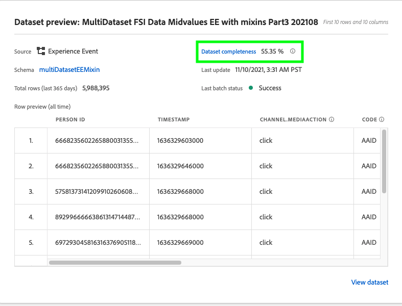
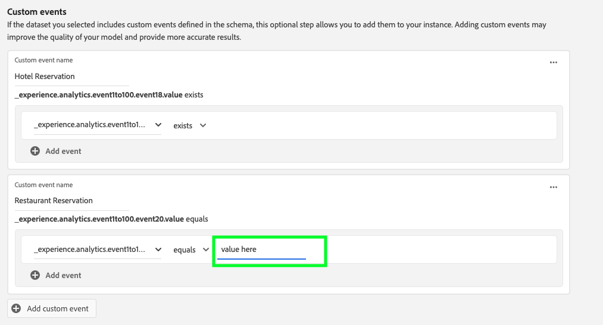

# Konfigurieren einer Customer AI-Instanz

Mit Customer AI als Teil von AI/ML Services können Sie benutzerdefinierte Tendenzwerte generieren, ohne sich um maschinelles Lernen kümmern zu müssen.

AI-/ML-Dienste bieten Customer AI als einfach zu verwendenden Adobe Sensei-Dienst, der für verschiedene Anwendungsfälle konfiguriert werden kann. Die folgenden Abschnitte enthalten Schritte zum Konfigurieren einer Instanz von Customer AI.

## Erstellen einer Instanz {#set-up-your-instance}

Wählen Sie in der Platform-Benutzeroberfläche im linken Navigationsbereich **[!UICONTROL Dienste]** aus. Der Browser für **[!UICONTROL Dienste]** erscheint und zeigt alle Dienste an, die Ihnen zur Verfügung stehen. Wählen Sie im Container für Customer AI **[!UICONTROL Öffnen]** aus.

Die Benutzeroberfläche von **Customer AI** wird angezeigt und zeigt alle Dienstinstanzen an.

- Sie finden die Metrik **[!UICONTROL Gesamte Profile mit Bewertungen]** unten rechts im Container **[!UICONTROL Instanz erstellen]** . Diese Metrik verfolgt die Gesamtzahl der Profile, die von Customer AI für das aktuelle Kalenderjahr bewertet wurden, einschließlich aller Sandbox-Umgebungen und aller gelöschten Dienstinstanzen.

Dienstinstanzen können mithilfe der Steuerelemente auf der rechten Seite der Benutzeroberfläche bearbeitet, geklont und gelöscht werden. Um diese Steuerelemente anzuzeigen, wählen Sie eine Instanz aus Ihren vorhandenen **[!UICONTROL Dienstinstanzen]** aus. Die Steuerelemente enthalten Folgendes:

- **[!UICONTROL Bearbeiten]**: Durch Auswahl von **[!UICONTROL Bearbeiten]** können Sie eine vorhandene Dienstinstanz ändern. Sie können den Namen, die Beschreibung und die Scoring-Häufigkeit der Instanz bearbeiten.
- **[!UICONTROL Klonen]**: Durch Auswahl von **[!UICONTROL Klonen]** wird das derzeit ausgewählte Dienstinstanzsetup kopiert. Anschließend können Sie den Workflow ändern, um kleinere Änderungen vorzunehmen, und ihn in eine neue Instanz umbenennen.
- **[!UICONTROL Löschen]**: Sie können eine Dienstinstanz einschließlich aller historischen Ausführungen löschen. Der entsprechende Ausgabedatensatz wird aus Platform gelöscht. Bewertungen, die mit dem Echtzeit-Kundenprofil synchronisiert wurden, werden jedoch nicht gelöscht.
- **[!UICONTROL Datenquelle]**: Ein Link zu dem von dieser Instanz verwendeten Datensatz. Wenn mehrere Datensätze verwendet werden, wird durch Auswahl des Hyperlink-Texts das Popup-Fenster für die Datensatzvorschau geöffnet.
- **[!UICONTROL Letzte Ausführungsdetails]**: Dies wird nur angezeigt, wenn eine Ausführung fehlschlägt. Informationen dazu, warum die Ausführung fehlgeschlagen ist, wie z. B. Fehlercodes, werden hier angezeigt.
- **[!UICONTROL Score-Definition]**: Ein kurzer Überblick über das Ziel, das Sie für diese Instanz konfiguriert haben.

Um eine neue Instanz zu erstellen, wählen Sie **[!UICONTROL Instanz erstellen]** aus.

## Einrichten

Der Workflow für die Instanzerstellung wird angezeigt, beginnend mit dem Schritt **[!UICONTROL Einrichten]** .

Im Folgenden finden Sie wichtige Informationen zu Werten, die Sie für die Instanz angeben müssen:

- **[!UICONTROL Name]:** Der Name der Instanz wird an allen Stellen verwendet, an denen Customer AI-Bewertungen angezeigt werden. Daher sollten Namen beschreiben, was die Prognosewerte darstellen. Beispiel: &quot;Wahrscheinlichkeit einer Kündigung eines Zeitschriftenabonnements&quot;.

- **[!UICONTROL Beschreibung]:** Eine Beschreibung, die angibt, was Sie vorhersagen möchten.

- **[!UICONTROL Propensity type]:** Der Tendenztyp bestimmt den Zweck des Wertes und der Metrikpolarität. Sie können entweder **[!UICONTROL Abwanderung]** oder **[!UICONTROL Konversion]** wählen. Weitere Informationen darüber, wie sich der Tendenztyp auf Ihre Instanz auswirkt, finden Sie in der [Auswertungszusammenfassung](./discover-insights.md#scoring-summary) im Discover Insight-Dokument.

Geben Sie die erforderlichen Werte ein und wählen Sie dann **[!UICONTROL Weiter]** aus, um fortzufahren.

## Daten auswählen {#select-data}

Standardmäßig verwendet Customer AI Adobe Analytics-, Adobe Audience Manager-, Erlebnisereignisse im Allgemeinen und Erlebnisereignisdaten für Verbraucher, um Tendenzwerte zu berechnen. Bei der Auswahl eines Datensatzes werden nur Datensätze aufgelistet, die mit Customer AI kompatibel sind. Um einen Datensatz auszuwählen, wählen Sie das Symbol (**+**) neben dem Datensatznamen aus oder aktivieren Sie das Kontrollkästchen, um mehrere Datensätze gleichzeitig hinzuzufügen. Verwenden Sie die Suchoption, um schnell die Datensätze zu finden, an denen Sie interessiert sind.

Wählen Sie nach Auswahl der Datensätze, die Sie verwenden möchten, die Schaltfläche **[!UICONTROL Hinzufügen]** aus, um die Datensätze zum Vorschaufenster für den Datensatz hinzuzufügen.

Wenn Sie das Infosymbol  neben dem Datensatz auswählen, wird das Popup-Fenster für die Datensatzvorschau geöffnet.

Die Datensatzvorschau enthält Daten wie die letzte Aktualisierungszeit, das Quellschema und eine Vorschau der ersten zehn Spalten.

Wählen Sie **[!UICONTROL Speichern]** aus, um Ihre Entwürfe zu speichern, während Sie den Workflow fortsetzen. Sie können auch Entwurfsmodellkonfigurationen speichern und mit dem nächsten Schritt im Workflow fortfahren. Verwenden Sie **[!UICONTROL Speichern und fortfahren]** , um Entwürfe während der Modellkonfigurationen zu erstellen und zu speichern. Die Funktion ermöglicht die Erstellung und Speicherung von Entwürfen der Modellkonfiguration und ist insbesondere dann nützlich, wenn Sie im Konfigurations-Workflow viele Felder definieren müssen.

### Datensatzvollständigkeit {#dataset-completeness}

In der Datensatzvorschau gibt es einen prozentualen Wert für die Vollständigkeit des Datensatzes. Dieser Wert liefert einen schnellen Überblick darüber, wie viele Spalten in Ihrem Datensatz leer/null sind. Wenn ein Datensatz viele fehlende Werte enthält und diese Werte an anderer Stelle erfasst werden, wird dringend empfohlen, den Datensatz mit den fehlenden Werten einzubeziehen. In diesem Beispiel ist die Personen-ID leer, jedoch wird die Personen-ID in einem separaten Datensatz erfasst, der eingeschlossen werden kann.

>[!NOTE]
>
>Die Vollständigkeit des Datensatzes wird mithilfe des maximalen Schulungsfensters für Customer AI (ein Jahr) berechnet. Das bedeutet, dass Daten, die älter als ein Jahr sind, bei der Anzeige Ihres Datensatzvollständigkeitswerts nicht berücksichtigt werden.

### Identität auswählen {#identity}

Sie können jetzt mehrere Datensätze auf Grundlage der Identitätszuordnung (Feld) miteinander verknüpfen. Sie müssen einen Identitätstyp (auch als &quot;Identitäts-Namespace&quot;bezeichnet) und einen Identitätswert in diesem Namespace auswählen. Wenn Sie innerhalb Ihres Schemas unter demselben Namespace mehr als ein Feld als Identität zugewiesen haben, werden alle zugewiesenen Identitätswerte im Dropdown-Menü &quot;Identität&quot;angezeigt, dem der Namespace vorangestellt wird, z. B. `EMAIL (personalEmail.address)` oder `EMAIL (workEmail.address)`.

[denselben Namespace auswählen](../images/user-guide/cai-identity-map.png)

>[!IMPORTANT]
>
>Für jeden ausgewählten Datensatz muss derselbe Identitätstyp (Namespace) verwendet werden. Neben dem Identitätstyp wird in der Identitätsspalte ein grünes Häkchen angezeigt, das angibt, dass Datensätze kompatibel sind. Wenn Sie beispielsweise den Namespace Phone und `mobilePhone.number` als Kennung verwenden, müssen alle Kennungen für die verbleibenden Datensätze den Namespace Phone enthalten und verwenden.

Um eine Identität auszuwählen, wählen Sie den unterstrichenen Wert in der Identitätsspalte aus. Das Popover zur Identitätsauswahl wird angezeigt.

<!--  -->
[denselben Namespace auswählen](../images/user-guide/cai-identity-namespace.png)

Wenn innerhalb eines Namespace mehr als eine Identität verfügbar ist, wählen Sie das richtige Identitätsfeld für Ihren Anwendungsfall aus. Beispielsweise sind im E-Mail-Namespace zwei E-Mail-Identitäten verfügbar: eine Arbeit und eine persönliche E-Mail. Je nach Anwendungsfall ist es wahrscheinlicher, dass eine persönliche E-Mail ausgefüllt wird, und nützlicher bei individuellen Prognosen. Das bedeutet, dass `EMAIL (personalEmail.address)` als Identität ausgewählt wird.

>[!NOTE]
>
> Wenn für einen Datensatz kein gültiger Identitätstyp (Namespace) vorhanden ist, müssen Sie eine primäre Identität festlegen und ihn mithilfe des Schemaeditors [1} einem Identitäts-Namespace zuweisen. ](../../../xdm/schema/composition.md#identity) Weitere Informationen zu Namespaces und Identitäten finden Sie in der Dokumentation zu [Identity Service-Namespaces](../../../identity-service/features/namespaces.md) .

## Ziel definieren {#define-a-goal}

<!-- https://www.adobe.com/go/cai-define-a-goal -->

Der Schritt **[!UICONTROL Ziel definieren]** wird angezeigt und bietet eine interaktive Umgebung, in der Sie ein Prognoseziel visuell definieren können. Ein Ziel besteht aus einem oder mehreren Ereignissen, bei denen das Auftreten eines jeden Ereignisses auf der Bedingung basiert, die es enthält. Ziel einer Customer AI-Instanz ist es, die Wahrscheinlichkeit zu bestimmen, mit der ihr Ziel innerhalb eines bestimmten Zeitraums erreicht wird.

Um ein Ziel zu erstellen, wählen Sie **[!UICONTROL Feldnamen eingeben]** und danach ein Feld aus der Dropdown-Liste. Wählen Sie die zweite Eingabe, eine Klausel für die Ereignisbedingung, und geben Sie dann optional den Zielwert an, um das Ereignis abzuschließen. Zusätzliche Ereignisse können konfiguriert werden, indem Sie **[!UICONTROL Ereignis hinzufügen]** auswählen. Schließen Sie schließlich das Ziel ab, indem Sie einen Prognosezeitrahmen in Anzahl von Tagen anwenden, und wählen Sie dann **[!UICONTROL Weiter]** aus.

<!--  -->

### Erfolgt und tritt nicht auf

Beim Definieren Ihres Ziels haben Sie die Möglichkeit, **[!UICONTROL Wird ausgeführt]** oder **[!UICONTROL Wird nicht ausgeführt]** auszuwählen. Wenn Sie **[!UICONTROL Vorkommen]** auswählen, müssen die von Ihnen definierten Ereignisbedingungen erfüllt sein, damit die Ereignisdaten eines Kunden in die Insight-Benutzeroberfläche aufgenommen werden.

Wenn Sie beispielsweise eine App einrichten möchten, um vorherzusagen, ob ein Kunde einen Kauf tätigt, können Sie **[!UICONTROL Vorkommen]** gefolgt von **[!UICONTROL Alle]** auswählen und dann **commerce.purchase.id** (oder ein ähnliches Feld) und **[!UICONTROL Vorhanden]** als Operator eingeben.

<!--  -->

Es kann jedoch vorkommen, dass Sie vorhersagen möchten, ob ein Ereignis innerhalb eines bestimmten Zeitraums nicht eintritt. Um ein Ziel mit dieser Option zu konfigurieren, wählen Sie **[!UICONTROL Wird nicht ausgeführt]** aus dem Dropdown-Menü auf oberster Ebene aus.

Wenn Sie beispielsweise vorhersagen möchten, welche Kunden weniger engagiert sind und Ihre Kontoanmeldeseite im nächsten Monat nicht besuchen. Wählen Sie **[!UICONTROL Wird nicht ausgeführt]** gefolgt von **[!UICONTROL Alle von]** und geben Sie dann **web.webInteraction.URL** (oder ein ähnliches Feld) und **[!UICONTROL entspricht]** als Operator mit **account-login** als Wert ein.

### Alle und beliebige von

In einigen Fällen können Sie vorhersagen, ob eine Kombination von Ereignissen eintritt, in anderen Fällen können Sie das Auftreten eines Ereignisses aus einem vordefinierten Satz vorhersagen. Um vorherzusagen, ob ein Kunde eine Kombination von Ereignissen haben wird, wählen Sie die Option **[!UICONTROL Alle von]** aus der Dropdown-Liste der zweiten Ebene auf der Seite **[!UICONTROL Ziel definieren]** aus.

Sie können beispielsweise vorhersagen, ob ein Kunde ein bestimmtes Produkt kauft. Dieses Prognoseziel wird durch zwei Bedingungen definiert: einen `commerce.order.purchaseID` **exists** und den `productListItems.SKU` **equals** bestimmten Wert.

Um vorherzusagen, ob ein Kunde ein Ereignis aus einem bestimmten Satz hat, können Sie die Option **[!UICONTROL Beliebig von]** verwenden.

Sie können beispielsweise vorhersagen, ob ein Kunde eine bestimmte URL oder eine Webseite mit einem bestimmten Namen besucht. Dieses Prognoseziel wird durch zwei Bedingungen definiert: `web.webPageDetails.URL` **beginnt mit** einem bestimmten Wert und `web.webPageDetails.name` **beginnt mit** einem bestimmten Wert.

### Förderfähige Population *(optional)*

Standardmäßig werden Tendenzwerte für alle Profile generiert, es sei denn, es wurde eine qualifizierte Zielgruppe angegeben. Sie können eine qualifizierte Zielgruppe angeben, indem Sie Bedingungen festlegen, um Profile auf Grundlage von Ereignissen ein- oder auszuschließen.

### Benutzerdefinierte Ereignisse (*optional*) {#custom-events}

Wenn Sie zusätzlich zu den [Standardereignisfeldern](../data-requirements.md#standard-events) zusätzliche Informationen haben, die von Customer AI zum Generieren von Tendenzwerten verwendet werden, wird eine Option für benutzerdefinierte Ereignisse bereitgestellt. Mit dieser Option können Sie zusätzliche Ereignisse hinzufügen, die Sie als einflussreich erachten, was die Qualität Ihres Modells verbessern und zu genaueren Ergebnissen beitragen kann. Wenn der ausgewählte Datensatz benutzerdefinierte Ereignisse enthält, die in Ihrem Schema definiert sind, können Sie sie zu Ihrer Instanz hinzufügen.

>[!NOTE]
>
> Eine ausführliche Erklärung dazu, wie sich benutzerdefinierte Ereignisse auf die Ergebnisse der Customer AI-Bewertung auswirken, finden Sie im Abschnitt [Beispiel eines benutzerdefinierten Ereignisses](#custom-event) .

Um ein benutzerdefiniertes Ereignis hinzuzufügen, wählen Sie **[!UICONTROL Benutzerdefiniertes Ereignis hinzufügen]** aus. Geben Sie anschließend einen benutzerdefinierten Ereignisnamen ein und ordnen Sie ihn dem Ereignisfeld in Ihrem Schema zu. Benutzerdefinierte Ereignisnamen werden anstelle des Feldwerts angezeigt, wenn Einflussfaktoren und andere Einblicke betrachtet werden. Das bedeutet, dass der benutzerdefinierte Ereignisname anstelle der ID/des Werts des Ereignisses verwendet wird. Weitere Informationen dazu, wie benutzerspezifische Ereignisse angezeigt werden, finden Sie im Abschnitt [Beispiel für benutzerspezifische Ereignisse](#custom-event). Diese zusätzlichen benutzerspezifischen Ereignisse werden von Customer AI verwendet, um die Qualität Ihres Modells zu verbessern und genauere Ergebnisse zu liefern.

Wählen Sie anschließend den zu verwendenden Benutzer aus der Dropdown-Liste der verfügbaren Benutzer aus. Es werden nur Benutzer aufgelistet, die mit dem Ereignis kompatibel sind.

Geben Sie abschließend die Feldwerte an, wenn der ausgewählte Benutzer einen Wert benötigt. In diesem Beispiel müssen wir nur sehen, ob eine Hotel- oder Restaurantreservierung vorhanden ist. Wenn wir jedoch genauer sein wollten, könnten wir den Operator gleich verwenden und einen genauen Wert in die Werteaufforderung eingeben.

Wählen Sie nach Abschluss **[!UICONTROL Weiter]** oben rechts aus, um fortzufahren.

### Benutzerdefinierte Profilattribute (*optional*)

Zusätzlich zu den von Customer AI zum Generieren von Tendenzwerten verwendeten [Standardereignisfeldern](../data-requirements.md#standard-events) können Sie in Ihren Daten wichtige Profil-Datensatzfelder (mit Zeitstempeln) definieren. Mit dieser Option können Sie zusätzliche Profilattribute hinzufügen, die Sie als einflussreich erachten, was die Qualität Ihres Modells verbessern und genauere Ergebnisse liefern kann. Durch das Hinzufügen benutzerdefinierter Profilattribute kann Customer AI außerdem besser zeigen, wie bestimmte Profile zu einem Tendenzbehälter gelangten.

>[!NOTE]
>
>Das Hinzufügen eines benutzerdefinierten Profilattributs folgt demselben Workflow wie das Hinzufügen eines benutzerdefinierten Ereignisses. Ähnlich wie bei benutzerspezifischen Ereignissen wirken sich benutzerdefinierte Profilattribute auf die Modellbewertung auf die gleiche Weise aus. Eine ausführliche Erläuterung finden Sie im Abschnitt [Beispiel für ein benutzerspezifisches Ereignis](#custom-event) .

#### Profilattribute aus dem Profil-Snapshot-Export auswählen

Sie können auch Profilattribute aus dem täglichen Profil-Snapshot-Export einbeziehen. Diese Attribute werden mit dem Profil-Snapshot-Export synchronisiert und zeigen den zuletzt verfügbaren Wert an. Sie werden automatisch angezeigt und erfordern nicht, dass im Konfigurationsschritt ein Datensatz ausgewählt wird.

>[!WARNING]
>
> Wählen Sie kein Profilattribut aus, das aufgrund des Prognoseziels aktualisiert wurde oder in hohem Maße mit dem Prognoseziel korreliert ist. Dies führt zu Datenlecks und Überanpassung des Modells. Beispiel: `total_purchases_in_the_last_3_months` ist ein Attribut, das die Kaufkonversion vorhersagt.

### Beispiel für benutzerspezifisches Ereignis hinzufügen {#custom-event}

Im folgenden Beispiel werden ein benutzerdefiniertes Ereignis und ein Profilattribut zu einer Customer AI-Instanz hinzugefügt. Ziel der Customer AI-Instanz ist es, die Wahrscheinlichkeit vorherzusagen, mit der ein Kunde in den nächsten 60 Tagen ein weiteres Luma-Produkt kaufen wird. Normalerweise werden Produktdaten mit einer Produkt-SKU verknüpft. In diesem Fall ist die SKU `prd1013`. Nachdem das Customer AI-Modell trainiert/bewertet wurde, kann diese SKU mit einem Ereignis verknüpft und als Einflussfaktor für einen Tendenzbehälter angezeigt werden.

Customer AI wendet automatisch die Generierung von Funktionen wie &quot;Tage seit&quot;oder &quot;Anzahl der&quot;gegen benutzerspezifische Ereignisse wie **Kauf ansehen** an. Wenn dieses Ereignis als einflussreicher Faktor für die hohe, mittlere oder niedrige Neigung von Kunden betrachtet wurde, zeigt Customer AI es als `Days since prd1013 purchase` oder `Count of prd1013 purchase` an. Wenn Sie dies als benutzerspezifisches Ereignis erstellen, können Sie dem Ereignis einen neuen Namen geben, um die Ergebnisse viel leichter zu lesen. Beispiel: `Days since Watch purchase`. Darüber hinaus verwendet Customer AI dieses Ereignis für Training und Scoring, selbst wenn es sich bei dem Ereignis nicht um ein Standardereignis handelt. Dies bedeutet, dass Sie mehrere Ereignisse hinzufügen können, die Ihrer Meinung nach Einfluss haben könnten, und Ihr Modell weiter anpassen können, indem Sie Daten wie Reservierungen, Besucherprotokolle und andere Ereignisse einschließen. Das Hinzufügen dieser Datenpunkte erhöht die Genauigkeit und Genauigkeit Ihres Customer AI-Modells weiter.

## Optionen festlegen

Im Schritt &quot;Optionen festlegen&quot;können Sie einen Zeitplan konfigurieren, um die Ausführung von Prognosen zu automatisieren, Prognoseausschlüsse zum Filtern bestimmter Ereignisse definieren und **[!UICONTROL Profil]** ein-/ausschalten.

### Zeitplan konfigurieren *(optional)* {#configure-a-schedule}

Um einen Scoring-Zeitplan einzurichten, konfigurieren Sie zunächst die **[!UICONTROL Scoring-Häufigkeit]**. Die Ausführung automatisierter Prognosen kann entweder wöchentlich oder monatlich geplant werden.

### Prognoseausschlüsse *(optional)*

Wenn Ihr Datensatz Spalten enthielt, die als Testdaten hinzugefügt wurden, können Sie diese Spalte oder dieses Ereignis zu einer Ausschlussliste hinzufügen, indem Sie **[!UICONTROL Ausschluss hinzufügen]** auswählen und anschließend das Feld eingeben, das Sie ausschließen möchten. Dadurch wird verhindert, dass Ereignisse, die bestimmte Bedingungen erfüllen, beim Generieren von Werten ausgewertet werden. Diese Funktion kann verwendet werden, um irrelevante Dateneingaben oder Promotions herauszufiltern.

Um ein Ereignis auszuschließen, wählen Sie **[!UICONTROL Ausschluss hinzufügen]** und definieren Sie das Ereignis. Um einen Ausschluss zu entfernen, wählen Sie die Auslassungszeichen (**[!UICONTROL ...]**) oben rechts im Ereigniscontainer aus und klicken Sie dann auf **[!UICONTROL Container entfernen]**.

### Profil-Umschalter

Mit dem Profil -Umschalter kann Customer AI die Scoring-Ergebnisse in das Echtzeit-Kundenprofil exportieren. Durch Deaktivieren dieses Umschalters wird verhindert, dass die Ergebnisse der Modellbewertung zum Profil hinzugefügt werden. Die Ergebnisse der Customer AI-Bewertung sind weiterhin verfügbar, wenn diese Funktion deaktiviert ist.

Wenn Sie Customer AI zum ersten Mal verwenden, können Sie diese Funktion deaktivieren, bis Sie mit den Modellausgabeergebnissen zufrieden sind. Dadurch wird verhindert, dass Sie mehrere Scoring-Datensätze in Ihre Kundenprofile hochladen und gleichzeitig Ihr Modell optimieren. Nachdem Sie die Kalibrierung des Modells abgeschlossen haben, können Sie das Modell mithilfe der [Klonoption](#set-up-your-instance) von der Seite **Dienstinstanzen** klonen. Auf diese Weise können Sie eine Kopie Ihres Modells erstellen und das Profil aktivieren.

Nachdem Sie Ihren Scoring-Zeitplan, die Prognoseausschlüsse und den Profilwechsel, an dem Sie möchten, eingerichtet haben, wählen Sie oben rechts **[!UICONTROL Beenden]** aus, um Ihre Customer AI-Instanz zu erstellen.

Wenn die Instanz erfolgreich erstellt wurde, wird sofort eine Prognose ausgeführt; nachfolgende Ausführungen erfolgen dann gemäß Ihrem definierten Zeitplan.

>[!NOTE]
>
>Je nach Größe der Eingabedaten kann die Ausführung von Prognosen bis zu 24 Stunden dauern.

In diesem Abschnitt haben Sie eine Instanz von Customer AI konfiguriert und eine Prognose ausgeführt. Nach erfolgreichem Abschluss der Ausführung werden Profile mit Bewertungsdaten automatisch mit prognostizierten Werten ausgefüllt, wenn der Profil-Umschalter aktiviert ist. Warten Sie bis zu 24 Stunden, bevor Sie mit dem nächsten Abschnitt dieses Tutorials fortfahren.

## Nächste Schritte {#next-steps}

In diesem Tutorial haben Sie erfolgreich eine Instanz von Customer AI konfiguriert und Tendenzwerte generiert. Sie können jetzt den Segment Builder verwenden, um [Kundensegmente mit prognostizierten Werten](./create-segment.md) oder [ zu erstellen und Einblicke mit Customer AI](./discover-insights.md) zu erhalten.

## Zusätzliche Ressourcen

Das folgende Video unterstützt Sie beim Verständnis des Konfigurations-Workflows für Customer AI. Darüber hinaus werden Best Practices und Anwendungsfallbeispiele bereitgestellt.

>[!IMPORTANT]
>
> Das folgende Video ist veraltet. Die aktuellsten Informationen finden Sie in der Dokumentation.

>[!VIDEO](https://video.tv.adobe.com/v/32665?learn=on&quality=12)

<!-- comment -->
