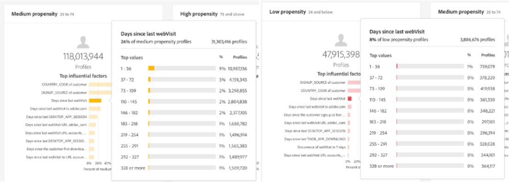

# Einblicke in Customer AI

Customer AI als Teil von Intelligent Services bietet Marketing-Experten die Möglichkeit, Adobe Sensei zu nutzen, um vorherzusagen, was Ihre Kunden als Nächstes tun werden. Customer AI wird verwendet, um für einzelne Profile skaliert benutzerdefinierte Tendenzwerte wie Abwanderung und Konversion zu berechnen. Das ist möglich, ohne dass die geschäftlichen Anforderungen in eine Aufgabe für maschinelles Lernen umgewandelt werden müssen, indem ein Algorithmus, ein Training oder eine Bereitstellung ausgewählt wird.

Dieses Dokument dient als Leitfaden für die Interaktion mit Einblicken von Dienstinstanzen in der Benutzeroberfläche von Intelligent Services Customer AI.

## Erste Schritte

Um Einblicke in Customer AI zu nutzen, benötigen Sie eine Dienstinstanz mit einem erfolgreichen Ausführungsstatus. So erstellen Sie einen neuen Dienstinstanzbesuch [Konfigurieren einer Customer AI-Instanz](./configure.md). Wenn Sie kürzlich eine Dienstinstanz erstellt haben und diese sich noch in der Trainings- und Bewertungsphase befindet, warten Sie bitte 24 Stunden, bis sie fertig ist.

## Übersicht über die Dienstinstanz

Im [!DNL Adobe Experience Platform] Benutzeroberfläche, auswählen **[!UICONTROL Dienste]** in der linken Navigation. Der *Dienste*-Browser wird geöffnet und zeigt verfügbare Intelligent Services an. Wählen Sie im Container für Customer AI die Option **[!UICONTROL Öffnen]**.

Die Seite des Customer AI-Service wird angezeigt. Auf dieser Seite werden Dienstinstanzen von Customer AI aufgelistet und Informationen zu ihnen angezeigt, einschließlich Name der Instanz, Tendenztyp, Häufigkeit der Ausführung der Instanz und Status der letzten Aktualisierung.

>[!NOTE]
>
>Nur Dienstinstanzen, die erfolgreiche Scoring-Läufe abgeschlossen haben, verfügen über Einblicke.

Wählen Sie einen Dienstinstanznamen aus, der gestartet werden soll.

Als Nächstes wird die Einblicke-Seite für diese Dienstinstanz mit der Option zur Auswahl angezeigt **[!UICONTROL Neueste Bewertungen]** oder **[!UICONTROL Leistungszusammenfassung]**. Standardregisterkarte **[!UICONTROL Neueste Bewertungen]** stellt Visualisierungen Ihrer Daten bereit. Die Visualisierungen und die Möglichkeiten, die Daten zu nutzen, werden in diesem Handbuch ausführlicher erläutert.

Die **[!UICONTROL Leistungszusammenfassung]** zeigt die tatsächlichen Abwanderungs- oder Konversionsraten für jeden Tendenzbehälter an. Weitere Informationen finden Sie im Abschnitt zu [Leistungszusammenfassungsmetriken](#performance-metrics).

## Details zur Dienstinstanz

Es gibt zwei Möglichkeiten, Details der Dienstinstanz anzuzeigen: über das Dashboard oder innerhalb der Dienstinstanz.

### Dashboard der Dienstinstanz

Um eine Übersicht über die Details der Dienstinstanz im Dashboard anzuzeigen, wählen Sie einen Dienstinstanzcontainer aus, wobei der mit dem Namen verknüpfte Hyperlink vermieden wird. Dadurch wird eine rechte Leiste mit zusätzlichen Details geöffnet. Die Steuerelemente enthalten Folgendes:

- **[!UICONTROL Bearbeiten]**: Auswählen **[!UICONTROL Bearbeiten]** können Sie eine vorhandene Dienstinstanz ändern. Sie können den Namen, die Beschreibung und die Scoring-Häufigkeit der Instanz bearbeiten.
- **[!UICONTROL Klonen]**: Auswählen **[!UICONTROL Klonen]** kopiert die derzeit ausgewählte Dienstinstanz, die eingerichtet ist. Anschließend können Sie den Workflow ändern, um kleinere Änderungen vorzunehmen, und ihn in eine neue Instanz umbenennen.
- **[!UICONTROL Löschen]**: Sie können eine Dienstinstanz, einschließlich aller historischen Ausführungen, löschen.
- **[!UICONTROL Datenquelle]**: Ein Link zum Datensatz, der von dieser Instanz verwendet wird.
- **[!UICONTROL Ausführungsfrequenz]**: Wie oft und wann ein Scoring-Lauf stattfindet.
- **[!UICONTROL Definition des Punkts]**: Ein kurzer Überblick über das Ziel, das Sie für diese Instanz konfiguriert haben.

>[!NOTE]
>
>Wenn ein Scoring-Lauf fehlschlägt, wird eine Fehlermeldung angezeigt. Die Fehlermeldung wird unter **Letzte Ausführungsdetails** in der rechten Leiste, die nur für fehlgeschlagene Ausführungen sichtbar ist.

### Dropdown &quot;Weitere Einblicke anzeigen&quot;

Die zweite Möglichkeit, zusätzliche Details für eine Dienstinstanz anzuzeigen, finden Sie auf der Insight-Seite. Auswählen **[!UICONTROL Mehr anzeigen]** oben rechts ein, um eine Dropdown-Liste auszufüllen. Details wie die Punktzahl-Definition, der Erstellungszeitpunkt, der Tendenztyp und die verwendeten Datensätze werden aufgelistet. Weitere Informationen zu den aufgelisteten Eigenschaften finden Sie unter [Konfigurieren einer Customer AI-Instanz](./configure.md).

### Popover zur Vorschau von Customer AI-Datensätzen

Wenn mehrere Datensätze von Customer AI verwendet werden, wird ein Hyperlink mit der Bezeichnung **[!UICONTROL Mehrere]** gefolgt von der Anzahl der Datensätze in Klammern `()` bereitgestellt wird.

Wenn Sie die Verknüpfung mit mehreren Datensätzen auswählen, wird das Popup-Fenster für die Vorschau des Customer AI-Datensatzes geöffnet. Jede Farbe in der Vorschau stellt einen Datensatz dar, wie der Farbschlüssel links neben den Datensatzspalten zeigt. In diesem Beispiel sehen Sie nur Folgendes: **Datensatz 1** enthält die `PROP1` Spalte.

### Bearbeiten einer Instanz

Um eine Instanz zu bearbeiten, wählen Sie **[!UICONTROL Bearbeiten]** in der oberen rechten Navigation.

Das Dialogfeld &quot;Bearbeiten&quot;wird angezeigt, in dem Sie den Namen, die Beschreibung, den Status und die Scoring-Häufigkeit der Instanz bearbeiten können. Um Ihre Änderungen zu bestätigen und das Dialogfeld zu schließen, wählen Sie **[!UICONTROL Speichern]** in der rechten unteren Ecke.

### Mehr Aktionen

Die Schaltfläche **[!UICONTROL Mehr Aktionen]** befindet sich in der oberen rechten Navigation neben **[!UICONTROL Bearbeiten]**. Auswählen **[!UICONTROL Mehr Aktionen]** öffnet ein Dropdown-Menü, in dem Sie einen der folgenden Vorgänge auswählen können:

- **[!UICONTROL Klonen]**: Auswählen **[!UICONTROL Klonen]** kopiert die eingerichtete Dienstinstanz. Anschließend können Sie den Workflow ändern, um kleinere Änderungen vorzunehmen, und ihn in eine neue Instanz umbenennen.
- **[!UICONTROL Löschen]**: Löscht die Instanz.
- **[!UICONTROL Auf Bewertungen zugreifen]**: Auswählen **[!UICONTROL Auf Bewertungen zugreifen]** öffnet ein Dialogfeld, das einen Link zum [Herunterladen von Bewertungen für Customer AI](./download-scores.md) Tutorial bietet das Dialogfeld auch die Datensatz-ID, die zum Ausführen von API-Aufrufen erforderlich ist.
- **[!UICONTROL Anzeigen des Ausführungsverlaufs]**: Ein Dialogfeld mit einer Liste aller mit der Dienstinstanz verknüpften Scoring-Läufe wird angezeigt.

## Bewertungszusammenfassung {#scoring-summary}

Die Bewertungszusammenfassung zeigt die Gesamtzahl der bewerteten Profile und kategorisiert sie in Behälter mit hoher, mittlerer und niedriger Tendenz. Die Tendenzbehälter werden anhand des Punktbereichs bestimmt, niedrig ist kleiner als 24, mittel ist 25 bis 74 und hoch ist über 74. Jeder Behälter hat eine der Legende entsprechende Farbe.

>[!NOTE]
>
>Wenn es sich um einen Konversionsintensitätswert handelt, werden die hohen Werte grün und die niedrigen Punkte rot angezeigt. Wenn Sie die Abwanderungsneigung vorhersagen, wird diese gespiegelt, die hohen Werte sind rot und die niedrigen Werte grün. Der mittlere Eimer bleibt gelb, unabhängig vom gewählten Tendenztyp.

Sie können den Mauszeiger über eine beliebige Farbe im Ring bewegen, um zusätzliche Informationen anzuzeigen, z. B. einen Prozentsatz und die Gesamtzahl der Profile, die zu einem Behälter gehören.

## Verteilung der Werte

Die **[!UICONTROL Verteilung der Werte]** -Karte eine visuelle Zusammenfassung der Population basierend auf der Punktzahl. Die Farben, die Sie in der [!UICONTROL Verteilung der Werte] -Karte den Typ des generierten Tendenzwerts darstellt. Wenn Sie den Mauszeiger über eine der Scoring-Distributionen bewegen, erhalten Sie die genaue Anzahl, die zu dieser Distribution gehört.

## Einflussfaktoren

Für jeden Punktebehälter wird eine Karte generiert, die die 10 wichtigsten Einflussfaktoren für diesen Behälter anzeigt. Die Einflussfaktoren geben Ihnen zusätzliche Details darüber, warum Ihre Kunden zu verschiedenen Punktgruppen gehören.

### Drilldowns für Einflussfaktoren

Wenn Sie den Mauszeiger über einen der wichtigsten Einflussfaktoren bewegen, werden die Daten weiter aufgeschlüsselt. Sie erhalten eine Übersicht darüber, warum bestimmte Profile zu einer Tendenzbehälter gehören. Je nach Faktor können Ihnen Zahlenwerte, Kategorienwerte oder boolesche Werte zugewiesen werden. Das folgende Beispiel zeigt kategorische Werte nach Region.

Darüber hinaus können Sie mithilfe von Drilldowns einen Verteilungsfaktor vergleichen, wenn er in zwei oder mehr Tendenzbehälter auftritt, und spezifischere Segmente mit diesen Werten erstellen. Das folgende Beispiel zeigt den ersten Anwendungsfall:

Sie können sehen, dass Profile mit geringer Konversionsneigung einen kürzlichen Besuch auf den Webseiten adobe.com weniger wahrscheinlich gemacht haben. Der Faktor &quot;Tage seit dem letzten WebVisit&quot;deckt nur 8 % ab, verglichen mit 26 % bei mittleren Tendenzprofilen. Mithilfe dieser Zahlen können Sie die Verteilung innerhalb der einzelnen Behälter anhand des Faktors vergleichen. Diese Informationen können verwendet werden, um darauf hinzuweisen, dass die Neuigkeit bei Webbesuch im Bereich der geringen Tendenz nicht so einflussreich ist wie bei der Gruppe der mittleren Tendenz.

### Erstellen eines Segments

Auswählen der **[!UICONTROL Segment erstellen]** -Schaltfläche in einem der Behälter für niedrige, mittlere und hohe Neigung leitet Sie zum Segment-Builder weiter.

>[!NOTE]
>
>Die **[!UICONTROL Segment erstellen]** -Schaltfläche ist nur verfügbar, wenn das Echtzeit-Kundenprofil für den Datensatz aktiviert ist. Weitere Informationen zum Aktivieren des Echtzeit-Kundenprofils finden Sie unter [Übersicht über das Echtzeit-Kundenprofil](../../../rtcdp/overview.md).

Der Segment Builder wird verwendet, um ein Segment zu definieren. Bei Auswahl von **[!UICONTROL Segment erstellen]** fügt Customer AI auf der Seite &quot;Einblicke&quot;die ausgewählten Behälterinformationen automatisch zum Segment hinzu. Um die Erstellung des Segments abzuschließen, füllen Sie einfach das **Name** und **Beschreibung** Container in der rechten Leiste der Benutzeroberfläche von Segment Builder. Nachdem Sie dem Segment einen Namen und eine Beschreibung gegeben haben, wählen Sie **[!UICONTROL Speichern]** oben rechts.

>[!NOTE]
>
>Da die Tendenzwerte in das jeweilige Profil geschrieben werden, sind sie im Segment Builder wie alle anderen Profilattribute verfügbar. Wenn Sie zum Segment Builder navigieren, um neue Segmente zu erstellen, können Sie alle verschiedenen Tendenzwerte unter Ihrem Namespace Customer AI anzeigen.

Um Ihr neues Segment in der Platform-Benutzeroberfläche anzuzeigen, wählen Sie **[!UICONTROL Segmente]** in der linken Navigation. Die **[!UICONTROL Durchsuchen]** angezeigt und zeigt alle verfügbaren Segmente an.

## Historische Leistung {#historical-performance}

Die **[!UICONTROL Leistungszusammenfassung]** zeigt die tatsächlichen Abwanderungs- oder Konversionsraten in die einzelnen Tendenzbehälter, die von Customer AI bewertet werden.

Zunächst werden nur erwartete Raten (gepunktete Linien) angezeigt. Die erwarteten Raten werden angezeigt, wenn kein Scoring-Lauf stattgefunden hat und noch keine Daten verfügbar sind. Sobald jedoch ein Ergebnisfenster vorüber ist, wird die erwartete Rate durch eine tatsächliche Rate (feste Linie) ersetzt.

Wenn Sie den Mauszeiger über die Zeilen bewegen, werden das Datum und die tatsächliche/erwartete Rate für diesen Tag in diesem Behälter angezeigt.

Sie können den Zeitrahmen nach den erwarteten und tatsächlichen angezeigten Raten filtern. Wählen Sie die **Kalendersymbol** und wählen Sie einen neuen Datumsbereich aus. Die Ergebnisse in den einzelnen Behältern werden aktualisiert und innerhalb des neuen Datumsbereichs angezeigt.

### Individuelle Scoring-Ausführungsraten

Die untere Hälfte der **[!UICONTROL Leistungszusammenfassung]** zeigt die Ergebnisse für jeden einzelnen Scoring-Lauf an. Wählen Sie das Dropdown-Datum oben rechts aus, um die Ergebnisse für einen anderen Scoring-Lauf anzuzeigen.

Je nachdem, ob Sie Abwanderung oder Konversion vorhersagen, wird die [!UICONTROL Verteilung der Werte] -Diagramm zeigt die Verteilung der Profile an, die in den einzelnen Schritten aktiviert/konvertiert und nicht gedreht/nicht konvertiert wurden.

## Modellauswertung {#model-evaluation}

Zusätzlich zum Tracking der prognostizierten und tatsächlichen Ergebnisse im Zeitverlauf auf der Registerkarte &quot;Historische Leistung&quot;haben Marketingexperten im Tab Modellauswertung noch mehr Transparenz in Bezug auf die Modellqualität. Sie können die Diagramme Steigerung und Gewinne verwenden, um die Unterschiede bei der Verwendung eines prädiktiven Modells im Vergleich zum zufälligen Targeting zu ermitteln. Darüber hinaus können Sie bestimmen, wie viele positive Ergebnisse bei jedem Score-Cutoff erfasst werden. Dies ist nützlich für die Segmentierung und für die Abstimmung der Kapitalrendite auf Marketing-Aktionen.

### Lift-Diagramm

Das Steigerungsdiagramm misst die Verbesserung der Verwendung eines Vorhersagemodells anstelle von zufälligem Targeting.

Zu den hochwertigen Modellindikatoren gehören:

- Hohe Steigerungswerte in den ersten Dezimalstellen. Das bedeutet, dass das Modell gut darin ist, die Benutzer zu identifizieren, die die größte Neigung haben, die gewünschten Aktionen durchzuführen.
- Absteigende Steigerungswerte Dies bedeutet, dass Kunden mit höheren Werten mit höherer Wahrscheinlichkeit die Aktion von Interesse ausführen als Kunden mit niedrigeren Werten.

### Gewinnerdiagramm

Das Diagramm für kumulative Gewinne misst den Prozentsatz der positiven Ergebnisse, die durch Targeting-Ergebnisse über einem bestimmten Schwellenwert erfasst werden. Nach Sortierung der Kunden nach Tendenzwert von hoch bis niedrig wird die Population in Dezimalstellen aufgeteilt - 10 gleich große Gruppen. Ein perfektes Modell würde alle positiven Ergebnisse in den höchsten Punktzahlen erfassen. Eine zufällige Basismethode erfasst positive Ergebnisse proportional zur Größe der Gruppe. Bei der Zielgruppenbestimmung würden 30 % der Benutzer 30 % der Ergebnisse erfassen.

Zu den hochwertigen Modellindikatoren gehören:

- Die kumulierten Gewinne nähern sich 100% schnell.
- Die kumulierte Gewinnkurve für das Modell ist näher an der oberen linken Ecke des Diagramms.
- Das Diagramm für kumulierte Gewinne kann verwendet werden, um die Bewertungsabbrüche für die Segmentierung und das Targeting zu bestimmen. Wenn das Modell beispielsweise 70 % der positiven Ergebnisse in den ersten 2 Bewertungsdezimeln erfasst, wird erwartet, dass das Targeting von Benutzern mit PerzentilScore > 80 ca. 70 % der positiven Ergebnisse erfasst.

### AUC (Fläche unter der Kurve)

Die AUC spiegelt die Stärke der Beziehung zwischen dem Rang nach Bewertung und dem Auftreten des prognostizierten Ziels wider. Ein **AUC** von 0,5 bedeutet, dass das Modell nicht besser ist als eine zufällige Schätzung. Ein **AUC** von 1 bedeutet, dass das Modell perfekt vorhersagen kann, wer die entsprechende Aktion ergreifen wird.

## Nächste Schritte

In diesem Dokument wurden die Einblicke einer Customer AI-Dienstinstanz beschrieben. Sie können jetzt mit dem Tutorial zum [Herunterladen von Bewertungen in Customer AI](./download-scores.md) oder die andere [Adobe Intelligent Services](../../home.md) Führer, die angeboten werden.

## Zusätzliche Ressourcen

Im folgenden Video wird beschrieben, wie Sie mit Customer AI die Ausgabe der Modelle und Einflussfaktoren anzeigen können.

>[!VIDEO](https://video.tv.adobe.com/v/32666?learn=on&quality=12)
